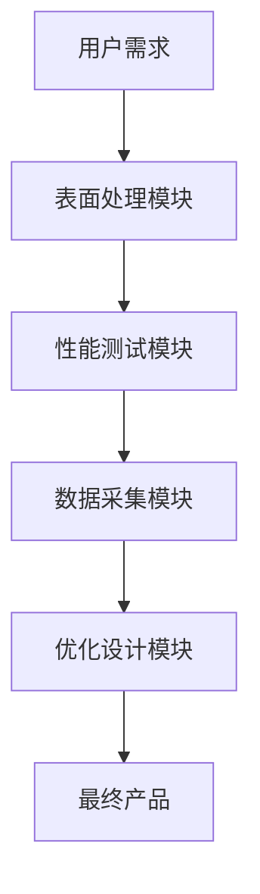
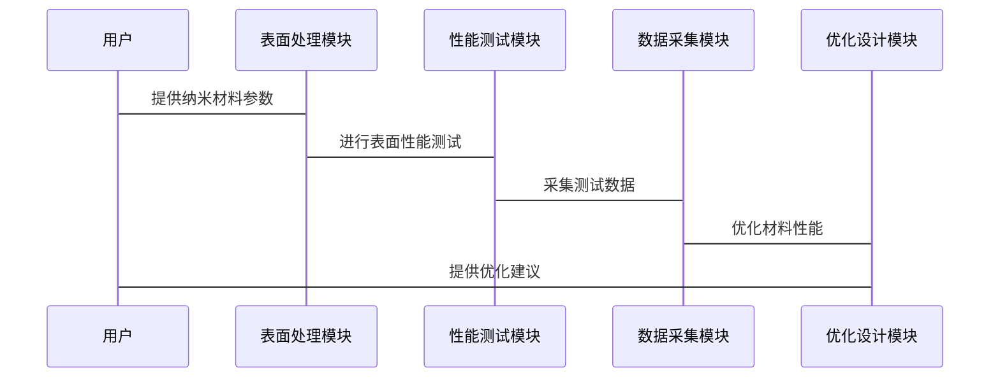

                 


# 价值投资中的智能纳米材料自清洁技术分析

---

## 关键词：
智能纳米材料、自清洁技术、价值投资、表面科学、投资评估、技术应用

---

## 摘要：
智能纳米材料自清洁技术是一种基于纳米尺度材料特性实现表面自清洁功能的创新技术，其在多个领域展现出广泛的应用潜力。本文从价值投资的角度，深入分析了智能纳米材料自清洁技术的核心原理、性能评估、市场应用及投资价值。通过结合材料科学、表面物理化学、投资评估等多学科知识，本文为投资者提供了技术评估框架和投资策略建议，帮助其在技术投资中做出明智决策。

---

# 第一部分：价值投资中的智能纳米材料自清洁技术背景

## 第1章：智能纳米材料自清洁技术的背景与概念

### 1.1 问题背景与问题描述

#### 1.1.1 自清洁技术的市场需求
现代社会对表面清洁技术的需求日益增加，特别是在建筑、汽车、电子设备等领域，自清洁功能能够显著降低维护成本并提高产品使用寿命。然而，传统清洁方法存在效率低、成本高、环境影响大等问题。

#### 1.1.2 纳米材料在自清洁技术中的作用
纳米材料因其独特的物理和化学性质，能够在表面形成纳米尺度的结构，从而实现自清洁功能。例如，纳米二氧化钛具有光催化性能，能够分解有机污染物；纳米结构表面可以通过微纳加工技术实现超疏水性能。

#### 1.1.3 价值投资视角下的技术评估
从投资角度看，智能纳米材料自清洁技术的市场潜力取决于其性能、成本、应用场景及竞争对手的分析。投资者需要评估技术的商业化可行性、市场规模和利润率。

### 1.2 核心概念与问题解决

#### 1.2.1 智能纳米材料的定义
智能纳米材料是指具有感知、响应和自适应能力的纳米尺度材料。其核心在于材料的微观结构和化学性质能够主动响应外界刺激（如光、电、化学物质等）。

#### 1.2.2 自清洁技术的核心问题
自清洁技术的核心问题在于如何通过材料设计和表面工程实现高效的污渍去除和长期的自清洁性能。这需要材料科学家和工程师在纳米尺度上进行精确控制。

#### 1.2.3 价值投资中的技术评估框架
技术评估框架包括以下几个方面：
1. **技术性能**：材料的自清洁能力、耐久性、环境适应性。
2. **成本分析**：材料的制备成本、生产规模、设备投入。
3. **市场潜力**：目标市场的规模、增长潜力、竞争对手情况。

### 1.3 智能纳米材料自清洁技术的边界与外延

#### 1.3.1 技术边界
智能纳米材料自清洁技术的核心边界在于其材料的微观结构和化学性质。技术的有效性依赖于材料的纳米尺度特性，过大或过小的尺度都会影响性能。

#### 1.3.2 应用外延
自清洁技术的应用范围广泛，包括建筑玻璃、太阳能电池板、汽车挡风玻璃、电子产品屏幕等。其外延应用包括环境监测、抗菌表面、智能衣物等领域。

#### 1.3.3 技术与投资的结合点
技术与投资的结合点在于技术的商业化潜力。投资者需要评估技术是否能够在特定市场中实现盈利，并与现有技术形成竞争优势。

### 1.4 智能纳米材料自清洁技术的概念结构

#### 1.4.1 核心要素组成
智能纳米材料自清洁技术的核心要素包括：
1. **材料特性**：纳米尺度的结构和化学性质。
2. **表面工程**：通过表面处理实现自清洁功能。
3. **技术应用**：在特定场景中的实际应用。

#### 1.4.2 技术与经济的双重属性
智能纳米材料自清洁技术具有技术性和经济性双重属性。技术性体现在材料的微观结构和性能，经济性体现在其商业化潜力和成本效益。

#### 1.4.3 价值投资中的技术评估维度
价值投资中的技术评估维度包括：
1. **技术可行性**：材料的制备和表面处理技术是否成熟。
2. **市场适应性**：技术是否能够满足目标市场的需求。
3. **投资回报率**：技术的市场潜力和盈利能力。

### 1.5 本章小结
本章从背景、概念、技术和经济等多个角度分析了智能纳米材料自清洁技术的核心要素及其在价值投资中的重要性。通过技术与投资的结合，为后续的技术评估和投资决策奠定了基础。

---

## 第2章：智能纳米材料的特性与分类

### 2.1 智能纳米材料的科学基础

#### 2.1.1 纳米材料的基本特性
纳米材料的基本特性包括：
1. **尺寸效应**：材料的物理化学性质随尺寸变化而变化。
2. **表面效应**：纳米材料的表面面积与体积比高，表面活性强。
3. **量子效应**：在纳米尺度下，材料的电子性质表现出量子效应。

#### 2.1.2 智能材料的定义与分类
智能材料是指能够感知外界环境变化并做出响应的材料。根据响应机制的不同，智能材料可以分为热敏材料、光敏材料、电敏材料等。

#### 2.1.3 纳米材料的制备方法
常见的纳米材料制备方法包括：
1. **化学合成法**：如水热合成、溶胶-凝胶法。
2. **物理气相沉积法**：如蒸发沉积、溅射沉积。
3. **生物合成法**：利用生物分子的自组装特性制备纳米材料。

### 2.2 自清洁技术的核心原理

#### 2.2.1 自清洁表面的科学原理
自清洁表面的科学原理基于表面的化学特性和微观结构。超疏水表面（超双疏表面）通过微纳结构的设计实现自清洁效果，同时具有防水、防油和防污的特性。

#### 2.2.2 纳米材料的自清洁机理
智能纳米材料的自清洁机理包括：
1. **化学降解**：通过光催化反应降解有机污染物。
2. **物理排斥**：通过表面微观结构的斥力作用排斥污渍。
3. **自我修复**：材料表面的损伤能够自我修复，恢复自清洁性能。

#### 2.2.3 自清洁技术的性能指标
自清洁技术的性能指标包括：
1. **接触角**：衡量表面的润湿性能，接触角越大，表面越疏水。
2. **耐久性**：表面结构的稳定性，抗磨损和抗老化能力。
3. **响应时间**：材料对外界刺激的响应速度。

### 2.3 智能纳米材料与传统材料的对比

#### 2.3.1 材料特性对比表
以下是一些常见材料的特性对比表：

| 材质        | 比重（g/cm³） | 硬度（莫氏） | 导电性 | 透明度 |
|-------------|----------------|--------------|--------|--------|
| 纳米二氧化钛 | 3.0          | 5-6          | 低     | 高     |
| 石英玻璃    | 2.25         | 7            | 低     | 高     |
| 普通玻璃    | 2.52         | 5            | 低     | 高     |

#### 2.3.2 自清洁性能对比
不同材料的自清洁性能对比：

| 材质        | 超疏水性能 | 耐久性 | 成本 |
|-------------|------------|--------|------|
| 纳米二氧化钛 | 高         | 中     | 中   |
| 石英玻璃    | 低         | 高     | 低   |
| 普通玻璃    | 低         | 低     | 低   |

#### 2.3.3 成本与性能的平衡
智能纳米材料的成本较高，但其性能优势明显。在选择材料时，需要综合考虑性能需求和成本预算。

### 2.4 本章小结
本章详细分析了智能纳米材料的特性、制备方法及其在自清洁技术中的应用。通过对比不同材料的性能和成本，为后续的技术评估和投资决策提供了参考依据。

---

## 第3章：自清洁技术的数学模型与算法

### 3.1 自清洁表面的物理模型

#### 3.1.1 表面张力与润湿性分析
表面张力是影响润湿性的重要因素。根据Young's方程，接触角θ与表面张力的关系为：

$$\cos\theta = \frac{\gamma_{SL} - \gamma_{SL}}{\gamma_{LL}}$$

其中，γ表示表面张力，下标S、L、SL分别代表固液界面、液气界面和固液界面的张力。

#### 3.1.2 纳米材料表面的化学特性
纳米材料的表面化学特性可以通过接触角来衡量。超疏水表面的接触角通常大于150度。

#### 3.1.3 自清洁效果的数学表达
自清洁效果可以通过以下公式进行评估：

$$E = \frac{A}{A_0}$$

其中，E为清洁效率，A为清洁后的表面积，A₀为清洁前的表面积。

### 3.2 纳米材料性能的数学模型

#### 3.2.1 纳米材料的结构稳定性
纳米材料的结构稳定性可以通过以下公式表示：

$$S = k \cdot t$$

其中，S为结构稳定性，k为比例常数，t为时间。

#### 3.2.2 材料的响应时间
材料的响应时间t与外界刺激强度I的关系为：

$$t = \frac{I}{C}$$

其中，C为材料的响应系数。

### 3.3 算法实现与代码示例

#### 3.3.1 纳米材料性能测试代码
以下是一个简单的纳米材料性能测试代码示例：

```python
import numpy as np

def calculate_contact_angle(material):
    # 假设材料的表面张力γ已知
    γ_SL = 0.07  # 固液界面张力（mN/m）
    γ_LV = 0.07  # 液气界面张力（mN/m）
    contact_angle = np.arccos((γ_SL - γ_LV) / γ_LV)
    return np.degrees(contact_angle)

material = "纳米二氧化钛"
print(f"{material}的接触角为：{calculate_contact_angle(material)}度")
```

#### 3.3.2 性能评估模型
性能评估模型可以通过以下代码实现：

```python
def evaluate_performance(material):
    # 假设材料的接触角θ已知
    θ = 150  # 接触角（度）
    if θ > 150:
        return "超疏水性能优异"
    elif θ > 120:
        return "疏水性能良好"
    else:
        return "疏水性能一般"

material = "纳米二氧化钛"
print(evaluate_performance(material))
```

### 3.4 本章小结
本章通过数学模型和算法实现，量化了智能纳米材料的自清洁性能。通过代码示例，读者可以更好地理解如何通过数学模型评估材料性能。

---

## 第四部分：系统分析与架构设计方案

### 第4章：智能纳米材料自清洁技术的系统架构设计

#### 4.1 问题场景介绍
假设我们正在设计一种基于纳米二氧化钛的自清洁玻璃，其应用场景包括建筑幕墙、汽车挡风玻璃等。

#### 4.2 系统功能设计
系统功能包括：
1. **表面处理**：纳米材料的涂覆和固化。
2. **性能测试**：接触角测试、耐久性测试。
3. **数据采集**：记录材料的性能参数。
4. **优化设计**：根据测试结果优化材料性能。

#### 4.3 系统架构设计
系统架构设计如图所示：



#### 4.4 系统接口设计
系统接口包括：
1. **输入接口**：接收用户需求和材料参数。
2. **输出接口**：输出测试结果和优化建议。

#### 4.5 系统交互设计
系统交互流程如图所示：



### 第5章：项目实战与投资分析

#### 5.1 项目环境配置
项目环境包括：
1. **硬件设备**：实验设备、测试仪器。
2. **软件工具**：数据分析工具、编程语言（如Python）。

#### 5.2 核心实现代码
以下是纳米材料性能测试的核心代码：

```python
import numpy as np

def calculate_stability(material):
    # 假设材料的稳定性系数k已知
    k = 0.9  # 稳定性系数
    t = 100  # 时间（小时）
    stability = k * t
    return stability

material = "纳米二氧化钛"
print(f"{material}的结构稳定性为：{calculate_stability(material)}")
```

#### 5.3 案例分析与经验总结
案例分析：以纳米二氧化钛为例，分析其在建筑玻璃上的应用效果。经验总结：纳米材料的性能与成本需要在投资决策中综合考虑。

### 5.4 本章小结
本章通过项目实战和投资分析，帮助读者更好地理解智能纳米材料自清洁技术的实际应用和投资价值。

---

## 第五部分：总结与展望

### 第6章：总结与展望

#### 6.1 总结
智能纳米材料自清洁技术是一种具有广阔市场潜力的技术。通过本文的分析，我们了解了其核心原理、性能评估和投资价值。投资者需要从技术性能、成本和市场潜力等多个角度进行评估。

#### 6.2 展望
未来，智能纳米材料自清洁技术将在更多领域得到应用。随着纳米技术的不断发展，其性能和成本将更加优化，市场潜力将进一步释放。

### 6.3 本章小结
本章总结了全文的主要内容，并展望了智能纳米材料自清洁技术的未来发展。

---

## 作者信息

作者：AI天才研究院/AI Genius Institute & 禅与计算机程序设计艺术 /Zen And The Art of Computer Programming

---

**本文为AI天才研究院原创，转载请注明出处。**

