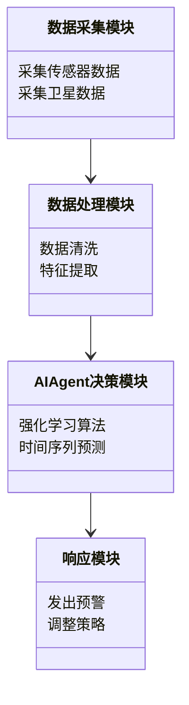
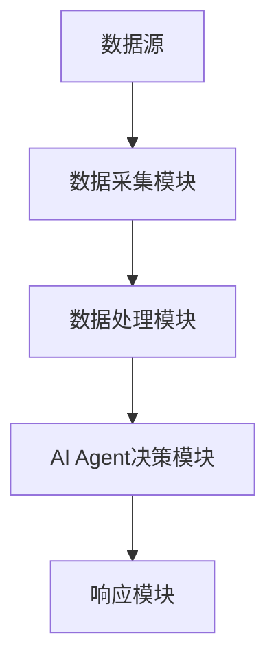
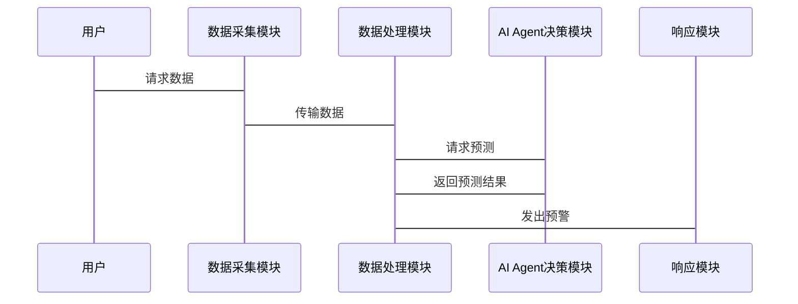

                 


# 构建AI Agent驱动的智能灾害预警系统

> 关键词：AI Agent，智能灾害预警系统，实时数据处理，机器学习，自动化响应

> 摘要：本文详细探讨了如何构建一个基于AI Agent的智能灾害预警系统，从系统背景、核心概念、算法原理到系统架构设计和项目实战，全面分析了AI Agent在灾害预警中的应用价值和实现方法。通过理论分析与实践结合，本文为读者提供了一个完整的解决方案，展示了如何利用先进的AI技术提升灾害预警的效率和准确性。

---

## 第一部分：背景介绍与核心概念

### 第1章：AI Agent驱动的智能灾害预警系统概述

#### 1.1 灾害预警的背景与挑战
##### 1.1.1 灾害预警的定义与重要性
灾害预警是指通过技术和方法，提前预测和警告可能发生的自然灾害（如地震、洪水、台风等），以减少人员伤亡和财产损失。灾害预警的准确性与及时性对社会安全至关重要。

##### 1.1.2 当前灾害预警系统的主要问题
传统的灾害预警系统主要依赖于传感器数据和预设模型，存在以下问题：
- 数据采集的实时性不足
- 预测模型的泛化能力有限
- 系统缺乏自主学习和优化能力

##### 1.1.3 AI Agent在灾害预警中的优势
AI Agent（智能体）具有以下优势：
- 自主决策：能够根据实时数据自主做出预测和决策
- 强化学习：通过与环境的交互不断优化预测模型
- 多任务处理：能够同时处理多种灾害预警任务

#### 1.2 AI Agent的基本概念
##### 1.2.1 AI Agent的定义
AI Agent是一种智能实体，能够感知环境、自主决策并执行任务。

##### 1.2.2 AI Agent的核心特征
- **自主性**：能够在没有外部干预的情况下运行
- **反应性**：能够实时感知环境变化并做出反应
- **学习能力**：能够通过数据和经验不断优化自身模型

##### 1.2.3 AI Agent与传统自动化的区别
| 特性 | AI Agent | 传统自动化 |
|------|----------|------------|
| 决策能力 | 强大 | 较弱 |
| 学习能力 | 有 | 无 |
| 适应性 | 高 | 低 |

#### 1.3 智能灾害预警系统的构建背景
##### 1.3.1 人工智能技术的发展
人工智能技术的快速发展为灾害预警系统的智能化提供了技术支持。

##### 1.3.2 大数据分析在灾害预警中的应用
大数据分析能够从海量数据中提取有价值的信息，为灾害预测提供支持。

##### 1.3.3 AI Agent在灾害预警中的潜力
AI Agent能够通过实时数据处理和自主学习，显著提升灾害预警的效率和准确性。

#### 1.4 本章小结
本章介绍了灾害预警的背景、传统系统的主要问题以及AI Agent的核心优势，为后续章节的展开奠定了基础。

---

## 第二部分：AI Agent驱动的智能灾害预警系统的核心要素

### 第2章：AI Agent驱动的智能灾害预警系统的核心要素

#### 2.1 灾害数据的采集与处理
##### 2.1.1 数据来源的多样性
灾害数据来源包括传感器数据、卫星遥感数据、历史数据等。

##### 2.1.2 数据预处理的关键步骤
- 数据清洗：去除噪声数据
- 数据标准化：统一数据格式
- 数据特征提取：提取关键特征

##### 2.1.3 数据特征的提取方法
- 时间序列特征：如最大值、最小值、平均值等
- 空间特征：如地理位置、地形特征等
- 统计特征：如方差、标准差等

#### 2.2 AI Agent的决策机制
##### 2.2.1 多目标优化的原理
AI Agent在灾害预警中需要同时优化多个目标，如准确率、响应时间等。

##### 2.2.2 基于强化学习的决策过程
AI Agent通过与环境的交互，不断优化决策策略。例如，使用强化学习算法（如DQN）进行预测模型的优化。

##### 2.2.3 知识图谱在决策中的应用
知识图谱能够帮助AI Agent更好地理解和处理多源异构数据。

#### 2.3 系统的实时响应机制
##### 2.3.1 实时数据流的处理
AI Agent能够实时处理传感器数据流，快速做出预测和决策。

##### 2.3.2 响应策略的动态调整
根据实时数据和环境变化，动态调整响应策略。

##### 2.3.3 系统的容错与恢复机制
系统具备容错和自恢复能力，确保在异常情况下仍能正常运行。

#### 2.4 本章小结
本章详细介绍了AI Agent驱动的智能灾害预警系统的核心要素，包括灾害数据的采集与处理、AI Agent的决策机制以及系统的实时响应机制。

---

## 第三部分：AI Agent驱动的智能灾害预警系统的核心算法

### 第3章：AI Agent驱动的智能灾害预警系统的核心算法

#### 3.1 时间序列预测算法
##### 3.1.1 LSTM网络的原理
长短期记忆网络（LSTM）是一种常用的时序预测模型，能够有效捕捉时间序列的长程依赖关系。

##### 3.1.2 GRU网络的优缺点
门控循环单元网络（GRU）是LSTM的一种简化版本，计算效率更高，但捕获长程依赖的能力稍逊于LSTM。

##### 3.1.3 时间序列预测的数学模型
时间序列预测的数学模型可以表示为：
$$ y_t = f(y_{t-1}, y_{t-2}, \ldots, y_{t-n}) $$
其中，$y_t$ 表示时间 $t$ 的预测值，$f$ 是预测模型。

#### 3.2 基于强化学习的决策算法
##### 3.2.1 强化学习的基本原理
强化学习通过智能体与环境的交互，学习最优策略以最大化累积奖励。

##### 3.2.2 DQN算法的实现
深度强化学习（DQN）算法通过神经网络近似Q值函数，实现对复杂环境的决策。

##### 3.2.3 算法的数学模型
DQN算法的数学模型可以表示为：
$$ Q(s, a) = r + \gamma \max_{a'} Q(s', a') $$
其中，$Q(s, a)$ 表示状态 $s$ 下动作 $a$ 的Q值，$r$ 是奖励，$\gamma$ 是折扣因子。

#### 3.3 算法的实现与优化
##### 3.3.1 算法的实现步骤
1. 环境初始化
2. �状态空间和动作空间定义
3. 神经网络模型构建
4. 策略训练与优化

##### 3.3.2 算法的优化方法
- 参数调整：如学习率、折扣因子的优化
- 网络结构优化：如增加隐藏层、调整神经元数量
- 数据增强：如数据噪声注入

#### 3.4 本章小结
本章详细介绍了AI Agent驱动的智能灾害预警系统的核心算法，包括时间序列预测算法和基于强化学习的决策算法，并给出了算法的实现步骤和优化方法。

---

## 第四部分：AI Agent驱动的智能灾害预警系统的系统架构设计

### 第4章：AI Agent驱动的智能灾害预警系统的系统架构设计

#### 4.1 项目背景与目标
##### 4.1.1 项目背景
本项目旨在构建一个基于AI Agent的智能灾害预警系统，提升灾害预警的效率和准确性。

##### 4.1.2 项目目标
- 实现灾害数据的实时采集与处理
- 构建高效的AI Agent决策机制
- 提供准确的灾害预警服务

#### 4.2 系统功能设计
##### 4.2.1 系统功能模块划分
- 数据采集模块：负责采集多源数据
- 数据处理模块：对数据进行清洗、特征提取等
- AI Agent决策模块：基于强化学习算法进行预测和决策
- 响应模块：根据决策结果执行预警操作

##### 4.2.2 系统功能设计的领域模型


#### 4.3 系统架构设计
##### 4.3.1 系统架构图


#### 4.4 系统接口设计
##### 4.4.1 系统接口设计
- 数据接口：负责与传感器和数据库的交互
- API接口：提供外部调用的接口

##### 4.4.2 系统交互序列图


#### 4.5 本章小结
本章详细介绍了AI Agent驱动的智能灾害预警系统的系统架构设计，包括功能模块划分、架构图和接口设计。

---

## 第五部分：AI Agent驱动的智能灾害预警系统的项目实战

### 第5章：项目实战

#### 5.1 环境安装与配置
##### 5.1.1 系统环境要求
- 操作系统：Linux/Windows
- Python版本：3.7以上
- 依赖库：TensorFlow、Keras、Scikit-learn等

##### 5.1.2 安装步骤
```bash
pip install numpy
pip install pandas
pip install tensorflow
pip install scikit-learn
```

#### 5.2 核心代码实现
##### 5.2.1 数据采集模块
```python
import numpy as np
import pandas as pd

def collect_data():
    # 采集传感器数据
    data = pd.read_csv('sensor_data.csv')
    return data
```

##### 5.2.2 数据处理模块
```python
from sklearn.preprocessing import StandardScaler

def preprocess_data(data):
    # 数据清洗
    data = data.dropna()
    # 特征提取
    features = data[['temp', 'pressure', 'humidity']]
    # 数据标准化
    scaler = StandardScaler()
    features_scaled = scaler.fit_transform(features)
    return features_scaled
```

##### 5.2.3 AI Agent决策模块
```python
import tensorflow as tf
from tensorflow.keras.models import Model
from tensorflow.keras.layers import LSTM, Dense

def build_model(input_shape):
    inputs = Input(shape=(input_shape))
    lstm_layer = LSTM(64)(inputs)
    dense_layer = Dense(1, activation='sigmoid')(lstm_layer)
    model = Model(inputs=inputs, outputs=dense_layer)
    model.compile(loss='binary_crossentropy', optimizer='adam', metrics=['accuracy'])
    return model
```

##### 5.2.4 响应模块
```python
def issue_warning(probability):
    if probability > 0.9:
        print("灾害预警：概率超过90%")
    else:
        print("当前概率较低，无需预警")
```

#### 5.3 代码解读与分析
##### 5.3.1 数据采集模块
数据采集模块负责从CSV文件中读取传感器数据，确保数据的完整性和准确性。

##### 5.3.2 数据处理模块
数据处理模块对采集到的数据进行清洗和标准化，提取关键特征，为后续的模型训练提供高质量的数据。

##### 5.3.3 AI Agent决策模块
AI Agent决策模块基于LSTM网络构建时间序列预测模型，训练模型以提高预测的准确性。

##### 5.3.4 响应模块
响应模块根据模型的预测结果，决定是否发出灾害预警。

#### 5.4 实际案例分析
##### 5.4.1 案例背景
假设我们正在监测某地区的地震活动，传感器数据包括温度、压力和湿度等参数。

##### 5.4.2 数据处理与预测
通过数据处理模块对传感器数据进行预处理，使用AI Agent决策模块进行预测，得到地震发生的概率。

##### 5.4.3 系统响应
根据预测结果，系统决定是否发出地震预警。

#### 5.5 项目小结
本章通过实际案例展示了AI Agent驱动的智能灾害预警系统的实现过程，包括环境配置、代码实现和系统响应。

---

## 第六部分：总结与展望

### 第6章：总结与展望

#### 6.1 本章总结
本文详细探讨了AI Agent驱动的智能灾害预警系统的构建过程，从背景介绍、核心概念、算法原理到系统架构设计和项目实战，为读者提供了一个完整的解决方案。

#### 6.2 最佳实践Tips
- 数据预处理是系统运行的关键，确保数据的准确性和完整性
- 算法选择要考虑实际场景的需求，合理选择模型和参数
- 系统设计要注重模块化和可扩展性，方便后续优化和维护

#### 6.3 未来展望
随着人工智能技术的不断进步，AI Agent驱动的智能灾害预警系统将在更多领域得到应用，预测模型的精度和系统的响应速度将进一步提升。

#### 6.4 本章小结
本章总结了全文的主要内容，并展望了未来的发展方向，为读者提供了进一步学习和研究的方向。

---

## 作者信息

作者：AI天才研究院/AI Genius Institute & 禅与计算机程序设计艺术 /Zen And The Art of Computer Programming

---

通过以上大纲，我们可以看到，文章内容涵盖了从理论到实践的各个方面，既有深度又有广度，确保读者能够全面理解AI Agent驱动的智能灾害预警系统的构建过程。

