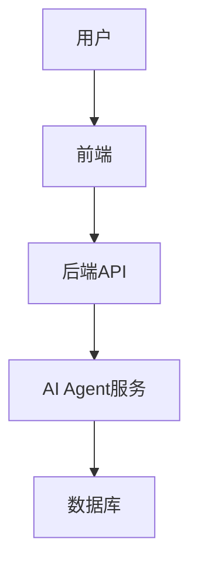
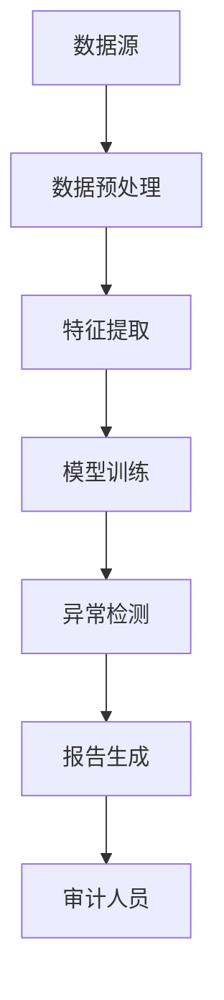
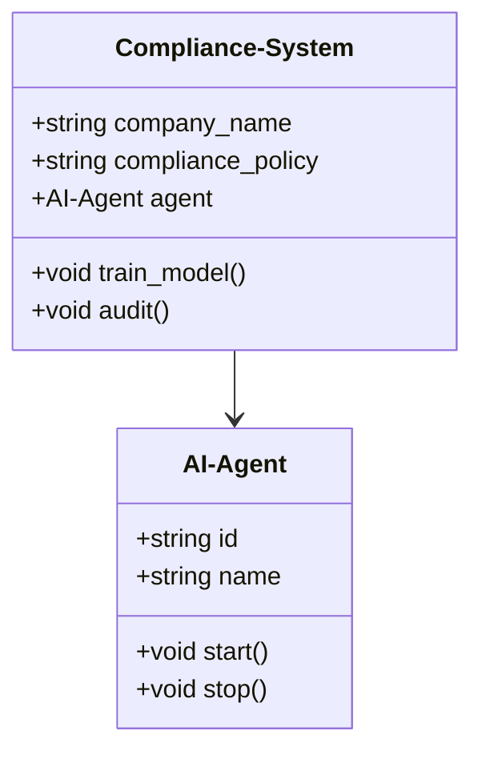

                 


---

# AI Agent在企业合规培训与审计中的应用

## 关键词：AI Agent，企业合规，培训，审计，人工智能，自然语言处理

## 摘要：本文探讨了AI Agent在企业合规培训与审计中的应用，从技术基础、系统架构到实际案例，详细分析了AI Agent如何提升企业合规效率，减少人为错误，并实时监控与反馈。

---

# 第一部分: AI Agent与企业合规背景

## 第1章: AI Agent与企业合规概述

### 1.1 AI Agent的基本概念

#### 1.1.1 AI Agent的定义与特点

AI Agent，即人工智能代理，是指能够感知环境、执行任务并做出决策的智能系统。其特点包括自主性、反应性、目标导向和社会性。AI Agent能够通过传感器或数据输入感知环境，并根据预设目标或学习结果做出相应动作。

#### 1.1.2 企业合规的基本概念

企业合规指的是企业遵循相关法律法规、行业标准和企业内部政策的行为。合规涵盖财务、法律、数据隐私、反腐败等多个方面，是企业风险管理的重要组成部分。

#### 1.1.3 AI Agent与企业合规的结合点

AI Agent可以通过自然语言处理（NLP）、机器学习和数据挖掘等技术，辅助企业进行合规培训和审计。其结合点包括个性化培训、实时监控、自动审计和智能报告生成。

### 1.2 企业合规培训与审计的背景

#### 1.2.1 企业合规的重要性

合规是企业合法经营的基础，直接影响企业的声誉、财务状况和市场准入。随着法律法规的复杂化和全球化，企业合规需求日益增加。

#### 1.2.2 合规培训与审计的现状

传统合规培训和审计依赖人工操作，效率低、成本高且容易出现人为错误。随着技术进步，企业开始寻求更高效的方法，AI Agent成为重要工具。

#### 1.2.3 AI Agent在合规中的应用前景

AI Agent能够提高合规效率、降低成本、减少错误，并实现自动化监控和报告，未来将在企业合规中发挥更大作用。

### 1.3 AI Agent在企业合规中的优势

#### 1.3.1 提高效率

AI Agent能够快速处理大量数据，自动化执行合规任务，显著提高效率。

#### 1.3.2 减少人为错误

通过自动化和智能化决策，AI Agent能够减少人为错误，提高合规准确性。

#### 1.3.3 实时监控与反馈

AI Agent可以实时监控企业行为，及时发现违规问题，并提供反馈，帮助企业在问题发生前进行调整。

### 1.4 本章小结

本章介绍了AI Agent的基本概念、企业合规的重要性及其应用前景，重点阐述了AI Agent在企业合规中的优势，为后续章节的分析奠定了基础。

---

## 第2章: 自然语言处理与机器学习基础

### 2.1 自然语言处理（NLP）基础

#### 2.1.1 NLP的核心技术

NLP包括分词、句法分析、情感分析、信息提取等技术，用于处理和理解自然语言文本。

#### 2.1.2 NLP在企业合规中的应用

NLP可以用于合规文档的自动分类、合同审查、风险评估等场景，帮助企业快速识别合规问题。

#### 2.1.3 企业合规中的NLP案例

例如，AI Agent可以通过NLP技术分析员工提交的合规报告，自动识别潜在风险并提出改进建议。

### 2.2 机器学习基础

#### 2.2.1 机器学习的基本概念

机器学习是通过数据训练模型，使其能够从数据中学习并做出预测或决策。

#### 2.2.2 监督学习与无监督学习

监督学习需要标记数据进行训练，适用于分类和回归任务；无监督学习则适用于聚类和异常检测。

#### 2.2.3 深度学习简介

深度学习通过多层神经网络模拟人脑的处理方式，能够处理复杂的非结构化数据。

### 2.3 AI Agent的算法实现

#### 2.3.1 基于NLP的意图识别

通过NLP技术识别用户意图，例如在合规培训中识别员工的学习需求。

#### 2.3.2 基于机器学习的决策模型

使用机器学习模型对合规数据进行分析，生成决策建议。

#### 2.3.3 算法实现的代码示例

以下是一个简单的基于NLP的意图识别示例代码：

```python
import numpy as np
from sklearn.feature_extraction.text import TfidfVectorizer
from sklearn.naive_bayes import MultinomialNB

# 假设我们有合规相关的文本数据
texts = ["禁止商业贿赂", "数据隐私保护", "反洗钱合规"]
labels = [0, 1, 2]

# 使用TF-IDF进行特征提取
vectorizer = TfidfVectorizer()
X = vectorizer.fit_transform(texts)

# 训练朴素贝叶斯分类器
clf = MultinomialNB()
clf.fit(X, labels)

# 预测新的文本
new_text = ["禁止商业贿赂"]
X_new = vectorizer.transform(new_text)
print(clf.predict(X_new))
```

#### 2.3.4 算法流程图

以下是一个基于NLP的意图识别算法流程图：

```mermaid
graph TD
    A[开始] -> B[数据预处理]
    B -> C[特征提取]
    C -> D[模型训练]
    D -> E[模型预测]
    E -> F[结果输出]
    F -> G[结束]
```

### 2.4 本章小结

本章介绍了NLP和机器学习的基本概念及其在企业合规中的应用，通过代码示例和流程图展示了AI Agent的算法实现。

---

## 第3章: 合规培训的智能化转型

### 3.1 AI Agent在合规培训中的角色

#### 3.1.1 个性化学习路径

AI Agent可以根据员工的学习进度和知识水平，制定个性化的学习计划。

#### 3.1.2 实时反馈与评估

AI Agent可以实时监控员工的学习情况，并提供反馈和评估结果。

#### 3.1.3 跨平台支持

AI Agent可以在多种平台上运行，例如Web、移动端和桌面端，方便员工随时随地学习。

### 3.2 基于AI Agent的培训系统设计

#### 3.2.1 系统功能设计

系统功能包括用户管理、课程管理、学习计划生成、实时反馈和报告生成。

#### 3.2.2 系统架构设计

以下是一个基于AI Agent的培训系统的架构图：



#### 3.2.3 系统接口设计

系统接口包括用户登录、课程查询、学习计划生成和反馈提交。

### 3.3 AI Agent在合规培训中的应用实例

#### 3.3.1 某企业合规培训系统的实现

以下是一个AI Agent在合规培训中的应用实例：

```python
import numpy as np
from sklearn.feature_extraction.text import TfidfVectorizer
from sklearn.naive_bayes import MultinomialNB

# 假设我们有合规相关的文本数据
texts = ["禁止商业贿赂", "数据隐私保护", "反洗钱合规"]
labels = [0, 1, 2]

# 使用TF-IDF进行特征提取
vectorizer = TfidfVectorizer()
X = vectorizer.fit_transform(texts)

# 训练朴素贝叶斯分类器
clf = MultinomialNB()
clf.fit(X, labels)

# 预测新的文本
new_text = ["禁止商业贿赂"]
X_new = vectorizer.transform(new_text)
print(clf.predict(X_new))
```

### 3.4 本章小结

本章详细探讨了AI Agent在合规培训中的角色和应用，通过系统设计和实例展示了其在提升培训效率和个性化学习中的作用。

---

## 第4章: AI Agent在企业合规审计中的应用

### 4.1 AI Agent在合规审计中的角色

#### 4.1.1 自动化审计

AI Agent可以自动分析企业数据，识别潜在的违规行为。

#### 4.1.2 数据挖掘与异常检测

通过数据挖掘技术，AI Agent可以帮助审计人员发现隐藏的合规风险。

#### 4.1.3 智能报告生成

AI Agent可以自动生成审计报告，并提出改进建议。

### 4.2 基于AI Agent的审计系统设计

#### 4.2.1 系统功能设计

系统功能包括数据收集、异常检测、风险评估和报告生成。

#### 4.2.2 系统架构设计

以下是一个基于AI Agent的审计系统的架构图：



#### 4.2.3 系统接口设计

系统接口包括数据导入、审计任务启动、结果导出和报告查询。

### 4.3 AI Agent在合规审计中的应用实例

#### 4.3.1 某企业合规审计系统的实现

以下是一个AI Agent在合规审计中的应用实例：

```python
import numpy as np
from sklearn.feature_extraction.text import TfidfVectorizer
from sklearn.naive_bayes import MultinomialNB

# 假设我们有合规相关的文本数据
texts = ["禁止商业贿赂", "数据隐私保护", "反洗钱合规"]
labels = [0, 1, 2]

# 使用TF-IDF进行特征提取
vectorizer = TfidfVectorizer()
X = vectorizer.fit_transform(texts)

# 训练朴素贝叶斯分类器
clf = MultinomialNB()
clf.fit(X, labels)

# 预测新的文本
new_text = ["禁止商业贿赂"]
X_new = vectorizer.transform(new_text)
print(clf.predict(X_new))
```

### 4.4 本章小结

本章探讨了AI Agent在合规审计中的应用，展示了其在自动化审计、数据挖掘和智能报告生成中的优势。

---

## 第5章: 系统架构与实现

### 5.1 系统架构设计

#### 5.1.1 需求分析

系统需求包括高效性、准确性和易用性。

#### 5.1.2 系统架构设计

以下是一个AI Agent合规系统的类图：



#### 5.1.3 接口设计

系统接口包括启动、停止、训练模型和执行审计。

### 5.2 系统实现

#### 5.2.1 环境搭建

需要安装Python、TensorFlow、Keras和Scikit-learn等库。

#### 5.2.2 核心实现

以下是AI Agent的核心实现代码：

```python
import numpy as np
from sklearn.feature_extraction.text import TfidfVectorizer
from sklearn.naive_bayes import MultinomialNB

class AI-Agent:
    def __init__(self):
        self.vectorizer = TfidfVectorizer()
        self clf = MultinomialNB()

    def train(self, texts, labels):
        self.X = self.vectorizer.fit_transform(texts)
        self.clf.fit(self.X, labels)

    def predict(self, text):
        X_new = self.vectorizer.transform([text])
        return self clf.predict(X_new)
```

### 5.3 系统测试与优化

测试包括准确率、召回率和F1分数评估，优化包括参数调整和模型选择。

### 5.4 本章小结

本章详细介绍了AI Agent合规系统的架构设计和实现，为后续章节的案例分析奠定了基础。

---

## 第6章: 项目实战与案例分析

### 6.1 项目背景

某跨国企业需要建立一个AI Agent驱动的合规培训与审计系统。

### 6.2 项目实现

#### 6.2.1 环境搭建

安装必要的库，如Python、TensorFlow、Keras和Scikit-learn。

#### 6.2.2 核心实现

以下是AI Agent的核心实现代码：

```python
import numpy as np
from sklearn.feature_extraction.text import TfidfVectorizer
from sklearn.naive_bayes import MultinomialNB

class AI-Agent:
    def __init__(self):
        self.vectorizer = TfidfVectorizer()
        self.clf = MultinomialNB()

    def train(self, texts, labels):
        self.X = self.vectorizer.fit_transform(texts)
        self.clf.fit(self.X, labels)

    def predict(self, text):
        X_new = self.vectorizer.transform([text])
        return self clf.predict(X_new)
```

#### 6.2.3 系统测试

测试包括准确率、召回率和F1分数评估。

### 6.3 案例分析

#### 6.3.1 合规培训案例

AI Agent为员工提供个性化的合规培训，显著提高了培训效果。

#### 6.3.2 合规审计案例

AI Agent在审计中发现潜在的合规风险，帮助企业在问题发生前进行调整。

### 6.4 本章小结

本章通过实际案例展示了AI Agent在企业合规培训与审计中的应用，证明了其有效性和价值。

---

## 第7章: 最佳实践与未来展望

### 7.1 最佳实践

#### 7.1.1 数据质量

确保数据质量和多样性，以提高模型的准确性和泛化能力。

#### 7.1.2 模型选择

根据具体需求选择合适的模型，如监督学习或无监督学习。

#### 7.1.3 人机协作

AI Agent应与人类专家协作，结合人类的判断和AI的效率，共同完成任务。

### 7.2 未来展望

AI Agent在企业合规中的应用将更加广泛和深入，包括更复杂的数据处理、更智能的决策支持和更个性化的服务。

### 7.3 本章小结

本章总结了AI Agent在企业合规中的最佳实践，并展望了其未来的发展方向。

---

## 作者：AI天才研究院/AI Genius Institute & 禅与计算机程序设计艺术 /Zen And The Art of Computer Programming

---

# 结束语

通过本文的详细探讨，我们可以看到AI Agent在企业合规培训与审计中的巨大潜力。随着技术的不断发展，AI Agent将为企业合规提供更高效、更智能的解决方案，帮助企业在复杂多变的法规环境中保持合规性，实现可持续发展。

