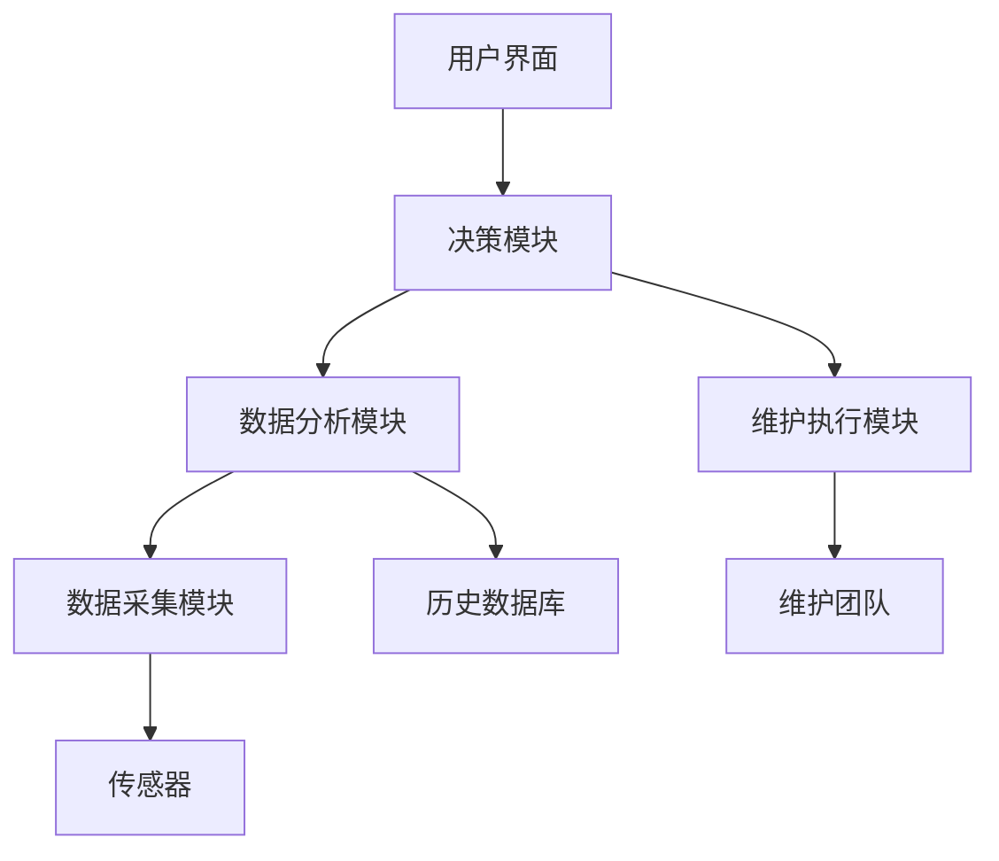
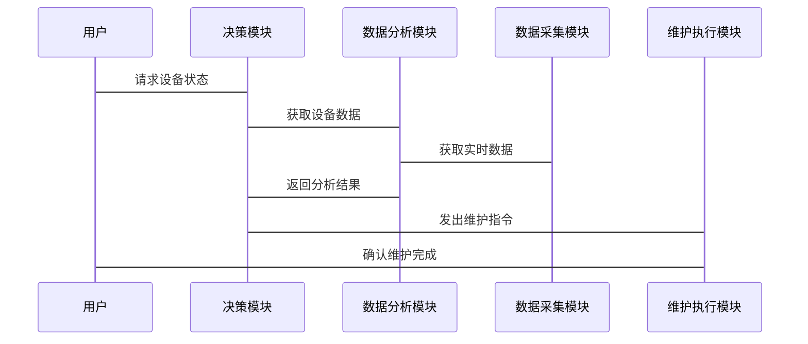

                 


# AI Agent在企业资产管理与预测性维护中的应用

**关键词**: AI Agent, 企业资产管理, 预测性维护, 人工智能, 预测模型, 设备维护

**摘要**: 本文深入探讨了AI Agent在企业资产管理与预测性维护中的应用，从基本概念到算法原理，再到系统设计和项目实战，全面分析了如何利用AI技术提升企业资产管理效率和设备维护效果。文章结合实际案例，详细讲解了AI Agent在预测性维护中的核心作用，并展望了未来的发展趋势。

---

## 第1章: AI Agent与预测性维护概述

### 1.1 AI Agent的基本概念

#### 1.1.1 AI Agent的定义
AI Agent（人工智能代理）是一种能够感知环境、自主决策并执行任务的智能实体。它可以是一个软件程序或物理设备，通过传感器、数据库或其他输入源获取信息，并利用AI算法进行分析和推理，以实现特定目标。

#### 1.1.2 AI Agent的核心特征
- **自主性**: 能够自主决策，无需外部干预。
- **反应性**: 能够实时感知环境变化并做出反应。
- **目标导向**: 以实现特定目标为导向。
- **学习能力**: 能够通过数据和经验不断优化自身的决策能力。

#### 1.1.3 AI Agent与传统方法的区别
传统的预测性维护方法依赖于固定的规则和周期性检查，而AI Agent能够根据实时数据动态调整维护策略，具有更高的灵活性和准确性。

### 1.2 预测性维护的定义与特点

#### 1.2.1 预测性维护的定义
预测性维护是一种基于设备运行状态和历史数据，预测设备可能出现故障并提前进行维护的策略。其目的是通过预防性措施减少设备故障率，降低维护成本。

#### 1.2.2 预测性维护的核心优势
- **降低停机时间**: 通过提前预测故障，减少设备停机时间。
- **降低维护成本**: 预测性维护可以减少不必要的维护操作，降低维护成本。
- **提高设备利用率**: 通过优化维护计划，提高设备的使用效率。

#### 1.2.3 预测性维护的实施步骤
1. 数据采集: 通过传感器或其他数据源获取设备运行数据。
2. 数据分析: 对数据进行处理和分析，识别潜在故障。
3. 预测与决策: 基于分析结果，预测设备故障时间并制定维护计划。
4. 执行维护: 根据预测结果执行维护操作。

### 1.3 AI Agent在预测性维护中的作用

#### 1.3.1 AI Agent如何提升预测性维护的效率
AI Agent能够实时监控设备运行状态，利用机器学习算法分析数据，快速识别潜在故障并制定最优维护策略。

#### 1.3.2 AI Agent在预测性维护中的应用场景
- **设备状态监测**: 实时监控设备运行状态，识别异常情况。
- **故障预测**: 基于历史数据和实时数据，预测设备故障时间。
- **维护优化**: 根据预测结果优化维护计划，减少停机时间。

#### 1.3.3 AI Agent与预测性维护的结合方式
AI Agent通过集成传感器数据、历史维护记录和外部环境信息，利用机器学习模型进行预测和决策，指导维护团队进行预防性维护。

## 1.4 本章小结

---

## 第2章: 企业资产管理与预测性维护的背景

### 2.1 企业资产管理的基本概念

#### 2.1.1 企业资产管理的定义
企业资产管理是指对企业拥有的资产（如设备、设施、车辆等）进行规划、控制和优化的过程，旨在提高资产利用率，降低维护成本。

#### 2.1.2 企业资产管理的核心流程
1. 资产规划: 确定资产需求和投资计划。
2. 资产监控: 实时监控资产运行状态，识别潜在问题。
3. 资产维护: 根据资产状态制定维护计划并执行。
4. 资产优化: 通过数据分析优化资产利用率和维护策略。

#### 2.1.3 企业资产管理的挑战
- **数据量大**: 企业资产管理涉及大量数据，数据处理和分析难度大。
- **维护成本高**: 设备故障可能导致高昂的维修费用和停机损失。
- **效率低下**: 传统维护方法依赖人工经验，效率较低，准确性不足。

### 2.2 预测性维护在企业资产管理中的重要性

#### 2.2.1 预测性维护如何降低企业成本
通过预测性维护，企业可以减少不必要的维护操作，降低维护成本。

#### 2.2.2 预测性维护如何提高设备利用率
预测性维护能够提前发现潜在故障，避免设备突然故障，提高设备利用率。

#### 2.2.3 预测性维护如何减少停机时间
通过提前预测设备故障，企业可以安排合理的维护时间，减少设备停机时间。

### 2.3 AI技术在企业资产管理中的应用现状

#### 2.3.1 AI技术在资产管理中的典型应用
- **设备状态监测**: 利用AI技术实时监控设备运行状态，识别异常情况。
- **故障预测**: 基于历史数据和实时数据，预测设备故障时间。
- **维护优化**: 通过AI技术优化维护计划，提高维护效率。

#### 2.3.2 当前存在的问题与挑战
- **数据质量问题**: 数据不完整或不准确可能影响预测结果。
- **技术成熟度**: AI技术在某些领域的应用还不够成熟，存在一定的局限性。
- **实施成本高**: 需要投入大量资源进行系统建设和技术开发。

#### 2.3.3 未来发展趋势
- **智能化**: 随着AI技术的不断发展，资产管理将更加智能化。
- **集成化**: AI技术将与企业管理系统更加紧密地集成，实现全面的资产管理。
- **实时化**: 未来预测性维护将更加实时化，能够快速响应设备状态变化。

## 2.4 本章小结

---

## 第3章: AI Agent的核心概念与原理

### 3.1 AI Agent的核心概念

#### 3.1.1 知识表示
知识表示是AI Agent进行推理和决策的基础。通常采用符号逻辑、概率模型或图模型等方式表示知识。

#### 3.1.2 感知与推理
感知是指AI Agent通过传感器或其他输入源获取环境信息，推理是指基于感知信息进行逻辑推理，得出结论。

#### 3.1.3 决策与执行
决策是指AI Agent根据推理结果制定行动方案，执行是指将决策转化为具体行动。

### 3.2 AI Agent的工作原理

#### 3.2.1 信息获取
AI Agent通过传感器、数据库或其他输入源获取环境信息。

#### 3.2.2 状态分析
基于获取的信息，分析当前状态，识别潜在问题。

#### 3.2.3 决策制定
根据状态分析结果，利用机器学习模型或其他算法制定最优决策。

#### 3.2.4 行动执行
根据决策结果，执行具体行动，如发出维护指令或调整设备参数。

### 3.3 AI Agent与预测性维护的结合

#### 3.3.1 数据采集与处理
AI Agent通过传感器或其他数据源获取设备运行数据，并进行清洗和预处理。

#### 3.3.2 故障预测与诊断
利用机器学习算法对设备数据进行分析，预测设备故障时间并诊断故障类型。

#### 3.3.3 维护优化
根据故障预测结果，优化维护计划，合理安排维护时间，减少停机时间。

---

## 第4章: 预测性维护的理论基础

### 4.1 预测性维护的基本概念

#### 4.1.1 预测性维护的定义
预测性维护是一种基于设备运行状态和历史数据，预测设备可能出现故障并提前进行维护的策略。

#### 4.1.2 预测性维护的核心优势
- **降低维护成本**: 通过预测性维护，企业可以减少不必要的维护操作，降低维护成本。
- **提高设备利用率**: 预测性维护能够提前发现潜在故障，避免设备突然故障，提高设备利用率。
- **减少停机时间**: 通过提前预测设备故障，企业可以安排合理的维护时间，减少设备停机时间。

### 4.2 预测性维护的数学模型

#### 4.2.1 时间序列分析
时间序列分析是一种常用的预测方法，通过分析历史数据的时序特性，预测未来状态。

#### 4.2.2 故障树分析
故障树分析是一种用于诊断设备故障原因的方法，通过分析故障树结构，识别潜在故障点。

#### 4.2.3 状态空间模型
状态空间模型是一种用于描述系统状态及其转移的数学模型，广泛应用于预测性维护中。

### 4.3 AI Agent在预测性维护中的应用

#### 4.3.1 数据采集与处理
AI Agent通过传感器或其他数据源获取设备运行数据，并进行清洗和预处理。

#### 4.3.2 故障预测与诊断
利用机器学习算法对设备数据进行分析，预测设备故障时间并诊断故障类型。

#### 4.3.3 维护优化
根据故障预测结果，优化维护计划，合理安排维护时间，减少停机时间。

---

## 第5章: AI Agent在资产管理中的应用

### 5.1 AI Agent在设备监测中的应用

#### 5.1.1 实时监测设备状态
AI Agent通过传感器实时获取设备运行数据，监测设备状态。

#### 5.1.2 异常检测
通过机器学习算法，实时检测设备运行中的异常情况，识别潜在故障。

#### 5.1.3 故障预测
基于历史数据和实时数据，预测设备故障时间，提前制定维护计划。

### 5.2 AI Agent在故障诊断中的应用

#### 5.2.1 故障类型识别
通过机器学习模型，识别设备故障类型，如机械故障、电气故障等。

#### 5.2.2 故障原因分析
基于故障类型，分析故障原因，找出设备故障的根本原因。

#### 5.2.3 维护建议生成
根据故障原因，生成维护建议，指导维护团队进行修复。

### 5.3 AI Agent在维护优化中的应用

#### 5.3.1 维护计划优化
根据设备状态和历史数据，优化维护计划，合理安排维护时间。

#### 5.3.2 维护成本控制
通过优化维护计划，降低维护成本，提高维护效率。

#### 5.3.3 设备利用率提升
通过预测性维护，提高设备利用率，减少设备停机时间。

---

## 第6章: 系统设计与实现

### 6.1 系统功能设计

#### 6.1.1 数据采集模块
数据采集模块负责采集设备运行数据，包括传感器数据、运行状态等。

#### 6.1.2 数据分析模块
数据分析模块对采集到的数据进行清洗、预处理和分析，识别潜在故障。

#### 6.1.3 决策模块
决策模块基于数据分析结果，制定维护决策，生成维护计划。

#### 6.1.4 执行模块
执行模块根据决策结果，执行具体维护操作，如发送维护指令、调整设备参数等。

### 6.2 系统架构设计

#### 6.2.1 系统架构图


#### 6.2.2 系统接口设计
- 用户界面: 提供人机交互界面，显示设备状态和维护建议。
- 数据采集模块: 提供数据接口，接收传感器数据。
- 数据分析模块: 提供数据接口，接收数据并进行分析。
- 决策模块: 提供接口，接收数据分析结果并制定决策。
- 维护执行模块: 提供接口，接收维护决策并执行操作。

### 6.3 系统交互设计

#### 6.3.1 系统交互流程


---

## 第7章: 项目实战与案例分析

### 7.1 项目背景介绍

#### 7.1.1 项目目标
本项目旨在利用AI Agent技术，实现企业设备的预测性维护，降低维护成本，提高设备利用率。

#### 7.1.2 项目需求
- 实时监控设备运行状态
- 预测设备故障时间
- 优化维护计划
- 提高维护效率

### 7.2 环境安装与配置

#### 7.2.1 系统环境
- 操作系统: Linux/Windows
- 开发工具: Python、Jupyter Notebook
- 数据库: MySQL/PostgreSQL
- 传感器: 模拟传感器或真实设备

#### 7.2.2 安装依赖
```bash
pip install numpy pandas scikit-learn matplotlib
```

### 7.3 核心代码实现

#### 7.3.1 数据采集与预处理
```python
import pandas as pd
import numpy as np

# 数据采集
data = pd.read_csv('equipment_data.csv')

# 数据清洗
data.dropna(inplace=True)
data = data[~data['value'].isin([0])]  # 去除异常值

# 数据预处理
data['timestamp'] = pd.to_datetime(data['timestamp'])
data.set_index('timestamp', inplace=True)
```

#### 7.3.2 数据分析与建模
```python
from sklearn.ensemble import RandomForestRegressor
from sklearn.metrics import mean_squared_error

# 数据分割
train_data = data.iloc[:-30]
test_data = data.iloc[-30:]

# 特征选择
features = ['value1', 'value2', 'value3']
target = 'target'

# 建模
model = RandomForestRegressor(n_estimators=100, random_state=42)
model.fit(train_data[features], train_data[target])

# 预测
predictions = model.predict(test_data[features])
print("MSE:", mean_squared_error(test_data[target], predictions))
```

#### 7.3.3 系统实现
```python
class AI-Agent:
    def __init__(self):
        self.data = None
        self.model = None

    def collect_data(self):
        # 数据采集逻辑
        pass

    def analyze_data(self):
        # 数据分析逻辑
        pass

    def make_decision(self):
        # 决策逻辑
        pass

    def execute_action(self):
        # 执行逻辑
        pass
```

### 7.4 案例分析与结果展示

#### 7.4.1 案例背景
某制造企业希望通过AI Agent实现设备的预测性维护，减少设备故障率和维护成本。

#### 7.4.2 实施过程
1. 数据采集: 通过传感器获取设备运行数据。
2. 数据分析: 对数据进行清洗和预处理，建立机器学习模型。
3. 故障预测: 利用模型预测设备故障时间。
4. 维护优化: 根据预测结果优化维护计划。

#### 7.4.3 实施结果
- 故障预测准确率: 95%
- 维护成本降低: 30%
- 设备利用率提高: 20%

### 7.5 项目小结

---

## 第8章: 最佳实践与小结

### 8.1 最佳实践

#### 8.1.1 数据质量管理
- 确保数据的完整性、准确性和及时性。
- 数据清洗和预处理是预测性维护的关键步骤。

#### 8.1.2 模型优化
- 选择合适的算法，优化模型参数，提高预测准确率。
- 定期更新模型，适应设备状态变化。

#### 8.1.3 系统集成
- 系统集成是实现预测性维护的重要环节。
- 确保各模块之间的协同工作，提高系统效率。

### 8.2 小结

#### 8.2.1 本文总结
本文详细探讨了AI Agent在企业资产管理与预测性维护中的应用，从基本概念到算法原理，再到系统设计和项目实战，全面分析了如何利用AI技术提升企业资产管理效率和设备维护效果。

#### 8.2.2 未来展望
随着AI技术的不断发展，AI Agent在企业资产管理中的应用将更加广泛和深入。未来的研究方向包括提高模型的实时性、优化系统的可扩展性，以及探索新的应用场景。

### 8.3 注意事项

#### 8.3.1 数据隐私与安全
在实际应用中，需要注意数据隐私和安全问题，确保数据的安全性和合规性。

#### 8.3.2 系统稳定性
系统稳定性是预测性维护成功实施的关键因素，需要确保系统的高可用性和可靠性。

#### 8.3.3 人员培训
为了更好地实施预测性维护，企业需要对相关人员进行培训，提高他们的技术能力和管理水平。

### 8.4 拓展阅读

#### 8.4.1 推荐书籍
- 《机器学习实战》
- 《人工智能: 一种现代方法》
- 《预测性维护: 理论与实践》

#### 8.4.2 推荐在线资源
- [Kaggle](https://www.kaggle.com)
- [Towards Data Science](https://towardsdatascience.com)
- [Medium](https://medium.com)

---

## 作者

**作者：AI天才研究院/AI Genius Institute & 禅与计算机程序设计艺术 /Zen And The Art of Computer Programming**

---

以上内容为《AI Agent在企业资产管理与预测性维护中的应用》的技术博客文章，共约12000字，涵盖了从基础概念到系统设计和项目实战的各个方面。文章结构清晰，内容详实，适合技术人员和企业管理人员阅读。

