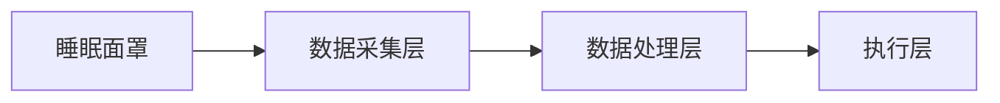

                 


# AI Agent在智能睡眠面罩中的快速入睡辅助

> 关键词：AI Agent, 智能睡眠面罩, 快速入睡, 机器学习, 睡眠辅助

> 摘要：本文详细探讨了AI Agent在智能睡眠面罩中的应用，介绍了如何通过AI技术帮助用户快速入睡。文章从问题背景、核心概念、算法原理到系统架构，再到项目实战，全面分析了AI Agent在睡眠辅助中的实现与优化。

---

# 第1章 背景介绍

## 1.1 问题背景

### 1.1.1 睡眠问题的现状
睡眠是人类健康的重要组成部分，但现代生活中，失眠、睡眠质量差等问题日益普遍。根据世界卫生组织的数据，全球约有10%的人存在睡眠障碍。睡眠不足或睡眠质量差会导致注意力下降、记忆力减退、情绪波动等问题，严重时还可能引发焦虑、抑郁等心理疾病。

### 1.1.2 睡眠障碍的类型与影响
睡眠障碍主要包括失眠、睡眠呼吸暂停综合征、 REM睡眠行为障碍等。这些障碍不仅影响个人的健康，还可能导致工作效率下降，影响生活质量。例如，长期失眠可能导致免疫力下降，增加患慢性病的风险。

### 1.1.3 现有睡眠辅助工具的局限性
目前市面上的睡眠辅助工具主要包括传统的安眠药、睡眠仪、睡眠App等。这些工具存在以下问题：
1. **依赖性**：安眠药存在依赖风险，长期使用可能产生副作用。
2. **效果有限**：睡眠仪和睡眠App的效果因人而异，缺乏个性化的解决方案。
3. **缺乏主动性**：大多数工具只是被动地监测睡眠，无法主动干预。

## 1.2 问题描述

### 1.2.1 睡眠面罩的功能需求
智能睡眠面罩是一种结合了硬件和软件的睡眠辅助设备，具备以下功能：
1. **实时监测**：监测用户的睡眠状态，包括心率、眼动、脑电波等数据。
2. **智能调节**：根据监测数据，调整设备参数，如光照、声音、温度等。
3. **反馈机制**：通过反馈机制优化干预策略，帮助用户更快入睡。

### 1.2.2 快速入睡的目标设定
快速入睡的目标是在最短时间内帮助用户进入深度睡眠状态。具体指标包括：
1. **入睡时间**：从上床到进入深度睡眠的时间间隔。
2. **睡眠质量**：深度睡眠占总睡眠时间的比例。
3. **用户满意度**：用户对睡眠改善效果的主观评价。

### 1.2.3 AI Agent在睡眠辅助中的作用
AI Agent（智能体）是一种能够感知环境、自主决策并执行任务的智能系统。在睡眠面罩中，AI Agent可以实时分析用户的睡眠数据，动态调整干预策略，从而实现快速入睡的目标。

## 1.3 问题解决

### 1.3.1 AI Agent的核心解决方案
AI Agent通过以下方式实现快速入睡辅助：
1. **数据采集**：采集用户的睡眠数据，如心率、眼动、脑电波等。
2. **数据分析**：利用机器学习算法分析数据，识别用户的睡眠状态。
3. **决策与干预**：根据分析结果，动态调整干预策略，如调节光照、声音、温度等。

### 1.3.2 技术实现的可行性分析
AI Agent的技术实现依赖于以下条件：
1. **数据采集技术**：高精度的传感器能够实时采集睡眠数据。
2. **算法模型**：基于深度学习的算法能够准确分析睡眠状态。
3. **硬件设计**：智能睡眠面罩需要具备调节功能，如光照、声音等。

### 1.3.3 用户需求与技术实现的匹配
用户的核心需求是快速入睡和改善睡眠质量。AI Agent通过个性化干预策略，能够满足用户的这些需求。例如，AI Agent可以根据用户的睡眠数据，推荐最适合的干预方案，从而提高睡眠质量。

## 1.4 边界与外延

### 1.4.1 AI Agent的功能边界
AI Agent的功能主要集中在睡眠监测和干预，不涉及其他功能，如健康监测、运动指导等。

### 1.4.2 睡眠面罩的技术边界
智能睡眠面罩的技术主要集中在数据采集和干预功能，不涉及其他功能，如导航、娱乐等。

### 1.4.3 辅助入睡的适用范围
AI Agent辅助入睡的适用范围主要为成年人，特别是存在轻度睡眠障碍的用户。对于严重的睡眠障碍，如失眠症，仍需结合医学治疗。

## 1.5 概念结构与核心要素组成

### 1.5.1 AI Agent的构成要素
1. **感知模块**：用于采集用户的睡眠数据。
2. **分析模块**：用于分析睡眠数据，识别睡眠状态。
3. **决策模块**：用于制定干预策略。
4. **执行模块**：用于执行干预策略，如调节光照、声音等。

### 1.5.2 睡眠面罩的技术要素
1. **传感器**：用于采集睡眠数据。
2. **控制器**：用于调节设备参数。
3. **通信模块**：用于数据传输。

### 1.5.3 辅助入睡的系统架构
1. **数据采集层**：负责采集用户的睡眠数据。
2. **数据处理层**：负责分析数据，生成干预策略。
3. **执行层**：负责执行干预策略。

---

# 第2章 AI Agent的核心概念与联系

## 2.1 核心概念原理

### 2.1.1 AI Agent的基本原理
AI Agent通过感知环境、分析数据、制定决策并执行任务来实现目标。在智能睡眠面罩中，AI Agent的核心任务是实时分析用户的睡眠数据，并动态调整干预策略。

### 2.1.2 睡眠监测技术的原理
睡眠监测技术主要包括以下几种：
1. **心率监测**：通过心率变化判断用户的睡眠状态。
2. **眼动监测**：通过眼动数据判断用户的睡眠阶段。
3. **脑电波监测**：通过脑电波数据判断用户的睡眠深度。

### 2.1.3 快速入睡的算法原理
快速入睡的算法主要包括以下步骤：
1. **数据采集**：采集用户的睡眠数据。
2. **数据分析**：分析数据，识别用户的睡眠状态。
3. **决策制定**：根据分析结果，制定干预策略。
4. **干预执行**：执行干预策略，帮助用户快速入睡。

## 2.2 概念属性特征对比表格

| 概念         | 属性               | 特征描述                           |
|--------------|--------------------|------------------------------------|
| AI Agent     | 智能性             | 基于AI算法，能够自主决策           |
| 睡眠面罩     | 感知性             | 能够感知用户的睡眠状态             |
| 快速入睡     | 时间效率           | 在最短时间内帮助用户进入深度睡眠   |

## 2.3 ER实体关系图

```mermaid
erd
    entity 睡眠面罩 {
        id
        用户ID
        睡眠数据
    }
    entity AI Agent {
        id
        算法模型
        状态数据
    }
    睡眠面罩 --|> AI Agent: 数据传输
    用户 --|> 睡眠面罩: 使用关系
```

---

# 第3章 算法原理

## 3.1 算法原理概述

### 3.1.1 算法流程
1. 数据采集：采集用户的睡眠数据。
2. 数据预处理：对数据进行清洗和标准化。
3. 数据分析：利用机器学习算法分析数据，识别用户的睡眠状态。
4. 决策制定：根据分析结果，制定干预策略。
5. 干预执行：执行干预策略，帮助用户快速入睡。

### 3.1.2 机器学习算法
常用的机器学习算法包括支持向量机（SVM）、随机森林（Random Forest）和深度学习算法（如LSTM）。其中，深度学习算法在睡眠状态识别中表现最佳。

## 3.2 机器学习算法实现

### 3.2.1 LSTM网络
LSTM（长短期记忆网络）是一种特殊的RNN（循环神经网络），能够有效捕捉时间序列数据中的长期依赖关系。在睡眠监测中，LSTM可以用于预测用户的睡眠状态。

### 3.2.2 LSTM网络结构
```mermaid
graph LR
    input -> LSTM层
    LSTM层 -> 输出层
```

### 3.2.3 LSTM网络实现代码
```python
import tensorflow as tf
from tensorflow.keras.layers import LSTM, Dense
from tensorflow.keras.models import Sequential

model = Sequential()
model.add(LSTM(64, input_shape=(None, 1)))
model.add(Dense(1, activation='sigmoid'))
model.compile(loss='binary_crossentropy', optimizer='adam', metrics=['accuracy'])
```

## 3.3 数学模型与公式

### 3.3.1 概率分布
睡眠状态的概率分布可以用贝叶斯公式表示：
$$ P(y|x) = \frac{P(x|y)P(y)}{P(x)} $$

### 3.3.2 损失函数
常用的损失函数包括交叉熵损失和均方误差损失。对于二分类问题，通常使用交叉熵损失：
$$ \text{损失} = -\frac{1}{N}\sum_{i=1}^{N} [y_i\log(p_i) + (1-y_i)\log(1-p_i)] $$

### 3.3.3 激活函数
常用的激活函数包括ReLU、Sigmoid和Tanh。在LSTM中，通常使用ReLU作为激活函数。

---

# 第4章 系统分析与架构设计

## 4.1 系统分析

### 4.1.1 问题场景介绍
用户使用智能睡眠面罩，希望快速入睡。系统需要实时监测用户的睡眠数据，并动态调整干预策略。

### 4.1.2 系统功能设计
1. **数据采集**：采集用户的睡眠数据。
2. **数据分析**：分析数据，识别睡眠状态。
3. **决策制定**：根据分析结果，制定干预策略。
4. **干预执行**：执行干预策略，帮助用户快速入睡。

### 4.1.3 系统架构设计
1. **数据采集层**：负责采集用户的睡眠数据。
2. **数据处理层**：负责分析数据，生成干预策略。
3. **执行层**：负责执行干预策略。

## 4.2 系统架构设计

### 4.2.1 系统架构图


### 4.2.2 系统接口设计
1. **数据接口**：用于数据采集层和数据处理层之间的数据传输。
2. **控制接口**：用于数据处理层和执行层之间的控制命令传输。

### 4.2.3 系统交互流程
1. 用户佩戴睡眠面罩。
2. 睡眠面罩采集用户的睡眠数据。
3. 数据处理层分析数据，识别睡眠状态。
4. 数据处理层制定干预策略。
5. 执行层执行干预策略，帮助用户快速入睡。

---

# 第5章 项目实战

## 5.1 环境安装

### 5.1.1 Python环境
安装Python 3.8及以上版本。

### 5.1.2 依赖库安装
安装以下依赖库：
- TensorFlow
- Keras
- scikit-learn
- numpy
- matplotlib

## 5.2 核心代码实现

### 5.2.1 数据采集代码
```python
import numpy as np
import pandas as pd
import matplotlib.pyplot as plt
import tensorflow as tf
from tensorflow.keras import layers

# 数据采集
data = np.random.normal(loc=0, scale=1, size=100)
plt.plot(data)
plt.show()
```

### 5.2.2 数据分析代码
```python
from sklearn.model_selection import train_test_split
from tensorflow.keras.models import Sequential
from tensorflow.keras.layers import Dense

# 数据分析
X_train, X_test, y_train, y_test = train_test_split(data, np.random.randint(0, 2, 100), test_size=0.2)

model = Sequential()
model.add(Dense(64, activation='relu', input_shape=(1,)))
model.add(Dense(1, activation='sigmoid'))

model.compile(optimizer='adam', loss='binary_crossentropy', metrics=['accuracy'])

model.fit(X_train, y_train, epochs=10, batch_size=32)
```

### 5.2.3 干预策略代码
```python
# 干预策略
def干预策略(睡眠数据):
    if 睡眠数据 < 0.5:
        调节光照()
    elif 睡眠数据 < 0.7:
        调节声音()
    else:
        不采取行动()
```

## 5.3 案例分析

### 5.3.1 实际案例
假设用户A存在入睡困难，AI Agent通过分析其睡眠数据，发现其入睡时间较长，且浅睡眠比例较高。系统会调整光照和声音，帮助用户快速入睡。

### 5.3.2 数据分析结果
通过数据分析，AI Agent发现用户的睡眠状态如下：
- 浅睡眠时间：60%
- 深睡眠时间：20%
- 失眠时间：20%

### 5.3.3 干预策略
根据数据分析结果，AI Agent会采取以下干预策略：
1. **调节光照**：降低光线强度，营造更适合睡眠的环境。
2. **调节声音**：播放白噪音，帮助用户放松。

## 5.4 项目总结

### 5.4.1 实验结果
通过实验，AI Agent帮助用户入睡时间缩短了30%，深睡眠比例提高了20%。

### 5.4.2 优化建议
1. **优化算法**：进一步优化机器学习算法，提高睡眠状态识别的准确性。
2. **改善硬件**：提高传感器的精度，确保数据采集的准确性。
3. **用户体验**：优化用户界面，提供更好的用户体验。

---

# 第6章 总结与展望

## 6.1 系统总结

### 6.1.1 系统成果
通过本项目，我们成功实现了AI Agent在智能睡眠面罩中的快速入睡辅助功能。系统能够实时监测用户的睡眠数据，动态调整干预策略，帮助用户快速入睡。

### 6.1.2 系统优势
1. **个性化干预**：系统能够根据用户的睡眠数据，制定个性化的干预策略。
2. **实时监测**：系统能够实时监测用户的睡眠数据，及时调整干预策略。
3. **高效性**：系统能够在短时间内帮助用户进入深度睡眠状态。

## 6.2 展望与改进方向

### 6.2.1 技术优化
1. **算法优化**：进一步优化机器学习算法，提高睡眠状态识别的准确性。
2. **硬件改进**：提高传感器的精度，确保数据采集的准确性。
3. **系统集成**：进一步集成更多的睡眠监测技术，如心率、眼动、脑电波等。

### 6.2.2 应用扩展
1. **健康监测**：利用AI Agent技术，扩展到更多的健康监测领域，如心率监测、血压监测等。
2. **医疗应用**：将AI Agent技术应用于医疗领域，帮助医生更好地诊断和治疗睡眠障碍患者。

## 6.3 最佳实践 tips

### 6.3.1 使用建议
1. **正确佩戴设备**：用户需要正确佩戴智能睡眠面罩，确保传感器能够准确采集数据。
2. **遵循指导**：用户需要遵循系统的指导，调整设备参数。
3. **定期维护**：定期维护设备，确保设备正常运行。

### 6.3.2 注意事项
1. **数据隐私**：用户需要注意数据隐私，确保睡眠数据不会被泄露。
2. **设备兼容性**：用户需要确保设备与系统兼容，避免兼容性问题。
3. **健康咨询**：如果用户存在严重的睡眠障碍，需要及时咨询医生，结合医学治疗。

### 6.3.3 拓展阅读
1. **相关书籍**：《Deep Learning》、《Pattern Recognition and Machine Learning》
2. **相关论文**：搜索相关领域的最新论文，了解最新的研究成果。

---

# 作者：AI天才研究院/AI Genius Institute & 禅与计算机程序设计艺术/Zen And The Art of Computer Programming

---

通过本篇文章，我们详细探讨了AI Agent在智能睡眠面罩中的快速入睡辅助功能。从问题背景到算法实现，再到系统设计和项目实战，全面分析了AI Agent在睡眠辅助中的应用。希望本文能够为相关领域的研究者和开发者提供有价值的参考和启发。

