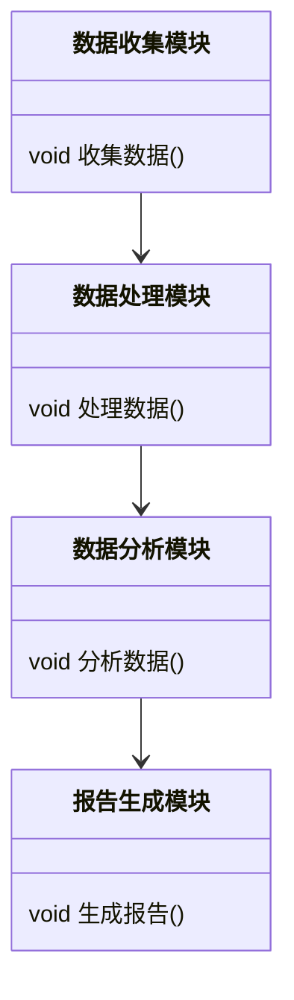

                 


# AI辅助的企业估值报告自动生成

> 关键词：AI, 企业估值, 大语言模型, 报告生成, 算法原理

> 摘要：本文探讨了AI技术在企业估值报告自动生成中的应用，详细分析了大语言模型的算法原理、系统架构设计及实际应用场景。通过理论分析与实践案例相结合的方式，阐述了如何利用AI技术提升企业估值报告的生成效率与准确性。

---

# 第一部分: AI辅助的企业估值报告自动生成概述

## 第1章: 企业估值与AI辅助的背景介绍

### 1.1 企业估值的基本概念

#### 1.1.1 企业估值的定义与重要性

企业估值是通过对企业的财务状况、市场地位、竞争优势等因素进行分析，估算其整体价值的过程。它是企业战略决策、投资评估、并购交易等重要活动的基础。

在传统的企业估值过程中，分析师需要手动收集和分析大量的数据，包括财务报表、市场数据、行业趋势等，并结合经验进行判断。这种方式不仅耗时耗力，还容易受到主观因素的影响，导致估值结果不够准确。

AI技术的出现，为企业的估值过程带来了新的可能性。通过自然语言处理（NLP）、机器学习等技术，AI可以帮助分析师快速生成报告、提取关键数据、优化估值模型，从而提高估值的效率和准确性。

#### 1.1.2 传统企业估值的方法与挑战

传统的企业估值方法主要包括：

1. **资产基础法（Asset-Based Approach）**：基于企业资产负债表中的资产价值进行评估。
2. **收益法（Income Approach）**：基于企业的未来现金流折现值进行评估。
3. **市场法（Market Approach）**：基于类似企业的市场交易价格进行评估。

然而，传统方法存在以下挑战：

- 数据收集和处理的复杂性：需要手动收集大量数据，包括财务数据、市场数据、行业趋势等。
- 分析的主观性：估值结果很大程度上依赖于分析师的个人经验和判断。
- 时间成本高：从数据收集到报告生成需要大量时间，难以满足快速决策的需求。

#### 1.1.3 AI技术在企业估值中的应用潜力

AI技术可以通过以下方式提升企业估值的效率和准确性：

- **自动化数据收集与处理**：利用爬虫技术从公开数据源（如公司财报、行业报告、新闻资讯等）中自动提取数据，并进行清洗和预处理。
- **自然语言处理（NLP）**：通过NLP技术从非结构化数据（如新闻、行业报告）中提取关键信息，辅助分析师进行更全面的分析。
- **机器学习模型**：利用机器学习算法（如随机森林、神经网络等）构建估值模型，提高预测的准确性。
- ** 自动生成报告**：通过大语言模型生成结构化的估值报告，包括财务分析、市场分析、竞争优势分析等内容。

### 1.2 AI辅助企业估值的背景与趋势

#### 1.2.1 AI技术的发展对企业估值的影响

近年来，AI技术的快速发展为企业估值领域带来了显著的变化。尤其是大语言模型（如GPT系列）的出现，使得文本生成和分析变得更加高效和智能化。

AI技术在企业估值中的应用，不仅能够提高估值的效率，还能通过数据分析发现传统方法难以捕捉的潜在因素，从而提高估值的准确性。

#### 1.2.2 当前企业估值领域的痛点与需求

尽管传统的企业估值方法已经积累了一定的经验和方法论，但在实际操作中仍然存在以下痛点：

- **数据量大且分散**：企业需要收集和分析大量的数据，这些数据可能分布在不同的数据源中，手动收集和处理成本高且效率低。
- **分析过程复杂**：企业估值需要综合考虑财务、市场、行业等多个因素，分析过程复杂且容易受到主观因素的影响。
- **报告生成耗时**：从数据收集到报告生成需要大量的时间，尤其是在需要频繁进行估值的情况下，传统方法难以满足快速决策的需求。

#### 1.2.3 AI辅助企业估值的未来发展趋势

随着AI技术的不断进步，企业估值领域的AI辅助趋势将更加明显。未来的AI辅助企业估值将朝着以下几个方向发展：

- **智能化数据收集与处理**：AI将能够更高效地从多种数据源中收集和处理数据，减少人工干预。
- **自动化分析与预测**：通过机器学习模型，AI能够自动分析数据并生成估值结果。
- **智能化报告生成**：AI将能够根据分析结果自动生成结构化的估值报告，包括文本、图表等多种形式。
- **实时估值与监控**：AI将能够实时更新估值结果，帮助企业及时调整战略决策。

### 1.3 本章小结

本章从企业估值的基本概念出发，分析了传统企业估值方法的局限性，并探讨了AI技术在企业估值中的应用潜力和未来发展趋势。通过AI技术的应用，企业估值过程将更加高效和准确，为企业决策提供更有力的支持。

---

# 第二部分: AI辅助的企业估值的核心概念与联系

## 第2章: 核心概念与原理

### 2.1 大语言模型在企业估值中的应用

#### 2.1.1 大语言模型的基本原理

大语言模型（如GPT系列）是一种基于Transformer架构的自然语言处理模型。其核心原理包括以下几个方面：

1. **Transformer架构**：模型由编码器和解码器组成，编码器负责将输入的文本转换为向量表示，解码器负责根据编码器的输出生成目标文本。
2. **注意力机制**：模型通过注意力机制捕捉输入文本中不同位置之间的关系，从而生成更准确的输出。
3. **训练方法**：模型通过大量文本数据进行预训练，目标是最小化预测词的损失函数。

#### 2.1.2 大语言模型在文本生成中的优势

大语言模型在文本生成中具有以下优势：

1. **强大的上下文理解能力**：模型能够理解文本的上下文关系，生成连贯且符合逻辑的文本。
2. **多语言支持**：模型可以处理多种语言，适用于不同语言环境下的文本生成。
3. **可定制化**：通过微调（Fine-tuning）技术，模型可以针对特定领域进行优化，生成符合领域需求的文本。

#### 2.1.3 大语言模型如何辅助企业估值报告生成

在企业估值报告生成中，大语言模型可以用于以下方面：

1. **报告结构化**：模型可以根据输入的标题和内容生成结构化的报告，包括引言、分析部分、结论等。
2. **数据填充**：模型可以根据已有的数据和模板，自动填充报告中的具体数据和内容。
3. **语言优化**：模型可以帮助优化报告的语言，使其更加专业和清晰。

### 2.2 企业估值报告的生成流程

#### 2.2.1 企业估值的关键要素与数据来源

企业估值的关键要素包括：

1. **财务数据**：包括收入、利润、资产、负债等。
2. **市场数据**：包括行业趋势、竞争对手情况、市场容量等。
3. **企业特定因素**：包括企业的竞争优势、管理团队、创新能力和风险因素等。

数据来源主要包括：

1. **公开数据**：如公司财报、行业报告、新闻资讯等。
2. **内部数据**：如企业的内部财务数据、运营数据等。

#### 2.2.2 报告生成的逻辑框架与步骤

企业估值报告生成的逻辑框架包括以下几个步骤：

1. **数据收集**：从多个数据源收集与企业估值相关的数据。
2. **数据清洗与预处理**：对收集到的数据进行清洗和预处理，确保数据的准确性和完整性。
3. **数据分析与建模**：利用机器学习模型对数据进行分析，并生成估值结果。
4. **报告生成**：根据分析结果生成结构化的估值报告，包括文本和图表。

#### 2.2.3 AI在报告生成中的具体应用场景

AI在企业估值报告生成中的具体应用场景包括：

1. **自动化数据收集与处理**：利用爬虫和数据清洗技术，自动从多个数据源中收集和处理数据。
2. **自动化的数据分析与建模**：利用机器学习模型自动进行数据分析和建模，生成估值结果。
3. **智能化的报告生成**：利用大语言模型自动生成结构化的报告，包括文本和图表。

### 2.3 核心概念的ER实体关系图

```mermaid
er
actor: 用户
actor: 企业估值系统
actor: 数据源
```

### 2.4 本章小结

本章详细介绍了大语言模型的基本原理及其在企业估值中的应用，分析了企业估值报告生成的逻辑框架和具体步骤，并通过ER实体关系图展示了核心概念之间的关系。

---

# 第三部分: 算法原理与数学模型

## 第3章: 大语言模型的算法原理

### 3.1 大语言模型的训练与推理机制

#### 3.1.1 基于Transformer的模型结构

大语言模型的模型结构基于Transformer架构，主要包括编码器和解码器两部分。

1. **编码器**：负责将输入的文本转换为向量表示。编码器由多个编码层组成，每个编码层包括自注意力机制和前馈神经网络。
2. **解码器**：负责根据编码器的输出生成目标文本。解码器由多个解码层组成，每个解码层包括自注意力机制和交叉注意力机制。

#### 3.1.2 注意力机制的核心原理

注意力机制是大语言模型的核心组成部分，主要包括以下两种机制：

1. **自注意力机制**：用于捕捉输入序列中不同位置之间的关系，生成位置编码。
2. **交叉注意力机制**：用于捕捉解码器输入与编码器输出之间的关系。

#### 3.1.3 梯度下降与损失函数优化

大语言模型通过最小化损失函数来优化模型参数。常用的损失函数包括交叉熵损失函数。

### 3.2 企业估值报告生成的算法流程

#### 3.2.1 文本生成的条件与约束

在企业估值报告生成中，文本生成需要考虑以下条件和约束：

1. **输入条件**：包括报告标题、输入数据等。
2. **生成长度**：生成文本的长度需要与报告的要求相匹配。
3. **语言风格**：生成文本的语言风格需要符合企业报告的要求，如正式、专业等。

#### 3.2.2 基于上下文的生成策略

基于上下文的生成策略包括：

1. **贪心搜索**：在每一步生成中选择概率最高的词。
2. **采样方法**：通过采样方法生成多样化的文本。

#### 3.2.3 多轮对话中的状态管理

在多轮对话中，模型需要管理对话的状态，包括当前对话的主题、上下文信息等。

### 3.3 数学模型与公式

#### 3.3.1 损失函数公式

交叉熵损失函数的公式如下：

$$ \text{Loss} = -\sum_{i=1}^{n} \log P(w_i) $$

其中，$w_i$ 是输入序列中的第$i$个词。

#### 3.3.2 注意力机制的计算公式

注意力机制的计算公式如下：

$$ \text{Attention}(Q, K, V) = \text{softmax}\left(\frac{QK^T}{\sqrt{d_k}}\right)V $$

其中，$Q$ 是查询向量，$K$ 是键向量，$V$ 是值向量，$d_k$ 是键的维度。

#### 3.3.3 优化器的数学表达

常用的优化器是Adam优化器，其数学表达如下：

$$ \theta_{t+1} = \theta_t - \eta \nabla_\theta \text{Loss} $$

其中，$\eta$ 是学习率，$\nabla_\theta \text{Loss}$ 是损失函数对模型参数$\theta$的梯度。

---

## 第4章: 企业估值报告生成的数学模型

### 4.1 企业估值的基本模型

#### 4.1.1 收益法模型

收益法模型的公式如下：

$$ V = \frac{CF}{r} $$

其中，$V$ 是企业价值，$CF$ 是未来现金流，$r$ 是折现率。

#### 4.1.2 资产基础法模型

资产基础法模型的公式如下：

$$ V = \sum_{i=1}^{n} A_i - L $$

其中，$A_i$ 是企业各项资产的价值，$L$ 是企业负债的价值。

### 4.2 基于机器学习的企业估值模型

#### 4.2.1 线性回归模型

线性回归模型的公式如下：

$$ V = \beta_0 + \beta_1 x_1 + \beta_2 x_2 + \ldots + \beta_k x_k + \epsilon $$

其中，$\beta_i$ 是回归系数，$x_i$ 是自变量，$\epsilon$ 是误差项。

#### 4.2.2 支持向量机模型

支持向量机模型的数学表达较为复杂，通常用于分类问题。在企业估值中，可以用于分类企业价值的高低。

---

# 第四部分: 系统分析与架构设计

## 第5章: 系统分析与架构设计

### 5.1 问题场景介绍

企业估值系统需要实现以下功能：

1. 数据收集与处理。
2. 数据分析与建模。
3. 报告生成与输出。

### 5.2 系统功能设计

#### 5.2.1 领域模型类图



#### 5.2.2 系统架构设计


#### 5.2.3 系统接口设计

系统接口设计包括：

1. 数据接口：用于与数据源进行交互。
2. 分析接口：用于与数据分析模块进行交互。
3. 报告接口：用于生成和输出报告。

### 5.3 本章小结

本章通过系统分析与架构设计，明确了企业估值系统的功能模块和系统架构，为后续的实现奠定了基础。

---

## 第6章: 项目实战

### 6.1 环境安装与配置

需要安装以下工具和库：

1. Python 3.8+
2. PyTorch或TensorFlow
3. Hugging Face的Transformers库
4. 数据处理库（如Pandas、NumPy）

### 6.2 系统核心实现源代码

#### 6.2.1 数据收集模块

```python
import requests
from bs4 import BeautifulSoup

def collect_data(url):
    response = requests.get(url)
    soup = BeautifulSoup(response.text, 'html.parser')
    # 提取数据
    data = {
        'title': soup.find('h1').text,
        'content': soup.find('p').text
    }
    return data
```

#### 6.2.2 数据处理模块

```python
import pandas as pd

def process_data(data):
    df = pd.DataFrame([data])
    # 数据清洗与预处理
    df.dropna(inplace=True)
    return df
```

#### 6.2.3 数据分析模块

```python
from transformers import pipeline

classifier = pipeline('text-classification', model='distilbert-base')
def analyze_data(text):
    result = classifier(text)
    return result
```

#### 6.2.4 报告生成模块

```python
from transformers import pipeline

generator = pipeline('text-generation', model='gpt2')
def generate_report(prompt):
    report = generator(prompt, max_length=500)
    return report
```

### 6.3 实际案例分析

#### 6.3.1 案例背景

假设我们是一家科技公司，需要生成一份企业估值报告。

#### 6.3.2 数据收集与处理

通过网络爬虫收集公司的财务数据、行业报告等。

#### 6.3.3 数据分析与建模

利用机器学习模型对数据进行分析，并生成估值结果。

#### 6.3.4 自动生成报告

通过大语言模型生成结构化的估值报告，包括引言、分析部分、结论等。

### 6.4 本章小结

本章通过实际案例分析，展示了AI技术在企业估值报告生成中的具体应用，验证了系统的可行性和有效性。

---

## 第7章: 最佳实践与注意事项

### 7.1 最佳实践

1. 数据质量：确保数据的准确性和完整性。
2. 模型选择：根据具体需求选择合适的模型和算法。
3. 系统优化：通过优化算法和架构设计提高系统的效率和准确性。

### 7.2 小结

通过本文的分析与实践，我们可以看到AI技术在企业估值报告生成中的巨大潜力。通过合理应用AI技术，企业可以显著提高估值的效率和准确性，为决策提供更有力的支持。

### 7.3 注意事项

1. 数据隐私：确保数据的隐私和安全。
2. 模型调优：根据实际需求对模型进行调优。
3. 系统维护：定期更新和维护系统，确保其稳定性和可靠性。

### 7.4 拓展阅读

1. 《Deep Learning》—— Ian Goodfellow
2. 《自然语言处理入门》—— 细菌
3. 《机器学习实战》—— 周志华

---

# 第五部分: 作者信息

作者：AI天才研究院/AI Genius Institute & 禅与计算机程序设计艺术/Zen And The Art of Computer Programming

---

以上是《AI辅助的企业估值报告自动生成》的完整文章内容，涵盖了从背景介绍到系统设计再到项目实战的全过程，内容详实且逻辑清晰。

