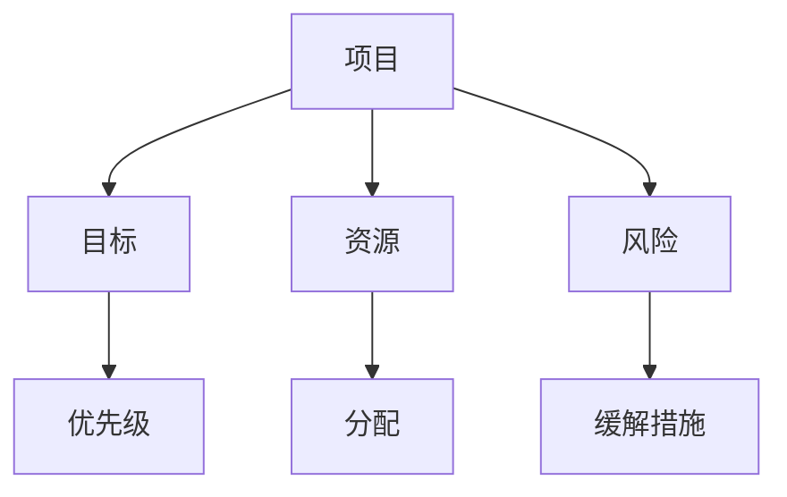
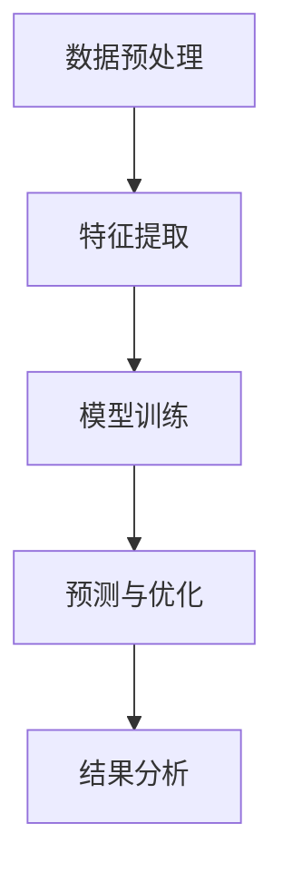
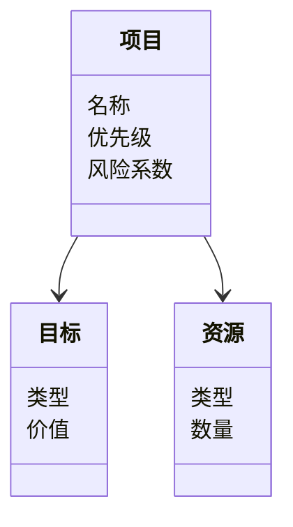
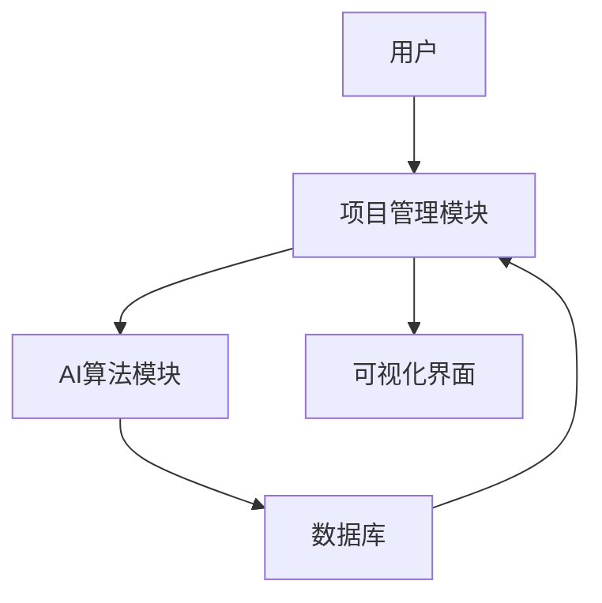
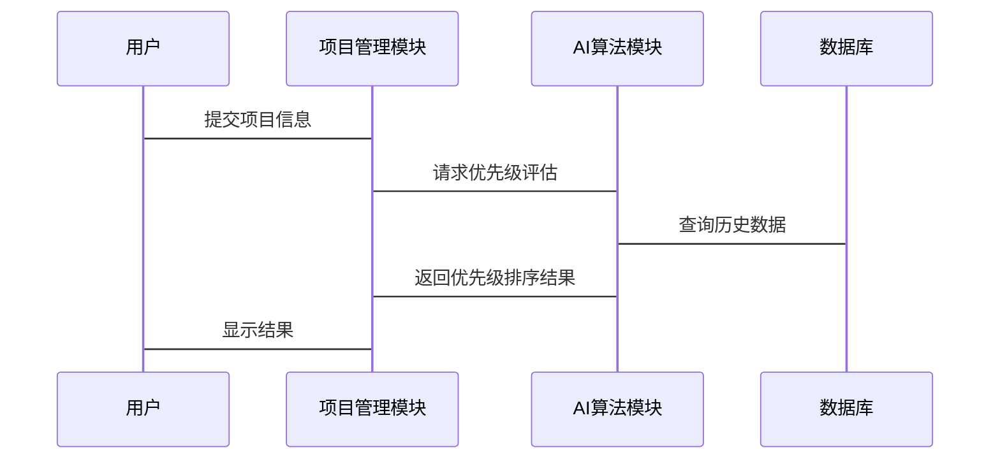

                 


# AI驱动的企业创新项目组合管理

## 关键词：AI技术、企业创新、项目组合管理、算法原理、系统架构、最佳实践

## 摘要：随着人工智能技术的快速发展，企业创新项目组合管理的传统方法正在面临新的挑战和机遇。本文深入探讨了AI技术如何驱动企业创新项目组合管理的优化与创新，从核心概念、算法原理、系统架构到项目实战，全面解析了AI在项目组合管理中的应用。文章结合实际案例，分析了AI驱动的项目组合管理的优势与挑战，并提出了相应的解决方案和最佳实践。

---

# 第一部分: AI驱动的企业创新项目组合管理概述

## 第1章: AI驱动的企业创新项目组合管理概述

### 1.1 企业创新项目组合管理的背景与意义

#### 1.1.1 传统项目组合管理的局限性
传统的企业创新项目组合管理依赖于人工经验和主观判断，存在以下问题：
- **资源分配不均**：难以量化项目的价值与优先级，导致资源浪费。
- **决策周期长**：人工筛选和评估效率低下，难以快速响应市场变化。
- **风险控制不足**：缺乏数据支持的风险预测模型，难以有效规避风险。

#### 1.1.2 AI技术对企业创新项目管理的驱动作用
AI技术通过数据挖掘、机器学习和自然语言处理等手段，为项目组合管理提供了新的可能性：
- **数据驱动决策**：利用历史数据和实时数据，建立量化评估模型。
- **自动化与智能化**：通过算法优化项目筛选、排序和资源配置。
- **实时监控与反馈**：基于动态数据调整项目优先级和资源分配。

#### 1.1.3 企业创新项目组合管理的核心目标
- **价值最大化**：通过科学的项目筛选和评估，选择最具潜力的项目。
- **资源优化配置**：合理分配人力、资金等资源，提升整体效率。
- **风险可控**：通过预测和分析，降低项目执行中的不确定性。

### 1.2 AI驱动项目组合管理的基本概念

#### 1.2.1 项目组合管理的定义与特点
- **定义**：项目组合管理是指对一组项目进行选择、优先级排序、资源分配和监控的过程，以实现组织的战略目标。
- **特点**：
  - **战略性**：与企业战略目标密切相关。
  - **动态性**：随着市场环境变化而调整。
  - **复杂性**：涉及多目标、多资源的优化。

#### 1.2.2 AI在项目组合管理中的应用领域
- **项目筛选与评估**：通过机器学习算法对项目进行分类和排序。
- **资源分配与优化**：利用数学模型分配有限资源。
- **风险预测与缓解**：基于历史数据预测项目风险并制定应对策略。

#### 1.2.3 项目组合管理的边界与外延
- **边界**：项目组合管理的范围通常限于企业的创新项目，不包括日常运营项目。
- **外延**：通过项目组合管理可以优化企业的战略规划、组织结构和文化。

### 1.3 本章小结
本章介绍了企业创新项目组合管理的背景、核心目标以及AI技术在其中的作用。通过对比传统方法与AI驱动方法的优劣，明确了AI技术在提升项目管理效率和效果中的重要性。

---

# 第二部分: AI驱动项目组合管理的核心概念与联系

## 第2章: AI驱动项目组合管理的核心概念

### 2.1 项目组合管理的理论基础

#### 2.1.1 项目组合管理的基本原理
- **目标导向**：所有项目的选择和管理都应围绕企业战略目标展开。
- **资源约束**：在有限资源条件下实现价值最大化。
- **动态调整**：根据外部环境和内部条件的变化，实时调整项目组合。

#### 2.1.2 项目组合管理的三要素（目标、资源、风险）
- **目标**：项目的最终成果与企业战略的契合程度。
- **资源**：包括人力、资金、技术等。
- **风险**：项目执行过程中可能遇到的不确定性因素。

### 2.2 AI技术在项目组合管理中的应用原理

#### 2.2.1 数据驱动的决策模型
- **数据来源**：项目的历史数据、市场数据、行业趋势等。
- **模型构建**：利用机器学习算法（如线性回归、随机森林）建立预测模型。

#### 2.2.2 AI算法在项目筛选与排序中的应用
- **算法选择**：根据项目特点选择合适的AI算法。
- **特征工程**：提取关键特征（如市场规模、技术可行性）进行数据预处理。
- **模型训练**：通过历史数据训练模型，评估项目的优先级和可行性。

#### 2.2.3 项目风险预测与优化
- **风险识别**：通过自然语言处理技术分析项目文档，识别潜在风险。
- **风险量化**：利用概率模型评估风险发生的可能性。
- **优化策略**：根据风险评估结果调整项目组合，降低整体风险。

### 2.3 核心概念对比分析

#### 2.3.1 传统项目组合管理与AI驱动管理的对比
| 对比维度         | 传统项目组合管理           | AI驱动项目组合管理           |
|------------------|---------------------------|-----------------------------|
| 决策依据         | 主观判断与经验           | 数据驱动与算法支持         |
| 决策效率         | 较低，依赖人工干预       | 较高，自动化决策           |
| 精准度           | 较低，受主观因素影响     | 较高，基于大数据分析       |

#### 2.3.2 不同AI算法在项目组合管理中的适用性
| 算法类型         | 适用场景                   | 示例应用                   |
|------------------|---------------------------|---------------------------|
| 机器学习         | 项目筛选与优先级排序     | 使用随机森林预测项目成功概率 |
| 自然语言处理     | 风险识别与文档分析       | 通过NLP分析项目报告中的风险点 |
| 图论算法         | 网络优化与关系分析       | 使用图论算法优化项目依赖关系 |

#### 2.3.3 项目组合管理中的关键指标分析
- **净现值（NPV）**：衡量项目的财务价值。
- **内部收益率（IRR）**：评估项目的投资回报率。
- **风险系数（Risk Factor）**：量化项目的不确定性。

### 2.4 实体关系图（ER图）架构



### 2.5 本章小结
本章详细介绍了AI驱动项目组合管理的核心概念，包括理论基础、算法原理和核心指标。通过对比分析和ER图展示，明确了AI技术在项目组合管理中的应用价值。

---

# 第三部分: AI驱动项目组合管理的算法原理

## 第3章: AI驱动项目组合管理的算法原理

### 3.1 常见AI算法在项目组合管理中的应用

#### 3.1.1 机器学习算法
- **线性回归**：用于预测项目的价值或收益。
- **支持向量机（SVM）**：用于分类项目类型。
- **随机森林**：用于项目优先级排序。

#### 3.1.2 自然语言处理（NLP）算法
- **文本挖掘**：从项目文档中提取关键信息。
- **情感分析**：评估项目团队的士气和信心。

#### 3.1.3 图论算法
- **最短路径算法**：优化项目依赖关系。
- **最大匹配算法**：优化资源分配。

### 3.2 算法流程图



### 3.3 算法实现代码示例

```python
# 示例代码：基于机器学习的项目优先级预测
import pandas as pd
from sklearn.model_selection import train_test_split
from sklearn.linear_model import LinearRegression

# 数据加载
data = pd.read_csv('projects.csv')

# 数据预处理
X = data[['市场规模', '技术可行性', '团队能力']]
y = data['优先级']

# 数据分割
X_train, X_test, y_train, y_test = train_test_split(X, y, test_size=0.2, random_state=42)

# 模型训练
model = LinearRegression()
model.fit(X_train, y_train)

# 预测与评估
y_pred = model.predict(X_test)
print('预测优先级:', y_pred)
```

### 3.4 算法的数学模型与公式

#### 3.4.1 线性回归模型
$$ y = \beta_0 + \beta_1 x_1 + \beta_2 x_2 + \ldots + \beta_n x_n + \epsilon $$
其中：
- $y$ 是目标变量（项目优先级）。
- $x_i$ 是特征变量（市场规模、技术可行性等）。
- $\beta_i$ 是回归系数。
- $\epsilon$ 是误差项。

#### 3.4.2 随机森林算法
随机森林是一种集成学习算法，通过构建多个决策树并进行投票或平均来提高模型的准确性和稳定性。

### 3.5 本章小结
本章通过具体的算法实现和数学公式，详细讲解了AI驱动项目组合管理的算法原理。通过代码示例和流程图，帮助读者理解如何将这些算法应用于实际项目管理中。

---

# 第四部分: AI驱动项目组合管理的系统架构设计

## 第4章: AI驱动项目组合管理的系统架构设计

### 4.1 项目场景介绍

#### 4.1.1 项目背景
某高科技企业希望通过AI技术优化其创新项目的筛选和管理流程，提升项目的整体成功率和资源利用率。

#### 4.1.2 项目目标
- 建立一个基于AI的项目组合管理系统。
- 实现项目自动筛选、优先级排序和资源分配功能。

### 4.2 系统功能设计

#### 4.2.1 领域模型类图



#### 4.2.2 系统架构设计



#### 4.2.3 系统交互设计



### 4.3 本章小结
本章通过系统架构设计，展示了AI驱动项目组合管理的实现方式。通过领域模型类图、系统架构图和交互序列图，明确了系统各部分的功能和交互关系。

---

# 第五部分: AI驱动项目组合管理的项目实战

## 第5章: AI驱动项目组合管理的项目实战

### 5.1 环境安装与配置

#### 5.1.1 安装Python与相关库
- Python版本：3.8及以上
- 库：pandas、scikit-learn、mermaid、matplotlib

#### 5.1.2 安装依赖
```bash
pip install pandas scikit-learn mermaid matplotlib
```

### 5.2 系统核心实现源代码

#### 5.2.1 数据加载与预处理
```python
import pandas as pd

# 加载数据
data = pd.read_csv('projects.csv')

# 数据预处理
data.dropna(inplace=True)
data = pd.get_dummies(data, columns=['项目类型'])
```

#### 5.2.2 模型训练与预测
```python
from sklearn.model_selection import train_test_split
from sklearn.ensemble import RandomForestRegressor

# 数据分割
X = data[['市场规模', '技术可行性', '团队能力', '项目类型_技术创新']]
y = data['优先级']

X_train, X_test, y_train, y_test = train_test_split(X, y, test_size=0.2, random_state=42)

# 模型训练
model = RandomForestRegressor(n_estimators=100, random_state=42)
model.fit(X_train, y_train)

# 预测与评估
y_pred = model.predict(X_test)
print('预测优先级:', y_pred)
```

### 5.3 代码应用解读与分析

#### 5.3.1 代码功能解读
- **数据加载**：从CSV文件中读取项目数据。
- **数据预处理**：删除缺失值并进行特征编码。
- **模型训练**：使用随机森林回归模型训练项目优先级预测模型。
- **预测与评估**：对测试数据进行预测并输出结果。

#### 5.3.2 代码优化建议
- **特征选择**：使用特征重要性分析选择关键特征。
- **超参数调优**：通过网格搜索优化模型性能。
- **模型评估**：使用混淆矩阵和ROC曲线评估模型效果。

### 5.4 实际案例分析与详细讲解剖析

#### 5.4.1 案例背景
某企业有10个项目，目标是通过AI算法筛选出最有潜力的3个项目。

#### 5.4.2 数据分析与预测
```python
import matplotlib.pyplot as plt

# 绘制预测结果分布图
plt.scatter(y_test, y_pred)
plt.xlabel('实际优先级')
plt.ylabel('预测优先级')
plt.title('优先级预测结果')
plt.show()
```

#### 5.4.3 案例小结
通过AI算法，企业成功筛选出3个高优先级项目，提升了资源分配效率和项目成功率。

### 5.5 本章小结
本章通过实际案例展示了AI驱动项目组合管理的实现过程，从数据加载到模型训练，再到结果分析，详细解读了每个步骤的操作和意义。

---

# 第六部分: AI驱动项目组合管理的最佳实践

## 第6章: AI驱动项目组合管理的最佳实践

### 6.1 最佳实践 tips

#### 6.1.1 数据质量管理
- 确保数据的完整性和准确性。
- 定期更新数据以反映最新情况。

#### 6.1.2 模型选择与优化
- 根据具体需求选择合适的AI算法。
- 定期对模型进行调优和再训练。

#### 6.1.3 人机协同
- AI技术辅助决策，但最终决策仍需结合人类经验。
- 建立人机协同的工作流程和机制。

### 6.2 小结
AI驱动的企业创新项目组合管理不仅提升了管理效率，还为企业创造了更大的价值。通过科学的项目筛选、资源分配和风险控制，企业可以在激烈的市场竞争中占据优势。

### 6.3 注意事项

#### 6.3.1 数据隐私与安全
- 确保项目数据的安全性，防止数据泄露。
- 遵守相关法律法规，保护数据隐私。

#### 6.3.2 模型解释性
- 选择具有较高解释性的算法，便于理解模型决策过程。
- 对模型结果进行解释和验证。

### 6.4 拓展阅读
- 《机器学习实战》
- 《企业项目组合管理指南》
- 《AI驱动的企业创新管理》

### 6.5 本章小结
本章总结了AI驱动项目组合管理的最佳实践，提出了数据质量管理、模型选择与优化、人机协同等关键注意事项，并推荐了相关拓展阅读资料。

---

# 作者：AI天才研究院/AI Genius Institute & 禅与计算机程序设计艺术 /Zen And The Art of Computer Programming

---

以上是《AI驱动的企业创新项目组合管理》的完整目录大纲和部分详细内容。如果需要进一步扩展或调整，请随时告知！

