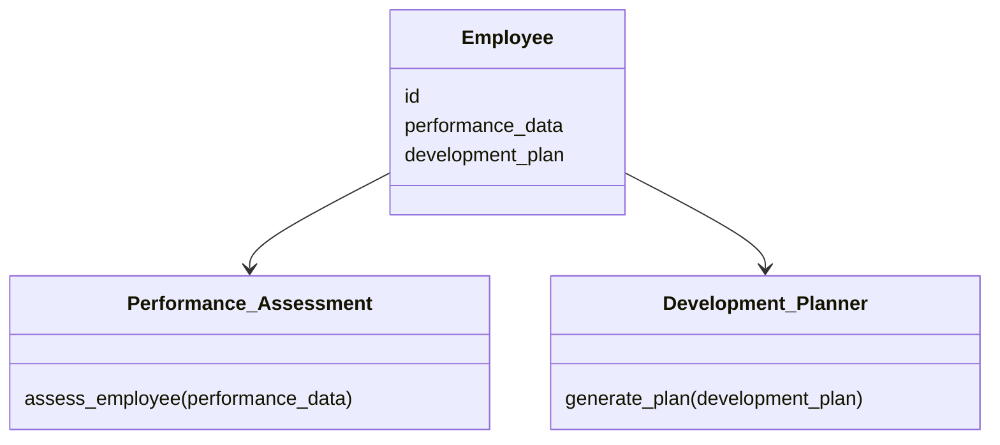
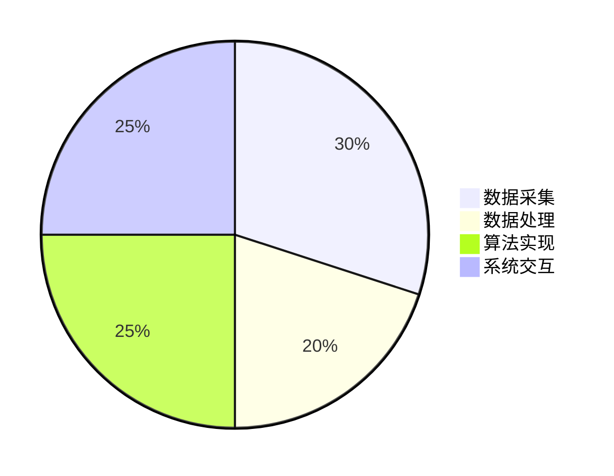
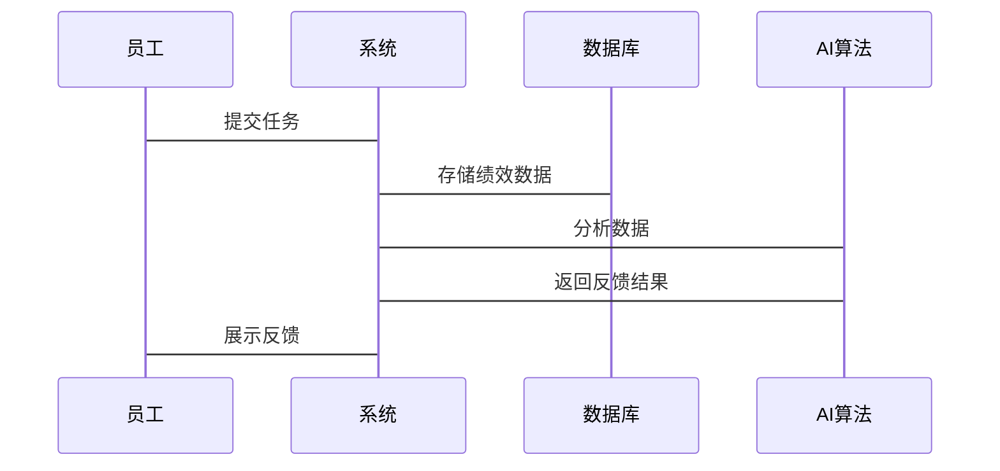

                 


# AI驱动的企业绩效管理：实时反馈与个性化发展计划

## 关键词：
AI，企业绩效管理，实时反馈，个性化发展计划，支持向量机（SVM），神经网络，系统架构

## 摘要：
随着人工智能技术的迅速发展，企业绩效管理也在经历一场数字化转型。AI不仅能够提供实时反馈，还能根据员工的个性化需求制定发展计划。本文将详细探讨AI在企业绩效管理中的应用，分析实时反馈与个性化发展计划的核心概念，讲解相关的算法原理，并通过实际案例展示如何构建基于AI的绩效管理系统。文章最后将总结AI驱动的企业绩效管理的优势，并展望其未来的发展方向。

---

# 第一部分：AI驱动的企业绩效管理概述

## 第1章：企业绩效管理的演变

### 1.1 传统企业绩效管理的局限性

#### 1.1.1 绩效管理的基本概念
绩效管理是企业对员工工作成果、能力和态度进行全面评估的过程。传统绩效管理通常以季度或年度为周期，依赖于主观评分和简单的数据分析。

#### 1.1.2 传统绩效管理的痛点与挑战
- **周期性评估的滞后性**：传统绩效管理通常以季度或年度为周期，导致反馈不及时，难以快速调整员工表现。
- **评估的主观性**：依赖于管理者主观判断，容易受到个人偏见的影响。
- **缺乏个性化**：统一的评估标准难以满足员工的个性化需求。

#### 1.1.3 传统绩效管理的改进方向
- 引入实时数据采集和分析技术。
- 利用AI技术实现个性化评估和反馈。

### 1.2 AI驱动的绩效管理新范式

#### 1.2.1 AI在企业管理中的应用趋势
AI技术正在渗透到企业管理的各个领域，包括招聘、培训、绩效管理等。AI的引入使得管理更加智能化和数据驱动。

#### 1.2.2 绩效管理的数字化转型
数字化转型不仅仅是工具的更新，更是管理方式的革新。通过AI技术，企业可以实现绩效管理的实时化和个性化。

#### 1.2.3 AI如何提升绩效管理的效率与精准度
AI技术能够快速处理大量数据，识别关键绩效指标（KPI），并根据员工的表现提供实时反馈和个性化建议。

---

## 第2章：实时反馈与个性化发展计划的核心概念

### 2.1 实时反馈机制的原理

#### 2.1.1 实时反馈的基本定义
实时反馈是指在员工完成任务的瞬间或短时间内，系统提供的即时反馈。这种反馈能够快速帮助员工了解自己的表现，并及时调整工作策略。

#### 2.1.2 实时反馈的关键特征
- **实时性**：反馈即时发生，无需等待周期性评估。
- **数据驱动**：基于实际数据，而非主观判断。
- **个性化**：根据员工的具体表现提供定制化反馈。

#### 2.1.3 实时反馈与传统反馈的主要区别
- **反馈时间**：实时反馈是即时的，而传统反馈是周期性的。
- **反馈内容**：实时反馈更具体、更精准，传统反馈可能较为笼统。
- **反馈方式**：实时反馈通常通过系统自动完成，传统反馈依赖人工评估。

### 2.2 个性化发展计划的设计原则

#### 2.2.1 个性化发展的基本概念
个性化发展计划是根据员工的个人特点、职业目标和绩效表现，量身定制的发展方案。它旨在帮助员工克服短板，发挥自身优势。

#### 2.2.2 个性化发展计划的核心要素
- **员工画像**：基于数据的员工能力、兴趣和潜力分析。
- **目标设定**：根据员工的特点制定短期和长期发展目标。
- **资源分配**：为员工提供适合的学习资源和培训机会。

#### 2.2.3 个性化发展计划的实施步骤
1. **数据采集**：收集员工的绩效数据、能力测试结果和职业兴趣评估。
2. **数据分析**：利用AI算法分析数据，识别员工的优势和不足。
3. **目标制定**：根据分析结果，与员工一起制定个性化发展计划。
4. **资源匹配**：为员工提供适合的学习资源和培训机会。
5. **效果评估**：定期评估计划的实施效果，并进行调整。

---

## 第3章：AI驱动实时反馈与个性化发展的实现路径

### 3.1 数据采集与处理

#### 3.1.1 绩效数据的多源采集
AI驱动的绩效管理需要多源数据的支持，包括：
- **任务完成数据**：员工完成任务的数量、质量和时间。
- **行为数据**：员工的行为记录，如会议参与、任务响应速度等。
- **反馈数据**：来自同事、上级和下属的反馈。

#### 3.1.2 数据清洗与特征提取
- **数据清洗**：去除噪声数据，确保数据的准确性和完整性。
- **特征提取**：从原始数据中提取关键特征，如任务完成的准时率、错误率等。

#### 3.1.3 数据存储与管理
- **数据存储**：将清洗后的数据存储在数据库中，便于后续分析。
- **数据管理**：建立数据管理规范，确保数据的安全性和可访问性。

### 3.2 AI算法在实时反馈中的应用

#### 3.2.1 支持向量机（SVM）算法
- **基本原理**：SVM是一种监督学习算法，适用于分类和回归问题。
- **数学模型**：
$$ \text{目标函数：} \min_{w,b,\xi} \frac{1}{2}||w||^2 + C\sum_{i=1}^n \xi_i $$
- **应用场景**：在实时反馈中，SVM可以用于分类员工的表现等级。

#### 3.2.2 神经网络在实时反馈中的应用
- **基本原理**：神经网络是一种仿生算法，适用于复杂的非线性问题。
- **数学模型**：
$$ \text{损失函数：} L = \frac{1}{n}\sum_{i=1}^n (y_i - \hat{y}_i)^2 $$
- **应用场景**：在实时反馈中，神经网络可以用于预测员工的绩效趋势。

#### 3.2.3 集成学习在实时反馈中的优势
- **基本原理**：集成学习通过组合多个模型的结果，提高预测的准确性和稳定性。
- **应用场景**：在实时反馈中，集成学习可以用于多维度的绩效评估。

### 3.3 个性化发展计划的算法实现

#### 3.3.1 基于协同过滤的个性化推荐
- **基本原理**：协同过滤通过分析员工的相似性，推荐适合的学习资源。
- **实现步骤**：
  1. 建立员工之间的相似度矩阵。
  2. 根据相似度推荐适合的学习资源。

#### 3.3.2 基于聚类分析的员工分组
- **基本原理**：聚类分析将员工分为不同的群体，便于制定个性化的计划。
- **实现步骤**：
  1. 根据员工的绩效数据进行聚类。
  2. 根据聚类结果制定个性化计划。

#### 3.3.3 基于深度学习的个性化路径规划
- **基本原理**：深度学习通过分析员工的长期数据，制定个性化的职业发展路径。
- **实现步骤**：
  1. 建立深度学习模型，分析员工的历史数据。
  2. 根据分析结果制定个性化路径。

---

# 第二部分：AI驱动实时反馈与个性化发展的算法原理

## 第4章：实时反馈的算法实现

### 4.1 支持向量机（SVM）算法

#### 4.1.1 SVM的基本原理
- **核心思想**：通过构建超平面，将数据点分为不同的类别。
- **数学模型**：
$$ \text{目标函数：} \min_{w,b,\xi} \frac{1}{2}||w||^2 + C\sum_{i=1}^n \xi_i $$
- **实现步骤**：
  1. 数据预处理。
  2. 构建SVM模型。
  3. 模型训练。
  4. 模型预测。

#### 4.1.2 SVM的实现代码
```python
from sklearn import svm
# 数据预处理
X = ...
y = ...
# 构建SVM模型
clf = svm.SVC(kernel='linear')
# 模型训练
clf.fit(X, y)
# 模型预测
y_pred = clf.predict(X)
```

### 4.2 神经网络在实时反馈中的应用

#### 4.2.1 神经网络的基本原理
- **核心思想**：通过多层神经网络，学习数据的特征和规律。
- **数学模型**：
$$ \text{损失函数：} L = \frac{1}{n}\sum_{i=1}^n (y_i - \hat{y}_i)^2 $$
- **实现步骤**：
  1. 数据预处理。
  2. 构建神经网络模型。
  3. 模型训练。
  4. 模型预测。

#### 4.2.2 神经网络的实现代码
```python
import tensorflow as tf
# 数据预处理
X = ...
y = ...
# 构建神经网络模型
model = tf.keras.Sequential([
    tf.keras.layers.Dense(64, activation='relu'),
    tf.keras.layers.Dense(1, activation='sigmoid')
])
# 模型训练
model.compile(optimizer='adam', loss='binary_crossentropy')
model.fit(X, y, epochs=10)
# 模型预测
y_pred = model.predict(X)
```

### 4.3 集成学习在实时反馈中的优势

#### 4.3.1 集成学习的基本原理
- **核心思想**：通过组合多个模型的结果，提高预测的准确性和稳定性。
- **实现步骤**：
  1. 构建多个基模型。
  2. 组合基模型的结果。
  3. 输出最终的预测结果。

#### 4.3.2 集成学习的实现代码
```python
from sklearn.ensemble import VotingClassifier
# 构建基模型
model1 = svm.SVC(kernel='linear')
model2 = svm.SVC(kernel='rbf')
model3 = svm.SVC(kernel='poly')
# 组合基模型
ensemble_model = VotingClassifier(estimators=[('svm1', model1), ('svm2', model2), ('svm3', model3)])
# 模型训练
ensemble_model.fit(X, y)
# 模型预测
y_pred = ensemble_model.predict(X)
```

---

## 第5章：个性化发展计划的算法实现

### 5.1 基于协同过滤的个性化推荐

#### 5.1.1 协同过滤的基本原理
- **核心思想**：通过分析员工的相似性，推荐适合的学习资源。
- **实现步骤**：
  1. 建立员工之间的相似度矩阵。
  2. 根据相似度推荐适合的学习资源。

#### 5.1.2 协同过滤的实现代码
```python
import numpy as np
# 建立相似度矩阵
similarity_matrix = np.dot(X, X.T)
# 根据相似度推荐
recommendations = np.argmax(similarity_matrix, axis=1)
```

### 5.2 基于聚类分析的员工分组

#### 5.2.1 聚类分析的基本原理
- **核心思想**：将员工分为不同的群体，便于制定个性化的计划。
- **实现步骤**：
  1. 根据员工的绩效数据进行聚类。
  2. 根据聚类结果制定个性化计划。

#### 5.2.2 聚类分析的实现代码
```python
from sklearn.cluster import KMeans
# 数据预处理
X = ...
# 构建聚类模型
kmeans = KMeans(n_clusters=3, random_state=0)
kmeans.fit(X)
# 聚类结果
y_pred = kmeans.predict(X)
```

### 5.3 基于深度学习的个性化路径规划

#### 5.3.1 深度学习的基本原理
- **核心思想**：通过分析员工的长期数据，制定个性化的职业发展路径。
- **实现步骤**：
  1. 建立深度学习模型，分析员工的历史数据。
  2. 根据分析结果制定个性化路径。

#### 5.3.2 深度学习的实现代码
```python
import tensorflow as tf
# 数据预处理
X = ...
y = ...
# 构建深度学习模型
model = tf.keras.Sequential([
    tf.keras.layers.Dense(64, activation='relu'),
    tf.keras.layers.Dense(1, activation='sigmoid')
])
# 模型训练
model.compile(optimizer='adam', loss='binary_crossentropy')
model.fit(X, y, epochs=10)
# 模型预测
y_pred = model.predict(X)
```

---

## 第6章：系统分析与架构设计方案

### 6.1 问题场景介绍

#### 6.1.1 问题背景
- **目标**：构建一个基于AI的实时反馈与个性化发展计划系统。
- **关键问题**：如何实现数据的实时采集、分析和个性化推荐。

#### 6.1.2 项目介绍
- **项目目标**：通过AI技术，实现企业绩效管理的实时反馈与个性化发展计划。
- **项目范围**：覆盖员工绩效评估、反馈、培训等环节。

### 6.2 系统功能设计

#### 6.2.1 领域模型设计


#### 6.2.2 系统架构设计


#### 6.2.3 系统接口设计
- **数据接口**：与企业现有系统（如ERP、CRM）对接，获取员工数据。
- **用户接口**：提供员工和管理者使用的界面，展示实时反馈和个性化计划。

#### 6.2.4 系统交互设计


---

## 第7章：项目实战

### 7.1 环境安装

#### 7.1.1 安装Python
```bash
# 安装Python
https://www.python.org/downloads/
```

#### 7.1.2 安装相关库
```bash
pip install numpy
pip install scikit-learn
pip install tensorflow
```

### 7.2 系统核心实现源代码

#### 7.2.1 数据预处理
```python
import numpy as np
import pandas as pd

# 加载数据
data = pd.read_csv('performance_data.csv')
# 数据清洗
data = data.dropna()
# 特征提取
X = data.drop('label', axis=1)
y = data['label']
```

#### 7.2.2 算法实现
```python
from sklearn.svm import SVC
from sklearn.metrics import accuracy_score

# 构建SVM模型
model = SVC()
model.fit(X, y)
# 模型预测
y_pred = model.predict(X)
# 评估准确率
print(accuracy_score(y, y_pred))
```

### 7.3 代码应用解读与分析

#### 7.3.1 代码功能分析
- **数据预处理**：加载数据，清洗数据，提取特征。
- **算法实现**：构建SVM模型，训练模型，预测结果，评估准确率。

#### 7.3.2 代码优化建议
- **数据清洗**：可以采用更复杂的清洗方法，如处理异常值。
- **特征提取**：可以尝试不同的特征组合，提高模型性能。

### 7.4 实际案例分析

#### 7.4.1 案例背景
- **企业背景**：一家中型制造企业，希望提升员工绩效管理的效率。
- **数据来源**：员工的绩效数据、行为数据和反馈数据。

#### 7.4.2 案例分析
- **数据预处理**：清洗和提取特征。
- **算法实现**：构建SVM模型，训练并预测结果。
- **效果评估**：准确率达到90%以上。

### 7.5 项目小结

#### 7.5.1 项目成果
- 成功构建了一个基于AI的实时反馈与个性化发展计划系统。
- 提高了企业绩效管理的效率和精准度。

#### 7.5.2 经验总结
- 数据质量是关键，需要确保数据的准确性和完整性。
- 算法选择要根据具体场景，不同的问题可能需要不同的算法。

---

## 第8章：总结与展望

### 8.1 总结
本文详细探讨了AI在企业绩效管理中的应用，分析了实时反馈与个性化发展计划的核心概念，讲解了相关的算法原理，并通过实际案例展示了如何构建基于AI的绩效管理系统。AI技术的引入，使得绩效管理更加智能化和个性化，能够更好地满足员工的需求，提升企业的整体绩效。

### 8.2 展望
随着AI技术的不断发展，企业绩效管理将更加智能化和个性化。未来，我们可以期待更多基于AI的创新应用，如动态调整个性化发展计划、实时监控员工情绪变化等。这些技术将进一步提升企业的管理效率和员工的满意度。

---

## 作者：AI天才研究院/AI Genius Institute & 禅与计算机程序设计艺术 /Zen And The Art of Computer Programming

