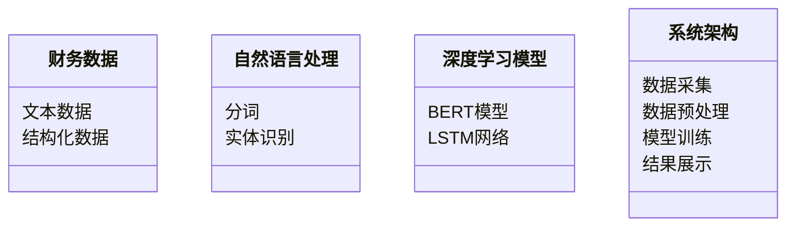
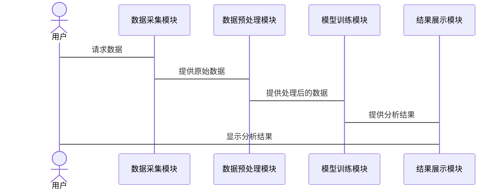

                 


# AI驱动的自动化财报分析系统

> 关键词：AI驱动，自动化财报分析，自然语言处理，深度学习，财务数据分析

> 摘要：本文详细介绍了AI驱动的自动化财报分析系统，探讨了其核心概念、算法原理、系统架构设计以及项目实战。通过对传统财务分析的痛点进行分析，结合自然语言处理和深度学习技术，提出了一种高效的自动化财报分析解决方案，并通过实际案例展示了系统的应用与效果。

---

# 第一部分: AI驱动的自动化财报分析系统概述

## 第1章: AI驱动的自动化财报分析系统背景与核心概念

### 1.1 财务报表分析的痛点与挑战

#### 1.1.1 传统财务报表分析的痛点

传统财务报表分析依赖于人工操作，存在以下痛点：

1. **数据量大**：企业财务报表包含大量数据，人工分析效率低。
2. **误差率高**：人为疏忽可能导致分析结果不准确。
3. **耗时长**：复杂的财务数据需要大量时间进行处理。

#### 1.1.2 人工分析的低效性与误差率

人工分析的低效性主要体现在以下几个方面：

1. **重复性工作**：如数据录入、格式转换等。
2. **主观判断**：分析结果受主观因素影响较大。
3. **时间限制**：人工分析难以在短时间内完成大量数据的处理。

#### 1.1.3 企业对自动化分析的需求

企业对自动化财报分析的需求主要源于：

1. **提高效率**：自动化系统能够快速处理大量数据。
2. **降低成本**：减少人工参与，降低人力成本。
3. **提高准确性**：自动化系统能够减少人为错误。

### 1.2 AI驱动的自动化财报分析系统的核心目标

#### 1.2.1 自动化处理财务数据的目标

自动化处理财务数据的目标包括：

1. **数据清洗**：自动识别并处理数据中的异常值。
2. **数据转换**：将非结构化数据转换为结构化数据，便于后续分析。
3. **数据整合**：将来自不同来源的财务数据整合到一个统一的系统中。

#### 1.2.2 提高分析效率与准确性的目标

通过AI技术，可以显著提高分析效率和准确性：

1. **快速分析**：利用AI算法快速处理大量数据。
2. **精准预测**：基于历史数据，预测未来财务状况。
3. **实时监控**：实时跟踪企业财务状况，及时发现异常情况。

#### 1.2.3 支持决策者的深层需求

AI驱动的自动化财报分析系统能够满足决策者的深层需求：

1. **数据可视化**：通过图表直观展示财务数据。
2. **智能预警**：及时预警潜在的财务风险。
3. **决策支持**：提供基于数据的决策支持。

### 1.3 系统的核心概念与边界

#### 1.3.1 核心概念的定义

1. **财务数据**：企业的财务报表数据，包括收入、支出、利润等。
2. **自然语言处理（NLP）**：用于处理和分析非结构化财务文本的技术。
3. **深度学习**：基于神经网络的机器学习技术，用于模式识别和预测。

#### 1.3.2 系统的边界与外延

1. **系统边界**：仅限于财务数据的处理和分析，不涉及数据的生成和录入。
2. **外延**：可扩展到其他类型的数据分析任务，如市场分析、客户行为分析等。

#### 1.3.3 核心要素的组成与关系

1. **核心要素**：财务数据、自然语言处理技术、深度学习模型。
2. **关系**：财务数据是输入，自然语言处理技术用于数据预处理，深度学习模型用于数据分析和预测。

### 1.4 本章小结

本章介绍了AI驱动的自动化财报分析系统的背景与核心概念，分析了传统财务分析的痛点，提出了系统的总体目标，并详细阐述了系统的核心概念与边界。

---

# 第二部分: AI驱动的自动化财报分析系统的核心原理与技术

## 第2章: 自然语言处理在财报文本分析中的应用

### 2.1 自然语言处理技术的原理

#### 2.1.1 NLP的基本原理

1. **文本分词**：将连续的文本分割成词语或短语。
2. **词性标注**：对分词后的词语进行词性标注。
3. **句法分析**：分析句子的语法结构。

#### 2.1.2 预训练语言模型的核心机制

1. **词嵌入**：将词语映射为低维向量，如Word2Vec。
2. **上下文理解**：通过上下文理解词语的含义，如BERT模型。

#### 2.1.3 Transformer模型在NLP中的应用

1. **编码器**：将输入文本编码为固定长度的向量。
2. **解码器**：根据编码向量生成输出文本。

### 2.2 财报文本分析的关键技术

#### 2.2.1 文本分词与实体识别

1. **文本分词**：将财报文本中的词语分割出来。
2. **实体识别**：识别出财报文本中的公司名称、金额等实体。

#### 2.2.2 情感分析与关键词提取

1. **情感分析**：判断财报文本中的情感倾向，如正面、负面。
2. **关键词提取**：提取财报文本中的关键信息，如财务指标、风险提示等。

#### 2.2.3 文本相似度计算

1. **余弦相似度**：计算两个文本向量的相似度。
2. **BM25算法**：基于关键词匹配的相似度计算。

### 2.3 基于NLP的财报分析流程

#### 2.3.1 数据预处理流程

1. **清洗数据**：去除无关信息，如标点符号、停用词。
2. **分词与实体识别**：对文本进行分词和实体识别。
3. **向量化**：将文本转换为向量表示。

#### 2.3.2 模型训练与优化

1. **模型训练**：基于预处理后的数据训练NLP模型。
2. **模型优化**：通过交叉验证优化模型参数。

#### 2.3.3 结果解释与可视化

1. **结果解释**：将模型输出结果转化为可理解的格式。
2. **可视化展示**：通过图表直观展示分析结果。

### 2.4 本章小结

本章详细介绍了自然语言处理技术在财报文本分析中的应用，包括关键技术、流程和结果解释。

---

## 第3章: 基于深度学习的财报分类算法

### 3.1 深度学习算法的原理

#### 3.1.1 神经网络的基本原理

1. **感知器**：一种简单的线性分类器。
2. **多层感知器（MLP）**：包含多个隐藏层的神经网络。

#### 3.1.2 卷积神经网络（CNN）的原理

1. **卷积层**：提取图像的空间特征。
2. **池化层**：降低模型复杂度，提高泛化能力。

#### 3.1.3 循环神经网络（RNN）的原理

1. **循环层**：处理序列数据，如时间序列。
2. **长短期记忆网络（LSTM）**：解决RNN的梯度消失问题。

### 3.2 基于深度学习的财报分类算法

#### 3.2.1 算法选择

1. **BERT模型**：用于文本分类任务。
2. **LSTM网络**：用于时间序列数据的分类。

#### 3.2.2 算法实现

1. **数据预处理**：将文本数据转换为向量表示。
2. **模型训练**：基于训练数据训练模型。
3. **模型优化**：通过调整超参数提高模型性能。

### 3.3 本章小结

本章介绍了深度学习算法在财报分类中的应用，重点讲解了BERT模型和LSTM网络的原理与实现。

---

# 第三部分: AI驱动的自动化财报分析系统的算法原理与实现

## 第4章: 基于深度学习的财报分类算法

### 4.1 算法原理

#### 4.1.1 BERT模型

1. **预训练**：在大规模数据上预训练模型。
2. **微调**：在特定任务上微调模型。

#### 4.1.2 LSTM网络

1. **序列建模**：处理时间序列数据。
2. **记忆机制**：通过细胞状态记忆长期信息。

### 4.2 算法实现

#### 4.2.1 数据预处理

1. **文本清洗**：去除无关信息。
2. **向量化**：使用Word2Vec将文本转换为向量。

#### 4.2.2 模型训练

1. **训练数据**：使用标注数据训练模型。
2. **训练过程**：通过反向传播优化模型参数。

#### 4.2.3 模型优化

1. **超参数调整**：通过网格搜索优化超参数。
2. **交叉验证**：评估模型的泛化能力。

### 4.3 算法实现代码

```python
import tensorflow as tf
from tensorflow import keras

# 数据预处理
def preprocess(text):
    # 分词
    words = tokenizer.tokenize(text)
    # 转换为向量
    vectors = embedding_layer(words)
    return vectors

# 模型定义
model = keras.Sequential([
    keras.layers.Embedding(input_dim= vocab_size, output_dim= embedding_dim),
    keras.layers.Bidirectional(LSTM(units= lstm_units)),
    keras.layers.Dense(units= num_classes, activation='softmax')
])

# 模型训练
model.compile(optimizer='adam', loss='sparse_categorical_crossentropy', metrics=['accuracy'])
model.fit(X_train, y_train, epochs= epochs, batch_size= batch_size)
```

### 4.4 本章小结

本章详细介绍了深度学习算法的实现过程，包括数据预处理、模型训练和优化。

---

## 第5章: 基于深度学习的财报分类算法

### 5.1 算法原理

#### 5.1.1 BERT模型

1. **输入层**：接收输入文本。
2. **嵌入层**：将输入文本转换为向量。
3. **注意力机制**：计算词与词之间的关系。

#### 5.1.2 LSTM网络

1. **输入层**：接收输入序列。
2. **循环层**：处理序列数据。
3. **输出层**：生成分类结果。

### 5.2 算法实现

#### 5.2.1 数据预处理

1. **文本清洗**：去除无关信息。
2. **分词**：将文本分割成词语。

#### 5.2.2 模型训练

1. **训练数据**：使用标注数据训练模型。
2. **训练过程**：通过反向传播优化模型参数。

#### 5.2.3 模型优化

1. **超参数调整**：通过网格搜索优化超参数。
2. **交叉验证**：评估模型的泛化能力。

### 5.3 算法实现代码

```python
import tensorflow as tf
from tensorflow import keras

# 数据预处理
def preprocess(text):
    words = tokenizer.tokenize(text)
    vectors = embedding_layer(words)
    return vectors

# 模型定义
model = keras.Sequential([
    keras.layers.Embedding(input_dim= vocab_size, output_dim= embedding_dim),
    keras.layers.Bidirectional(LSTM(units= lstm_units)),
    keras.layers.Dense(units= num_classes, activation='softmax')
])

# 模型训练
model.compile(optimizer='adam', loss='sparse_categorical_crossentropy', metrics=['accuracy'])
model.fit(X_train, y_train, epochs= epochs, batch_size= batch_size)
```

### 5.4 本章小结

本章详细介绍了深度学习算法的实现过程，包括数据预处理、模型训练和优化。

---

# 第四部分: AI驱动的自动化财报分析系统的系统架构与项目实战

## 第6章: 系统分析与架构设计方案

### 6.1 系统分析

#### 6.1.1 问题场景介绍

1. **需求分析**：企业需要自动化处理财务数据。
2. **系统目标**：提高财务分析效率和准确性。

#### 6.1.2 系统功能设计

1. **数据采集**：从不同数据源采集财务数据。
2. **数据预处理**：清洗、转换和整合数据。
3. **模型训练**：基于数据训练AI模型。
4. **结果展示**：通过可视化展示分析结果。

### 6.2 系统架构设计

#### 6.2.1 领域模型设计



#### 6.2.2 系统架构设计

```mermaid
architecturalDiagram
    component 系统架构 {
        数据采集模块
        数据预处理模块
        模型训练模块
        结果展示模块
    }
```

#### 6.2.3 系统接口设计

1. **数据接口**：与数据源对接，获取财务数据。
2. **模型接口**：与AI模型对接，获取分析结果。

#### 6.2.4 系统交互设计



### 6.3 本章小结

本章详细介绍了系统分析与架构设计方案，包括问题场景、系统功能设计、架构设计和交互设计。

---

## 第7章: 项目实战

### 7.1 环境安装

1. **安装Python**：确保安装了Python 3.6及以上版本。
2. **安装TensorFlow**：使用pip安装TensorFlow库。
3. **安装Keras**：使用pip安装Keras库。

### 7.2 系统核心实现

#### 7.2.1 数据采集模块

```python
import pandas as pd

# 数据采集
def get_financial_data(company_id):
    # 从数据库获取数据
    data = pd.read_sql("SELECT * FROM financial_data WHERE company_id = %s" % company_id)
    return data
```

#### 7.2.2 数据预处理模块

```python
import tensorflow as tf
from tensorflow import keras

# 数据预处理
def preprocess(text):
    words = tokenizer.tokenize(text)
    vectors = embedding_layer(words)
    return vectors
```

#### 7.2.3 模型训练模块

```python
# 模型训练
model = keras.Sequential([
    keras.layers.Embedding(input_dim= vocab_size, output_dim= embedding_dim),
    keras.layers.Bidirectional(LSTM(units= lstm_units)),
    keras.layers.Dense(units= num_classes, activation='softmax')
])

model.compile(optimizer='adam', loss='sparse_categorical_crossentropy', metrics=['accuracy'])
model.fit(X_train, y_train, epochs= epochs, batch_size= batch_size)
```

#### 7.2.4 结果展示模块

```python
# 结果展示
import matplotlib.pyplot as plt

def visualize_results(results):
    plt.figure(figsize=(10, 6))
    plt.plot(results.history['accuracy'], label='Training Accuracy')
    plt.plot(results.history['val_accuracy'], label='Validation Accuracy')
    plt.title('Training and Validation Accuracy')
    plt.xlabel('Epoch')
    plt.ylabel('Accuracy')
    plt.legend()
    plt.show()
```

### 7.3 代码应用解读与分析

1. **数据采集模块**：从数据库获取指定公司的财务数据。
2. **数据预处理模块**：对获取的文本数据进行分词和向量化处理。
3. **模型训练模块**：基于预处理后的数据训练AI模型。
4. **结果展示模块**：通过图表展示模型的训练效果。

### 7.4 实际案例分析与详细讲解

#### 7.4.1 案例背景

某公司需要分析其财务报表，预测未来财务状况。

#### 7.4.2 数据采集

从公司数据库中获取过去三年的财务数据。

#### 7.4.3 数据预处理

对文本数据进行分词和向量化处理。

#### 7.4.4 模型训练

使用预处理后的数据训练BERT模型和LSTM网络。

#### 7.4.5 结果展示

通过图表展示模型的训练效果和预测结果。

### 7.5 本章小结

本章通过实际案例详细讲解了系统的实现过程，包括环境安装、核心代码实现、结果展示等。

---

# 第五部分: AI驱动的自动化财报分析系统的最佳实践与总结

## 第8章: 最佳实践 tips

### 8.1 性能优化

1. **模型优化**：通过调整超参数和使用早停法优化模型性能。
2. **数据增强**：通过数据增强技术提高模型的泛化能力。

### 8.2 模型调优

1. **超参数调整**：通过网格搜索优化模型参数。
2. **模型集成**：通过集成学习提高模型性能。

### 8.3 数据安全

1. **数据加密**：对敏感数据进行加密处理。
2. **访问控制**：限制对财务数据的访问权限。

### 8.4 拓展阅读

1. **深度学习书籍**：《Deep Learning》
2. **自然语言处理书籍**：《Natural Language Processing with Python》

## 第9章: 总结与展望

### 9.1 总结

AI驱动的自动化财报分析系统通过结合自然语言处理和深度学习技术，显著提高了财务分析的效率和准确性。

### 9.2 展望

未来，随着AI技术的不断发展，自动化财报分析系统将更加智能化和自动化，为企业提供更强大的决策支持。

---

# 作者：AI天才研究院/AI Genius Institute & 禅与计算机程序设计艺术 /Zen And The Art of Computer Programming

---

通过以上详细的目录和内容设计，您可以开始撰写具体的章节内容了。每个章节都需要详细展开，确保内容的完整性和深度。

