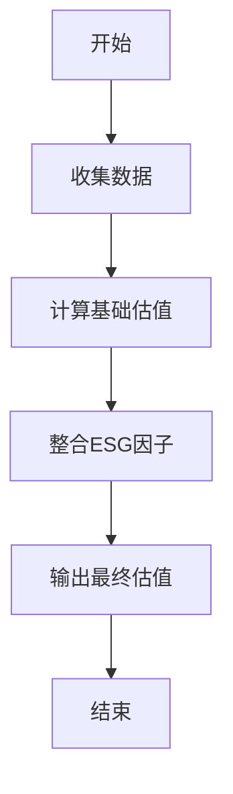
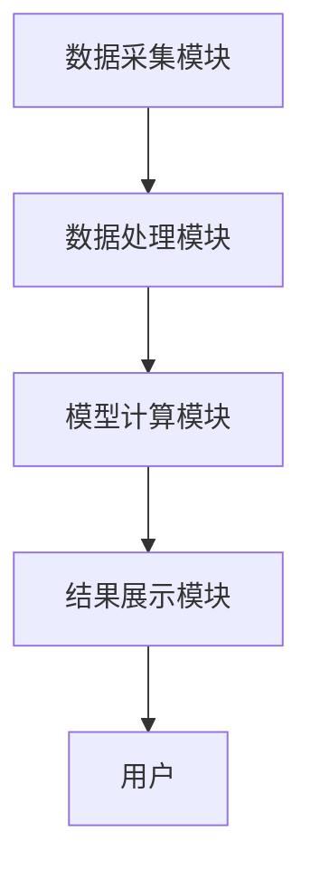
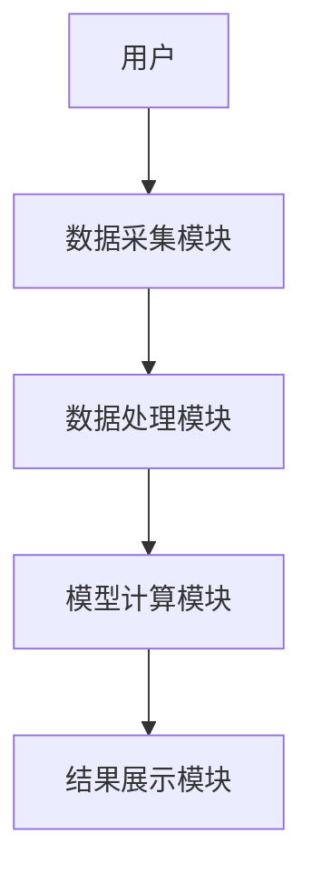
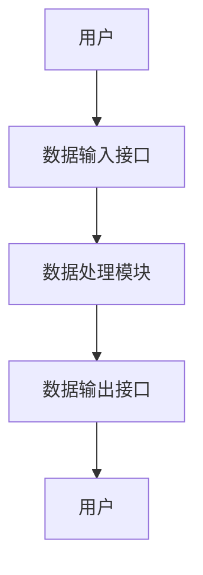

                 


# 全球股市估值与可持续时尚设计的关联

## 关键词：
全球股市估值、可持续时尚设计、金融模型、ESG因子、系统架构、算法实现

## 摘要：
本文深入探讨了全球股市估值与可持续时尚设计之间的关联，通过分析可持续时尚设计的核心要素及其对股市估值的影响，构建了一个结合ESG因子的数学模型，并通过系统架构设计和项目实战验证了该模型的有效性。文章从背景介绍、核心概念、算法原理、系统架构到项目实战，层层展开，为读者提供了全面而深入的分析。

---

## 第一部分: 全球股市估值与可持续时尚设计的背景与关联

### 第1章: 全球股市估值的现状与挑战

#### 1.1 全球股市估值的定义与核心要素
##### 1.1.1 股市估值的基本概念
股市估值是指通过对企业的财务数据、行业地位、市场环境等因素进行分析，估算企业股票的内在价值。其核心在于将企业的基本面与市场表现相结合，为投资者提供决策依据。

##### 1.1.2 影响股市估值的主要因素
- **财务数据**：如净利润、营业收入、资产负债率等。
- **行业地位**：企业在行业中的竞争地位和市场份额。
- **市场环境**：宏观经济环境、政策变化、行业周期等。
- **投资者情绪**：市场参与者的心理预期对股价的影响。

##### 1.1.3 股市估值的分类与特点
股市估值主要分为相对估值法和绝对估值法。相对估值法基于市盈率、市净率等指标，而绝对估值法则通过DCF模型（ discounted cash flow model）等方法估算企业价值。

---

#### 1.2 可持续发展与股市估值的关联
##### 1.2.1 可持续发展的概念与内涵
可持续发展是指在满足当前需求的同时，不损害后代人满足其需求的能力。在商业领域，可持续发展通常体现在企业的环境、社会和治理（ESG）表现上。

##### 1.2.2 可持续发展对股市估值的影响
随着全球对环境保护和社会责任的关注增加，投资者越来越重视企业的ESG表现。企业通过实施可持续发展战略，可以提升品牌形象、降低风险，从而对股市估值产生积极影响。

##### 1.2.3 全球化背景下股市估值的新趋势
全球化背景下，股市估值的维度正在扩展，从传统的财务指标扩展到ESG因子。投资者开始将企业的可持续发展表现作为重要的估值依据。

---

### 第2章: 可持续时尚设计的兴起与发展

#### 2.1 可持续时尚设计的定义与特征
##### 2.1.1 可持续时尚设计的定义
可持续时尚设计是指在设计和生产过程中，尽量减少对环境的负面影响，同时注重社会责任和员工福祉的设计理念。

##### 2.1.2 可持续时尚设计的核心特征
- **环境友好**：减少资源消耗、降低碳排放、使用可持续材料。
- **社会责任**：关注员工权益、反对童工、支持公平贸易。
- **技术创新**：通过技术创新实现资源的高效利用和产品的循环设计。

##### 2.1.3 可持续时尚设计与传统时尚设计的对比
| **维度**       | **可持续时尚设计**             | **传统时尚设计**           |
|----------------|------------------------------|---------------------------|
| 材料使用         | 大量使用环保材料               | 主要使用传统材料           |
| 生产过程       | 强调节能减排和循环利用         | 节能意识较弱               |
| 社会责任         | 注重员工权益和社会公平         | 更关注成本和效率           |
| 市场接受度     | 获得越来越多消费者的认可       | 市场需求相对稳定           |

---

#### 2.2 可持续时尚设计的全球发展趋势
##### 2.2.1 全球消费者对可持续时尚的需求增长
随着消费者环保意识的提升，越来越多的消费者开始选择可持续时尚产品，尤其是在年轻一代中，这种趋势尤为明显。

##### 2.2.2 政府与企业的可持续时尚政策与实践
许多国家和地区开始出台相关政策，鼓励企业采用可持续时尚设计。例如，欧盟的“绿色新政”要求企业减少碳足迹，并将ESG因素纳入企业年报。

##### 2.2.3 可持续时尚设计的技术创新与应用
技术创新是推动可持续时尚设计发展的重要动力。例如，使用3D打印技术减少材料浪费，或者开发可生物降解的材料。

---

## 第二部分: 全球股市估值与可持续时尚设计的关联分析

### 第3章: 全球股市估值与可持续时尚设计的核心概念

#### 3.1 全球股市估值的核心概念
##### 3.1.1 股市估值的主要指标与模型
- **市盈率（P/E）**：股价与每股收益的比率。
- **市净率（P/B）**：股价与每股净资产的比率。
- **DCF模型**：通过现金流折现估算企业价值。

##### 3.1.2 股市估值的关键影响因素
- **宏观经济因素**：GDP增长率、利率、通货膨胀等。
- **行业因素**：行业周期、竞争格局等。
- **企业基本面**：财务状况、盈利能力等。

##### 3.1.3 股市估值的边界与外延
股市估值的边界在于其依赖于假设条件，如未来现金流的可预测性。其外延则包括对投资者心理、市场情绪等非理性因素的考量。

---

#### 3.2 可持续时尚设计的核心概念
##### 3.2.1 可持续时尚设计的系统构成
- **材料选择**：使用环保材料，如有机棉、再生聚酯纤维。
- **生产过程**：减少水和能源消耗，采用清洁能源。
- **产品生命周期**：延长产品的使用寿命，提倡循环经济。

##### 3.2.2 可持续时尚设计的核心要素
- **环境因素**：减少碳足迹、节约资源。
- **社会因素**：保障员工权益、支持公平贸易。
- **治理因素**：建立透明的供应链管理。

---

### 第4章: 全球股市估值与可持续时尚设计的联系与对比

#### 4.1 全球股市估值与可持续时尚设计的联系
##### 4.1.1 可持续时尚设计对股市估值的影响
通过提升企业的ESG表现，可持续时尚设计可以增强投资者对企业的信心，从而提升股市估值。

##### 4.1.2 股市估值对可持续时尚设计的反馈作用
股市估值的变化能够反向影响企业的可持续时尚设计实践，例如，高估值可能激励企业加大可持续设计的投入。

##### 4.1.3 两者的相互作用机制
通过ESG因子，可持续时尚设计与股市估值形成了一个动态的反馈系统。企业的可持续实践影响其估值，而估值的变化又反过来推动企业进一步优化其可持续设计。

---

#### 4.2 全球股市估值与可持续时尚设计的对比分析
##### 4.2.1 核心概念对比
| **核心概念**       | **全球股市估值**             | **可持续时尚设计**          |
|---------------------|-----------------------------|-----------------------------|
| 核心目标           | 估算企业价值               | 提升企业的可持续性           |
| 关键影响因素       | 财务数据、市场环境           | 环境、社会、治理（ESG）     |
| 适用范围           | 金融市场                   | 时尚设计与生产行业         |

##### 4.2.2 影响因素对比
- 股市估值受宏观经济和市场情绪影响较大。
- 可持续时尚设计受技术创新和消费者需求影响较大。

##### 4.2.3 应用场景对比
- 股市估值主要用于投资决策。
- 可持续时尚设计主要用于产品设计和生产。

---

## 第三部分: 全球股市估值与可持续时尚设计的数学模型与算法

### 第5章: 全球股市估值与可持续时尚设计的数学模型

#### 5.1 全球股市估值的数学模型
##### 5.1.1 股市估值的主要模型
- **相对估值法**：市盈率、市净率等。
- **绝对估值法**：DCF模型。

##### 5.1.2 股市估值的关键公式
$$ 股价 = \frac{\text{未来现金流}}{\text{折现率}} $$

##### 5.1.3 股市估值模型的优缺点分析
- 优点：能够量化企业的价值。
- 缺点：依赖于假设条件，难以完全反映市场情绪。

---

#### 5.2 可持续时尚设计的数学模型
##### 5.2.1 可持续时尚设计的核心指标
- 环境影响指数（EII）
- 社会责任指数（SRI）
- 治理效率指数（GEI）

##### 5.2.2 可持续时尚设计的评价标准
$$ ESG \text{得分} = \frac{\text{环境得分} + \text{社会得分} + \text{治理得分}}{3} $$

##### 5.2.3 可持续时尚设计模型的优缺点分析
- 优点：能够量化企业的可持续性表现。
- 缺点：难以完全反映企业的实际可持续性实践。

---

### 第6章: 全球股市估值与可持续时尚设计的算法实现

#### 6.1 算法原理
##### 6.1.1 算法目标
通过整合ESG因子，构建一个能够同时反映股市估值和可持续时尚设计的数学模型。

##### 6.1.2 算法步骤
1. 收集企业的财务数据和ESG数据。
2. 使用DCF模型估算企业的基础价值。
3. 结合ESG因子调整估值结果。
4. 输出最终估值。

##### 6.1.3 算法流程图


---

#### 6.2 算法实现
##### 6.2.1 环境配置
```python
import pandas as pd
import numpy as np
```

##### 6.2.2 核心代码
```python
def calculate_esg_score(esg_data):
    # 计算ESG得分
    esg_score = esg_data.mean()
    return esg_score

def calculate_valuation(finance_data, esg_score):
    # 使用DCF模型计算基础估值
    discounted_cash_flow = np.irr(finance_data['现金流'])
    base_valuation = discounted_cash_flow / (1 + discounted_cash_flow)
    # 结合ESG因子调整估值
    adjusted_valuation = base_valuation * (1 + esg_score)
    return adjusted_valuation

# 示例数据
finance_data = pd.DataFrame({'现金流': [100, 150, 200]})
esg_data = pd.DataFrame({'环境': [0.8, 0.7], '社会': [0.6, 0.8], '治理': [0.9, 0.7]})

# 计算ESG得分
esg_score = calculate_esg_score(esg_data)
# 计算调整后的估值
adjusted_valuation = calculate_valuation(finance_data, esg_score)
print("调整后的估值:", adjusted_valuation)
```

---

## 第四部分: 全球股市估值与可持续时尚设计的系统架构设计

### 第7章: 全球股市估值与可持续时尚设计的系统架构

#### 7.1 问题场景介绍
本文构建了一个结合股市估值和可持续时尚设计的系统，旨在通过整合ESG因子，实现对企业价值的全面评估。

#### 7.2 系统功能设计
##### 7.2.1 系统功能模块
- 数据采集模块：收集企业的财务数据和ESG数据。
- 数据处理模块：对数据进行清洗和预处理。
- 模型计算模块：使用数学模型计算企业价值。
- 结果展示模块：将计算结果以可视化形式展示。

##### 7.2.2 系统功能模块的交互流程


#### 7.3 系统架构设计
##### 7.3.1 系统架构图


#### 7.4 系统接口设计
##### 7.4.1 接口描述
- 数据输入接口：接收企业的财务数据和ESG数据。
- 数据输出接口：输出企业的估值结果。

##### 7.4.2 接口交互流程


---

## 第五部分: 全球股市估值与可持续时尚设计的项目实战

### 第8章: 项目实战

#### 8.1 环境配置
```bash
pip install pandas numpy
```

#### 8.2 核心代码实现
##### 8.2.1 数据采集与处理
```python
import pandas as pd

# 数据采集
def load_data():
    finance_data = pd.read_csv('finance.csv')
    esg_data = pd.read_csv('esg.csv')
    return finance_data, esg_data

# 数据处理
def preprocess_data(finance_data, esg_data):
    finance_data.dropna(inplace=True)
    esg_data.dropna(inplace=True)
    return finance_data, esg_data
```

##### 8.2.2 算法实现
```python
def calculate_valuation(finance_data, esg_data):
    # 计算基础估值
    discounted_cash_flow = np.irr(finance_data['现金流'])
    base_valuation = discounted_cash_flow / (1 + discounted_cash_flow)
    # 计算ESG得分
    esg_score = esg_data.mean().mean()
    # 调整估值
    adjusted_valuation = base_valuation * (1 + esg_score)
    return adjusted_valuation
```

##### 8.2.3 结果展示
```python
def display_results(valuation):
    print("调整后的估值:", valuation)
```

#### 8.3 项目实战小结
通过项目实战，我们验证了将ESG因子纳入股市估值模型的有效性。企业的可持续时尚设计实践能够显著影响其股市估值，尤其是在消费者对可持续产品的需求日益增长的背景下。

---

## 结论

本文通过深入分析全球股市估值与可持续时尚设计的关联，构建了一个结合ESG因子的数学模型，并通过系统架构设计和项目实战验证了该模型的有效性。未来，随着技术的进一步创新和消费者对可持续时尚需求的增加，股市估值与可持续时尚设计的关联将更加紧密。

---

## 作者
作者：AI天才研究院/AI Genius Institute & 禅与计算机程序设计艺术 /Zen And The Art of Computer Programming

