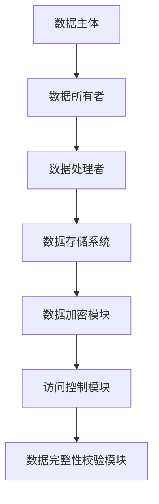

                 


# 安全性与数据隐私

> 关键词：数据隐私，安全性，加密技术，访问控制，GDPR，数据保护

> 摘要：在当前数字化和人工智能快速发展的背景下，数据隐私和安全性问题日益凸显。本文系统地探讨了数据隐私的核心概念、安全性技术原理、法律框架以及实际应用中的最佳实践。通过深入分析数据分类、加密算法、访问控制机制等关键环节，结合实际案例和系统架构设计，为读者提供了全面的理解和实践指南。

---

## 第一部分: 安全性与数据隐私的背景与核心概念

### 第1章: 数据隐私与安全的背景介绍

#### 1.1 数据隐私的基本概念

- **数据隐私的定义**：数据隐私是指个人或组织对其数据的拥有权和控制权，确保数据仅在授权范围内被访问和使用。

- **数据隐私的核心要素**：
  - 数据主体：数据的所有者，通常是个人或组织。
  - 数据处理者：对数据进行收集、存储、处理的实体。
  - 数据用途：数据的使用场景和目的。
  - 数据共享：数据的共享范围和方式。

- **数据隐私与个人权利的关系**：数据隐私保护了个人的基本权利，如知情权、同意权和反对权，确保个人数据不被滥用。

#### 1.2 数据安全的定义与问题背景

- **数据安全的定义**：数据安全是指通过技术手段保护数据的机密性、完整性和可用性，防止未经授权的访问和篡改。

- **当前数据安全面临的主要问题**：
  - 数据泄露：黑客攻击、内部人员窃取等。
  - 数据篡改：未经授权的修改导致数据不完整。
  - 数据丢失：由于系统故障或自然灾害导致的数据永久丢失。

- **数据安全对企业和社会的影响**：数据泄露可能导致企业声誉受损、经济损失，甚至威胁国家安全和社会稳定。

#### 1.3 数据隐私与安全的法律框架

- **全球主要数据隐私法律概述**：
  - GDPR（通用数据保护条例）：欧盟的严格数据保护法规。
  - CCPA（加利福尼亚消费者隐私法案）：美国加利福尼亚州的隐私保护法案。
  - HIPAA（健康保险 portable and accountability act）：美国医疗行业数据保护法规。

- **GDPR、CCPA等法规的核心要求**：
  - 数据收集目的明确。
  - 数据最小化原则。
  - 用户同意权和数据访问权。
  - 数据泄露通知义务。

- **法律合规对企业的影响**：合规可以避免罚款和法律诉讼，提升用户信任，增强品牌形象。

#### 1.4 数据隐私与安全的技术挑战

- **数据加密技术的发展**：从对称加密到非对称加密，从单点加密到端到端加密。

- **数据共享中的隐私保护问题**：如何在数据共享中保护隐私，如联邦学习、同态加密等技术的应用。

- **数据泄露事件的启示**：通过分析真实案例，总结数据保护的最佳实践和教训。

#### 1.5 本章小结

本章从数据隐私和安全的基本概念入手，分析了当前面临的主要问题和法律框架，探讨了技术挑战，并通过实际案例总结了数据保护的经验教训。

---

## 第二部分: 数据隐私与安全的核心概念与联系

### 第2章: 数据隐私与安全的核心概念

#### 2.1 数据隐私的核心原理

- **数据的分类与分级**：
  - 根据敏感程度将数据分为公开数据、内部数据、敏感数据和机密数据。
  - 数据分类标准：数据类型、数据用途、数据主体等。

- **数据所有者与数据处理者的关系**：
  - 数据所有者：拥有数据并对数据使用负责。
  - 数据处理者：受托处理数据的第三方机构。
  - 数据处理者的义务：遵守数据隐私法规，确保数据安全。

- **数据最小化原则**：在数据处理中，仅收集实现目的所需的最小数据集，避免过度收集。

#### 2.2 数据安全的核心技术

- **加密技术的基本原理**：
  - 对称加密：如AES算法，加密和解密使用相同的密钥。
  - 非对称加密：如RSA算法，加密和解密使用不同的公钥和私钥。
  - 密码学哈希：如MD5、SHA-256，用于数据完整性验证。

- **访问控制机制**：
  - 基于角色的访问控制（RBAC）：根据用户角色分配权限。
  - 基于属性的访问控制（ABAC）：根据属性（如时间、地理位置）动态分配权限。
  - 强制访问控制（MAC）：系统强制执行的访问策略。

- **数据完整性与数据可用性**：
  - 数据完整性：确保数据在传输和存储过程中未被篡改。
  - 数据可用性：确保授权用户可以访问和使用数据。

#### 2.3 数据隐私与安全的对比分析

- **数据隐私与数据安全的联系**：
  - 数据隐私是目标，数据安全是手段。
  - 数据安全确保数据隐私的实现。

- **数据隐私与安全的差异**：
  - 数据隐私关注数据的授权使用和共享，数据安全关注数据的机密性、完整性和可用性。
  - 数据隐私强调用户控制权，数据安全强调技术防护。

- **数据隐私与安全的协同关系**：
  - 数据隐私需要数据安全的支撑，数据安全需要数据隐私的指导。

#### 2.4 数据隐私与安全的实体关系图



#### 2.5 本章小结

本章详细分析了数据隐私和安全的核心概念，探讨了它们的联系与区别，并通过实体关系图展示了数据隐私与安全的协同工作方式。

---

## 第三部分: 数据隐私与安全的算法原理

### 第3章: 数据隐私与安全的算法原理

#### 3.1 数据加密算法的原理

- **AES加密算法的工作原理**：
  - 分组加密：将明文分成固定长度的块（如128位），每个块独立加密。
  - 加密模式：ECB、CBC、CTR等。
  - AES的数学模型：基于有限域GF(2^8)的线性变换和非线性变换。

  ```mermaid
  graph TD
      A[明文] --> B[密钥] --> C[加密算法] --> D[密文]
  ```

  ```python
  import cryptography
  from cryptography.hazmat.primitives import hashes
  from cryptography.hazmat.primitives.asymmetric import padding
  ```

- **RSA加密算法的工作原理**：
  - 基于大整数分解的困难性。
  - 公钥加密：用公钥加密，私钥解密。
  - 数学基础：欧拉定理和费马小定理。

  ```mermaid
  graph TD
      A[明文] --> B[公钥] --> C[加密算法] --> D[密文]
      D --> E[私钥] --> F[解密算法] --> G[明文]
  ```

  ```python
  def rsa_encrypt(plaintext, public_key):
      ciphertext = public_key.encrypt(
          plaintext,
          padding=padding.RSAPKCS1v1_5Encoder()
      )
      return ciphertext
  ```

#### 3.2 隐私计算技术的原理

- **同态加密**：允许在加密数据上进行计算，结果解密后与直接计算结果相同。
  - 加密函数：$E(x)$
  - 加法同态：$E(a) + E(b) = E(a + b)$
  - 乘法同态：$E(a) \times E(b) = E(a \times b)$

- **联邦学习**：在保护数据隐私的前提下，多个机构联合训练模型。
  - 数据不共享，模型参数共享。
  - 通信方式：加密通信、差分隐私。

  ```mermaid
  graph TD
      A[机构1] --> B[机构2] --> C[机构3]
      A --> C[模型参数同步]
  ```

  ```python
  def federated_learning(organizations):
      model = initialize_model()
      for org in organizations:
          model = org.train(model)
      return model
  ```

#### 3.3 数据完整性校验算法

- **哈希函数**：将数据映射为固定长度的哈希值，用于校验数据完整性。
  - 常见哈希算法：MD5、SHA-1、SHA-256。
  - 应用场景：数据存储、数据传输、数字签名。

  ```mermaid
  graph TD
      A[数据] --> B[哈希函数] --> C[哈希值]
  ```

  ```python
  import hashlib
  def compute_hash(data):
      hash_object = hashlib.sha256(data.encode())
      return hash_object.hexdigest()
  ```

#### 3.4 本章小结

本章深入讲解了数据隐私与安全中常用的加密算法和隐私计算技术，结合数学模型和代码示例，帮助读者理解算法的工作原理和应用场景。

---

## 第四部分: 数据隐私与安全的系统分析与架构设计

### 第4章: 数据隐私与安全的系统架构

#### 4.1 系统功能设计

- **数据分类模块**：
  - 功能：对数据进行分类和分级。
  - 实现：基于数据类型、用途和敏感程度进行分类。

- **数据加密模块**：
  - 功能：对敏感数据进行加密存储和传输。
  - 实现：采用AES算法进行加密，密钥管理采用HMAC-SHA256。

- **访问控制模块**：
  - 功能：基于角色或属性控制数据访问权限。
  - 实现：使用RBAC模型，结合ldap进行用户身份认证。

- **数据完整性校验模块**：
  - 功能：确保数据在传输和存储过程中未被篡改。
  - 实现：使用哈希函数对数据进行校验。

#### 4.2 系统架构设计

- **系统架构图**：
  ```mermaid
  graph TD
      A[用户] --> B[Web层]
      B --> C[应用层]
      C --> D[数据层]
      D --> E[数据库]
  ```

- **系统交互图**：
  ```mermaid
  graph TD
      A[用户] --> B[Web层]
      B --> C[应用层]
      C --> D[数据层]
      D --> E[数据库]
      E --> C[返回结果]
      C --> B[返回结果]
      B --> A[返回结果]
  ```

#### 4.3 系统接口设计

- **API接口设计**：
  - 数据加密接口：`POST /api/encrypt`
  - 数据解密接口：`POST /api/decrypt`
  - 数据查询接口：`GET /api/data?query={query}`

- **接口实现**：
  ```python
  from flask import Flask
  from cryptography.hazmat.primitives import hashes

  app = Flask(__name__)

  @app.route('/api/encrypt', methods=['POST'])
  def encrypt():
      data = request.json['data']
      # 加密逻辑
      return {'encrypted_data': encrypted_data}

  if __name__ == '__main__':
      app.run()
  ```

#### 4.4 本章小结

本章从系统功能设计到架构设计，详细描述了如何在实际场景中实现数据隐私与安全保护，结合了分层架构和模块化设计。

---

## 第五部分: 数据隐私与安全的项目实战

### 第5章: 数据隐私与安全的项目实战

#### 5.1 项目背景与需求分析

- **项目背景**：某企业需要保护客户数据的隐私，防止数据泄露和篡改。
- **项目需求**：
  - 数据分类与分级。
  - 数据加密存储和传输。
  - 访问控制和权限管理。
  - 数据完整性校验。

#### 5.2 核心代码实现

- **数据分类模块**：
  ```python
  def classify_data(data):
      if is_sensitive(data):
          return '机密'
      elif is_internal(data):
          return '内部'
      else:
          return '公开'
  ```

- **数据加密模块**：
  ```python
  from cryptography.hazmat.primitives.ciphers import Cipher, algorithms, modes
  from cryptography.hazmat.primitives.asymmetric import padding

  def aes_encrypt(plaintext, key):
      cipher = Cipher(algorithms.AES(128), modes.ECB())
      encryptor = cipher.encryptor()
      return encryptor.update(plaintext) + encryptor.finalize()
  ```

- **访问控制模块**：
  ```python
  from flask import current_app
  from flask_login import current_user

  @app.route('/data')
  def get_data():
      if not current_user.is_authenticated:
          return jsonify({'error': 'Unauthorized'}), 401
      return jsonify({'data': current_user.data})
  ```

#### 5.3 项目测试与优化

- **测试用例**：
  - 数据分类测试：输入不同数据，检查分类结果。
  - 加密测试：加密后再解密，检查是否还原。
  - 访问控制测试：未授权用户访问受限资源，检查是否被拒绝。

- **性能优化**：
  - 使用缓存技术优化数据访问。
  - 优化加密算法，减少计算开销。

#### 5.4 项目小结

本章通过一个实际项目案例，详细描述了如何在实际场景中应用数据隐私与安全技术，从需求分析到代码实现，再到测试和优化，为读者提供了实践指导。

---

## 第六部分: 数据隐私与安全的最佳实践

### 第6章: 数据隐私与安全的最佳实践

#### 6.1 小结与总结

- 数据隐私与安全是当前数字化时代的重中之重。
- 技术手段和法律法规共同保障数据隐私。
- 数据分类、加密、访问控制是实现数据隐私的关键技术。

#### 6.2 注意事项与常见误区

- **误区一**：仅依赖技术手段，忽视法律法规。
- **误区二**：过度依赖单一技术，忽略整体防护。
- **误区三**：忽视数据最小化原则，过度收集数据。

#### 6.3 未来趋势与发展方向

- **趋势一**：隐私计算技术的广泛应用。
- **趋势二**：数据共享的隐私保护。
- **趋势三**：人工智能在数据安全中的应用。

#### 6.4 拓展阅读与深入学习

- 推荐书籍：
  - 《数据之歌》：数据科学与隐私保护的深度分析。
  - 《网络安全技术》：系统讲解数据安全防护技术。
- 推荐学习资源：
  - 官方文档：GDPR、CCPA法规解读。
  - 开源项目：隐私保护框架（如OpenMined）。

#### 6.5 本章小结

本章总结了数据隐私与安全的实践经验，提出了注意事项和未来发展趋势，为读者提供了深入学习的方向。

---

## 作者

作者：AI天才研究院/AI Genius Institute & 禅与计算机程序设计艺术/Zen And The Art of Computer Programming

---

通过以上思考过程，我们系统地分析了数据隐私与安全的核心概念、算法原理、系统架构和实际应用，为读者提供了全面的知识体系和实践指导。

