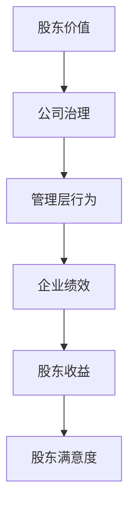
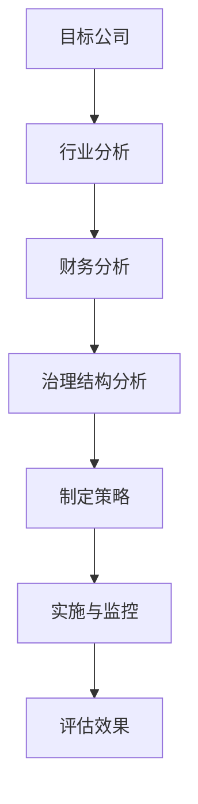
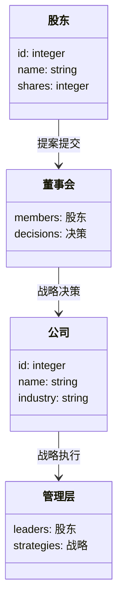
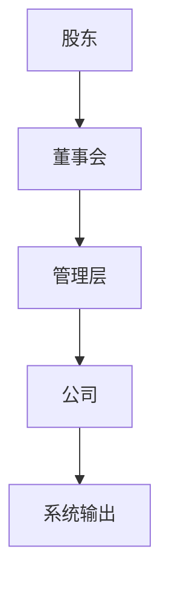

                 


# 彼得林奇如何看待公司的股东积极主义应对策略

---

## 关键词：股东积极主义，公司治理，彼得林奇，投资策略，企业风险管理

---

## 摘要：本文探讨彼得·林奇在股东积极主义背景下的应对策略，分析其在企业治理中的作用和影响，结合实际案例和数学模型，提出系统的应对方法，为企业的可持续发展提供借鉴。

---

## 第1章: 股东积极主义的背景与概念

### 1.1 股东积极主义的定义与背景

#### 1.1.1 股东积极主义的定义
股东积极主义是指股东通过主动参与公司治理，影响公司决策以实现自身利益最大化的行为。其核心在于股东不仅仅满足于被动接受投资回报，而是积极参与公司管理，推动公司朝着更有利于股东的方向发展。

#### 1.1.2 股东积极主义的核心要素
- **股东参与度**：股东通过投票、提案等方式参与公司治理。
- **目标导向**：以实现股东价值最大化为核心目标。
- **策略多样性**：包括股权结构调整、管理层激励、企业战略优化等策略。

#### 1.1.3 股东积极主义与企业治理的关系
股东积极主义是企业治理的重要组成部分，通过强化股东的监督和参与，提升企业治理效率和透明度，促进企业长期健康发展。

---

### 1.2 股东积极主义的背景

#### 1.2.1 当前企业治理面临的挑战
- **利益冲突**：股东与管理层的利益不一致。
- **信息不对称**：股东难以全面掌握公司运营信息。
- **代理成本**：管理层决策可能偏离股东利益。

#### 1.2.2 股东积极主义的兴起原因
- **市场环境变化**：投资者对透明度和效率的要求提高。
- **监管政策支持**：各国加强对企业治理的监管，鼓励股东积极参与。
- **技术进步**：信息技术的发展使股东更容易获取信息并参与治理。

#### 1.2.3 股东积极主义的全球发展趋势
- **全球化**：跨国公司增多，股东积极主义呈现全球化趋势。
- **多样化**：不同国家和地区的股东积极主义策略有所差异。
- **制度化**：越来越多的机构投资者采用股东积极主义策略。

---

## 第2章: 股东积极主义的核心概念

### 2.1 股东积极主义的目标与手段

#### 2.1.1 股东积极主义的主要目标
- **最大化股东价值**：通过优化公司治理和经营策略，提升公司业绩。
- **风险控制**：降低投资风险，确保投资安全。
- **长期收益**：通过持续参与和监督，实现长期稳定收益。

#### 2.1.2 股东积极主义的主要手段
- **股东大会参与**：通过投票、提案等方式影响公司决策。
- **股权结构调整**：优化股权结构，确保股东权益。
- **管理层激励**：通过股权激励等方式提升管理层积极性。
- **战略优化**：推动公司战略调整，提升竞争力。

#### 2.1.3 股东积极主义的实施策略
- **信息收集与分析**：全面了解公司运营状况和潜在风险。
- **策略制定**：根据分析结果制定具体应对策略。
- **持续监控**：定期评估策略效果并进行调整。

---

### 2.2 股东积极主义与股东权利

#### 2.2.1 股东的基本权利
- **投票权**：参与股东大会投票。
- **知情权**：获取公司运营信息。
- **收益权**：获得股息和其他收益分配。
- **监督权**：监督公司管理层和董事会的运作。

#### 2.2.2 股东积极主义对股东权利的强化
- **增强知情权**：通过主动获取信息，提升决策的准确性。
- **强化监督权**：通过参与治理，提升对公司运营的监督力度。
- **保护收益权**：通过优化公司治理，确保收益的可持续性。

#### 2.2.3 股东权利的边界与限制
- **法律约束**：股东权利的行使需遵守相关法律法规。
- **公司治理结构**：董事会和管理层的职责分工对股东权利的行使产生影响。
- **市场环境**：宏观经济环境和行业竞争状况影响股东权利的实际效果。

---

### 2.3 股东积极主义与企业治理的关系

#### 2.3.1 企业治理的基本框架
- **董事会**：负责公司战略制定和监督。
- **管理层**：执行董事会决策，管理日常经营。
- **股东**：通过投票和参与影响公司治理。

#### 2.3.2 股东积极主义在企业治理中的作用
- **提升治理效率**：通过积极参与，优化公司治理结构。
- **降低代理成本**：减少管理层与股东利益冲突。
- **增强透明度**：通过监督和信息披露，提升企业透明度。

#### 2.3.3 股东积极主义与企业治理的平衡点
- **利益协调**：平衡股东利益与管理层利益。
- **机制设计**：建立有效的激励和约束机制。
- **制度保障**：通过法律法规和公司章程，保障股东积极主义的有效实施。

---

### 2.4 核心概念对比表

#### 2.4.1 股东积极主义与其他治理模式的对比

| 比较维度 | 股东积极主义 | 股东消极主义 | 利益相关者治理 |
|----------|--------------|--------------|----------------|
| 目标     | 股东价值最大化 | 股东利益最小化 | 平衡各方利益    |
| 手段     | 主动参与治理   | 被动接受结果   | 协商与对话      |
| 优势     | 提高治理效率   | 降低干预成本 | 短期与长期兼顾  |
| 劣势     | 可能引发冲突   | 可能忽视风险 | 难以快速决策    |

---

### 2.5 ER实体关系图

```mermaid
erDiagram
    customer[股东] {
        <属性>
        id : integer
        name : string
        shares : integer
        address : string
    }
    company[公司] {
        <属性>
        id : integer
        name : string
        industry : string
        founded : date
    }
    relationship[股东积极主义] {
        <关系>
        股东 -> 公司 : 参与治理
        股东 -> 公司 : 提案提交
        股东 -> 公司 : 投票决策
    }
```

---

## 第3章: 股东积极主义的实施策略与算法原理

### 3.1 股东积极主义的实施步骤

#### 3.1.1 确定目标公司
- **行业分析**：选择具备增长潜力的行业。
- **财务分析**：评估公司财务状况，确保投资价值。
- **治理结构分析**：了解公司治理现状，判断股东积极主义的可能性。

#### 3.1.2 收集相关信息
- **市场数据**：收集公司股价、财务报表等数据。
- **治理信息**：获取董事会构成、管理层背景等信息。
- **行业趋势**：分析行业动态，判断投资风险。

#### 3.1.3 制定行动方案
- **目标设定**：明确希望通过股东积极主义实现的具体目标。
- **策略制定**：根据公司情况制定具体的实施策略。
- **资源分配**：合理分配人力、资金等资源，确保方案实施。

#### 3.1.4 实施与监控
- **提案提交**：向股东大会提交相关提案。
- **投票参与**：积极参与股东大会投票。
- **持续监控**：定期评估方案实施效果，及时调整策略。

#### 3.1.5 评估效果
- **财务指标**：评估公司财务状况是否改善。
- **治理效果**：评估公司治理是否优化。
- **股东收益**：评估股东是否实现收益最大化。

---

### 3.2 股东积极主义的策略选择

#### 3.2.1 股权激励策略
- **管理层激励**：通过股权激励提升管理层积极性。
- **员工激励**：通过员工持股计划增强员工归属感。
- **股东激励**：通过分红等措施回馈股东。

#### 3.2.2 股权结构调整策略
- **优化股权结构**：合理分配股权，确保股东权益。
- **防止敌意收购**：通过股权结构调整防止公司被恶意收购。
- **增强控制权**：通过集中股权提升股东控制能力。

#### 3.2.3 股东参与策略
- **股东大会参与**：通过投票和提案影响公司决策。
- **董事会参与**：通过提名董事参与公司治理。
- **监事会监督**：通过监事会监督公司运营。

#### 3.2.4 股东沟通策略
- **定期沟通**：通过定期报告和会议保持与股东的沟通。
- **透明化**：通过公开信息提升股东信任度。
- **危机沟通**：在危机事件中及时与股东沟通，降低信任危机。

---

### 3.3 股东积极主义的算法原理

#### 3.3.1 股东价值最大化模型



#### 3.3.2 股东积极主义的决策树



#### 3.3.3 股东积极主义的收益-风险评估模型

公式1：收益-风险评估模型

$$ \text{收益} = \text{投资金额} \times (\text{预期收益率} - \text{风险成本}) $$

公式2：风险成本计算

$$ \text{风险成本} = \text{标准差} \times \text{风险偏好系数} $$

---

## 第4章: 系统分析与架构设计

### 4.1 系统分析

#### 4.1.1 问题场景介绍
- **目标**：优化公司治理，提升股东价值。
- **挑战**：信息不对称、代理成本高、治理效率低。
- **解决方案**：通过股东积极主义优化公司治理结构。

#### 4.1.2 项目介绍
- **项目目标**：通过股东积极主义提升公司治理效率。
- **项目范围**：涵盖公司治理的各个方面，包括董事会结构、管理层激励等。
- **项目利益相关者**：股东、董事会、管理层、监管机构等。

---

### 4.2 系统架构设计

#### 4.2.1 系统功能设计
- **领域模型**：使用Mermaid类图展示系统结构。



---

### 4.3 系统架构设计



---

## 第5章: 项目实战

### 5.1 项目实战环境安装

#### 5.1.1 环境要求
- **操作系统**：Windows 10或更高版本，macOS 10.15或更高版本，Linux（推荐Ubuntu 20.04）。
- **开发工具**：PyCharm或VS Code。
- **编程语言**：Python 3.8或更高版本。
- **依赖库**：pandas, numpy, matplotlib。

#### 5.1.2 安装步骤
1. 安装Python：从官网下载并安装Python 3.8或更高版本。
2. 安装依赖库：
   ```bash
   pip install pandas numpy matplotlib
   ```

---

### 5.2 核心实现代码

#### 5.2.1 股东积极主义策略实现

```python
import pandas as pd
import numpy as np
import matplotlib.pyplot as plt

# 示例数据：公司财务数据
data = {
    'Revenue': [100, 200, 300, 400],
    'NetIncome': [20, 40, 60, 80],
    'EarningsPerShare': [2, 4, 6, 8]
}

df = pd.DataFrame(data)

# 计算股东价值
def calculate_shareholder_value(df):
    # 计算每股收益增长
    df['Growth'] = df['EarningsPerShare'].pct_change() * 100
    # 计算股东价值评分
    df['ShareholderValueScore'] = df['Growth'].rank()
    return df

# 应用计算
result = calculate_shareholder_value(df)
print(result)

# 可视化
plt.figure(figsize=(10,6))
plt.plot(df['Revenue'], label='Revenue')
plt.plot(df['NetIncome'], label='NetIncome')
plt.title('公司财务数据可视化')
plt.xlabel('年份')
plt.ylabel('金额')
plt.legend()
plt.show()
```

---

### 5.3 代码应用解读与分析

#### 5.3.1 代码功能
- **数据处理**：读取公司财务数据，计算每股收益增长率。
- **评分系统**：根据增长率对股东价值进行评分。
- **可视化**：绘制公司财务数据图表，直观展示公司业绩。

#### 5.3.2 代码优势
- **数据驱动**：基于实际数据进行分析，确保结果的客观性。
- **可视化辅助**：通过图表直观展示数据，便于理解和分析。
- **模块化设计**：代码结构清晰，易于扩展和维护。

---

### 5.4 实际案例分析

#### 5.4.1 案例背景
假设某公司面临治理结构不合理的问题，股东希望通过积极主义优化公司治理。

#### 5.4.2 实施步骤
1. **信息收集**：收集公司财务报表、治理结构等信息。
2. **策略制定**：提出优化董事会结构、调整管理层激励等方案。
3. **实施与监控**：通过股东大会提交提案，参与投票，持续监控公司治理变化。
4. **评估效果**：定期评估治理效果，调整策略。

#### 5.4.3 分析结果
- **董事会优化**：通过提案成功优化董事会结构，增加独立董事比例。
- **管理层激励**：通过股权激励提升管理层积极性，公司业绩显著提高。
- **股东收益**：股东收益增加，股东满意度提升。

---

## 第6章: 总结与展望

### 6.1 最佳实践 tips

- **信息透明**：保持与股东的信息透明，增强信任。
- **有效沟通**：建立有效的沟通机制，及时反馈股东意见。
- **长期视角**：注重长期发展，避免短期行为。
- **风险管理**：建立完善的风险管理机制，降低投资风险。
- **持续优化**：根据市场变化和公司情况，持续优化治理策略。

---

### 6.2 小结

本文从彼得·林奇的视角出发，系统分析了股东积极主义的实施策略和应对方法。通过理论分析、案例研究和代码实现，全面探讨了股东积极主义在企业治理中的应用。结合实际案例和数学模型，提出了一套完整的应对策略，为企业的可持续发展提供了重要参考。

---

### 6.3 注意事项

- **合规性**：股东积极主义的实施需遵守相关法律法规，确保合法性。
- **可行性**：根据公司实际情况制定策略，确保可操作性。
- **持续性**：股东积极主义是一个长期过程，需要持续关注和调整。
- **团队合作**：股东积极主义的实施需要团队合作，合理分配资源。

---

### 6.4 拓展阅读

- **推荐书籍**：
  - 《The New Finance: The Case for Stakeholder Capitalism》
  - 《Shareholder Value: How the Avoidable Crisis Happened》
- **推荐文章**：
  - “The Rise of Shareholder Activism: Challenges and Opportunities”
  - “Corporate Governance and Shareholder Rights in the Digital Age”
- **推荐网站**：
  - [投资者关系网](https://www.investorrelations.com)
  - [公司治理论坛](https://www.corporate-governance-forum.com)

---

## 作者：AI天才研究院/AI Genius Institute & 禅与计算机程序设计艺术 /Zen And The Art of Computer Programming

