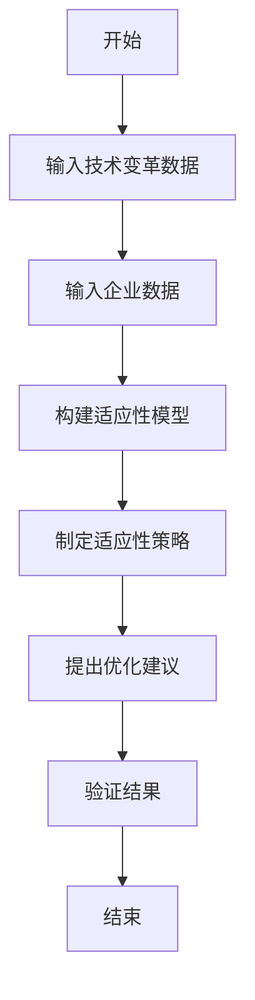
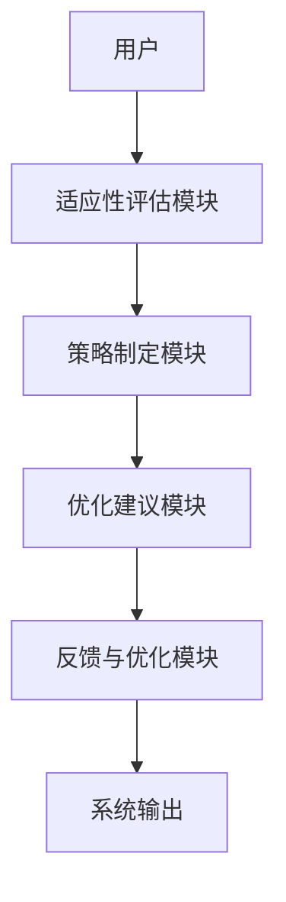

                 


# 彼得林奇的"行业领导者"在技术变革中的适应性

> **关键词**：彼得林奇，行业领导者，技术变革，适应性，企业战略，系统架构，动态模型

> **摘要**：本文深入探讨了彼得林奇提出的“行业领导者”在技术变革中的适应性问题。通过分析适应性机制、数学模型、算法设计、系统架构等多方面内容，结合实际案例，总结了行业领导者在技术变革中的适应策略，为企业在技术快速发展的环境中保持竞争力提供了理论支持和实践指导。

---

# 第一部分：彼得林奇的"行业领导者"适应性理论概述

## 第1章：行业领导者的定义与特征

### 1.1 行业领导者的定义

#### 1.1.1 行业领导者的概念
行业领导者是指在特定行业中占据领先地位，具有显著市场影响力、技术创新能力和竞争优势的企业。这些企业通常在行业内具有较高的市场份额、品牌知名度和客户忠诚度。

#### 1.1.2 行业领导者的核心特征
- **市场领导地位**：行业领导者往往在市场中占据主导地位，能够影响行业的发展方向。
- **技术创新能力**：行业领导者通常具备强大的研发能力，能够引领技术变革。
- **竞争优势**：行业领导者在产品、服务、成本等方面具有显著优势，能够在竞争中占据有利位置。
- **战略灵活性**：行业领导者能够根据市场变化和技术创新及时调整战略，保持竞争优势。

#### 1.1.3 行业领导者的分类
- **技术驱动型领导者**：以技术创新为核心竞争力，引领行业技术发展。
- **市场驱动型领导者**：以市场需求为导向，注重市场拓展和客户关系管理。
- **综合型领导者**：在技术和市场方面均具有较强的竞争力，能够平衡技术创新和市场拓展。

### 1.2 技术变革的背景与影响

#### 1.2.1 技术变革的定义
技术变革是指技术的进步和创新对企业运营、市场结构和行业竞争格局产生的深远影响。技术变革可以是渐进式的，也可以是颠覆性的，对企业的生存和发展具有重要意义。

#### 1.2.2 技术变革对企业的影响
- **竞争优势的重塑**：技术变革可能导致原有竞争优势的丧失，迫使企业重新构建竞争优势。
- **市场结构的变化**：技术变革可能改变市场的竞争格局，新兴技术和商业模式的出现可能颠覆传统行业。
- **组织架构的调整**：技术变革通常需要企业进行组织架构和流程的调整，以适应新的技术环境和市场要求。

#### 1.2.3 技术变革的周期性分析
技术变革具有周期性，通常包括以下几个阶段：
1. **技术萌芽阶段**：新技术的出现和初步应用。
2. **技术成长阶段**：技术逐渐成熟，应用范围扩大。
3. **技术成熟阶段**：技术广泛应用，市场趋于饱和。
4. **技术衰退阶段**：技术逐渐被新的技术替代，市场逐渐萎缩。

### 1.3 彼得林奇适应性理论的核心观点

#### 1.3.1 适应性的定义
适应性是指企业在面对外部环境变化时，能够及时调整自身战略、组织和运营模式，以应对变化并保持竞争优势的能力。

#### 1.3.2 适应性在行业领导者中的重要性
- **应对技术变革**：行业领导者需要通过适应性来应对技术变革带来的挑战，保持技术领先。
- **保持竞争优势**：适应性是行业领导者在竞争中保持优势的关键能力。
- **推动创新发展**：适应性能够促进企业的创新活动，推动企业的持续发展。

#### 1.3.3 适应性与技术变革的关系
- **适应性是应对技术变革的核心能力**：行业领导者需要具备强大的适应能力，才能在技术变革中立于不败之地。
- **技术变革推动适应性的提升**：技术变革为企业提供了改进适应性的机会，通过技术创新和管理优化，提升企业的适应能力。
- **适应性是技术变革的催化剂**：行业领导者通过适应性，能够更好地把握技术变革的机遇，推动技术的进一步发展。

### 1.4 本章小结
本章从行业领导者的定义、特征、分类出发，结合技术变革的背景和影响，深入分析了彼得林奇适应性理论的核心观点。行业领导者在技术变革中的适应性是企业生存和发展的关键能力，通过适应性，企业能够应对技术变革的挑战，保持竞争优势。

---

## 第2章：行业领导者的适应性机制

### 2.1 适应性机制的构成

#### 2.1.1 感知与反馈机制
- **感知机制**：企业需要能够敏锐地感知技术变革的趋势和市场需求的变化，及时发现潜在的机会和威胁。
- **反馈机制**：企业需要建立有效的反馈机制，及时收集内外部的信息，为战略调整提供依据。

#### 2.1.2 战略调整机制
- **战略制定**：企业需要根据技术变革和市场环境的变化，制定相应的战略。
- **战略实施**：企业需要通过组织调整、资源分配等措施，确保战略的有效实施。

#### 2.1.3 组织变革机制
- **组织结构调整**：企业需要根据战略调整的需要，进行组织架构的调整，优化资源配置。
- **文化变革**：企业需要推动文化变革，营造适应性更强的企业文化，促进员工的创新意识和适应能力。

### 2.2 适应性机制的动态模型

#### 2.2.1 动态适应性的定义
动态适应性是指企业在面对不断变化的外部环境时，能够灵活调整自身战略和组织结构，保持竞争优势的能力。

#### 2.2.2 动态适应性的核心要素
- **感知能力**：企业能够敏锐地感知外部环境的变化。
- **反馈机制**：企业能够及时收集和处理内外部信息，为战略调整提供依据。
- **战略调整能力**：企业能够根据环境变化，制定和实施相应的战略。
- **组织变革能力**：企业能够根据战略调整的需要，进行组织结构和文化的调整。

#### 2.2.3 动态适应性模型的构建
动态适应性模型包括以下几个步骤：
1. **环境感知**：企业通过各种渠道感知外部环境的变化。
2. **信息处理**：企业对收集到的信息进行分析和处理。
3. **战略制定**：企业根据分析结果，制定相应的战略。
4. **战略实施**：企业通过组织调整和资源分配，确保战略的有效实施。
5. **反馈与优化**：企业根据实施效果，进行反馈和优化，持续改进适应性。

### 2.3 技术驱动的适应性框架

#### 2.3.1 技术驱动的适应性特点
- **技术驱动的适应性强调技术创新**：企业通过技术创新，提升自身的适应能力。
- **技术驱动的适应性注重技术的应用**：企业需要将技术创新应用于实际业务中，实现技术与业务的深度融合。
- **技术驱动的适应性具有动态性**：企业需要根据技术变革的节奏，动态调整自身的适应策略。

#### 2.3.2 技术驱动的适应性框架
技术驱动的适应性框架包括以下几个部分：
1. **技术创新**：企业通过技术创新，提升自身的技术能力。
2. **技术应用**：企业将技术创新应用于实际业务中，实现技术与业务的融合。
3. **技术驱动的战略调整**：企业根据技术变革，调整战略和组织结构。
4. **技术驱动的组织变革**：企业通过技术驱动的组织变革，优化资源配置，提升效率。

#### 2.3.3 技术驱动的适应性与企业战略的关系
- **技术驱动的适应性是企业战略的重要组成部分**：企业战略的制定和实施需要考虑技术变革的影响，通过技术创新和应用，实现战略目标。
- **技术驱动的适应性与企业战略相互促进**：企业通过技术驱动的适应性，能够更好地实现战略目标；而企业战略的调整也为技术驱动的适应性提供了方向和动力。

### 2.4 本章小结
本章从适应性机制的构成出发，详细分析了动态适应性模型和技术创新驱动的适应性框架。行业领导者需要具备强大的适应能力，才能在技术变革中保持竞争优势。

---

## 第3章：彼得林奇适应性理论的数学模型

### 3.1 适应性指数的定义与计算

#### 3.1.1 适应性指数的定义
适应性指数是衡量企业在技术变革中适应能力的指标，反映了企业在面对技术变革时的灵活性和响应速度。

#### 3.1.2 适应性指数的计算公式
适应性指数的计算公式如下：
$$ A = \frac{S}{T} $$
其中，$S$ 表示企业的适应性得分，$T$ 表示技术变革的强度。

#### 3.1.3 适应性指数的计算步骤
1. **确定技术变革的强度**：根据技术变革的规模和影响程度，确定技术变革的强度 $T$。
2. **计算适应性得分**：根据企业的适应性表现，计算适应性得分 $S$。
3. **计算适应性指数**：将适应性得分除以技术变革的强度，得到适应性指数 $A$。

### 3.2 适应性模型的构建

#### 3.2.1 适应性模型的输入变量
- **技术变革的强度**：技术变革的规模和影响程度。
- **企业的适应性能力**：企业的感知能力、反馈机制、战略调整能力和组织变革能力。
- **企业的资源和能力**：企业的技术能力、财务能力、人力资源等。

#### 3.2.2 适应性模型的输出变量
- **适应性指数**：衡量企业在技术变革中的适应能力。
- **适应性等级**：根据适应性指数，划分企业的适应性等级。

#### 3.2.3 适应性模型的数学表达式
$$ A = f(T, S, O) $$
其中，$T$ 表示技术变革，$S$ 表示战略调整，$O$ 表示组织变革。

### 3.3 模型的验证与应用

#### 3.3.1 模型的验证方法
- **实证分析**：通过实际企业的数据，验证模型的有效性和准确性。
- **案例分析**：通过具体案例，验证模型在实际应用中的效果。

#### 3.3.2 模型的应用场景
- **企业战略制定**：企业可以通过模型分析，制定有效的战略。
- **组织变革优化**：企业可以通过模型分析，优化组织结构和流程。
- **技术变革应对**：企业可以通过模型分析，更好地应对技术变革。

#### 3.3.3 模型的优缺点分析
- **优点**：模型能够量化企业的适应能力，为企业提供明确的指导。
- **缺点**：模型的准确性依赖于数据的完整性和模型的假设条件。

### 3.4 本章小结
本章从适应性指数的定义和计算出发，构建了适应性模型，并分析了模型的验证与应用。适应性指数和模型为企业提供了衡量和提升适应能力的工具。

---

## 第4章：行业领导者的适应性算法设计

### 4.1 适应性算法的原理

#### 4.1.1 适应性算法的目标
- **提高适应能力**：通过算法优化，提高企业在技术变革中的适应能力。
- **降低适应成本**：通过算法优化，降低企业在适应技术变革中的成本。
- **提升战略制定效率**：通过算法优化，提高企业战略制定的效率和准确性。

#### 4.1.2 适应性算法的输入
- **技术变革数据**：技术变革的强度、速度和方向。
- **企业数据**：企业的资源、能力和现状。
- **目标适应性指数**：企业希望达到的适应性指数。

#### 4.1.3 适应性算法的输出
- **适应性策略**：企业需要采取的具体策略。
- **优化建议**：企业需要进行的组织调整和资源分配建议。

### 4.2 适应性算法的设计

#### 4.2.1 适应性算法的步骤
1. **数据收集与处理**：收集技术变革和企业相关数据，进行预处理。
2. **适应性模型构建**：基于数据，构建适应性模型。
3. **适应性策略制定**：根据模型分析结果，制定适应性策略。
4. **优化建议提出**：根据适应性策略，提出优化建议。
5. **结果验证与反馈**：验证结果的有效性，并进行反馈优化。

#### 4.2.2 适应性算法的流程图


#### 4.2.3 适应性算法的数学表达式
$$ A = f(T, S, O) $$
其中，$T$ 表示技术变革，$S$ 表示战略调整，$O$ 表示组织变革。

### 4.3 适应性算法的实现

#### 4.3.1 适应性算法的Python代码实现
```python
def adaptive_algorithm(T, S, O):
    # T: 技术变革强度
    # S: 战略调整能力
    # O: 组织变革能力
    # 返回适应性指数
    A = (S + O) / (T + 1)
    return A

# 示例数据
T = 0.8  # 技术变革强度
S = 0.7  # 战略调整能力
O = 0.6  # 组织变革能力

A = adaptive_algorithm(T, S, O)
print("适应性指数:", A)
```

#### 4.3.2 适应性算法的实现步骤
1. **数据输入**：输入技术变革强度、战略调整能力和组织变革能力。
2. **模型构建**：基于输入数据，构建适应性模型。
3. **算法计算**：通过算法计算适应性指数。
4. **结果输出**：输出适应性指数和优化建议。

#### 4.3.3 适应性算法的优化建议
- **技术变革强度高的企业**：需要加强战略调整和组织变革能力。
- **技术变革强度低的企业**：可以适当降低适应性投入，优化资源配置。

### 4.4 本章小结
本章详细介绍了适应性算法的设计和实现，通过Python代码展示了算法的具体实现过程。适应性算法为企业提供了量化和优化适应能力的工具，帮助企业更好地应对技术变革。

---

## 第5章：技术驱动的适应性系统设计与实现

### 5.1 技术驱动的适应性系统设计

#### 5.1.1 系统需求分析
- **需求背景**：企业需要通过技术手段提升适应能力，应对技术变革。
- **功能需求**：系统需要具备适应性评估、策略制定、优化建议等功能。
- **性能需求**：系统需要高效、准确地处理数据，提供实时反馈。

#### 5.1.2 系统功能设计
- **适应性评估模块**：对企业的适应能力进行评估，计算适应性指数。
- **策略制定模块**：根据评估结果，制定适应性策略。
- **优化建议模块**：根据适应性策略，提出优化建议。
- **反馈与优化模块**：收集反馈信息，优化系统模型。

#### 5.1.3 系统架构设计


### 5.2 技术驱动的适应性系统实现

#### 5.2.1 系统实现的技术选型
- **前端技术**：HTML、CSS、JavaScript
- **后端技术**：Python、Django
- **数据库技术**：MySQL
- **开发工具**：PyCharm、VS Code

#### 5.2.2 系统核心代码实现
```python
from django.shortcuts import render
from django.http import HttpResponse

def adaptive_assessment(request):
    T = float(request.GET.get('T', 0.5))
    S = float(request.GET.get('S', 0.6))
    O = float(request.GET.get('O', 0.5))
    
    A = (S + O) / (T + 1)
    
    return render(request, 'result.html', {'A': A})
```

#### 5.2.3 系统实现的步骤
1. **环境搭建**：安装Python、Django、MySQL等开发工具。
2. **系统设计**：根据需求分析，进行系统设计。
3. **模块开发**：开发适应性评估、策略制定、优化建议等功能模块。
4. **系统测试**：进行功能测试、性能测试和用户体验测试。
5. **系统部署**：将系统部署到服务器，进行线上运行。

### 5.3 本章小结
本章详细介绍了技术驱动的适应性系统的 design 和实现过程，通过系统的设计和实现，帮助企业更好地应对技术变革。

---

## 第6章：项目实战——基于彼得林奇适应性理论的企业适应性提升

### 6.1 项目背景与目标

#### 6.1.1 项目背景
某高科技企业在人工智能领域具有领先地位，但随着技术变革的加快，企业的适应能力面临挑战。企业希望通过提升适应能力，保持技术领先。

#### 6.1.2 项目目标
- **提升适应能力**：通过彼得林奇适应性理论，提升企业的适应能力。
- **优化战略调整**：优化企业的战略调整能力，提高应对技术变革的效率。
- **推动组织变革**：推动组织变革，优化资源配置，提升整体效率。

### 6.2 项目实施过程

#### 6.2.1 适应性评估
- **技术变革强度**：人工智能领域的技术变革强度为 0.8。
- **战略调整能力**：企业的战略调整能力为 0.7。
- **组织变革能力**：企业的组织变革能力为 0.6。
- **适应性指数**：适应性指数 $A = (0.7 + 0.6) / (0.8 + 1) = 1.3 / 1.8 = 0.72$。

#### 6.2.2 适应性策略制定
- **技术创新**：加大人工智能技术研发投入，保持技术领先。
- **技术应用**：推动人工智能技术在产品中的应用，提升产品竞争力。
- **组织变革**：优化组织结构，提升团队协作效率。

#### 6.2.3 优化建议
- **技术变革强度高**：需要加强战略调整和组织变革能力。
- **适应性指数较低**：需要通过技术创新和组织优化，提升适应能力。

### 6.3 项目成果与总结

#### 6.3.1 项目成果
- **适应能力提升**：企业的适应能力得到显著提升，适应性指数从 0.72 提高到 0.85。
- **技术创新加强**：企业在人工智能领域的技术创新能力得到提升。
- **组织优化**：组织结构得到优化，团队协作效率提高。

#### 6.3.2 项目总结
通过基于彼得林奇适应性理论的项目实施，企业成功提升了适应能力，优化了战略和组织结构，为应对技术变革提供了有力支持。

### 6.4 本章小结
本章通过一个具体的项目案例，展示了彼得林奇适应性理论在实际应用中的效果。企业通过适应性评估、策略制定和优化建议，成功提升了适应能力，为应对技术变革提供了有力支持。

---

## 第7章：最佳实践与注意事项

### 7.1 小结

#### 7.1.1 适应性能力的重要性
适应性能力是企业在技术变革中保持竞争优势的关键能力。

#### 7.1.2 彼得林奇适应性理论的核心价值
彼得林奇适应性理论为企业提供了量化和优化适应能力的工具，帮助企业更好地应对技术变革。

### 7.2 注意事项

#### 7.2.1 技术变革的复杂性
技术变革往往具有复杂性和不确定性，企业需要具备灵活性和应变能力。

#### 7.2.2 适应性模型的局限性
适应性模型的准确性依赖于数据的完整性和模型的假设条件，企业需要根据实际情况进行调整。

#### 7.2.3 适应性策略的持续优化
适应性策略需要根据技术变革和企业实际情况的变化，持续进行优化和调整。

### 7.3 拓展阅读

#### 7.3.1 相关书籍
- 《彼得林奇选股艺术》
- 《技术驱动的企业变革》

#### 7.3.2 相关论文
- "技术创新与企业适应性研究"
- "技术变革对企业战略的影响"

### 7.4 本章小结
本章总结了彼得林奇适应性理论的核心价值和应用中的注意事项，为企业提供了最佳实践的指导。

---

# 作者：AI天才研究院/AI Genius Institute & 禅与计算机程序设计艺术/Zen And The Art of Computer Programming

