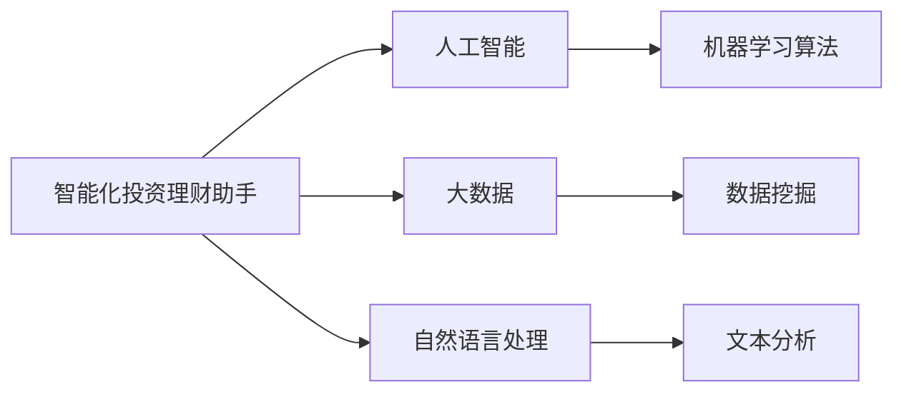
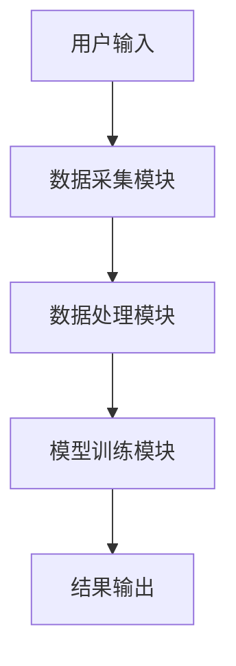
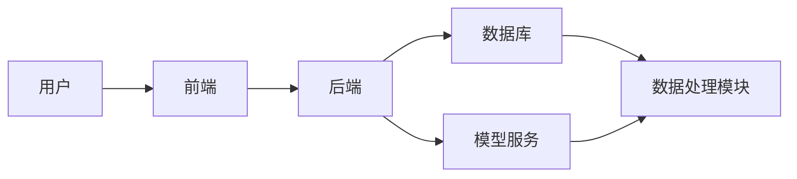
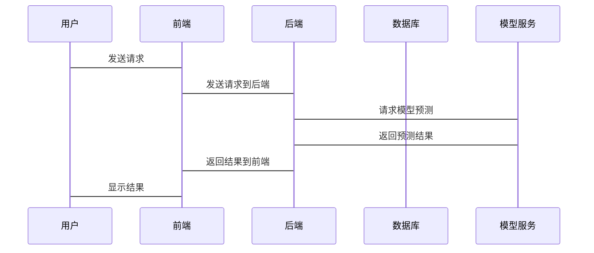

                 


# 探索下一代投资理财智能助手的发展方向

> 关键词：投资理财，智能助手，人工智能，大数据，自然语言处理，系统架构

> 摘要：本文探讨了下一代投资理财智能助手的发展方向，分析了其背景、核心概念、算法原理、系统架构，并通过项目实战和最佳实践提供了具体的实现方案和案例分析。文章内容涵盖了从理论到实践的各个方面，为投资理财智能助手的未来发展提供了全面的思考和指导。

---

# 第一部分: 投资理财智能助手的背景与概念

## 第1章: 投资理财智能助手的背景介绍

### 1.1 问题背景

#### 1.1.1 投资者面临的痛点分析
- 投资者在面对复杂的金融市场时，往往缺乏足够的知识和时间来做出明智的决策。
- 传统金融工具和信息获取渠道存在碎片化问题，难以满足投资者的个性化需求。
- 市场波动和不确定性增加了投资决策的难度。

#### 1.1.2 智能化投资理财的需求驱动
- 随着人工智能和大数据技术的快速发展，投资者对智能化工具的需求日益增长。
- 个性化投资建议和实时市场分析成为投资者的重要需求。
- 提高投资效率和降低决策风险是智能化投资理财的核心目标。

#### 1.1.3 技术进步对投资理财的影响
- 人工智能技术的进步使得智能投资助手能够实现自动化和智能化的决策支持。
- 大数据技术的应用为投资分析提供了丰富的数据来源和精准的分析能力。
- 自然语言处理技术使得智能助手能够理解和解析非结构化的金融信息。

### 1.2 问题描述

#### 1.2.1 投资者面临的决策挑战
- 如何在复杂的市场环境中快速获取和分析信息。
- 如何制定个性化的投资策略以满足不同的财务目标。
- 如何降低投资风险并提高收益。

#### 1.2.2 传统投资理财工具的局限性
- 传统金融工具缺乏智能化和个性化支持。
- 数据获取渠道分散，难以提供实时和全面的市场分析。
- 缺乏对非结构化数据的处理能力，导致信息利用效率低下。

#### 1.2.3 智能化投资理财助手的定义与目标
- 定义：智能化投资理财助手是一种基于人工智能和大数据技术的工具，能够为投资者提供个性化的投资建议、实时市场分析和风险评估。
- 目标：帮助投资者提高投资效率，降低决策风险，实现财务目标。

### 1.3 问题解决

#### 1.3.1 AI技术在投资理财中的应用价值
- 提供实时市场分析和趋势预测。
- 实现个性化投资策略推荐。
- 自动化处理和分析大量金融数据。

#### 1.3.2 智能助手如何辅助投资决策
- 通过自然语言处理技术解析新闻、报告等非结构化数据。
- 利用机器学习算法进行市场预测和风险评估。
- 提供交互式界面，帮助投资者快速获取信息和制定决策。

#### 1.3.3 提升投资效率的具体措施
- 优化数据获取和处理流程。
- 提供个性化投资建议和实时反馈。
- 实现多渠道数据整合和分析。

### 1.4 边界与外延

#### 1.4.1 智能助手的功能边界
- 数据范围：仅限于公开的金融数据和市场信息。
- 决策支持：提供建议，但不直接进行交易操作。
- 用户群体：主要面向个人投资者和小型机构。

#### 1.4.2 与传统金融工具的区分
- 智能助手提供的是辅助决策，而非直接投资服务。
- 传统工具依赖人工分析，而智能助手实现自动化和智能化。

#### 1.4.3 未来发展外延
- 逐步扩展到机构投资者和大型金融企业。
- 结合区块链技术实现更加安全和透明的金融交易。

### 1.5 概念结构与核心要素

#### 1.5.1 核心概念的层次结构
- **顶层概念**：智能化投资理财助手。
- **中间概念**：人工智能、大数据、自然语言处理。
- **底层概念**：金融数据、投资策略、用户需求。

#### 1.5.2 核心要素的特征分析
- **金融数据**：实时性、多样性、复杂性。
- **投资策略**：个性化、动态性、风险可控性。
- **用户需求**：多样性、个性化、实时性。

#### 1.5.3 概念之间的关系图解


---

## 第2章: 投资理财智能助手的核心概念与联系

### 2.1 核心概念原理

#### 2.1.1 人工智能在投资理财中的应用原理
- **机器学习**：通过历史数据训练模型，预测市场趋势。
- **深度学习**：利用神经网络进行复杂模式识别。
- **自然语言处理**：解析金融新闻、报告等文本信息。

#### 2.1.2 大数据技术对投资决策的支持
- **数据采集**：从多种来源获取金融数据。
- **数据清洗**：处理数据中的噪声和缺失值。
- **数据分析**：通过统计分析和数据挖掘提取有价值的信息。

#### 2.1.3 自然语言处理在金融信息分析中的作用
- **文本分类**：识别新闻的类型和情感倾向。
- **实体识别**：提取公司名称、股票代码等实体信息。
- **信息抽取**：从文本中提取关键信息用于市场分析。

### 2.2 核心概念属性特征对比

#### 2.2.1 不同技术的特征对比表格
| 技术         | 特征             | 优势                           | 局限性                         |
|--------------|------------------|--------------------------------|---------------------------------|
| 人工智能     | 数据驱动         | 高度个性化和精准化             | 需大量数据支持                 |
| 大数据       | 数据量大         | 提供全面的市场分析             | 数据清洗和处理成本高           |
| 自然语言处理 | 文本理解能力     | 能够处理非结构化数据           | 对复杂语义的理解有限           |

#### 2.2.2 技术之间的协同效应分析
- **人工智能与大数据**：人工智能依赖大数据进行训练和推理，大数据为人工智能提供丰富的数据来源。
- **自然语言处理与机器学习**：自然语言处理提供文本数据，机器学习对文本数据进行分析和预测。

#### 2.2.3 技术与业务目标的匹配度
- **匹配度高**：技术能够直接支持投资决策和市场分析。
- **匹配度低**：部分技术在实际应用中可能需要额外的调整和优化。

### 2.3 ER实体关系图架构

```mermaid
erd
    user {
        int id
        string name
        string email
    }
    investment_account {
        int id
        int user_id
        string account_number
        decimal balance
    }
    financial_data {
        int id
        string symbol
        decimal price
        date timestamp
    }
    transaction {
        int id
        int account_id
        int financial_data_id
        decimal amount
        date timestamp
    }
    investment_strategy {
        int id
        string name
        string description
        boolean is_active
    }
    risk_assessment {
        int id
        int account_id
        decimal risk_level
        date assessment_date
    }
```

---

## 第3章: 投资理财智能助手的算法原理

### 3.1 算法原理概述

#### 3.1.1 算法选择与优化
- **机器学习算法**：线性回归、支持向量机（SVM）、随机森林、神经网络等。
- **优化方法**：梯度下降、Adam优化器。

#### 3.1.2 算法实现流程
1. 数据预处理：清洗、特征提取。
2. 模型训练：选择合适的算法，进行训练。
3. 模型评估：使用测试数据评估模型性能。
4. 模型优化：调整参数，提高预测精度。

#### 3.1.3 算法复杂度分析
- **时间复杂度**：O(n)，n为数据量。
- **空间复杂度**：O(m)，m为特征数量。

### 3.2 机器学习算法实现

#### 3.2.1 线性回归算法
- **数学模型**：$$ y = \beta_0 + \beta_1x + \epsilon $$
- **实现代码**：
  ```python
  import numpy as np

  def linear_regression(X, y):
      X = np.hstack([np.ones((X.shape[0], 1)), X])
      theta = np.linalg.inv(X.T @ X) @ (X.T @ y)
      return theta
  ```

#### 3.2.2 支持向量机（SVM）算法
- **数学模型**：最大化间隔的分类问题。
- **实现代码**：
  ```python
  from sklearn import svm

  def svm_classifier(X_train, y_train):
      clf = svm.SVC()
      clf.fit(X_train, y_train)
      return clf
  ```

#### 3.2.3 随机森林算法
- **数学模型**：基于决策树的集成学习方法。
- **实现代码**：
  ```python
  from sklearn.ensemble import RandomForestClassifier

  def random_forest_classifier(X_train, y_train):
      clf = RandomForestClassifier(n_estimators=100)
      clf.fit(X_train, y_train)
      return clf
  ```

### 3.3 深度学习算法实现

#### 3.3.1 神经网络算法
- **数学模型**：$$ a^{(l+1)} = \sigma(w^{(l)}a^{(l)} + b^{(l)}) $$
- **实现代码**：
  ```python
  import tensorflow as tf

  def neural_network_model(input_dim):
      model = tf.keras.Sequential([
          tf.keras.layers.Dense(64, activation='relu', input_dim=input_dim),
          tf.keras.layers.Dense(32, activation='relu'),
          tf.keras.layers.Dense(1, activation='sigmoid')
      ])
      model.compile(optimizer='adam', loss='binary_crossentropy', metrics=['accuracy'])
      return model
  ```

#### 3.3.2 卷积神经网络（CNN）算法
- **数学模型**：$$ f(x) = \max(0, 1 + x) $$
- **实现代码**：
  ```python
  import tensorflow as tf

  def cnn_model(input_shape):
      model = tf.keras.Sequential([
          tf.keras.layers.Conv2D(32, (3,3), activation='relu', input_shape=input_shape),
          tf.keras.layers.MaxPooling2D((2,2)),
          tf.keras.layers.Flatten(),
          tf.keras.layers.Dense(64, activation='relu'),
          tf.keras.layers.Dense(1, activation='sigmoid')
      ])
      model.compile(optimizer='adam', loss='binary_crossentropy', metrics=['accuracy'])
      return model
  ```

---

## 第4章: 投资理财智能助手的系统分析与架构设计

### 4.1 系统功能设计

#### 4.1.1 功能模块划分
- 数据采集模块：从多种数据源获取金融数据。
- 数据处理模块：清洗、转换和存储数据。
- 模型训练模块：训练机器学习和深度学习模型。
- 用户交互模块：提供友好的用户界面和交互体验。

#### 4.1.2 功能流程图


### 4.2 系统架构设计

#### 4.2.1 系统架构图


#### 4.2.2 系统接口设计
- **前端接口**：RESTful API，用于用户交互。
- **后端接口**：与模型服务和数据库通信。

#### 4.2.3 系统交互流程


---

## 第5章: 投资理财智能助手的项目实战

### 5.1 环境安装

#### 5.1.1 安装Python和必要的库
- 安装Python 3.8或更高版本。
- 使用pip安装以下库：
  - numpy
  - pandas
  - scikit-learn
  - tensorflow
  - mermaid

#### 5.1.2 安装Jupyter Notebook
- 使用以下命令安装：
  ```bash
  pip install jupyter notebook
  ```

### 5.2 系统核心实现

#### 5.2.1 数据处理代码
```python
import pandas as pd

def load_data(file_path):
    data = pd.read_csv(file_path)
    return data

def preprocess_data(data):
    # 数据清洗和特征提取
    data.dropna()
    data = pd.get_dummies(data)
    return data

data = load_data('financial_data.csv')
data = preprocess_data(data)
```

#### 5.2.2 模型训练代码
```python
from sklearn.model

