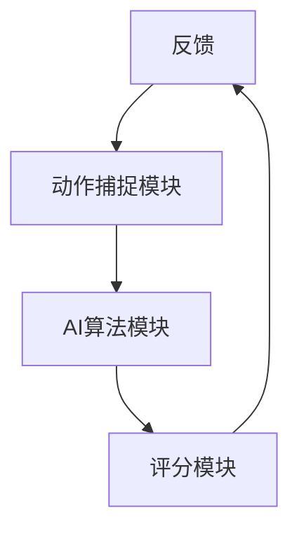
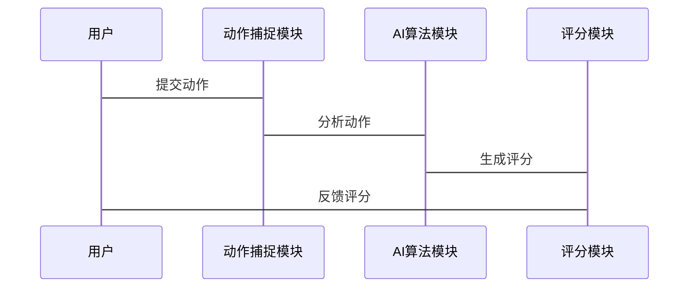

                 


# 智能健身镜：AI Agent的实时动作纠正与评分

> 关键词：智能健身镜，AI Agent，实时动作纠正，健身动作评分，姿态估计，深度学习

> 摘要：本文深入探讨了智能健身镜中AI Agent的实时动作纠正与评分技术，从背景、概念、算法原理到系统架构和项目实战，全面分析了这一技术的核心要素和实现细节。文章结合理论与实践，详细讲解了动作纠正的数学模型、评分算法的实现流程以及系统架构的设计思路，为读者提供了一个全面的技术视角。

---

# 第一部分: 背景与概念

## 第1章: 背景与问题背景

### 1.1 智能健身镜的定义与应用场景

#### 1.1.1 什么是智能健身镜
智能健身镜是一种结合了人工智能（AI）和健身科技的交互式镜子，能够实时捕捉用户的健身动作，并通过AI算法提供实时反馈、动作纠正和评分。它通常配备摄像头、传感器和高算力芯片，支持多种健身模式，如瑜伽、普拉提、力量训练等。

#### 1.1.2 智能健身镜的主要应用场景
- **家庭健身**：用户可以在家中进行专业级的健身训练，无需去健身房。
- **远程健身指导**：用户可以与在线教练进行实时互动，获得专业指导。
- **健身社交**：用户可以通过智能健身镜与好友进行健身比赛或组训。

#### 1.1.3 智能健身镜的核心价值
- 提供专业级的健身指导，帮助用户避免因动作错误导致的运动损伤。
- 通过实时反馈和评分，增强用户的健身体验和成就感。

### 1.2 问题背景与用户需求

#### 1.2.1 现有健身方式的痛点
- **传统健身教练**：成本高、时间受限，无法满足大规模需求。
- **在线视频健身**：缺乏实时反馈，动作错误难以发现。
- **健身App**：依赖手动输入数据，无法提供实时指导。

#### 1.2.2 智能健身镜解决的核心问题
- 实现实时动作纠正，避免运动损伤。
- 提供精准的健身评分，增强用户动力。
- 降低健身成本，提升健身效率。

#### 1.2.3 用户需求分析
- **专业性**：用户需要准确的动作纠正和评分。
- **实时性**：用户希望得到即时反馈。
- **便捷性**：用户希望操作简单，无需复杂设备。

### 1.3 AI Agent在智能健身镜中的作用

#### 1.3.1 AI Agent的基本概念
AI Agent（智能体）是一种能够感知环境、做出决策并执行任务的智能系统。在智能健身镜中，AI Agent负责处理用户的动作数据、分析动作是否标准，并提供反馈。

#### 1.3.2 AI Agent在健身领域的应用
- **动作识别**：通过摄像头捕捉用户动作，识别健身动作的类型。
- **动作纠正**：基于深度学习模型，分析动作偏差并提出纠正建议。
- **评分系统**：根据动作的准确性和规范性，生成实时评分。

#### 1.3.3 智能健身镜中的AI Agent功能
- **实时感知**：通过摄像头和传感器获取用户动作数据。
- **智能分析**：利用深度学习模型分析动作偏差。
- **反馈指导**：实时提供纠正建议和评分反馈。

---

## 第2章: 动作纠正与评分的核心概念

### 2.1 动作纠正的定义与技术背景

#### 2.1.1 动作纠正的基本概念
动作纠正是一种通过AI技术分析用户的健身动作，并提供纠正建议的技术。它基于动作捕捉、姿态估计和深度学习模型，帮助用户优化动作质量。

#### 2.1.2 基于AI的动作纠正技术
- **动作捕捉**：通过摄像头捕捉用户的动作数据。
- **姿态估计**：基于深度学习模型，估计用户的身体姿态。
- **动作分析**：根据姿态估计结果，分析动作是否标准。

#### 2.1.3 动作纠正的实现流程
1. 捕捉用户动作数据。
2. 通过姿态估计模型分析动作。
3. 对比标准动作库，识别动作偏差。
4. 提供纠正建议。

### 2.2 健身动作评分的定义与标准

#### 2.2.1 健身动作评分的基本概念
健身动作评分是基于动作的准确性和规范性，通过AI算法生成的评分。评分系统通常包括动作的标准度、完成度和流畅度等多个维度。

#### 2.2.2 健身动作评分的标准与指标
- **标准度**：动作是否符合标准姿势。
- **完成度**：动作是否完整执行。
- **流畅度**：动作是否连贯。

#### 2.2.3 评分系统的实现逻辑
1. 通过姿态估计模型分析动作。
2. 对比标准动作库，生成评分结果。
3. 提供评分反馈。

### 2.3 智能健身镜的边界与外延

#### 2.3.1 智能健身镜的功能边界
- **核心功能**：动作纠正、评分反馈。
- **辅助功能**：视频播放、语音指导。

#### 2.3.2 智能健身镜的外延功能
- **数据统计**：记录用户的健身数据。
- **社交互动**：与好友进行健身比赛。

#### 2.3.3 系统与其他设备的交互
- **手机App**：同步数据、查看反馈。
- **云端平台**：存储数据、生成报告。

---

## 第3章: 核心概念与联系

### 3.1 AI Agent与动作纠正的关系

#### 3.1.1 AI Agent在动作纠正中的角色
AI Agent负责处理用户的动作数据，分析动作偏差，并提供纠正建议。

#### 3.1.2 动作纠正对AI Agent的要求
- **高精度**：动作识别准确率高。
- **实时性**：反馈速度快。

#### 3.1.3 两者结合的实现机制
1. 用户执行动作，智能健身镜捕捉数据。
2. AI Agent分析数据，生成纠正建议。
3. 反馈给用户。

### 3.2 动作捕捉与评分的对比分析

#### 3.2.1 动作捕捉技术的优缺点
- **优点**：高精度、实时性强。
- **缺点**：硬件成本高、需要专业设备。

#### 3.2.2 健身动作评分的优缺点
- **优点**：提供量化反馈，增强用户动力。
- **缺点**：评分标准需统一。

#### 3.2.3 两者结合的协同效应
- **高精度**：动作捕捉提供准确数据。
- **实时反馈**：评分系统提供即时反馈。

### 3.3 ER实体关系图

```mermaid
er
actor: 用户
agent: AI Agent
action_correction: 动作纠正记录
score: 评分结果
actor --> action_correction: 提交动作
agent --> action_correction: 处理动作
action_correction --> score: 生成评分
```

---

## 第4章: 动作纠正算法原理

### 4.1 基于AI的动作纠正算法

#### 4.1.1 基于深度学习的动作识别
- **卷积神经网络（CNN）**：用于图像特征提取。
- **循环神经网络（RNN）**：用于时间序列分析。

#### 4.1.2 基于姿态估计的动作纠正
- **姿态估计模型**：通过摄像头捕捉用户姿态。
- **动作偏差分析**：对比标准姿势，识别偏差。

#### 4.1.3 动作纠正的实现流程
1. 捕捉用户动作数据。
2. 通过姿态估计模型分析动作。
3. 对比标准姿势，识别偏差。
4. 提供纠正建议。

### 4.2 动作纠正的数学模型

#### 4.2.1 姿态估计模型
- **输入**：RGB图像。
- **输出**：人体关键点坐标。
- **模型**：基于ResNet的Hourglass网络。

#### 4.2.2 动作纠正的优化算法
- **损失函数**：均方误差（MSE）。
- **优化器**：Adam优化器。
- **模型训练**：使用标准动作数据进行监督学习。

#### 4.2.3 模型训练与调优
1. 数据预处理：标准化、数据增强。
2. 模型训练：使用GPU加速。
3. 模型调优：调整超参数。

### 4.3 算法实现的代码示例

#### 4.3.1 姿态估计模型代码
```python
import tensorflow as tf
from tensorflow.keras import layers

def hourglass_block(x, num_out channels):
    skip = x
    x = layers.Conv2D(num_out_channels, (1, 1), padding='same')(x)
    x = layers.BatchNormalization()(x)
    x = layers.ReLU()(x)
    x = layers.Add()([x, skip])
    return x

def hourglass_net(input_shape, num_classes):
    input = layers.Input(shape=input_shape)
    x = layers.Conv2D(64, (3, 3), padding='same')(input)
    x = layers.BatchNormalization()(x)
    x = layers.ReLU()(x)
    x = hourglass_block(x, 64)
    x = layers.Conv2D(num_classes, (1, 1), activation='sigmoid')(x)
    model = tf.keras.Model(inputs=input, outputs=x)
    return model
```

#### 4.3.2 动作纠正算法代码
```python
def correct_action(estimated_pose, target_pose):
    correction = {}
    for key in estimated_pose:
        correction[key] = target_pose[key] - estimated_pose[key]
    return correction
```

---

## 第5章: 健身动作评分算法

### 5.1 评分算法的实现原理

#### 5.1.1 基于姿态估计的评分标准
- **标准度**：动作与标准姿势的相似度。
- **完成度**：动作是否完整执行。
- **流畅度**：动作的连贯性。

#### 5.1.2 评分算法的实现流程
1. 通过姿态估计模型分析动作。
2. 对比标准姿势，计算偏差。
3. 根据偏差生成评分。

### 5.2 评分算法的数学模型

#### 5.2.1 评分公式
$$ \text{评分} = \alpha \times \text{标准度} + \beta \times \text{完成度} + \gamma \times \text{流畅度} $$

其中，$\alpha + \beta + \gamma = 1$。

#### 5.2.2 标准度计算
$$ \text{标准度} = 1 - \sum_{i=1}^{n} (\text{估计点坐标} - \text{标准点坐标})^2 $$

---

## 第6章: 系统分析与架构设计

### 6.1 系统功能设计

#### 6.1.1 功能模块
- **动作捕捉模块**：摄像头和传感器。
- **AI算法模块**：姿态估计和评分算法。
- **用户反馈模块**：显示纠正建议和评分。

#### 6.1.2 功能流程
1. 用户执行动作。
2. 摄像头捕捉动作数据。
3. AI算法分析动作。
4. 显示纠正建议和评分。

### 6.2 系统架构设计

#### 6.2.1 系统架构图


#### 6.2.2 系统交互图


---

## 第7章: 项目实战

### 7.1 环境安装与配置

#### 7.1.1 系统要求
- **硬件**：摄像头、GPU。
- **软件**：Python、TensorFlow、OpenCV。

#### 7.1.2 安装依赖
```bash
pip install tensorflow==2.5.0
pip install opencv-python
pip install numpy
```

### 7.2 核心代码实现

#### 7.2.1 姿态估计代码
```python
import cv2
import numpy as np

def detect_keypoints(image):
    # 使用OpenCV检测人体关键点
    pass
```

#### 7.2.2 动作纠正代码
```python
def correct_action(estimated_pose, target_pose):
    correction = {}
    for key in estimated_pose:
        correction[key] = target_pose[key] - estimated_pose[key]
    return correction
```

#### 7.2.3 评分系统代码
```python
def calculate_score(corrected_pose):
    score = 0
    for key in corrected_pose:
        score += abs(corrected_pose[key])
    return score
```

### 7.3 案例分析与详细解读

#### 7.3.1 实际案例
- **用户A**：动作偏差较大，评分较低。
- **用户B**：动作标准，评分较高。

#### 7.3.2 代码分析
- **动作捕捉**：使用OpenCV检测关键点。
- **动作纠正**：计算偏差并生成反馈。
- **评分系统**：根据偏差计算评分。

---

## 第8章: 总结与最佳实践

### 8.1 总结

#### 8.1.1 核心内容回顾
- AI Agent在智能健身镜中的应用。
- 动作纠正与评分的实现原理。
- 系统架构与项目实战。

#### 8.1.2 本文的创新点
- 结合AI技术实现实时动作纠正。
- 提供量化评分反馈，增强用户体验。

### 8.2 最佳实践 tips

#### 8.2.1 开发建议
- 确保动作捕捉的高精度。
- 提供多样化的健身模式。

#### 8.2.2 使用建议
- 定期更新动作库。
- 提供用户反馈渠道。

### 8.3 注意事项

#### 8.3.1 技术注意事项
- 硬件性能影响体验。
- 数据隐私需严格保护。

#### 8.3.2 用户注意事项
- 遵循纠正建议，避免受伤。
- 定期检查设备状态。

### 8.4 拓展阅读

#### 8.4.1 推荐书籍
- 《深度学习》
- 《计算机视觉实战》

#### 8.4.2 推荐博客
- TensorFlow官方博客
- OpenCV中文网

---

# 作者：AI天才研究院 & 禅与计算机程序设计艺术

