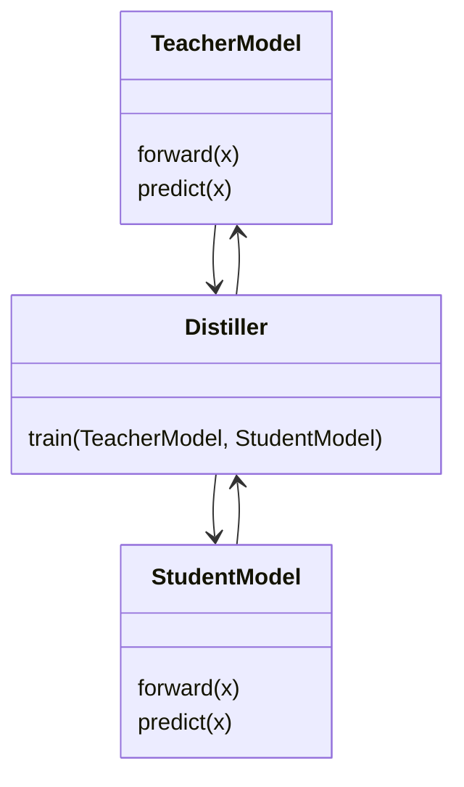
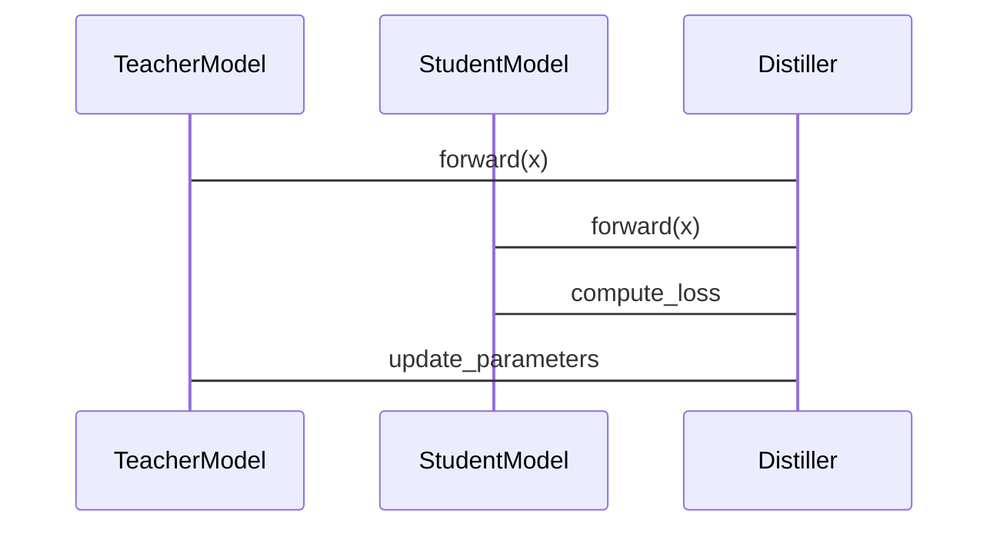

                 


# 构建具有知识蒸馏能力的AI Agent

> 关键词：知识蒸馏，AI Agent，模型压缩，迁移学习，机器学习，深度学习

> 摘要：本文系统地探讨了如何将知识蒸馏技术应用于AI Agent的构建过程中。文章首先介绍了知识蒸馏的基本概念及其在AI Agent中的重要性，随后详细分析了知识蒸馏的核心原理和算法，结合实际案例，展示了如何在AI Agent系统中实现知识蒸馏。文章还探讨了知识蒸馏与迁移学习的关系，并通过系统架构设计和项目实战，深入讲解了如何在实际场景中应用知识蒸馏技术。最后，文章总结了知识蒸馏在AI Agent中的优势与挑战，并展望了未来的研究方向。

---

# 第一部分: 知识蒸馏与AI Agent概述

## 第1章: 知识蒸馏的核心概念

### 1.1 知识蒸馏的背景与问题背景

#### 1.1.1 大模型的计算资源消耗问题
随着深度学习技术的快速发展，大型模型（如GPT、BERT等）在各种任务中表现出色，但其计算资源消耗巨大。训练和推理这些模型需要大量的计算资源和时间，这在实际应用中往往不可行。因此，如何将大型模型的知识迁移到更小、更高效的模型中，成为了一个重要的研究方向。

#### 1.1.2 模型压缩与轻量化的需求
模型压缩是将大型模型的知识迁移到更小模型的过程。通过模型压缩，可以在资源受限的环境中（如移动设备、边缘设备等）运行高效的AI模型。知识蒸馏是一种常用的模型压缩技术，它通过将教师模型（大型模型）的知识迁移到学生模型（较小模型）中，实现模型的轻量化。

#### 1.1.3 知识蒸馏的定义与目标
知识蒸馏是一种通过将教师模型的知识迁移到学生模型的技术。其目标是使学生模型在保持或接近教师模型性能的同时，具有更小的模型规模和更高效的计算能力。知识蒸馏的核心思想是将教师模型的决策过程（如概率分布）作为标签，指导学生模型的学习。

#### 1.1.4 知识蒸馏的应用场景与边界
知识蒸馏广泛应用于图像分类、自然语言处理、语音识别等领域。例如，在自然语言处理中，可以通过知识蒸馏将大型语言模型的知识迁移到更小的模型中，从而在资源受限的场景下实现高效的文本生成或问答任务。

### 1.2 AI Agent的基本概念与特点

#### 1.2.1 AI Agent的定义与分类
AI Agent（智能体）是指能够感知环境并采取行动以实现目标的实体。AI Agent可以是软件程序、机器人或其他智能系统。根据功能和应用场景，AI Agent可以分为多种类型，如反应式AI Agent、基于模型的AI Agent、学习型AI Agent等。

#### 1.2.2 AI Agent的核心功能与能力
AI Agent的核心功能包括感知、决策、行动和学习。它需要能够从环境中获取信息（感知），根据信息做出决策，并采取行动以实现目标。学习型AI Agent还需要能够通过与环境的交互不断优化自身的知识和能力。

#### 1.2.3 AI Agent与传统AI的区别
与传统AI相比，AI Agent具有更强的自主性和适应性。传统AI通常依赖于预定义的规则和数据，而AI Agent能够动态感知环境并自主决策。此外，AI Agent还具有更强的交互能力，能够与人类或其他智能体进行协作或竞争。

#### 1.2.4 知识蒸馏在AI Agent中的作用
知识蒸馏可以将教师模型的知识迁移到AI Agent中，从而提升其性能和效率。例如，在自然语言处理任务中，可以通过知识蒸馏将大型语言模型的知识迁移到更小的学生模型中，使AI Agent能够在资源受限的场景下高效运行。

---

## 第2章: 知识蒸馏与AI Agent的关系

### 2.1 知识蒸馏的基本原理

#### 2.1.1 知识蒸馏的定义
知识蒸馏是一种通过将教师模型的知识迁移到学生模型的技术。教师模型通常是大型模型，具有强大的表现能力，但计算成本较高。学生模型通常是小型模型，具有较低的计算成本，但性能较差。通过知识蒸馏，学生模型可以从教师模型中学习到知识，从而提升性能。

#### 2.1.2 知识蒸馏的核心步骤
知识蒸馏的核心步骤包括：(1) 确定教师模型和学生模型；(2) 设计蒸馏损失函数；(3) 进行蒸馏训练；(4) 微调学生模型。

#### 2.1.3 知识蒸馏的关键技术点
知识蒸馏的关键技术点包括：(1) 如何设计蒸馏损失函数；(2) 如何平衡教师模型和学生模型的损失；(3) 如何选择合适的温度参数。

### 2.2 知识蒸馏在AI Agent中的应用

#### 2.2.1 知识蒸馏如何提升AI Agent的性能
通过知识蒸馏，AI Agent可以从教师模型中学习到更丰富的特征和知识，从而在保持或接近教师模型性能的同时，减少计算成本。

#### 2.2.2 知识蒸馏如何降低AI Agent的资源消耗
知识蒸馏可以将教师模型的知识迁移到更小的学生模型中，从而减少AI Agent的计算资源消耗，使其能够在资源受限的环境中运行。

#### 2.2.3 知识蒸馏如何增强AI Agent的可解释性
与传统的模型压缩技术相比，知识蒸馏能够更直观地将教师模型的知识迁移到学生模型中，从而增强AI Agent的可解释性。

### 2.3 知识蒸馏与AI Agent的结合优势

#### 2.3.1 知识蒸馏如何优化AI Agent的训练过程
知识蒸馏可以将教师模型的决策过程作为标签，指导学生模型的学习，从而优化AI Agent的训练过程。

#### 2.3.2 知识蒸馏如何提升AI Agent的推理效率
通过将教师模型的知识迁移到学生模型中，AI Agent可以在推理阶段快速做出决策，从而提升推理效率。

#### 2.3.3 知识蒸馏如何增强AI Agent的泛化能力
知识蒸馏可以通过教师模型的泛化能力，增强学生模型的泛化能力，从而提升AI Agent在不同场景下的表现。

---

## 第3章: 知识蒸馏的核心概念与联系

### 3.1 知识蒸馏的核心原理

#### 3.1.1 知识蒸馏的基本流程
知识蒸馏的基本流程包括：(1) 确定教师模型和学生模型；(2) 设计蒸馏损失函数；(3) 进行蒸馏训练；(4) 微调学生模型。

#### 3.1.2 知识蒸馏的核心技术
知识蒸馏的核心技术包括：(1) 软标签蒸馏；(2) 硬标签蒸馏；(3) 概率蒸馏；(4) 知识蒸馏的其他变体。

#### 3.1.3 知识蒸馏的数学模型
知识蒸馏的数学模型通常包括教师模型的输出概率分布和学生模型的输出概率分布。例如，软标签蒸馏的目标函数可以表示为：

$$ L_{\text{distill}} = -\sum_{i=1}^n T_i \log(S_i) $$

其中，$T_i$是教师模型的输出概率，$S_i$是学生模型的输出概率。

### 3.2 知识蒸馏与模型压缩的关系

#### 3.2.1 模型压缩的定义与分类
模型压缩是指通过减少模型的参数数量或降低模型的复杂度，使其在资源受限的环境中能够高效运行。模型压缩可以分为参数剪枝、知识蒸馏、量化等。

#### 3.2.2 知识蒸馏与模型压缩的异同点
知识蒸馏和模型压缩都是减少模型复杂度的技术，但知识蒸馏更注重将教师模型的知识迁移到学生模型中，而模型压缩更注重通过减少参数数量来降低模型复杂度。

#### 3.2.3 知识蒸馏如何辅助模型压缩
知识蒸馏可以通过将教师模型的知识迁移到学生模型中，辅助模型压缩。例如，可以通过知识蒸馏将教师模型的特征提取能力迁移到学生模型中，从而减少学生模型的参数数量。

### 3.3 知识蒸馏与迁移学习的对比

#### 3.3.1 迁移学习的定义与特点
迁移学习是指将一个领域中学到的知识应用到另一个领域中。其特点是通过共享不同任务或领域的特征，减少数据需求和计算成本。

#### 3.3.2 知识蒸馏与迁移学习的异同点
知识蒸馏和迁移学习的共同点是都涉及知识的迁移，但知识蒸馏更注重将教师模型的决策过程迁移到学生模型中，而迁移学习更注重在不同任务或领域之间共享特征。

#### 3.3.3 知识蒸馏与迁移学习的结合
知识蒸馏和迁移学习可以结合使用，例如，可以通过知识蒸馏将教师模型的决策过程迁移到学生模型中，同时通过迁移学习在不同任务或领域之间共享特征。

---

## 第4章: 知识蒸馏的算法原理

### 4.1 知识蒸馏的基本算法

#### 4.1.1 软标签蒸馏
软标签蒸馏是一种通过将教师模型的输出概率分布作为学生模型的软标签进行训练的技术。其目标函数为：

$$ L_{\text{distill}} = -\sum_{i=1}^n T_i \log(S_i) $$

其中，$T_i$是教师模型的输出概率，$S_i$是学生模型的输出概率。

#### 4.1.2 硬标签蒸馏
硬标签蒸馏是一种通过将教师模型的输出概率分布转换为硬标签（如类别标签）进行训练的技术。其目标函数为：

$$ L_{\text{distill}} = -\sum_{i=1}^n \log(S_{i,j}) $$

其中，$j$是教师模型预测的类别标签。

#### 4.1.3 概率蒸馏
概率蒸馏是一种通过将教师模型的概率分布作为学生模型的先验概率进行训练的技术。其目标函数为：

$$ L_{\text{distill}} = -\sum_{i=1}^n P_i \log(S_i) $$

其中，$P_i$是教师模型的概率分布，$S_i$是学生模型的概率分布。

#### 4.1.4 知识蒸馏的其他变体
除了上述三种主要的蒸馏方法，还有许多其他变体，如对比蒸馏、特征蒸馏等。这些方法在具体实现和应用场景上有所不同，但核心思想都是通过教师模型的知识迁移来优化学生模型的性能。

### 4.2 知识蒸馏的数学模型

#### 4.2.1 软标签蒸馏的数学公式
软标签蒸馏的目标函数可以表示为：

$$ L_{\text{distill}} = -\sum_{i=1}^n T_i \log(S_i) $$

其中，$T_i$是教师模型的输出概率，$S_i$是学生模型的输出概率。

#### 4.2.2 硬标签蒸馏的数学公式
硬标签蒸馏的目标函数可以表示为：

$$ L_{\text{distill}} = -\sum_{i=1}^n \log(S_{i,j}) $$

其中，$j$是教师模型预测的类别标签。

---

## 第5章: 知识蒸馏在AI Agent中的系统架构设计

### 5.1 问题场景介绍
在本章中，我们将探讨如何将知识蒸馏技术应用于AI Agent的系统架构设计中。通过设计一个具有知识蒸馏能力的AI Agent系统，我们可以实现高效的模型压缩和知识迁移。

### 5.2 系统功能设计

#### 5.2.1 领域模型设计
领域模型是AI Agent的核心部分，负责处理具体的任务。我们可以通过知识蒸馏将教师模型的知识迁移到学生模型中，从而提升领域模型的性能。

#### 5.2.2 系统架构设计
系统架构设计需要考虑教师模型和学生模型的交互。我们可以通过设计一个模块化的架构，将知识蒸馏的过程融入到AI Agent的训练和推理过程中。

### 5.3 系统架构设计mermaid图


### 5.4 系统接口设计
系统接口设计需要考虑教师模型和学生模型之间的交互接口。我们可以通过定义一个统一的接口，将教师模型和学生模型的输出进行整合，从而实现知识蒸馏。

### 5.5 系统交互mermaid序列图


---

## 第6章: 知识蒸馏的项目实战

### 6.1 项目介绍
在本章中，我们将通过一个具体的项目实战，展示如何将知识蒸馏技术应用于AI Agent的构建过程中。我们将以自然语言处理任务为例，展示如何通过知识蒸馏将教师模型的知识迁移到学生模型中。

### 6.2 核心代码实现

#### 6.2.1 环境安装
```bash
pip install torch
```

#### 6.2.2 核心代码实现
```python
import torch
import torch.nn as nn
import torch.optim as optim

class TeacherModel(nn.Module):
    def __init__(self):
        super(TeacherModel, self).__init__()
        self.fc = nn.Linear(10, 5)

    def forward(self, x):
        return self.fc(x)

class StudentModel(nn.Module):
    def __init__(self):
        super(StudentModel, self).__init__()
        self.fc = nn.Linear(10, 5)

    def forward(self, x):
        return self.fc(x)

def distill_loss(student_outputs, teacher_outputs, temperature=1.0):
    teacher_probs = torch.nn.functional.softmax(teacher_outputs / temperature, dim=1)
    student_probs = torch.nn.functional.log_softmax(student_outputs, dim=1)
    return torch.mean(torch.sum(-teacher_probs * student_probs, dim=1))

teacher_model = TeacherModel()
student_model = StudentModel()

optimizer = optim.Adam(student_model.parameters())
teacher_outputs = teacher_model(torch.randn(10, 10))
for _ in range(100):
    student_outputs = student_model(torch.randn(10, 10))
    loss = distill_loss(student_outputs, teacher_outputs)
    optimizer.zero_grad()
    loss.backward()
    optimizer.step()
```

#### 6.2.3 代码解读与分析
上述代码展示了如何通过知识蒸馏将教师模型的知识迁移到学生模型中。我们定义了一个简单的教师模型和学生模型，并通过蒸馏损失函数将教师模型的输出概率分布迁移到学生模型中。

### 6.3 实际案例分析与详细讲解

#### 6.3.1 案例分析
在上述代码中，我们通过知识蒸馏将教师模型的输出概率分布迁移到学生模型中。通过多次迭代训练，学生模型可以逐步逼近教师模型的性能。

#### 6.3.2 详细讲解
知识蒸馏的核心思想是将教师模型的输出概率分布作为学生模型的软标签进行训练。通过设置不同的温度参数，可以控制蒸馏的强度。温度参数越大，蒸馏的效果越好，但需要更多的训练时间。

### 6.4 项目小结
通过本章的项目实战，我们可以看到，知识蒸馏是一种有效的模型压缩技术，能够将教师模型的知识迁移到学生模型中，从而提升学生的性能和效率。

---

## 第7章: 总结与展望

### 7.1 知识蒸馏的优势与挑战

#### 7.1.1 优势
知识蒸馏的优势包括：(1) 可以将教师模型的知识迁移到学生模型中，提升学生的性能；(2) 可以减少模型的计算成本，使其在资源受限的环境中能够高效运行；(3) 可以增强模型的可解释性。

#### 7.1.2 挑战
知识蒸馏的挑战包括：(1) 如何设计高效的蒸馏损失函数；(2) 如何平衡教师模型和学生模型的损失；(3) 如何选择合适的温度参数。

### 7.2 知识蒸馏的未来研究方向

#### 7.2.1 更高效的蒸馏算法
未来的研究可以致力于开发更高效的蒸馏算法，例如通过优化蒸馏损失函数或引入新的蒸馏方法，进一步提升蒸馏的效果。

#### 7.2.2 知识蒸馏与多模态学习的结合
知识蒸馏可以与多模态学习结合，例如在图像和文本的联合学习中，通过知识蒸馏将多模态教师模型的知识迁移到学生模型中。

#### 7.2.3 知识蒸馏的实时应用
未来的研究可以探索知识蒸馏在实时应用中的潜力，例如在自动驾驶、实时语音识别等领域，通过知识蒸馏实现高效的模型压缩和知识迁移。

### 7.3 最佳实践 tips

#### 7.3.1 选择合适的蒸馏方法
根据具体任务和数据特点，选择合适的蒸馏方法。例如，在图像分类任务中，可以选择软标签蒸馏；在自然语言处理任务中，可以选择概率蒸馏。

#### 7.3.2 设计高效的蒸馏损失函数
通过实验和理论分析，设计高效的蒸馏损失函数，以平衡教师模型和学生模型的损失。

#### 7.3.3 选择合适的温度参数
温度参数是知识蒸馏中的一个重要超参数。需要通过实验或理论分析，选择合适的温度参数，以实现最佳的蒸馏效果。

### 7.4 小结

通过本文的探讨，我们深入分析了知识蒸馏在AI Agent中的应用，展示了如何通过知识蒸馏将教师模型的知识迁移到学生模型中，从而提升AI Agent的性能和效率。未来的研究可以进一步探索知识蒸馏的优化方法和新的应用场景，为AI Agent的发展提供更多可能性。

---

作者：AI天才研究院/AI Genius Institute & 禅与计算机程序设计艺术 /Zen And The Art of Computer Programming

