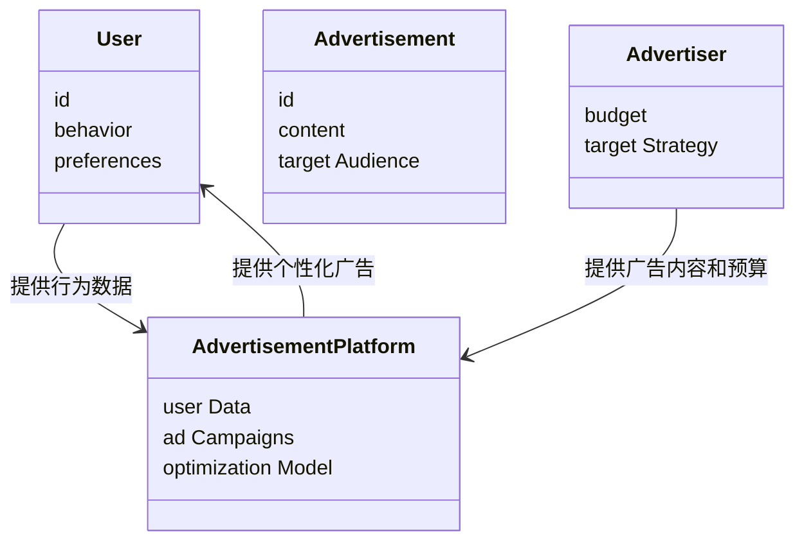
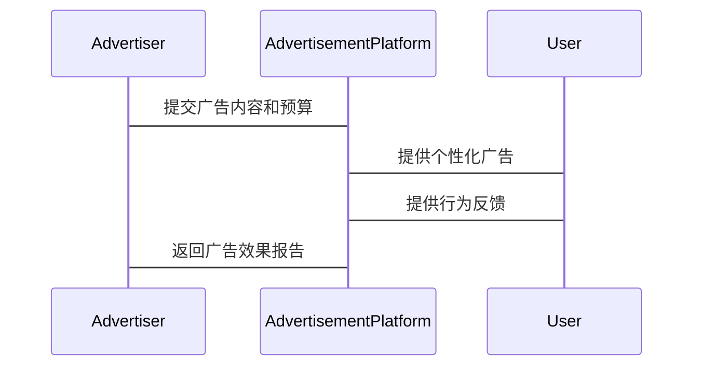

                 


# AI Agent在广告投放中的精准定位

---

## 关键词：AI Agent、广告投放、精准定位、机器学习、用户行为分析、多臂老虎机算法、上下文 Bandit 算法

---

## 摘要

在数字化广告时代，精准定位用户需求是广告投放的核心目标。AI Agent（人工智能代理）作为一种智能体，能够通过数据驱动的决策和自动化执行机制，实现广告投放的精准定位。本文将从背景、原理、算法、系统架构到项目实战，全面解析AI Agent在广告投放中的应用，探讨其在精准定位中的优势与挑战。通过理论与实践结合，为读者提供深入的技术见解和实际操作指南。

---

# 第1章: 广告投放的背景与AI Agent的应用价值

## 1.1 广告投放的现状与挑战

### 1.1.1 广告投放的传统模式

传统的广告投放依赖于人工分析和规则设定，广告主根据历史数据和经验判断，选择目标受众和投放策略。这种方式效率低下，且难以应对用户行为的复杂性和多样性。

### 1.1.2 广告投放的主要问题

1. **用户行为复杂**：用户的兴趣和需求动态变化，传统投放难以实时捕捉和响应。
2. **数据量大且分散**：广告投放涉及多维度数据，包括用户行为、点击率、转化率等，数据处理难度大。
3. **投放效果难优化**：传统投放策略难以实时调整，难以最大化广告效果。

### 1.1.3 AI Agent的应用价值

AI Agent能够实时分析用户行为数据，动态调整广告策略，实现精准定位和个性化推荐，显著提升广告投放的效果和效率。

## 1.2 AI Agent的核心概念

### 1.2.1 AI Agent的定义

AI Agent是一种智能体，能够感知环境、做出决策并执行操作。在广告投放中，AI Agent通过分析用户行为数据，优化广告内容和投放策略。

### 1.2.2 AI Agent的核心特征

1. **感知能力**：能够实时采集和分析用户行为数据。
2. **决策能力**：基于数据，动态优化广告策略。
3. **执行能力**：通过API或其他接口，自动执行广告投放操作。

### 1.2.3 AI Agent与传统广告投放的对比

| 特性                | 传统广告投放                          | AI Agent广告投放                          |
|---------------------|---------------------------------------|-------------------------------------------|
| 数据处理能力        | 依赖人工分析，处理效率低              | 实时数据处理，自动化决策                  |
| 精准度              | 精准度有限，难以应对复杂需求          | 高度精准，动态优化策略                    |
| 效率                | 效率低下，难以快速响应                | 高效，实时调整策略，提升效果              |

---

## 1.3 本章小结

本章介绍了广告投放的传统模式和面临的挑战，以及AI Agent在广告投放中的应用价值。通过对比分析，展示了AI Agent在精准定位和效率提升方面的优势。

---

# 第2章: AI Agent在广告投放中的核心概念

## 2.1 AI Agent的感知机制

### 2.1.1 数据采集与处理

AI Agent通过多种渠道（如网站、APP、API）采集用户行为数据，包括点击、浏览、搜索等，并通过数据清洗和特征提取，形成可供分析的结构化数据。

### 2.1.2 用户行为分析

通过机器学习算法（如聚类分析、关联规则挖掘），AI Agent能够识别用户的兴趣偏好和行为模式，为精准定位提供依据。

### 2.1.3 广告内容理解

AI Agent能够解析广告内容的语义信息，理解广告的主题、关键词和目标受众，从而优化广告投放策略。

---

## 2.2 AI Agent的决策机制

### 2.2.1 决策模型的构建

AI Agent基于用户行为数据和广告内容信息，构建多目标优化模型，综合考虑点击率、转化率、用户满意度等多个目标。

### 2.2.2 多目标优化策略

通过强化学习算法（如多臂老虎机算法），AI Agent能够在多个目标之间找到平衡点，实现广告策略的最优配置。

### 2.2.3 决策结果的评估

AI Agent通过A/B测试和实时反馈机制，评估广告策略的效果，并根据评估结果动态调整决策模型。

---

## 2.3 AI Agent的执行机制

### 2.3.1 广告投放策略的制定

AI Agent根据决策模型的结果，制定广告投放策略，包括投放渠道、投放时间、广告内容等。

### 2.3.2 投放效果的实时监控

通过实时数据分析和反馈机制，AI Agent能够监控广告投放的效果，并根据数据反馈优化投放策略。

### 2.3.3 自适应优化算法

AI Agent通过强化学习和在线优化算法（如上下文 Bandit 算法），实现广告策略的自适应优化。

---

## 2.4 核心概念对比分析

### 2.4.1 AI Agent与其他广告定位技术的对比

| 技术                | 基于规则的定位                        | 基于机器学习的定位                      | AI Agent定位                            |
|---------------------|---------------------------------------|-------------------------------------------|------------------------------------------|
| 定位方式            | 人工设定规则                          | 数据驱动的自动学习                      | 实时感知与动态调整                      |
| 精准度              | 精准度有限，难以应对复杂需求          | 精准度较高，但依赖数据质量                | 高度精准，动态优化策略                  |
| 灵活性              | 灵活性低，难以快速响应变化            | 灵活性较高，但需要大量数据训练            | 灵活性最高，实时适应需求                |

---

## 2.5 本章小结

本章详细介绍了AI Agent在广告投放中的核心概念，包括感知、决策和执行机制，并与其他广告定位技术进行了对比分析，展示了AI Agent在精准定位和动态优化方面的优势。

---

# 第3章: AI Agent的算法原理

## 3.1 多臂老虎机算法

### 3.1.1 多臂老虎机算法的基本原理

多臂老虎机算法是一种经典的强化学习算法，适用于多臂选择问题。其核心思想是在有限的尝试中，找到收益最大的臂。

### 3.1.2 算法的数学模型

$$ UCB1 算法公式：$$
$$ \text{UCB}(i) = \frac{\text{奖赏} + \sqrt{2 \ln t / n_i}}{n_i} $$
其中，$n_i$ 表示第$i$个臂被选择的次数，$t$ 表示总尝试次数。

### 3.1.3 算法实现

```python
import numpy as np

def ucb1_algorithm(num_arms, num_rounds):
    arms = num_arms
    rounds = num_rounds
    rewards = np.zeros(arms)
    counts = np.zeros(arms)
    for t in range(rounds):
        max_upper_bound = -1
        best_arm = 0
        for i in range(arms):
            if counts[i] == 0:
                upper_bound = float('inf')
            else:
                upper_bound = rewards[i] + np.sqrt(2 * np.log(t+1) / counts[i])
            if upper_bound > max_upper_bound:
                max_upper_bound = upper_bound
                best_arm = i
        counts[best_arm] += 1
        # 假设 reward 是根据实际广告效果生成的
        reward = np.random.uniform(0, 1)
        rewards[best_arm] += reward
    return rewards, counts

# 示例
rewards, counts = ucb1_algorithm(5, 100)
print("Rewards:", rewards)
print("Counts:", counts)
```

---

## 3.2 上下文 Bandit 算法

### 3.2.1 上下文 Bandit 算法的基本原理

上下文 Bandit 算法是一种结合了上下文信息的多臂老虎机算法，能够根据用户特征（如年龄、性别、兴趣等）动态调整广告策略。

### 3.2.2 算法的数学模型

$$ 上下文 Bandit 算法的奖励模型：$$
$$ p(i|c) = \frac{\exp(\theta_i^T c)}{\sum_j \exp(\theta_j^T c)} $$
其中，$c$ 是用户特征向量，$\theta_i$ 是广告$i$的参数。

### 3.2.3 算法实现

```python
import numpy as np

def contextual_bandit_algorithm(users, arms, rounds):
    theta = np.random.randn(arms, 2)  # 每个广告有两个特征
    rewards = np.zeros((users, arms))
    counts = np.zeros((users, arms))
    for u in range(users):
        c = np.random.randn(2)  # 用户特征向量
        max_prob = -1
        best_arm = 0
        for i in range(arms):
            prob = np.exp(theta[i].T.dot(c)) / np.sum([np.exp(theta[j].T.dot(c)) for j in range(arms)])
            if prob > max_prob:
                max_prob = prob
                best_arm = i
        counts[u][best_arm] += 1
        # 假设 reward 是根据实际广告效果生成的
        reward = np.random.uniform(0, 1)
        rewards[u][best_arm] += reward
    return rewards, counts

# 示例
rewards, counts = contextual_bandit_algorithm(10, 5, 100)
print("Rewards:", rewards)
print("Counts:", counts)
```

---

## 3.3 本章小结

本章详细介绍了AI Agent在广告投放中常用的两种算法：多臂老虎机算法和上下文 Bandit 算法，并通过Python代码展示了算法的实现过程。

---

# 第4章: 系统分析与架构设计

## 4.1 广告投放的场景介绍

广告投放系统通常包括广告发布者、广告平台、用户等多个角色，需要实时处理大量的用户行为数据和广告内容信息。

---

## 4.2 系统功能设计

### 4.2.1 领域模型（Mermaid 类图）



### 4.2.2 系统架构设计（Mermaid 架构图）


---

## 4.3 系统接口设计

### 4.3.1 API 接口

1. `get_user_behavior()`：获取用户行为数据
2. `optimize_ad_strategy()`：优化广告投放策略
3. `submitAdvertisement()`：提交广告内容

---

## 4.4 系统交互流程图（Mermaid 序列图）



---

## 4.5 本章小结

本章通过系统分析与架构设计，展示了AI Agent在广告投放中的应用场景和系统实现的可行性。

---

# 第5章: 项目实战

## 5.1 环境安装

1. 安装Python和必要的库：
   ```bash
   pip install numpy matplotlib scikit-learn
   ```

2. 安装广告投放平台API：
   ```bash
   pip install advertising-api
   ```

---

## 5.2 核心代码实现

### 5.2.1 数据预处理

```python
import pandas as pd

# 假设我们有一个用户行为数据集
data = pd.read_csv('user_behavior.csv')
data.head()
```

### 5.2.2 模型训练

```python
from sklearn.linear_model import LogisticRegression

# 假设我们有一个分类任务，如点击率预测
X = data[['age', 'gender', 'interest']]
y = data['click']
model = LogisticRegression().fit(X, y)
```

### 5.2.3 广告推荐

```python
def recommend_advertisement(user_features):
    # 预测点击概率
    prob = model.predict_proba(user_features)[0][1]
    if prob > 0.5:
        return "推荐广告A"
    else:
        return "不推荐广告A"
```

---

## 5.3 实际案例分析

### 5.3.1 案例背景

某广告主希望通过AI Agent优化其广告投放策略，目标是提高广告点击率和转化率。

### 5.3.2 数据分析与优化

通过分析用户行为数据，AI Agent发现特定时间段内年轻用户的点击率较高，因此优化广告投放时间，提升广告效果。

---

## 5.4 本章小结

本章通过项目实战，展示了AI Agent在广告投放中的具体实现过程和实际应用效果。

---

# 第6章: 总结与扩展

## 6.1 本章总结

本文详细介绍了AI Agent在广告投放中的精准定位方法，从背景、原理、算法到系统设计和项目实战，全面解析了AI Agent的优势和应用价值。

## 6.2 最佳实践 Tips

1. 数据是关键，确保数据质量和多样性。
2. 算法选择要根据实际场景，灵活调整。
3. 实时反馈和动态优化是提升效果的核心。

## 6.3 注意事项

1. 避免过度依赖单一算法，需结合业务场景。
2. 数据隐私和用户隐私需严格保护。

## 6.4 拓展阅读

1. 《强化学习导论》
2. 《广告投放与用户行为分析》
3. 《机器学习在广告中的应用》

---

# 作者：AI天才研究院/AI Genius Institute & 禅与计算机程序设计艺术 /Zen And The Art of Computer Programming

---

**本文通过系统性地分析AI Agent在广告投放中的应用，从理论到实践，为读者提供了一套完整的解决方案和实现指南。**

