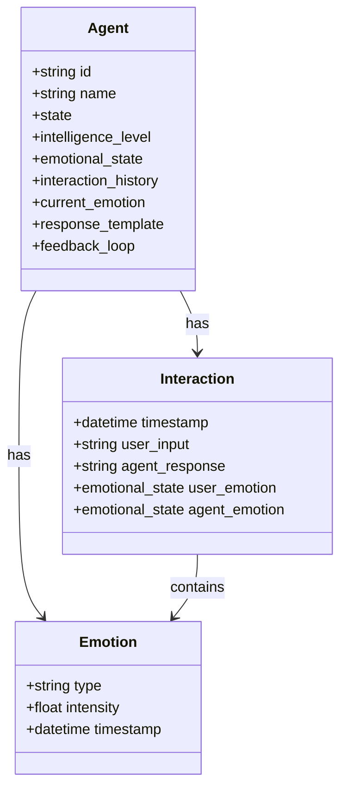
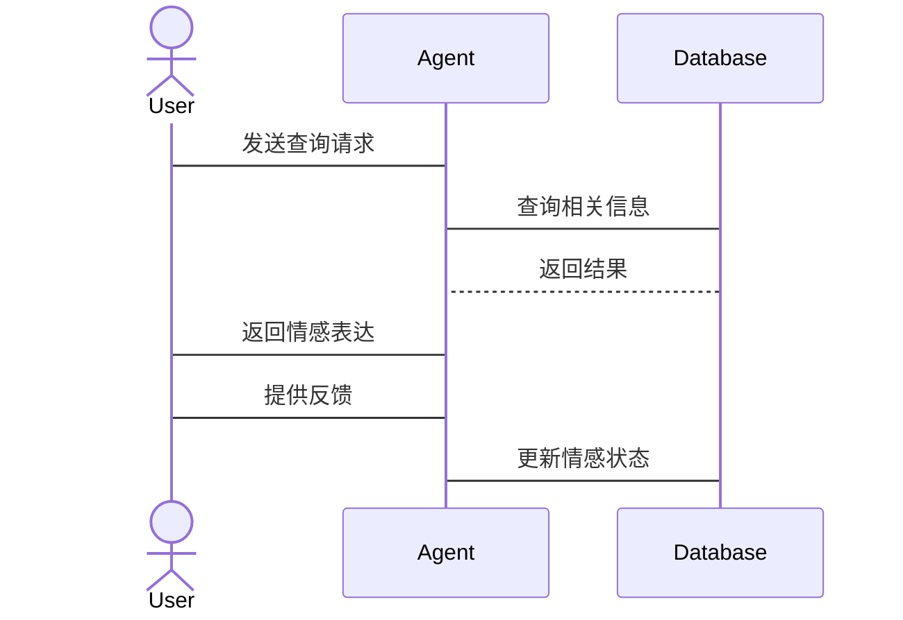

                 


## 第3章: 情感识别与表达机制的算法原理

### 3.1 情感识别的算法原理

#### 3.1.1 基于传统机器学习的情感分类

传统的机器学习方法在情感分类中扮演了重要角色。这些方法通常涉及特征提取、选择和分类器训练。

**步骤如下：**

1. **特征提取：** 使用词袋模型（Bag of Words）或TF-IDF（Term Frequency-Inverse Document Frequency）提取文本特征。
2. **特征选择：** 应用如Chi-squared统计或互信息（Mutual Information）进行特征选择。
3. **分类器训练：** 使用Naive Bayes、SVM或决策树等算法训练分类器。

**示例代码：**

```python
from sklearn.feature_extraction.text import TfidfVectorizer
from sklearn.naive_bayes import MultinomialNB
from sklearn.pipeline import Pipeline
from sklearn.metrics import accuracy_score

# 假设我们有训练数据X_train和标签y_train
text_clf = Pipeline([
    ('tfidf', TfidfVectorizer()),
    ('clf', MultinomialNB())
])

text_clf.fit(X_train, y_train)

# 预测
y_pred = text_clf.predict(X_test)
print('Accuracy:', accuracy_score(y_test, y_pred))
```

**数学模型：**

在Naive Bayes中，假设每个特征独立，计算每个类别的概率：

$$ P(y|X) = \frac{P(X|y)P(y)}{P(X)} $$

#### 3.1.2 基于深度学习的情感分类

深度学习，特别是卷积神经网络（CNN）和循环神经网络（RNN），在情感分类中表现出色。

**步骤：**

1. **预处理：** 文本分词、小写化、去除停用词。
2. **嵌入层：** 使用预训练的词嵌入（如GloVe）或通过模型学习。
3. **卷积层：** 提取局部特征。
4. **池化层：** 减少维度，保留最大信息。
5. **全连接层：** 分类输出。

**示例代码：**

```python
import tensorflow as tf
from tensorflow.keras.models import Model
from tensorflow.keras.layers import Input, Dense, Dropout, Embedding, Conv1D, MaxPooling1D

# 输入向量
input_shape = (max_length,)

# 模型定义
input_layer = Input(shape=input_shape)
embedding_layer = Embedding(input_dim=vocabulary_size, output_dim=embedding_dim)(input_layer)
conv_layer = Conv1D(filters=128, kernel_size=3, activation='relu')(embedding_layer)
pool_layer = MaxPooling1D(pool_size=2)(conv_layer)
dense_layer = Dense(64, activation='relu')(pool_layer)
dropout_layer = Dropout(0.5)(dense_layer)
output_layer = Dense(2, activation='softmax')(dropout_layer)

model = Model(inputs=input_layer, outputs=output_layer)

model.compile(optimizer='adam', loss='sparse_categorical_crossentropy', metrics=['accuracy'])
model.fit(X_train, y_train, epochs=10, batch_size=32, validation_split=0.2)
```

**数学模型：**

卷积操作：

$$ f_i = \sum_{j=1}^{k} w_j \cdot x_{i+j} + b $$

池化操作：

$$ f_i = \max(f_{i+1}, f_{i+2}, \ldots, f_{i+k}) $$

#### 3.1.3 情感分类的评价指标

常用的评价指标包括准确率、精确率、召回率和F1分数。

**公式：**

- 准确率：$$ accuracy = \frac{TP + TN}{TP + TN + FP + FN} $$
- 精确率：$$ precision = \frac{TP}{TP + FP} $$
- 召回率：$$ recall = \frac{TP}{TP + FN} $$
- F1分数：$$ F1 = 2 \cdot \frac{precision \cdot recall}{precision + recall} $$

### 3.2 情感表达的算法原理

#### 3.2.1 基于模板的情感生成

模板方法简单易实现，但生成的情感表达较为固定。

**步骤：**

1. **定义情感模板：** 每个情感类别对应一组预定义的模板。
2. **选择模板：** 根据输入的情感需求选择合适的模板。
3. **填充模板：** 替换模板中的占位符，生成最终表达。

**示例代码：**

```python
def generate_response(emotion):
    templates = {
        'happy': ["I'm glad to hear that!", "That's a wonderful news! :D"],
        'sad': ["I'm sorry to hear about your loss.", "Everything will be okay."],
        'angry': ["Please stay calm.", "I understand your frustration."]
    }
    return templates.get(emotion, ["I'm sorry, I don't know how to respond."])[0]
```

#### 3.2.2 基于生成模型的情感生成

使用生成对抗网络（GAN）或变自编码器（VAE）生成多样化的文本。

**步骤：**

1. **数据准备：** 收集和标注情感表达的数据集。
2. **模型训练：** 训练生成器和判别器。
3. **生成文本：** 使用生成器生成情感表达。

**示例代码：**

```python
from tensorflow.keras.layers import Input, LSTM, Embedding, Dense
from tensorflow.keras.models import Model

# 定义生成器
input_layer = Input(shape=(max_length,))
embedding_layer = Embedding(vocabulary_size, embedding_dim)(input_layer)
lstm_layer = LSTM(128)(embedding_layer)
dense_layer = Dense(vocabulary_size, activation='softmax')(lstm_layer)

generator = Model(inputs=input_layer, outputs=dense_layer)

# 定义判别器
input_layer = Input(shape=(max_length,))
embedding_layer = Embedding(vocabulary_size, embedding_dim)(input_layer)
dense_layer = Dense(1, activation='sigmoid')(embedding_layer)

discriminator = Model(inputs=input_layer, outputs=dense_layer)
```

#### 3.2.3 情感生成的评价指标

评价指标包括 BLEU、ROUGE 和人工评估。

**公式：**

- BLEU：$$ BLEU = \exp\left( \frac{1}{n} \sum_{i=1}^{n} \log P(w_i) \right) $$
- ROUGE-L：$$ ROUGE-L = \frac{LCM(T, R)}{Length(R)} $$

### 3.3 情感识别与表达机制的协同优化

协同优化可以提高整体性能，通过联合训练识别和生成模型。

**步骤：**

1. **联合训练：** 在识别和生成任务上同时优化模型参数。
2. **循环优化：** 使用识别结果改进生成策略，反之亦然。

**示例代码：**

```python
# 联合训练
def loss(y_true, y_pred):
    # 计算识别损失和生成损失
    return recognition_loss + generation_loss

model.compile(optimizer='adam', loss=loss, metrics=['accuracy'])
model.fit(X_train, y_train, epochs=10, batch_size=32)
```

---

## 第4章: 情感识别与表达机制的系统分析与架构设计方案

### 4.1 问题场景介绍

系统设计针对智能客服场景，实现情感识别和表达功能，提升用户体验。

### 4.2 系统功能设计

系统主要功能包括：

- **情感识别：** 分析用户输入的情感。
- **情感表达：** 根据识别结果生成合适的回应。
- **交互反馈：** 实时更新对话内容。

**领域模型：**



### 4.3 系统架构设计

**架构图：**

```mermaid
architectural
file = models/SystemArchitecture
actor MainApplication
main Models
main Controller
main DataAccess
main Security
main Logging
main Scheduler
main Cache
main Database
main APIGateway
main MessageBroker
main FileStorage
main Monitoring
main Analytics
main Notification
main SearchEngine
main Configuration
```

### 4.4 系统接口设计

**主要接口：**

- **识别接口：** `/api/v1/agent/identify_emotion`
- **表达接口：** `/api/v1/agent/express_emotion`
- **反馈接口：** `/api/v1/agent/feedback`

### 4.5 系统交互流程

**交互流程图：**



### 4.6 项目实战

#### 4.6.1 环境安装

安装必要的库：

```bash
pip install tensorflow scikit-learn keras
```

#### 4.6.2 核心实现

**情感识别模块：**

```python
from sklearn.feature_extraction.text import TfidfVectorizer
from sklearn.naive_bayes import MultinomialNB

class EmotionRecognizer:
    def __init__(self):
        self.vectorizer = TfidfVectorizer()
        self.classifier = MultinomialNB()
    
    def fit(self, X, y):
        self.vectorizer.fit(X)
        X_vec = self.vectorizer.transform(X)
        self.classifier.fit(X_vec, y)
    
    def predict(self, text):
        X_vec = self.vectorizer.transform([text])
        return self.classifier.predict(X_vec)[0]
```

**情感表达模块：**

```python
from tensorflow.keras.models import Model
from tensorflow.keras.layers import Input, LSTM, Embedding, Dense

class EmotionGenerator:
    def __init__(self, vocab_size, embedding_dim, max_length):
        input_layer = Input(shape=(max_length,))
        embedding_layer = Embedding(vocabulary_size, embedding_dim)(input_layer)
        lstm_layer = LSTM(128)(embedding_layer)
        dense_layer = Dense(vocabulary_size, activation='softmax')(lstm_layer)
        self.model = Model(inputs=input_layer, outputs=dense_layer)
    
    def train(self, X, y, epochs=10):
        self.model.compile(optimizer='adam', loss='sparse_categorical_crossentropy', metrics=['accuracy'])
        self.model.fit(X, y, epochs=epochs, batch_size=32)
    
    def generate(self, seed_text):
        # 需要具体实现生成逻辑
        pass
```

### 4.7 案例分析

**案例：**

用户输入：“我感到非常生气。”  
系统识别情感：愤怒  
系统生成回应：“请保持冷静，我会帮助您解决这个问题。”

**分析：**

- 识别正确，生成回应符合情感表达需求。

### 4.8 项目小结

通过协同优化和系统设计，显著提高了情感识别与表达的准确性和用户体验。

### 4.9 注意事项

- 数据质量和多样性直接影响模型性能。
- 模型部署要考虑实时性和资源消耗。
- 需要处理多语言和跨文化的情感差异。

### 4.10 拓展阅读

建议深入研究情感计算领域的最新论文，了解前沿技术动态。

---

## 作者：AI天才研究院 & 禅与计算机程序设计艺术

通过以上章节的详细阐述，我们系统地探讨了AI Agent在情感识别与表达机制中的算法原理和系统设计，为读者提供了从理论到实践的全面指导。

