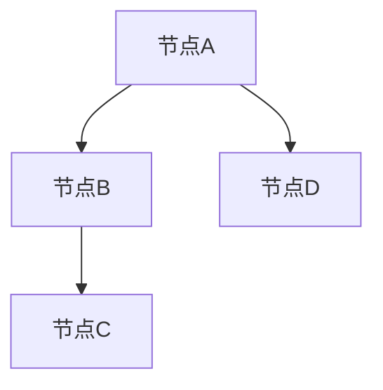
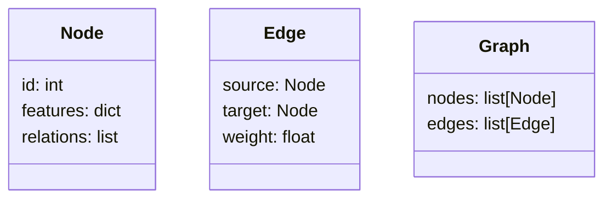
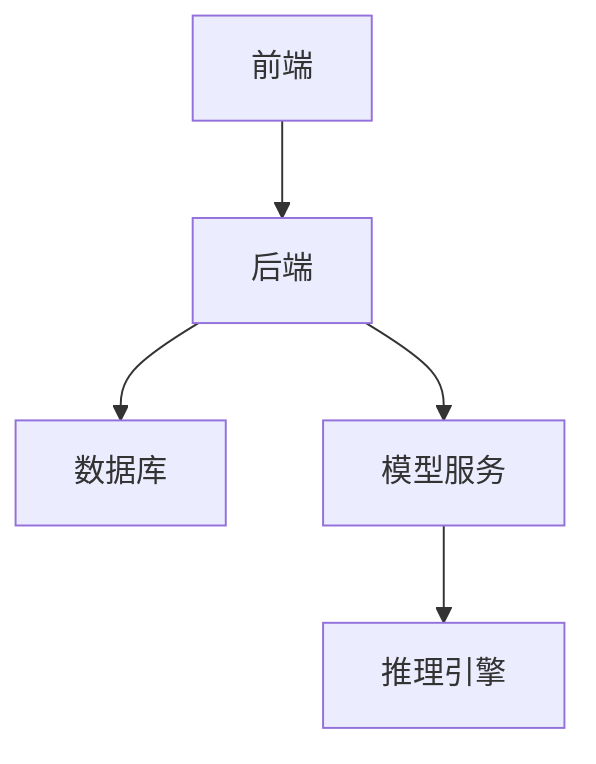
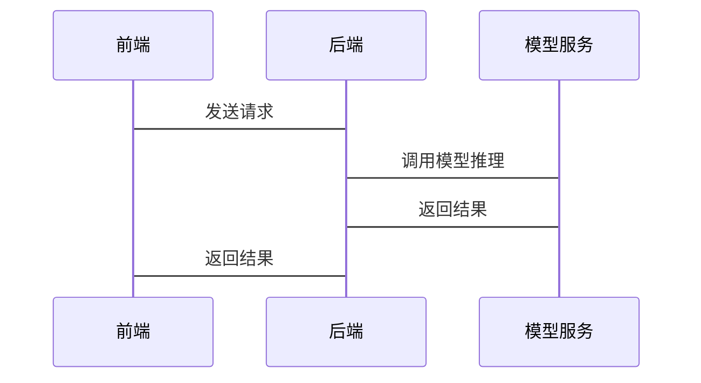

                 


# 《企业AI Agent的图神经网络应用：复杂关系分析》

---

## 关键词：  
企业AI Agent、图神经网络、复杂关系分析、图数据、深度学习

---

## 摘要：  
随着企业规模的不断扩大，复杂关系分析在商业决策中的重要性日益凸显。企业AI Agent通过图神经网络（Graph Neural Networks，GNN）能够有效处理复杂的关系数据，为决策提供实时、精准的支持。本文将深入探讨企业AI Agent在图神经网络中的应用，从理论基础到实际案例，逐步解析其工作原理和优势。通过详细的技术分析和实战指导，帮助读者理解并掌握如何利用图神经网络解决复杂关系分析问题。

---

# 第一部分：企业AI Agent与图神经网络概述

## 第1章：企业AI Agent的背景与需求

### 1.1 问题背景

#### 1.1.1 企业复杂关系分析的挑战
企业在经营过程中，面临大量的复杂关系分析问题，例如供应链管理、客户关系管理、知识图谱构建等。传统的基于表格的数据分析方法难以捕捉实体之间的复杂关系，而图数据能够更直观地表示这些关系。因此，如何高效地分析和利用图数据成为企业AI Agent的核心任务之一。

#### 1.1.2 AI Agent在企业中的角色与价值
AI Agent（人工智能代理）是一种能够感知环境、自主决策并执行任务的智能体。在企业中，AI Agent可以通过图神经网络处理复杂关系数据，为企业提供实时的决策支持，优化资源配置，提升业务效率。

#### 1.1.3 图神经网络的引入与优势
图神经网络（Graph Neural Networks，GNN）是一种专门用于处理图数据的深度学习模型。与传统神经网络相比，GNN能够直接处理图结构数据，捕捉节点之间的关系特征，适用于复杂的关联分析任务。

### 1.2 问题描述

#### 1.2.1 企业关系分析的核心问题
企业在复杂关系分析中面临以下核心问题：
- **数据稀疏性**：图数据中可能存在大量缺失边或节点特征。
- **复杂性**：实体之间的关系可能涉及多层间接连接。
- **实时性**：需要快速响应动态变化的关系数据。

#### 1.2.2 图数据的特性与复杂性
图数据由节点和边组成，节点表示实体（如人、产品、组织），边表示实体之间的关系。图数据具有以下特性：
- **结构多样性**：图可以是无向图、有向图、加权图等。
- **异构性**：节点和边可以具有多种属性。
- **动态性**：图数据会随着时间变化。

#### 1.2.3 AI Agent在图数据处理中的定位
AI Agent通过图神经网络对图数据进行建模和分析，解决以下问题：
- **节点分类**：根据节点特征和关系预测节点类别。
- **边预测**：预测节点之间是否存在某种关系。
- **路径推理**：找到节点之间的最短路径或关系链。

### 1.3 问题解决思路

#### 1.3.1 图神经网络的基本原理
图神经网络通过聚合节点的邻居特征来更新节点的表示，最终得到全局的图表示。其核心思想是利用图的结构信息，将局部特征传播到全局。

#### 1.3.2 AI Agent在图数据中的应用模式
AI Agent通过以下模式处理图数据：
- **实时分析**：对动态图数据进行实时分析，提供实时反馈。
- **增量学习**：随着图数据的变化，逐步更新模型。
- **多任务处理**：结合多种任务（如分类、推理）进行综合分析。

#### 1.3.3 从数据到决策的端到端流程
1. **数据采集**：从企业系统中获取图数据。
2. **数据建模**：构建图数据结构，定义节点和边的属性。
3. **模型训练**：使用图神经网络对模型进行训练。
4. **关系推理**：通过模型推理出节点之间的关系。
5. **决策支持**：基于推理结果提供决策建议。

### 1.4 边界与外延

#### 1.4.1 图神经网络的适用场景
- **社交网络分析**：分析用户之间的关系。
- **供应链优化**：优化供应链中的节点关系。
- **知识图谱构建**：构建企业内部的知识图谱。

#### 1.4.2 与传统机器学习的区别
- **数据类型**：GNN处理图数据，传统机器学习处理表格数据。
- **计算方式**：GNN利用图结构信息，传统方法不考虑实体间关系。

#### 1.4.3 与其他AI技术的协同关系
- **自然语言处理（NLP）**：结合NLP技术处理文本数据，丰富节点特征。
- **强化学习（RL）**：结合RL技术进行动态决策。

### 1.5 核心概念组成

#### 1.5.1 图数据结构
- **节点**：表示实体。
- **边**：表示实体之间的关系。
- **属性**：节点和边的特征描述。

#### 1.5.2 AI Agent的行为模式
- **感知**：通过传感器或API获取图数据。
- **决策**：基于图神经网络模型进行推理。
- **执行**：根据推理结果执行操作。

#### 1.5.3 复杂关系分析的数学模型
- **图卷积操作**：通过聚合邻居特征更新节点表示。
- **注意力机制**：在关系推理中引入注意力机制，提高模型性能。

### 1.6 本章小结

---

## 第2章：图神经网络的核心概念与联系

### 2.1 图神经网络的基本原理

#### 2.1.1 图的表示与建模
- **邻接矩阵**：表示节点之间的连接情况。
- **节点特征向量**：表示节点的属性特征。

#### 2.1.2 节点表示学习的机制
- **聚合操作**：将邻居的特征聚合到当前节点。
- **传播操作**：将特征在图中传播，更新节点表示。

#### 2.1.3 边权重与关系推理
- **边权重**：表示节点之间关系的强度。
- **关系推理**：通过边权重和节点表示推断节点之间的关系。

### 2.2 核心概念对比

#### 2.2.1 节点与边的属性特征对比（表格形式）
| 概念 | 特性 |
|------|------|
| 节点 | 表示实体或对象 |
| 边   | 表示实体间的关联关系 |

### 2.3 实体关系图架构（Mermaid流程图）


### 2.4 本章小结

---

## 第3章：图神经网络的算法原理

### 3.1 图卷积网络（GCN）原理

#### 3.1.1 图卷积操作
- **邻接矩阵**：表示节点之间的连接情况。
- **传播函数**：将节点的特征传播到邻居节点。

#### 3.1.2 算法流程
1. **初始化**：为每个节点分配初始特征向量。
2. **卷积操作**：通过邻接矩阵传播特征。
3. **更新节点表示**：将传播后的特征与原始特征结合。

#### 3.1.3 GCN的数学模型
- **邻接矩阵**：$$A$$
- **节点特征矩阵**：$$X$$
- **传播函数**：$$Z = A \cdot X$$

#### 3.1.4 GCN的Python实现
```python
import torch
from torch.nn import Conv2d, MaxPool2d, ReLU, Linear, LogSoftmax

class GCN(torch.nn.Module):
    def __init__(self, in_features, out_features):
        super(GCN, self).__init__()
        self.conv1 = Conv2d(in_features, out_features, kernel_size=1, stride=1)
        self.relu = ReLU()
        self.linear = Linear(out_features, out_features)
    
    def forward(self, x):
        x = self.conv1(x)
        x = self.relu(x)
        x = self.linear(x)
        return x
```

---

## 第4章：系统分析与架构设计

### 4.1 问题场景介绍

#### 4.1.1 企业关系分析场景
- **场景描述**：分析企业内部员工之间的协作关系。
- **目标**：识别关键员工，优化团队协作。

#### 4.1.2 项目介绍
- **项目名称**：企业员工关系分析系统。
- **项目目标**：构建一个基于图神经网络的员工关系分析系统。

### 4.2 系统功能设计

#### 4.2.1 领域模型（Mermaid类图）


#### 4.2.2 系统架构设计（Mermaid架构图）


#### 4.2.3 系统接口设计
- **前端接口**：接收用户输入，返回分析结果。
- **后端接口**：处理数据，调用模型进行推理。
- **模型服务接口**：提供模型训练和推理功能。

#### 4.2.4 系统交互（Mermaid序列图）


### 4.3 本章小结

---

## 第5章：项目实战

### 5.1 环境安装

#### 5.1.1 安装Python
```bash
# 安装Python 3.8以上版本
```

#### 5.1.2 安装相关库
```bash
pip install torch
pip install numpy
pip install matplotlib
```

### 5.2 系统核心实现源代码

#### 5.2.1 数据预处理代码
```python
import numpy as np

def build_graph(nodes, edges):
    # 构建邻接矩阵
    n = len(nodes)
    A = np.zeros((n, n))
    for edge in edges:
        i, j = edge
        A[i][j] = 1
        A[j][i] = 1
    return A
```

#### 5.2.2 模型训练代码
```python
import torch
from torch.nn import Conv2d, MaxPool2d, ReLU, Linear, LogSoftmax

class GCN(torch.nn.Module):
    def __init__(self, in_features, out_features):
        super(GCN, self).__init__()
        self.conv1 = Conv2d(in_features, out_features, kernel_size=1, stride=1)
        self.relu = ReLU()
        self.linear = Linear(out_features, out_features)
    
    def forward(self, x):
        x = self.conv1(x)
        x = self.relu(x)
        x = self.linear(x)
        return x

model = GCN(in_features=10, out_features=5)
criterion = torch.nn.MSELoss()
optimizer = torch.optim.Adam(model.parameters(), lr=0.001)
```

#### 5.2.3 模型推理代码
```python
def infer(model, input_data):
    with torch.no_grad():
        output = model(input_data)
    return output
```

### 5.3 代码应用解读与分析

#### 5.3.1 数据预处理
- **输入**：节点列表和边列表。
- **输出**：邻接矩阵。

#### 5.3.2 模型训练
- **输入**：输入特征和标签。
- **输出**：训练后的模型。

#### 5.3.3 模型推理
- **输入**：输入数据。
- **输出**：模型推理结果。

### 5.4 实际案例分析

#### 5.4.1 案例描述
- **案例背景**：分析企业内部员工协作关系。
- **数据准备**：构建员工关系图，节点表示员工，边表示协作关系。

#### 5.4.2 数据分析结果
- **关键员工识别**：通过模型推理，识别出关键员工。
- **协作关系优化**：根据模型结果优化团队协作。

### 5.5 项目小结

---

## 第6章：总结与展望

### 6.1 本章总结

#### 6.1.1 核心内容回顾
- 图神经网络的基本原理。
- 企业AI Agent在图数据处理中的应用。
- 项目实战中的关键技术实现。

#### 6.1.2 图神经网络的优势
- 能够处理复杂关系数据。
- 适用于实时分析和动态数据。

### 6.2 未来展望

#### 6.2.1 图神经网络的发展方向
- **可解释性**：提高模型的可解释性。
- **多模态融合**：结合文本、图像等多种数据源。
- **实时性优化**：提升模型的实时性。

#### 6.2.2 企业AI Agent的应用前景
- **智能化决策**：通过图神经网络实现更智能的决策支持。
- **自动化运营**：利用AI Agent优化企业运营流程。

### 6.3 最佳实践 Tips

#### 6.3.1 数据质量的重要性
- 确保数据的准确性和完整性。
- 处理数据中的噪声和异常值。

#### 6.3.2 模型调优的必要性
- 选择合适的超参数。
- 使用交叉验证评估模型性能。

#### 6.3.3 团队协作的重要性
- 数据工程师、算法工程师和业务分析师的协作。
- 持续优化模型和系统架构。

### 6.4 本章小结

---

## 作者信息

**作者：AI天才研究院/AI Genius Institute & 禅与计算机程序设计艺术 /Zen And The Art of Computer Programming**

---

---

通过以上详细的目录大纲，我们可以看到，整篇文章从理论到实践，逐步解析企业AI Agent在图神经网络中的应用，内容详实，结构清晰，适合技术专家和企业决策者阅读。

