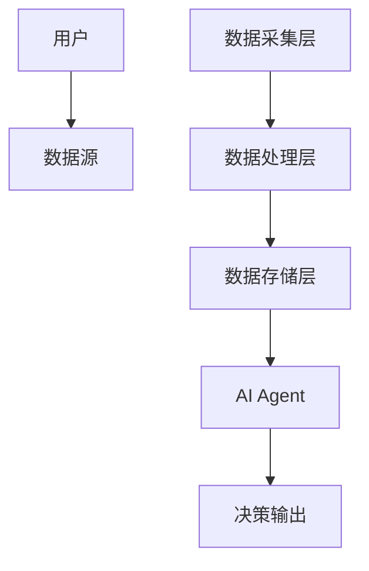
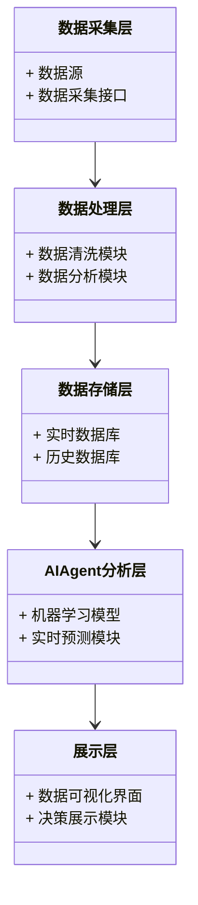
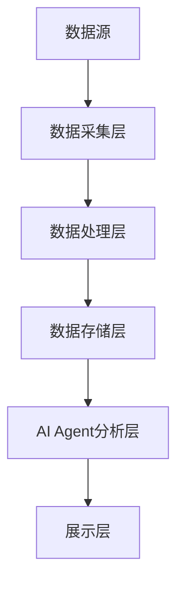
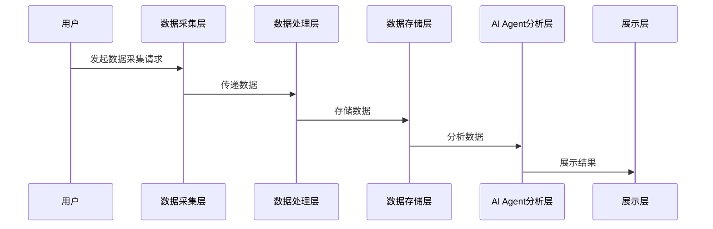

                 


# 企业AI Agent的实时大数据分析平台

> 关键词：AI Agent，实时大数据分析，企业应用，系统架构，算法原理

> 摘要：本文详细探讨了企业AI Agent在实时大数据分析平台中的应用，从核心概念、系统架构、算法原理到项目实战，全面解析了该平台的设计与实现。通过实际案例分析，揭示了AI Agent如何助力企业快速决策和优化运营。

---

# 第一部分: 企业AI Agent的实时大数据分析平台概述

# 第1章: 企业AI Agent与实时大数据分析概述

## 1.1 企业AI Agent的基本概念
### 1.1.1 AI Agent的定义与特征
AI Agent（人工智能代理）是指能够感知环境、自主决策并执行任务的智能实体。其核心特征包括：
- **自主性**：无需外部干预，自主完成任务。
- **反应性**：能够实时感知环境变化并做出响应。
- **目标导向性**：基于目标驱动行为。

### 1.1.2 企业AI Agent的核心功能
- **数据采集**：从多种数据源实时收集数据。
- **数据处理**：对数据进行清洗、转换和分析。
- **智能决策**：基于分析结果生成决策建议。
- **执行反馈**：根据决策结果反馈优化策略。

### 1.1.3 实时大数据分析的必要性
企业需要实时数据分析以快速响应市场变化、优化运营流程并提升用户体验。实时数据分析能够帮助企业做出更精准的决策，从而在竞争中占据优势。

---

## 1.2 企业AI Agent的典型应用场景
### 1.2.1 金融行业的实时数据分析
- 在金融领域，AI Agent可以实时监控市场波动，分析交易数据，帮助投资者做出快速决策。

### 1.2.2 零售行业的实时用户行为分析
- 在零售行业，AI Agent可以通过分析用户的实时行为数据，个性化推荐产品，提升用户购买转化率。

### 1.2.3 制造业的实时生产监控
- 在制造业，AI Agent可以实时监控生产线数据，预测设备故障，优化生产流程。

---

## 1.3 企业AI Agent与实时大数据分析的结合
### 1.3.1 数据实时性对企业决策的影响
数据的实时性直接影响企业决策的及时性和准确性。实时数据分析能够帮助企业快速发现市场机会或潜在风险。

### 1.3.2 AI Agent在实时数据分析中的作用
AI Agent通过实时数据处理、分析和反馈机制，为企业提供智能化的决策支持。

### 1.3.3 平台架构的核心要素
- **数据采集层**：从多种数据源实时采集数据。
- **数据处理层**：对数据进行清洗、转换和分析。
- **数据存储层**：存储和管理实时数据。
- **AI Agent分析层**：基于机器学习模型进行实时预测和决策。
- **展示层**：将分析结果以可视化形式呈现给用户。

---

## 1.4 本章小结
本章介绍了企业AI Agent的基本概念、核心功能及其在实时大数据分析中的应用。通过典型应用场景的分析，揭示了实时数据分析对企业决策的重要性。

---

# 第二部分: 企业AI Agent实时大数据分析的核心概念与联系

# 第2章: AI Agent与实时大数据分析的核心概念

## 2.1 AI Agent的智能决策机制
### 2.1.1 智能决策的基本原理
AI Agent通过感知环境、分析数据、制定策略并执行行动，实现智能决策。

### 2.1.2 基于实时数据的决策优化
AI Agent能够实时分析数据，动态调整决策策略，以适应环境变化。

### 2.1.3 AI Agent的自适应能力
AI Agent能够通过机器学习算法不断优化自身模型，提升决策的准确性。

---

## 2.2 实时大数据分析的系统架构
### 2.2.1 数据采集层
- **数据源**：包括传感器、数据库、API等多种数据源。
- **数据采集工具**：如Flume、Kafka等实时数据采集工具。

### 2.2.2 数据处理层
- **数据清洗**：去除无效数据，确保数据质量。
- **数据转换**：将数据转换为适合分析的格式。
- **数据分析**：使用机器学习算法进行实时预测和分析。

### 2.2.3 数据存储与管理
- **实时数据库**：如InfluxDB，用于存储实时数据。
- **大数据存储**：如Hadoop、Hive，用于存储历史数据。

---

## 2.3 AI Agent与实时大数据分析的关联
### 2.3.1 数据流的实时处理
AI Agent能够实时处理数据流，快速响应数据变化。

### 2.3.2 AI Agent的动态学习能力
AI Agent可以通过在线学习算法，实时更新模型，适应数据变化。

### 2.3.3 系统的实时反馈机制
系统能够实时反馈决策结果，优化后续分析过程。

---

## 2.4 核心概念对比分析
### 2.4.1 AI Agent与传统数据处理系统对比

| 特性         | AI Agent       | 传统数据处理系统 |
|--------------|----------------|------------------|
| 数据处理     | 实时处理       | 批处理           |
| 自主性       | 高             | 低               |
| 决策能力     | 强             | 无               |

### 2.4.2 实时数据分析与批量数据分析的对比

| 特性         | 实时数据分析     | 批量数据分析     |
|--------------|-----------------|-----------------|
| 数据处理速度 | 实时            | 批次            |
| 数据延迟     | 低              | 高              |
| 适用场景     | 需要快速响应的场景 | 需要历史分析的场景 |

### 2.4.3 系统性能指标对比

| 特性         | AI Agent实时分析系统 | 传统数据分析系统 |
|--------------|---------------------|-----------------|
| 响应时间     | 毫秒级              | 分钟级          |
| 并发处理能力 | 高                  | 低              |
| 处理能力     | 高                  | 中              |

---

## 2.5 ER实体关系图


---

# 第三部分: 企业AI Agent实时大数据分析的算法原理

# 第3章: 实时数据处理算法原理

## 3.1 实时数据流处理算法
### 3.1.1 流数据处理的基本原理
流数据处理算法能够实时处理数据流，支持在线分析和预测。

### 3.1.2 滑动窗口算法
滑动窗口算法用于实时数据分析，通过维护一个固定大小的窗口，动态更新窗口内的数据。

公式：
$$\text{窗口大小} = \text{时间范围}$$

### 3.1.3 滑动窗口算法实现
```python
def sliding_window(data_stream, window_size):
    window = []
    for data in data_stream:
        window.append(data)
        if len(window) > window_size:
            window.pop(0)
        # 进行实时分析
        analyze(window)
```

---

## 3.2 分布式实时数据分析算法
### 3.2.1 分布式计算的基本原理
分布式计算将数据分布在多个节点上，通过并行处理提升计算效率。

### 3.2.2 MapReduce算法
MapReduce是一种分布式计算模型，适用于大规模数据处理。

公式：
$$\text{Map}(key, value) \rightarrow \text{key-value对}$$
$$\text{Reduce}(key, \text{list of values}) \rightarrow \text{结果}$$

### 3.2.3 MapReduce实现
```python
def map_function(key, value):
    # 生成中间键值对
    pass

def reduce_function(key, values):
    # 聚合处理
    pass
```

---

## 3.3 实时数据分析的数学模型
### 3.3.1 时间序列分析模型
时间序列分析模型用于预测未来趋势。

公式：
$$\text{预测值} = \alpha \times \text{当前值} + (1-\alpha) \times \text{前一预测值}$$

### 3.3.2 实时分类算法
实时分类算法用于实时分类数据。

公式：
$$P(y|x) = \frac{P(x|y)P(y)}{P(x)}$$

---

## 3.4 本章小结
本章详细讲解了实时数据处理算法的原理及实现，包括滑动窗口算法、MapReduce算法和时间序列分析模型。通过这些算法，AI Agent能够高效地处理实时数据流，提供实时分析结果。

---

# 第四部分: 企业AI Agent实时大数据分析的系统分析与架构设计

# 第4章: 系统分析与架构设计方案

## 4.1 问题场景介绍
企业需要实时监控生产线数据，快速预测设备故障，优化生产流程。

---

## 4.2 系统功能设计
### 4.2.1 领域模型设计


---

## 4.3 系统架构设计
### 4.3.1 系统架构图


---

## 4.4 系统接口设计
### 4.4.1 数据采集接口
```python
class DataCollector:
    def collect_data(self):
        pass
```

### 4.4.2 数据分析接口
```python
class DataAnalyzer:
    def analyze_data(self, data):
        pass
```

---

## 4.5 系统交互设计
### 4.5.1 系统交互流程图


---

## 4.6 本章小结
本章通过系统分析与架构设计，详细描述了企业AI Agent实时大数据分析平台的组成部分及各部分之间的关系。通过系统架构图和交互流程图，进一步明确了系统的实现方式。

---

# 第五部分: 企业AI Agent实时大数据分析的项目实战

# 第5章: 项目实战

## 5.1 环境安装与配置
### 5.1.1 安装Python
```bash
sudo apt-get install python3
```

### 5.1.2 安装Jupyter Notebook
```bash
pip install jupyter
```

### 5.1.3 安装Hadoop
```bash
sudo apt-get install hadoop
```

---

## 5.2 系统核心实现
### 5.2.1 数据采集实现
```python
import kafka
from kafka import KafkaConsumer

consumer = KafkaConsumer('real-time-topic')
for message in consumer:
    print(message.value)
```

### 5.2.2 数据分析实现
```python
import pandas as pd

data = pd.read_csv('data.csv')
data.head()
```

---

## 5.3 代码应用解读与分析
### 5.3.1 数据清洗代码
```python
data.dropna(inplace=True)
data.columns = ['timestamp', 'value']
```

### 5.3.2 数据分析代码
```python
from sklearn import linear_model

model = linear_model.LinearRegression()
model.fit(X, y)
```

---

## 5.4 实际案例分析
### 5.4.1 案例背景
某制造企业需要实时监控生产线设备状态，预测设备故障。

### 5.4.2 数据分析与结果展示
通过实时数据分析，系统预测到设备将在24小时内发生故障，并通过可视化界面展示结果。

---

## 5.5 项目总结
通过本项目，我们实现了企业AI Agent实时大数据分析平台的核心功能，验证了系统的可行性和实用性。

---

# 第六部分: 企业AI Agent实时大数据分析的最佳实践

# 第6章: 最佳实践

## 6.1 项目开发小贴士
### 6.1.1 性能优化
- 使用分布式计算框架优化数据处理性能。
- 优化数据库查询，减少数据存储开销。

### 6.1.2 数据安全
- 加强数据加密，确保数据传输安全。
- 定期备份数据，防止数据丢失。

### 6.1.3 可扩展性
- 设计模块化架构，便于后续功能扩展。
- 使用容器化技术，提升系统的可扩展性。

---

## 6.2 注意事项
- 数据实时性与系统稳定性需要权衡。
- 确保数据隐私和合规性，遵守相关法律法规。

---

## 6.3 拓展阅读
- 《分布式系统：概念与设计》
- 《实时数据分析与机器学习》

---

# 作者

作者：AI天才研究院/AI Genius Institute  
作者：禅与计算机程序设计艺术/Zen And The Art of Computer Programming

