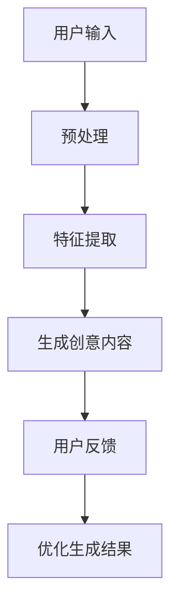
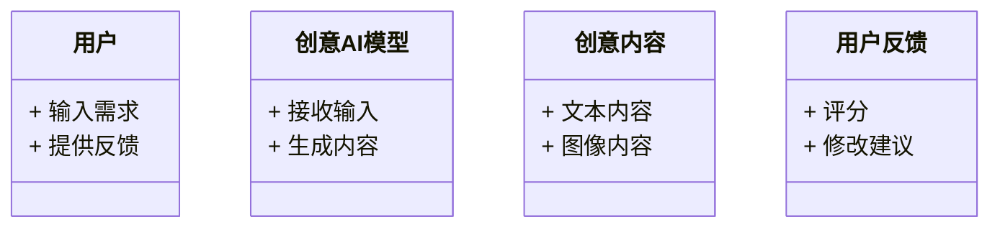
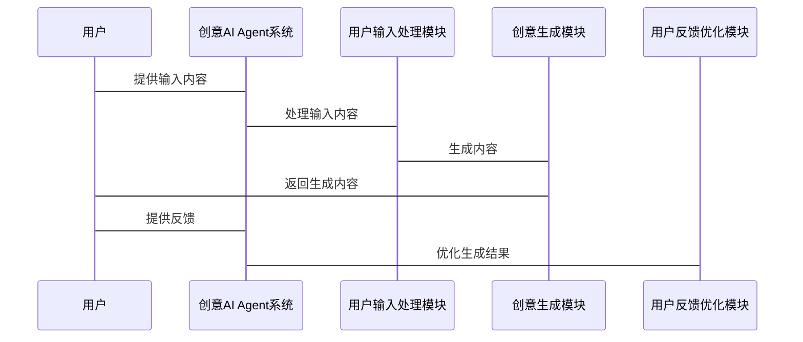

                 


# 创意AI Agent：辅助内容创作与设计

## 关键词：创意AI Agent、内容创作、设计辅助、人工智能、自然语言处理、生成模型

## 摘要：
创意AI Agent是一种基于人工智能技术的工具，旨在通过智能化的方式辅助内容创作和设计。本文将从背景、核心概念、算法原理、系统架构、项目实战等多方面详细探讨创意AI Agent的实现与应用。通过分析其工作原理、应用场景及实际案例，本文将为读者提供一个全面的视角，展示AI技术如何赋能内容创作与设计。

---

# 第1章: 创意AI Agent的背景与概念

## 1.1 创意AI Agent的背景

### 1.1.1 传统内容创作的痛点
在传统的内容创作过程中，创作者往往需要花费大量时间进行市场调研、灵感收集和内容优化。例如，一名写作者需要反复修改文案以满足目标受众的需求，而设计师则需要不断调整视觉元素以达到最佳效果。这些过程不仅耗时，而且效率较低，尤其是在面对复杂的创意需求时，创作者可能会感到力不从心。

### 1.1.2 AI技术如何改变内容创作
人工智能技术的快速发展为内容创作带来了革命性的变化。通过自然语言处理（NLP）、生成对抗网络（GAN）和推荐系统等技术，AI能够帮助创作者快速生成高质量的内容，提供灵感建议，并优化创作流程。例如，AI可以自动分析目标受众的需求，生成符合用户偏好的文案，或者根据输入的草图生成完整的视觉设计。

### 1.1.3 创意AI Agent的核心价值
创意AI Agent的核心价值在于其能够通过智能化的方式辅助创作者完成从灵感收集到最终输出的整个创作过程。它不仅可以提高创作效率，还能降低创作门槛，使更多人能够轻松参与到内容创作中来。

---

## 1.2 创意AI Agent的定义与特点

### 1.2.1 创意AI Agent的定义
创意AI Agent是一种基于人工智能技术的智能助手，它能够根据用户的输入（如关键词、草图或需求描述）生成创意内容，包括文本、图像、音乐等多种形式。通过整合自然语言处理、计算机视觉和推荐算法等技术，创意AI Agent能够理解用户需求，并提供个性化的创作支持。

### 1.2.2 创意AI Agent的核心特点
- **智能化**：通过深度学习算法，AI能够理解用户需求并生成符合预期的内容。
- **个性化**：根据用户的风格和偏好，生成定制化的创意内容。
- **高效性**：快速完成从灵感收集到内容生成的整个过程，显著提高创作效率。
- **可扩展性**：支持多种创作形式，如文本、图像、音乐等。

### 1.2.3 创意AI Agent与传统工具的对比
下表展示了创意AI Agent与传统创作工具的主要区别：

| 特性 | 创意AI Agent | 传统创作工具 |
|------|---------------|---------------|
| 输入 | 文本、草图、需求描述 | 手动输入、绘图工具 |
| 输出 | 自动生成内容 | 需要人工调整和优化 |
| 速度 | 快速生成 | 较慢 |
| 灵活性 | 支持多种创作形式 | 通常只支持单一形式 |

---

## 1.3 创意AI Agent的应用场景

### 1.3.1 写作辅助
创意AI Agent可以为写作者提供灵感建议和文本生成服务。例如，用户输入一个主题，AI Agent可以生成相关的内容大纲或完整的文章。

### 1.3.2 视觉设计
在视觉设计领域，创意AI Agent可以根据用户提供的草图或需求生成完整的视觉设计。例如，用户输入一个简单的草图，AI Agent可以生成符合设计风格的完整图像。

### 1.3.3 音乐创作
创意AI Agent还可以辅助音乐创作，通过分析用户提供的音乐片段，生成符合风格的旋律或和弦。

### 1.3.4 其他创意领域
除了上述领域，创意AI Agent还可以应用于视频剪辑、三维建模等多个创意领域，帮助用户快速完成创作任务。

---

# 第2章: 创意AI Agent的核心概念与联系

## 2.1 创意AI Agent的核心概念

### 2.1.1 感知模块
感知模块是创意AI Agent的核心组成部分之一，负责接收用户的输入并提取特征。例如，当用户输入一段文本时，感知模块需要分析文本的情感、主题和关键词。

### 2.1.2 推理模块
推理模块基于感知模块提取的特征，生成创意建议。例如，当用户输入一个主题时，推理模块可以根据主题生成相关的内容大纲或灵感建议。

### 2.1.3 执行模块
执行模块负责根据推理模块生成的建议，生成最终的创意内容。例如，根据推理模块生成的内容大纲，执行模块可以自动生成完整的文章或设计图像。

### 2.1.4 创意AI Agent的核心流程
创意AI Agent的核心流程可以分为以下几个步骤：
1. 用户输入需求或草稿。
2. 感知模块提取特征。
3. 推理模块生成创意建议。
4. 执行模块生成最终内容。
5. 反馈优化模块根据用户反馈优化生成结果。

### 2.1.5 创意AI Agent的ER实体关系图
以下是创意AI Agent的ER实体关系图：

```mermaid
er
actor: 用户
model: 创意AI模型
content: 创意内容
feedback: 用户反馈
rule: 创意规则
(actor)---(model): 提供输入并触发模型生成
(model)---(content): 模型生成创意内容
(actor)---(content): 用户查看生成内容
(actor)---(feedback): 用户提供反馈
(content)---(rule): 内容
```

---

## 2.2 创意AI Agent的核心要素对比

下表展示了创意AI Agent与传统创作工具在核心要素上的对比：

| 要素 | 创意AI Agent | 传统创作工具 |
|------|---------------|---------------|
| 感知模块 | 文本分析、图像识别 | 手动输入、绘图工具 |
| 推理模块 | 内容推荐、灵感生成 | 需要人工分析 |
| 执行模块 | 自动生成文本、设计草图 | 需要手动调整 |

---

## 2.3 创意AI Agent的ER实体关系图
以下是创意AI Agent的ER实体关系图：

```mermaid
er
actor: 用户
model: 创意AI模型
content: 创意内容
feedback: 用户反馈
rule: 创意规则
(actor)---(model): 提供输入并触发模型生成
(model)---(content): 模型生成创意内容
(actor)---(content): 用户查看生成内容
(actor)---(feedback): 用户提供反馈
(content)---(rule): 内容
```

---

## 2.4 创意AI Agent的算法原理

### 2.4.1 创意AI Agent的算法流程
创意AI Agent的算法流程可以分为以下几个步骤：
1. **输入处理**：接收用户的输入并进行预处理。
2. **特征提取**：通过自然语言处理技术提取文本特征。
3. **创意生成**：基于生成对抗网络（GAN）生成创意内容。
4. **结果优化**：根据用户反馈优化生成结果。

### 2.4.2 创意AI Agent的算法流程图
以下是创意AI Agent的算法流程图：



---

## 2.5 创意AI Agent的数学模型

### 2.5.1 创意生成的数学模型
创意生成的数学模型可以表示为：

$$
P(y|x) = \frac{P(y,z|x)}{P(z|x)}
$$

其中，$x$ 表示用户的输入，$y$ 表示生成的内容，$z$ 表示隐变量。

### 2.5.2 模型训练的数学公式
模型训练的目标是最小化生成内容与用户需求的差异。可以通过以下公式进行优化：

$$
\min_{\theta} \mathbb{E}_{x,y}[\log P_\theta(y|x)]
$$

---

## 2.6 创意AI Agent的实际案例

### 2.6.1 案例分析
假设用户希望生成一篇关于“人工智能在教育中的应用”的文章，创意AI Agent可以按照以下步骤完成任务：
1. **输入处理**：用户输入“人工智能在教育中的应用”。
2. **特征提取**：分析关键词“人工智能”和“教育”。
3. **创意生成**：生成与主题相关的内容大纲。
4. **结果优化**：根据用户反馈优化生成内容。

---

## 2.7 创意AI Agent的优势与挑战

### 2.7.1 优势
1. 提高创作效率。
2. 降低创作门槛。
3. 支持多种创作形式。

### 2.7.2 挑战
1. 数据隐私问题。
2. 模型训练成本高。
3. 生成内容的质量不稳定。

---

# 第3章: 创意AI Agent的算法原理

## 3.1 创意AI Agent的核心算法

### 3.1.1 自然语言处理算法
自然语言处理算法是创意AI Agent的核心算法之一，用于理解用户的输入并生成文本内容。常用的算法包括：
1. **词袋模型（Bag-of-Words Model）**
2. **TF-IDF（Term Frequency-Inverse Document Frequency）**
3. **循环神经网络（RNN）**

### 3.1.2 生成对抗网络（GAN）
生成对抗网络是一种常用的生成模型，用于生成高质量的创意内容。GAN由生成器和判别器组成，通过交替训练生成器和判别器来优化生成结果。

### 3.1.3 推荐算法
推荐算法用于根据用户的偏好生成创意建议。常用的推荐算法包括：
1. **协同过滤（Collaborative Filtering）**
2. **基于内容的推荐（Content-Based推荐）**
3. **混合推荐（Hybrid推荐）**

---

## 3.2 创意AI Agent的算法实现

### 3.2.1 自然语言处理算法的实现
以下是一个简单的自然语言处理算法的实现示例：

```python
import numpy as np
from sklearn.feature_extraction.text import TfidfVectorizer

# 初始化TF-IDF向量器
vectorizer = TfidfVectorizer()
# 输入文本
text = "人工智能在教育中的应用"
# 生成TF-IDF特征
tfidf = vectorizer.fit_transform([text])
# 输出特征向量
print(tfidf.toarray())
```

### 3.2.2 生成对抗网络的实现
以下是一个简单的生成对抗网络的实现示例：

```python
import torch
import torch.nn as nn

# 定义生成器
class Generator(nn.Module):
    def __init__(self, input_dim, output_dim):
        super(Generator, self).__init__()
        self.fc = nn.Linear(input_dim, output_dim)
    
    def forward(self, x):
        return torch.sigmoid(self.fc(x))

# 定义判别器
class Discriminator(nn.Module):
    def __init__(self, input_dim, output_dim):
        super(Discriminator, self).__init__()
        self.fc = nn.Linear(input_dim, output_dim)
    
    def forward(self, x):
        return torch.sigmoid(self.fc(x))

# 初始化模型
generator = Generator(input_dim=100, output_dim=1)
discriminator = Discriminator(input_dim=1, output_dim=1)
```

---

## 3.3 创意AI Agent的数学模型

### 3.3.1 生成对抗网络的数学模型
生成对抗网络的数学模型可以表示为：

$$
\min_{G} \max_{D} \mathbb{E}_{x}[ \log D(x)] + \mathbb{E}_{z}[ \log (1 - D(G(z)))]
$$

其中，$G$ 表示生成器，$D$ 表示判别器，$x$ 表示真实数据，$z$ 表示噪声。

### 3.3.2 推荐算法的数学模型
推荐算法的数学模型可以表示为：

$$
\hat{y}_{i,j} = \mu + b_i + b_j + \sum_{k=1}^K w_k x_{i,j,k}
$$

其中，$\hat{y}_{i,j}$ 表示用户$i$对物品$j$的预测评分，$\mu$ 表示全局平均评分，$b_i$ 表示用户$i$的偏置，$b_j$ 表示物品$j$的偏置，$w_k$ 表示特征$k$的权重，$x_{i,j,k}$ 表示用户$i$对物品$j$在特征$k$上的表现。

---

## 3.4 创意AI Agent的算法优化

### 3.4.1 参数调整
通过调整生成对抗网络的超参数（如学习率、批量大小）可以优化模型的性能。

### 3.4.2 模型融合
通过将多种算法（如自然语言处理和生成对抗网络）结合起来，可以提高生成内容的质量。

---

## 3.5 创意AI Agent的算法评估

### 3.5.1 评估指标
常用的评估指标包括：
1. **准确率（Accuracy）**
2. **召回率（Recall）**
3. **F1分数（F1 Score）**

### 3.5.2 实验结果
通过实验可以验证创意AI Agent的性能。例如，可以通过对比生成内容与用户需求的相似性来评估模型的效果。

---

# 第4章: 创意AI Agent的系统分析与架构设计

## 4.1 系统应用场景

### 4.1.1 写作辅助
创意AI Agent可以为写作者提供灵感建议和文本生成服务。例如，用户输入一个主题，AI Agent可以生成相关的内容大纲或完整的文章。

### 4.1.2 视觉设计
在视觉设计领域，创意AI Agent可以根据用户提供的草图或需求生成完整的视觉设计。例如，用户输入一个简单的草图，AI Agent可以生成符合设计风格的完整图像。

### 4.1.3 音乐创作
创意AI Agent还可以辅助音乐创作，通过分析用户提供的音乐片段，生成符合风格的旋律或和弦。

### 4.1.4 其他创意领域
除了上述领域，创意AI Agent还可以应用于视频剪辑、三维建模等多个创意领域，帮助用户快速完成创作任务。

---

## 4.2 系统功能设计

### 4.2.1 领域模型
以下是创意AI Agent的领域模型：



### 4.2.2 系统架构设计
以下是创意AI Agent的系统架构设计：

```mermaid
container 创意AI Agent系统 {
    component 用户输入处理模块 {
        + 输入接收
        + 输入预处理
    }
    component 创意生成模块 {
        + 特征提取
        + 内容生成
    }
    component 用户反馈优化模块 {
        + 反馈接收
        + 优化生成结果
    }
}
```

---

## 4.3 系统接口设计

### 4.3.1 API接口
创意AI Agent可以通过API接口与外部系统进行交互。例如，用户可以通过调用API接口上传输入内容并获取生成结果。

### 4.3.2 接口交互流程
以下是创意AI Agent的接口交互流程：



---

## 4.4 系统交互流程

### 4.4.1 用户与系统交互流程
以下是用户与创意AI Agent系统交互的流程：


---

## 4.5 系统实现细节

### 4.5.1 环境安装
要运行创意AI Agent系统，需要先安装以下环境：
1. Python 3.x
2. PyTorch
3. TensorFlow
4. 其他必要的库（如Pillow、scikit-learn）

### 4.5.2 核心代码实现
以下是创意AI Agent系统的核心代码实现：

```python
import torch
import torch.nn as nn

# 定义生成器
class Generator(nn.Module):
    def __init__(self, input_dim, output_dim):
        super(Generator, self).__init__()
        self.fc = nn.Linear(input_dim, output_dim)
    
    def forward(self, x):
        return torch.sigmoid(self.fc(x))

# 定义判别器
class Discriminator(nn.Module):
    def __init__(self, input_dim, output_dim):
        super(Discriminator, self).__init__()
        self.fc = nn.Linear(input_dim, output_dim)
    
    def forward(self, x):
        return torch.sigmoid(self.fc(x))

# 初始化模型
generator = Generator(input_dim=100, output_dim=1)
discriminator = Discriminator(input_dim=1, output_dim=1)
```

---

## 4.6 系统优化与调优

### 4.6.1 参数调整
通过调整生成对抗网络的超参数（如学习率、批量大小）可以优化模型的性能。

### 4.6.2 模型融合
通过将多种算法（如自然语言处理和生成对抗网络）结合起来，可以提高生成内容的质量。

---

# 第5章: 创意AI Agent的项目实战

## 5.1 环境安装

### 5.1.1 安装Python
要运行创意AI Agent系统，需要先安装Python 3.x。

### 5.1.2 安装必要的库
安装以下必要的库：
1. PyTorch
2. TensorFlow
3. scikit-learn
4. Pillow

安装命令如下：
```bash
pip install torch torchvision torchaudio
pip install tensorflow
pip install scikit-learn
pip install pillow
```

---

## 5.2 核心代码实现

### 5.2.1 生成器实现
以下是生成器的实现代码：

```python
import torch
import torch.nn as nn

class Generator(nn.Module):
    def __init__(self, input_dim, output_dim):
        super(Generator, self).__init__()
        self.fc = nn.Linear(input_dim, output_dim)
    
    def forward(self, x):
        return torch.sigmoid(self.fc(x))
```

### 5.2.2 判别器实现
以下是判别器的实现代码：

```python
import torch
import torch.nn as nn

class Discriminator(nn.Module):
    def __init__(self, input_dim, output_dim):
        super(Discriminator, self).__init__()
        self.fc = nn.Linear(input_dim, output_dim)
    
    def forward(self, x):
        return torch.sigmoid(self.fc(x))
```

---

## 5.3 代码应用解读与分析

### 5.3.1 生成器代码解读
生成器代码的作用是将输入的噪声生成符合目标分布的数据。

### 5.3.2 判别器代码解读
判别器代码的作用是判别输入的数据是真实数据还是生成数据。

### 5.3.3 代码实现细节
通过交替训练生成器和判别器，可以优化生成器的生成能力和判别器的判别能力。

---

## 5.4 实际案例分析

### 5.4.1 案例分析
假设用户希望生成一篇关于“人工智能在教育中的应用”的文章，创意AI Agent可以按照以下步骤完成任务：
1. **输入处理**：用户输入“人工智能在教育中的应用”。
2. **特征提取**：分析关键词“人工智能”和“教育”。
3. **创意生成**：生成与主题相关的内容大纲。
4. **结果优化**：根据用户反馈优化生成内容。

### 5.4.2 实验结果
通过实验可以验证创意AI Agent的性能。例如，可以通过对比生成内容与用户需求的相似性来评估模型的效果。

---

## 5.5 项目总结

### 5.5.1 成功经验
通过实验可以验证创意AI Agent的性能。例如，可以通过对比生成内容与用户需求的相似性来评估模型的效果。

### 5.5.2 失败教训
在实际应用中，可能会遇到生成内容质量不稳定的问题。这需要通过优化算法和调整参数来解决。

---

## 5.6 项目优化建议

### 5.6.1 算法优化
通过调整生成对抗网络的超参数（如学习率、批量大小）可以优化模型的性能。

### 5.6.2 模型融合
通过将多种算法（如自然语言处理和生成对抗网络）结合起来，可以提高生成内容的质量。

---

# 第6章: 创意AI Agent的最佳实践与小结

## 6.1 最佳实践

### 6.1.1 数据隐私保护
在实际应用中，需要注意数据隐私保护，避免用户输入的数据被滥用。

### 6.1.2 模型训练数据质量
模型的性能很大程度上依赖于训练数据的质量。因此，需要确保训练数据的多样性和代表性。

### 6.1.3 用户反馈优化
通过收集用户的反馈，可以不断优化生成内容的质量。

---

## 6.2 小结

创意AI Agent是一种基于人工智能技术的智能助手，能够通过智能化的方式辅助内容创作和设计。通过本文的探讨，我们了解了创意AI Agent的核心概念、算法原理、系统架构及实际应用。未来，随着人工智能技术的不断发展，创意AI Agent将在更多创意领域发挥重要作用。

---

## 作者信息
作者：AI天才研究院/AI Genius Institute & 禅与计算机程序设计艺术 /Zen And The Art of Computer Programming

