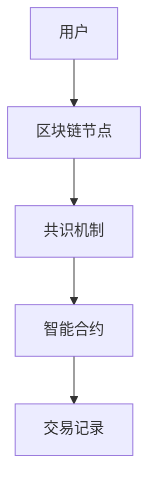
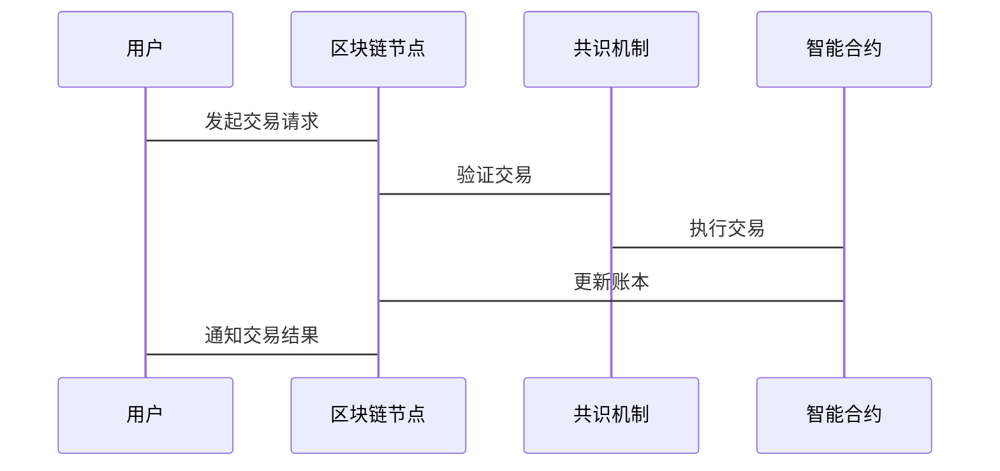

                 


# 区块链在金融数据安全中的创新应用

## 关键词
区块链、金融数据安全、分布式账本、智能合约、加密算法、去中心化、支付清算

## 摘要
区块链技术作为一项革命性的创新，在金融数据安全领域展现出巨大的潜力。本文详细探讨了区块链技术的基本原理、核心组件及其在金融领域的创新应用，特别是支付清算和身份认证等方面。通过实际案例分析和系统架构设计，本文揭示了区块链如何提升金融数据的安全性、透明性和效率。文章还提供了项目实战指南，帮助读者理解如何在实际中应用区块链技术，并总结了最佳实践和注意事项。

---

# 第一部分: 区块链与金融数据安全的背景介绍

## 第1章: 区块链的基本概念与技术特点

### 1.1 区块链的定义与核心原理

#### 1.1.1 区块链的定义
区块链是一种去中心化的分布式账本技术，通过加密算法和共识机制，确保数据的安全性和不可篡改性。其核心特点包括去中心化、透明性、不可篡改性和去信任化。

#### 1.1.2 区块链的核心特点
- **去中心化**: 数据不依赖于单一中心节点，而是分布在网络的各个节点上。
- **透明性**: 每个节点都能查看交易记录，确保透明。
- **不可篡改性**: 数据一旦写入区块链，难以被修改。
- **去信任化**: 通过技术手段减少对中心机构的信任依赖。

#### 1.1.3 区块链与传统数据库的对比

| 特性            | 传统数据库          | 区块链         |
|-----------------|--------------------|---------------|
| 数据存储        | 集中存储            | 分布式存储      |
| 数据一致性      | 依赖中心服务器      | 依赖共识机制    |
| 数据安全性      | 易受攻击            | 高度安全        |
| 可扩展性        | 高                  | 有限           |

### 1.2 区块链在金融领域的应用背景

#### 1.2.1 金融数据安全的现状与挑战
- **数据泄露**: 中心化系统易受黑客攻击，导致数据泄露。
- **信任缺失**: 用户对中心机构的信任不足，导致数据不被广泛接受。
- **效率低下**: 多次验证和中间环节增加交易成本和时间。

#### 1.2.2 区块链技术如何解决金融数据安全问题
- **去中心化**: 减少单一目标攻击，提高安全性。
- **数据不可篡改**: 确保数据真实性和完整性。
- **透明性**: 提高信任度，减少欺诈行为。

#### 1.2.3 区块链在金融领域的应用前景
- **支付清算**: 提高效率，降低成本。
- **身份认证**: 增强安全性，减少身份盗窃。
- **交易监控**: 实时监控，防止洗钱等非法活动。

### 1.3 区块链的分类与应用场景

#### 1.3.1 公有链、私有链与联盟链的定义与特点
- **公有链**: 开放式网络，任何人都可以参与，如比特币。
- **私有链**: 仅限内部使用，权限严格控制，如企业内部账本。
- **联盟链**: 多个机构共同维护，如金融联盟链。

#### 1.3.2 区块链在金融领域的具体应用场景
- **支付与清算**: 使用区块链技术提高效率和透明度。
- **身份识别**: 利用区块链确保身份信息的安全和唯一性。
- **证券交易**: 实现证券的发行、转让和结算的自动化。

#### 1.3.3 区块链技术的边界与外延
- **边界**: 区块链主要用于数据记录和价值转移，不适用于复杂计算。
- **外延**: 区块链技术可以与其他技术（如人工智能）结合，扩展应用场景。

## 1.4 本章小结
本章介绍了区块链的基本概念、核心特点以及在金融领域的应用背景。通过对比传统数据库，阐述了区块链在数据安全和信任方面的优势，为后续章节的应用分析奠定了基础。

---

## 第2章: 区块链的技术原理

### 2.1 区块链的核心组件

#### 2.1.1 区块结构
区块链由多个区块组成，每个区块包含交易记录和哈希指针。

#### 2.1.2 区块链的共识机制
共识机制是区块链的核心，确保所有节点达成一致。常用机制包括：
- **工作量证明（PoW）**: 如比特币。
- **权益证明（PoS）**: 以持有代币的多少决定记账权。
- **实用拜占庭容错（PBFT）**: 适用于联盟链。

#### 2.1.3 智能合约
智能合约是区块链上的自动执行程序，用于自动执行合同条款。

### 2.2 区块链的安全机制

#### 2.2.1 加密算法
- **哈希函数**: 用于生成区块标识和数字签名。
- **公私钥加密**: 确保交易的安全性和身份验证。

#### 2.2.2 节点身份验证
通过数字签名和公钥验证，确保节点身份的真实性和合法性。

#### 2.2.3 数据完整性与不可篡改性
通过 Merkel 树和链式结构，确保数据在传输和存储过程中的完整性。

### 2.3 区块链的去中心化特性

#### 2.3.1 去中心化的基本概念
去中心化是指数据和计算资源分布在网络的各个节点上，而非依赖单一中心机构。

#### 2.3.2 去中心化与数据安全的关系
去中心化减少了单点故障风险，提高了系统的抗攻击能力。

#### 2.3.3 去中心化的优势与挑战
- **优势**: 高可用性、抗审查性。
- **挑战**: 网络延迟、资源消耗。

### 2.4 本章小结
本章详细讲解了区块链的核心组件和安全机制，重点分析了去中心化特性及其对数据安全的影响，为后续章节的应用提供了技术基础。

---

## 第3章: 区块链在支付清算中的应用

### 3.1 支付清算的现状与问题

#### 3.1.1 现有支付清算系统的优缺点
- **优点**: 高效、可靠。
- **缺点**: 中心化导致单点故障，跨境支付效率低。

#### 3.1.2 支付清算中的数据安全挑战
- **数据泄露**: 中心化系统易受攻击。
- **交易欺诈**: 传统系统难以完全防止欺诈行为。

#### 3.1.3 区块链技术如何优化支付清算流程
- **去中心化**: 减少单点故障，提高安全性。
- **实时清算**: 提高交易速度，降低成本。

### 3.2 区块链支付清算的实现原理

#### 3.2.1 区块链支付清算的流程
1. 用户发起支付请求。
2. 区块链网络验证交易。
3. 确认交易后更新账本。
4. 通知收款人。

#### 3.2.2 智能合约在支付清算中的应用
智能合约自动执行支付规则，减少人为干预。

#### 3.2.3 区块链支付清算的安全性保障
通过加密算法和共识机制，确保交易的合法性和不可篡改性。

### 3.3 实际案例分析

#### 3.3.1 某知名区块链支付平台的案例
- 案例背景: 某平台采用区块链技术实现跨境支付。
- 技术实现: 使用联盟链和智能合约。
- 成功经验: 提高效率，降低成本。

#### 3.3.2 案例中的技术实现与安全分析
- 技术实现: 区块链节点分布在多个国家，采用PBFT共识机制。
- 安全分析: 通过多节点验证和加密签名，确保交易安全。

#### 3.3.3 案例的成功经验与教训
- 成功经验: 高效、透明、安全。
- 教训: 跨境支付涉及复杂监管，需注意合规性。

### 3.4 本章小结
本章通过分析区块链在支付清算中的应用，展示了其在提高效率、降低成本和增强安全性方面的优势，并通过实际案例说明了技术实现和成功经验。

---

## 第4章: 区块链在身份认证中的应用

### 4.1 身份认证的现状与问题

#### 4.1.1 现有身份认证系统
- **优点**: 集中管理方便。
- **缺点**: 易受攻击，数据泄露风险高。

#### 4.1.2 身份认证中的数据安全挑战
- **数据泄露**: 中心化存储易被攻击。
- **身份盗窃**: 管理不善导致身份信息被盗用。

#### 4.1.3 区块链技术如何解决身份认证问题
- **去中心化存储**: 提高数据安全性。
- **不可篡改性**: 确保身份信息的真实性和唯一性。

### 4.2 区块链身份认证的实现原理

#### 4.2.1 身份认证流程
1. 用户注册时生成公私钥对。
2. 公钥存储在区块链上。
3. 登录时使用私钥签名请求，节点验证签名。

#### 4.2.2 区块链身份认证的安全机制
- **加密签名**: 使用RSA算法进行签名验证。
- **智能合约**: 实现身份信息的自动验证和管理。

#### 4.2.3 区块链身份认证的优势
- **安全性**: 数据存储在区块链，难以被篡改。
- **隐私保护**: 可通过零知识证明实现隐私保护。

### 4.3 实际案例分析

#### 4.3.1 某区块链身份认证平台的案例
- 案例背景: 某平台使用区块链技术进行用户身份认证。
- 技术实现: 使用公私钥加密和智能合约验证。
- 成功经验: 提高身份认证的安全性和用户隐私保护。

#### 4.3.2 案例中的技术实现与安全分析
- 技术实现: 区块链网络中的每个节点都存储用户公钥，通过共识机制验证身份。
- 安全分析: 通过加密算法和去中心化存储，降低身份信息泄露风险。

#### 4.3.3 案例的成功经验与教训
- 成功经验: 提高身份认证的安全性和效率。
- 教训: 需考虑用户隐私保护和合规性要求。

### 4.4 本章小结
本章分析了区块链在身份认证中的应用，展示了其在提高安全性、隐私保护和去中心化方面的优势，并通过实际案例说明了技术实现和成功经验。

---

## 第5章: 区块链在金融数据安全中的系统架构与设计

### 5.1 系统架构设计

#### 5.1.1 系统功能设计
- **数据存储**: 分布式账本存储交易记录。
- **共识机制**: 采用PBFT确保数据一致性。
- **智能合约**: 自动执行金融规则。

#### 5.1.2 系统架构图


### 5.2 系统接口设计

#### 5.2.1 接口功能
- **发起交易**: 用户提交交易请求。
- **验证交易**: 节点验证交易合法性。
- **更新账本**: 交易确认后更新区块链。

#### 5.2.2 接口实现
- **REST API**: 提供标准接口供其他系统调用。
- **WebSocket**: 实时通知交易状态。

### 5.3 系统交互设计

#### 5.3.1 交互流程
1. 用户发起交易请求。
2. 节点验证交易。
3. 共识机制确认交易。
4. 智能合约执行交易。
5. 交易记录上链。

#### 5.3.2 交互序列图


### 5.4 本章小结
本章详细设计了区块链在金融数据安全中的系统架构和接口，通过Mermaid图展示了系统的交互流程，为实际应用提供了指导。

---

## 第6章: 区块链在金融数据安全中的项目实战

### 6.1 项目环境安装

#### 6.1.1 安装以太坊开发环境
- **Node.js**: 安装最新版本。
- **Ganache**: 安装以太坊本地测试网络。
- **Solidity**: 安装智能合约开发工具。

#### 6.1.2 安装必要的依赖
- 使用npm安装Web3和Truffle框架。

### 6.2 系统核心实现源代码

#### 6.2.1 智能合约实现
```solidity
// SPDX-License-Identifier: MIT
pragma solidity ^0.8.0;

contract FinanceSecurity {
    event Transfer(address indexed from, address indexed to, uint value);

    function transfer(address recipient, uint amount) external {
        emit Transfer(msg.sender, recipient, amount);
    }
}
```

#### 6.2.2 后端实现
```javascript
const Web3 = require('web3');
const web3 = new Web3(new Web3.providers.HttpProvider('http://localhost:8545'));

async function sendTransaction(from, to, amount) {
    const contract = new web3.eth.Contract(ABI, contractAddress);
    const tx = contract.methods.transfer(to, amount).send({ from: from });
    return tx;
}
```

### 6.3 代码应用解读与分析

#### 6.3.1 智能合约解读
- **事件定义**: `Transfer`事件记录每次交易。
- **函数实现**: `transfer`函数处理转账逻辑。

#### 6.3.2 后端代码解读
- **Web3库**: 用于连接以太坊节点。
- **事务发送**: 使用智能合约方法发送事务。

### 6.4 实际案例分析

#### 6.4.1 项目介绍
- **项目名称**: 区块链金融数据安全系统。
- **项目目标**: 提供安全的支付和身份认证服务。

#### 6.4.2 代码实现与测试
- **测试用例**: 测试转账功能和交易记录。
- **测试结果**: 确保交易记录准确，系统安全可靠。

### 6.5 本章小结
本章通过实际项目案例，详细讲解了区块链在金融数据安全中的实现过程，从环境搭建到代码实现，再到测试和部署，为读者提供了完整的实战指南。

---

## 第7章: 总结与展望

### 7.1 总结
本文详细探讨了区块链在金融数据安全中的创新应用，分析了其在支付清算、身份认证等方面的优势，并通过实际案例展示了技术实现和成功经验。区块链技术通过去中心化、透明性和不可篡改性，显著提升了金融数据的安全性和效率。

### 7.2 展望
未来，区块链技术将在金融领域进一步深化应用，与人工智能等技术结合，推动金融行业的智能化和数字化转型。同时，需要解决隐私保护、合规性和 scalability 等问题，以实现更广泛的应用。

### 7.3 最佳实践 tips
- **安全性**: 确保智能合约代码无漏洞。
- **合规性**: 遵守相关金融监管法规。
- **可扩展性**: 选择合适的共识机制和网络架构。

### 7.4 小结
区块链技术在金融数据安全中的应用前景广阔，通过技术创新和最佳实践，可以进一步推动其在金融领域的广泛应用。

---

## 作者：AI天才研究院/AI Genius Institute & 禅与计算机程序设计艺术 /Zen And The Art of Computer Programming

---

**全文完**

