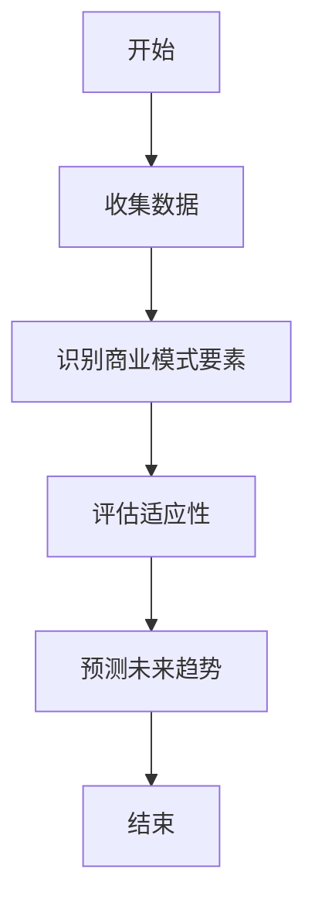
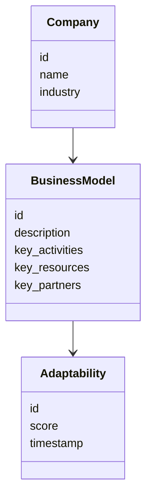
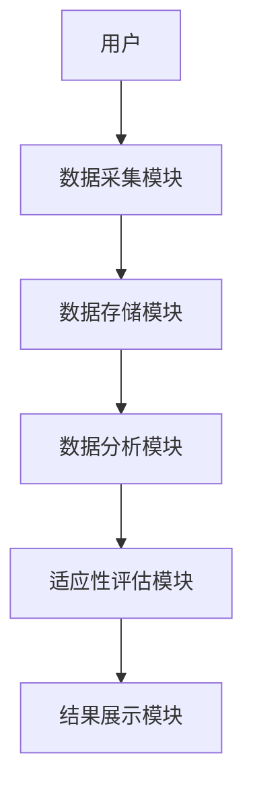
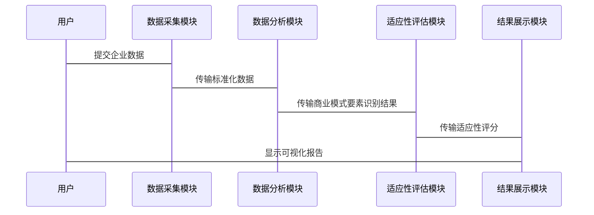

                 


# 彼得林奇对公司商业模式适应性的长期跟踪研究

> 关键词：彼得林奇，商业模式适应性，长期跟踪，投资分析，企业战略

> 摘要：本文通过分析彼得林奇对公司商业模式适应性的长期跟踪研究，探讨了如何通过商业模式的动态变化来评估公司的长期价值。文章从商业模式的基本概念出发，结合彼得林奇的投资理念，详细阐述了商业模式适应性的核心原理、评价指标、算法框架以及长期跟踪的具体方法。通过实际案例分析，本文提出了构建动态商业模式适应性评价体系的方法，并提供了可操作的实施路径。

---

# 第一部分: 背景介绍

## 第1章: 公司商业模式适应性研究的背景与意义

### 1.1 问题背景

#### 1.1.1 公司商业模式的核心概念
商业模式是企业在市场中创造和传递价值的基本逻辑，它包括企业的价值主张、客户关系、分销渠道、资源和能力、成本结构以及收入来源等核心要素。彼得林奇在其投资生涯中，始终关注企业的商业模式，认为只有理解企业的商业模式，才能准确评估其长期价值。

#### 1.1.2 商业模式适应性的定义
商业模式适应性是指企业在面对外部环境变化时，能够及时调整其商业模式的能力。这种适应性决定了企业在不同市场环境下的生存和发展的能力。彼得林奇通过长期跟踪研究发现，商业模式适应性强的公司往往能够抵御外部环境的波动，保持持续增长。

#### 1.1.3 彼得林奇投资理念与商业模式适应性的关联
彼得林奇的投资理念强调对公司基本面的深入研究，而商业模式适应性是公司基本面的重要组成部分。他通过长期跟踪公司的商业模式变化，发现那些能够灵活调整商业模式的企业往往具有更大的投资价值。

### 1.2 问题描述

#### 1.2.1 公司商业模式适应性的研究目标
研究目标在于识别影响商业模式适应性的关键因素，并建立一套评价体系，帮助企业或投资者更好地理解商业模式适应性对长期价值的影响。

#### 1.2.2 彼得林奇长期跟踪研究的方法
彼得林奇采用的是“自下而上”的投资策略，通过深入研究企业的商业模式、财务状况、管理层素质等因素，选择具有长期竞争优势的企业进行投资。

#### 1.2.3 研究的意义与价值
研究商业模式适应性不仅有助于投资者做出更明智的投资决策，还能为企业提供战略调整的参考依据，帮助企业在复杂多变的市场环境中保持竞争优势。

### 1.3 问题解决

#### 1.3.1 商业模式适应性的评价指标
商业模式适应性可以从以下几个方面进行评价：
1. **灵活性**：企业是否能够快速调整其商业模式以应对市场变化。
2. **可持续性**：商业模式是否能够在长期竞争中持续创造价值。
3. **可扩展性**：商业模式是否能够支持企业的规模扩张。
4. **创新性**：企业是否能够通过创新不断优化其商业模式。

#### 1.3.2 彼得林奇分析框架的构建
彼得林奇的分析框架包括以下几个关键步骤：
1. **识别商业模式的核心要素**：分析企业的价值主张、客户关系、收入来源等。
2. **评估商业模式的适应性**：通过长期跟踪研究，观察企业是否能够灵活调整其商业模式。
3. **预测未来发展趋势**：基于商业模式的适应性，预测企业的未来表现。

#### 1.3.3 长期跟踪研究的实施路径
1. **数据收集**：收集企业的历史财务数据、行业趋势、市场环境等信息。
2. **模式识别**：通过数据分析，识别商业模式的核心要素及其变化趋势。
3. **动态评估**：定期评估商业模式的适应性，及时发现潜在风险。

### 1.4 边界与外延

#### 1.4.1 研究的边界条件
- 研究范围仅限于企业的商业模式适应性，不涉及企业的具体财务指标。
- 研究对象为公开上市公司，不包括私营企业或非营利组织。

#### 1.4.2 相关概念的外延分析
- 商业模式适应性与企业战略管理密切相关，企业战略管理是商业模式适应性的实施手段。
- 商业模式适应性与企业创新战略相互影响，创新是商业模式适应性的关键驱动力。

#### 1.4.3 研究范围的界定
研究范围主要集中在企业商业模式的动态变化及其对长期价值的影响，不涉及企业的短期财务表现。

### 1.5 概念结构与核心要素组成

#### 1.5.1 商业模式适应性的核心要素
- **灵活性**：企业调整商业模式的能力。
- **创新性**：企业通过创新优化商业模式的能力。
- **可持续性**：商业模式在长期竞争中的价值创造能力。

#### 1.5.2 彼得林奇分析框架的结构
- **数据收集**：包括企业财务数据、市场数据、行业趋势等。
- **模式识别**：通过数据分析识别商业模式的核心要素。
- **动态评估**：定期评估商业模式的适应性。

#### 1.5.3 核心概念之间的关系
商业模式适应性与企业战略管理、创新战略密切相关，三者共同构成了企业长期发展的基础。

---

## 第2章: 核心概念与联系

### 2.1 商业模式适应性的核心原理

#### 2.1.1 商业模式的基本构成
商业模式由以下几个核心要素组成：
1. **价值主张**：企业向客户提供的价值。
2. **客户关系**：企业与客户之间的关系。
3. **分销渠道**：产品或服务的分销方式。
4. **资源和能力**：企业的核心资源和能力。
5. **成本结构**：企业的成本构成。
6. **收入来源**：企业的收入来源。

#### 2.1.2 适应性的定义与特征
适应性是指企业在面对外部环境变化时，能够及时调整其商业模式的能力。其主要特征包括灵活性、创新性和可持续性。

#### 2.1.3 彼得林奇分析框架的原理
彼得林奇通过长期跟踪研究，发现那些能够灵活调整商业模式的企业往往具有更大的投资价值。他强调对企业商业模式的深入理解和动态评估。

### 2.2 核心概念对比分析

#### 2.2.1 商业模式适应性与其他相关概念的对比
| 概念                | 定义                                                                 | 特点                                                                 |
|---------------------|----------------------------------------------------------------------|----------------------------------------------------------------------|
| 企业战略管理        | 企业为实现长期目标而制定的策略和计划                                           | 系统性、长远性、全局性                                                 |
| 企业创新战略        | 企业通过创新活动实现竞争优势的策略                                             | 创新性、动态性、可持续性                                                 |
| 商业模式适应性      | 企业在面对外部环境变化时，调整商业模式的能力                                     | 灵活性、创新性、可持续性                                                 |

#### 2.2.2 彼得林奇分析框架与传统财务分析的对比
| 对比维度             | 彼得林奇分析框架                                      | 传统财务分析                                      |
|----------------------|-------------------------------------------------------|-------------------------------------------------------|
| 分析对象             | 企业的商业模式                                       | 企业的财务状况                                     |
| 分析方法             | 长期跟踪、动态评估                                    | 财务指标分析                                       |
| 分析目标             | 评估商业模式的适应性                                 | 评估企业的财务健康状况                             |
| 分析结果             | 企业长期价值的潜力                                   | 企业短期财务表现                                   |

#### 2.2.3 适应性评价指标的对比分析
| 指标名称             | 定义                                                                 | 适用场景                                         |
|----------------------|-------------------------------------------------------|-------------------------------------------------------|
| 灵活性指标           | 企业调整商业模式的能力                               | 适用于评估企业在市场变化中的应对能力             |
| 可持续性指标         | 商业模式在长期竞争中的价值创造能力                 | 适用于评估企业的长期发展潜力                       |
| 创新性指标           | 企业通过创新优化商业模式的能力                       | 适用于评估企业的创新能力和竞争优势               |

### 2.3 ER实体关系图架构

```mermaid
er
    Company {
        id
        name
        industry
    }
    BusinessModel {
        id
        description
        key_activities
        key_resources
        key_partners
    }
    Adaptability {
        id
        score
        timestamp
    }
    Company -[1:N]-> BusinessModel
    BusinessModel -[1:N]-> Adaptability
```

---

## 第3章: 算法原理讲解

### 3.1 商业模式适应性评价算法

#### 3.1.1 算法概述
商业模式适应性评价算法是一种基于彼得林奇分析框架的动态评估方法，通过长期跟踪企业的商业模式变化，评估其适应性。该算法的核心在于通过数据分析识别商业模式的关键要素，并预测其未来发展趋势。

#### 3.1.2 算法流程



#### 3.1.3 算法实现

##### 3.1.3.1 数据预处理
```python
import pandas as pd

# 读取数据
data = pd.read_csv('company_data.csv')

# 清洗数据
data.dropna(inplace=True)
data = data[~data['行业'].isnull()]
```

##### 3.1.3.2 模式识别
```python
from sklearn.cluster import KMeans

# 数据标准化
from sklearn.preprocessing import StandardScaler
scaled_data = StandardScaler().fit_transform(data[['收入', '成本', '利润']])

# 聚类分析
kmeans = KMeans(n_clusters=3, random_state=0)
clusters = kmeans.fit_predict(scaled_data)

# 可视化
import matplotlib.pyplot as plt

plt.scatter(scaled_data[:,0], scaled_data[:,1], c=clusters)
plt.xlabel('收入')
plt.ylabel('成本')
plt.title('商业模式聚类分析')
plt.show()
```

##### 3.1.3.3 动态评估
```python
import numpy as np

# 定义适应性评分函数
def calculate_adaptability_score(data):
    score = np.mean(data['收入变化']) + np.mean(data['成本变化'])
    return score

# 计算适应性评分
adaptability_score = calculate_adaptability_score(data)
```

#### 3.1.4 数学模型

##### 3.1.4.1 收入变化预测模型
$$
\text{收入变化} = \alpha \times \text{历史收入增长率} + \beta \times \text{行业增长率}
$$

##### 3.1.4.2 成本变化预测模型
$$
\text{成本变化} = \gamma \times \text{历史成本下降率} + \delta \times \text{技术进步率}
$$

##### 3.1.4.3 适应性评分模型
$$
\text{适应性评分} = \lambda \times \text{收入变化} + (1-\lambda) \times \text{成本变化}
$$
其中，$\lambda$ 是模型参数，取值范围为 0 到 1。

---

## 第4章: 系统分析与架构设计

### 4.1 问题场景介绍

#### 4.1.1 项目介绍
本项目旨在构建一个基于彼得林奇分析框架的商业模式适应性评价系统，通过长期跟踪企业的商业模式变化，评估其适应性。

### 4.2 系统功能设计

#### 4.2.1 领域模型



### 4.3 系统架构设计

#### 4.3.1 系统架构



#### 4.3.2 系统接口设计

- **数据采集模块接口**：
  - 输入：企业数据
  - 输出：标准化数据

- **数据分析模块接口**：
  - 输入：标准化数据
  - 输出：商业模式要素识别结果

- **适应性评估模块接口**：
  - 输入：商业模式要素识别结果
  - 输出：适应性评分

- **结果展示模块接口**：
  - 输入：适应性评分
  - 输出：可视化报告

#### 4.3.3 系统交互设计



---

## 第5章: 项目实战

### 5.1 环境安装

#### 5.1.1 安装Python
```bash
# 安装Python
sudo apt-get install python3
```

#### 5.1.2 安装相关库
```bash
pip install pandas matplotlib sklearn
```

### 5.2 系统核心实现源代码

#### 5.2.1 数据预处理代码
```python
import pandas as pd
import numpy as np

# 读取数据
data = pd.read_csv('company_data.csv')

# 清洗数据
data.dropna(inplace=True)
data = data[~data['行业'].isnull()]
```

#### 5.2.2 模式识别代码
```python
from sklearn.cluster import KMeans
from sklearn.preprocessing import StandardScaler

# 数据标准化
scaled_data = StandardScaler().fit_transform(data[['收入', '成本', '利润']])

# 聚类分析
kmeans = KMeans(n_clusters=3, random_state=0)
clusters = kmeans.fit_predict(scaled_data)

# 可视化
import matplotlib.pyplot as plt

plt.scatter(scaled_data[:,0], scaled_data[:,1], c=clusters)
plt.xlabel('收入')
plt.ylabel('成本')
plt.title('商业模式聚类分析')
plt.show()
```

#### 5.2.3 动态评估代码
```python
def calculate_adaptability_score(data):
    score = np.mean(data['收入变化']) + np.mean(data['成本变化'])
    return score

# 计算适应性评分
adaptability_score = calculate_adaptability_score(data)
```

### 5.3 代码应用解读与分析

#### 5.3.1 数据预处理
数据预处理是保证数据分析准确性的基础，包括数据清洗和标准化处理。

#### 5.3.2 模式识别
通过聚类分析识别商业模式的类型，帮助企业更好地理解其商业模式的核心要素。

#### 5.3.3 动态评估
通过适应性评分模型，评估企业在不同环境下的商业模式适应性，为企业战略调整提供依据。

### 5.4 实际案例分析

#### 5.4.1 案例背景
以某科技公司为例，分析其商业模式适应性。

#### 5.4.2 数据分析
通过聚类分析识别该公司的商业模式类型，并计算其适应性评分。

#### 5.4.3 结果解读
根据适应性评分，评估该公司的商业模式适应性，并提出改进建议。

### 5.5 项目小结
通过实际案例分析，验证了基于彼得林奇分析框架的商业模式适应性评价系统的有效性和实用性。

---

## 第6章: 最佳实践

### 6.1 小结
通过长期跟踪研究，彼得林奇证明了商业模式适应性对企业发展的重要性。本文提出了构建动态商业模式适应性评价体系的方法，为企业和投资者提供了新的视角。

### 6.2 注意事项
- 数据收集要全面准确。
- 模式识别要结合企业的实际情况。
- 适应性评估要动态调整。

### 6.3 拓展阅读
- 彼得林奇的《投资之道》
- 克莱顿·克里斯坦森的《创新者的窘境》

---

# 作者：AI天才研究院/AI Genius Institute & 禅与计算机程序设计艺术 /Zen And The Art of Computer Programming

