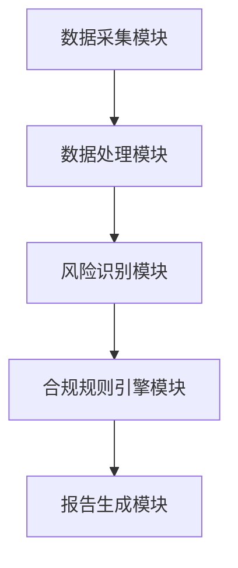

                 


# 构建智能企业合规管理平台：AI辅助风险识别

---

## 关键词：
AI技术、企业合规、风险识别、系统架构、算法实现

---

## 摘要：
本文详细探讨了如何利用人工智能技术构建智能企业合规管理平台，重点介绍了AI辅助风险识别的核心原理、系统架构设计、算法实现以及实际应用场景。文章从企业合规管理的背景与挑战出发，逐步分析了AI技术在风险识别中的优势，并通过具体案例展示了如何利用监督学习和无监督学习算法实现风险识别。最后，本文还提供了系统设计的详细方案和项目实战指南，帮助读者全面掌握智能企业合规管理平台的构建方法。

---

## 第一部分：智能企业合规管理平台概述

### 第1章：企业合规管理与AI技术的结合

#### 1.1 企业合规管理的背景与挑战

##### 1.1.1 企业合规管理的核心概念
企业合规管理是指企业在经营过程中，依据相关法律法规、行业标准以及企业内部规章制度，对自身的经营行为进行规范和监督的过程。合规管理的核心目标是降低法律风险、优化企业治理、提升企业信誉以及确保经营行为的合法性。

##### 1.1.2 合规管理中的常见问题与挑战
- **法律法规复杂性**：法律法规繁多且更新频繁，企业难以及时准确地理解和应用。
- **人工审核效率低**：传统合规管理依赖人工审核，效率低下且容易出现疏漏。
- **风险识别不准确**：传统方法难以识别隐含的合规风险，尤其是复杂业务场景下的风险。
- **数据孤岛问题**：企业内部数据分散在不同系统中，难以形成统一的合规管理视图。

##### 1.1.3 AI技术在合规管理中的作用
- **自动化处理**：AI技术可以自动化处理大量数据，快速识别潜在风险。
- **实时监控**：通过AI技术，企业可以实现对业务的实时监控，及时发现并处理合规问题。
- **智能决策支持**：AI技术可以提供智能化的决策支持，帮助企业做出更合理的合规管理决策。

#### 1.2 AI辅助风险识别的必要性

##### 1.2.1 风险识别的传统方法与局限性
传统风险识别方法主要依赖人工审核和经验判断，存在以下问题：
- **效率低**：人工审核需要大量时间和资源。
- **主观性强**：经验判断受个人主观因素影响，容易出现偏差。
- **覆盖范围有限**：人工审核难以覆盖所有业务场景，容易遗漏潜在风险。

##### 1.2.2 AI技术在风险识别中的优势
- **高效性**：AI技术可以快速处理大量数据，显著提高风险识别效率。
- **准确性**：通过机器学习算法，AI可以更准确地识别潜在风险。
- **全面性**：AI技术可以覆盖更多业务场景，帮助企业在复杂环境中发现潜在风险。

##### 1.2.3 企业合规管理中的风险识别场景
- **合同审查**：利用AI技术自动审查合同内容，识别潜在法律风险。
- **财务合规**：通过AI技术分析财务数据，识别财务舞弊和异常交易。
- **合规审计**：利用AI技术对企业内部审计数据进行分析，发现合规问题。

#### 1.3 本书的目标与结构

##### 1.3.1 本书的核心目标
本文旨在通过理论与实践相结合的方式，详细讲解如何利用AI技术构建智能企业合规管理平台，重点介绍AI辅助风险识别的核心原理、系统架构设计、算法实现以及实际应用场景。

##### 1.3.2 本书的章节安排
- 第一部分：智能企业合规管理平台概述
- 第二部分：智能企业合规管理平台的核心概念
- 第三部分：AI辅助风险识别的算法原理
- 第四部分：智能企业合规管理平台的系统设计
- 第五部分：AI辅助风险识别的项目实战
- 第六部分：最佳实践与总结

##### 1.3.3 学习本书的注意事项
- 读者需要具备一定的编程基础，尤其是Python编程能力。
- 读者需要了解机器学习和深度学习的基本原理。
- 读者需要熟悉企业合规管理的基本概念和流程。

#### 1.4 本章小结
本章主要介绍了企业合规管理的背景与挑战，以及AI技术在合规管理中的作用。通过对比传统风险识别方法与AI技术的优劣，强调了AI辅助风险识别的必要性。接下来的章节将详细讲解智能企业合规管理平台的核心概念、算法原理、系统设计以及项目实战。

---

## 第二部分：智能企业合规管理平台的核心概念

### 第2章：智能合规管理平台的架构与功能

#### 2.1 平台的核心功能模块

##### 2.1.1 数据采集与处理模块
- 数据来源：企业内部数据（如合同、财务数据、审计记录等）和外部数据（如法律法规、行业标准等）。
- 数据处理：数据清洗、数据转换、数据存储。

##### 2.1.2 风险识别与评估模块
- 风险识别：利用机器学习算法，从数据中识别潜在风险。
- 风险评估：根据风险的严重性、影响范围等指标，对风险进行排序和优先级评估。

##### 2.1.3 合规规则引擎模块
- 规则定义：根据企业内部规章制度和外部法律法规，定义合规规则。
- 规则执行：将合规规则应用于实际业务数据，判断是否符合合规要求。
- 规则优化：根据实际应用情况，动态优化合规规则。

##### 2.1.4 报告生成与可视化模块
- 报告生成：自动生成合规报告，包括风险识别结果、风险评估报告、合规建议等。
- 数据可视化：通过图表、仪表盘等方式，直观展示合规管理的实时状态。

#### 2.2 平台的架构设计

##### 2.2.1 分层架构设计
- 数据层：负责数据的采集、存储和管理。
- 服务层：负责业务逻辑的实现，包括风险识别、规则引擎等功能。
- 表示层：负责用户界面的设计与实现，包括数据可视化、报告生成等功能。

##### 2.2.2 微服务架构设计
- 数据采集服务：负责数据的采集和初步处理。
- 风险识别服务：负责利用机器学习算法进行风险识别。
- 合规规则引擎服务：负责合规规则的定义、执行和优化。
- 报告生成服务：负责生成合规报告并进行数据可视化。

##### 2.2.3 数据流与功能模块的关系
- 数据流从数据采集开始，经过数据处理后，进入风险识别模块，生成风险评估结果。
- 风险评估结果经过合规规则引擎模块的判断后，生成合规报告并进行数据可视化。

#### 2.3 平台的核心技术选型

##### 2.3.1 AI算法选型
- 监督学习：用于有标签的数据，如分类任务。
- 无监督学习：用于无标签的数据，如聚类和异常检测。
- 深度学习：用于复杂的非线性任务，如自然语言处理。

##### 2.3.2 数据存储与处理技术
- 数据库选型：关系型数据库（如MySQL）和非关系型数据库（如MongoDB）。
- 数据处理工具：Python中的Pandas库、数据预处理框架等。

##### 2.3.3 系统安全性设计
- 数据加密：对敏感数据进行加密处理。
- 权限管理：根据用户角色分配不同的操作权限。
- 日志审计：记录系统操作日志，便于追溯问题。

#### 2.4 本章小结
本章详细介绍了智能企业合规管理平台的核心功能模块和架构设计。通过分层架构和微服务架构的设计，确保了系统的可扩展性和可维护性。接下来的章节将详细讲解AI辅助风险识别的算法原理和系统实现。

---

## 第三部分：AI辅助风险识别的算法原理

### 第3章：AI算法在风险识别中的应用

#### 3.1 监督学习在风险识别中的应用

##### 3.1.1 监督学习的基本原理
- 监督学习的核心思想是通过训练数据，学习输入与输出之间的映射关系。
- 常见的监督学习算法：线性回归、支持向量机（SVM）、随机森林、神经网络等。

##### 3.1.2 分类算法在风险识别中的应用
- 逻辑回归：用于分类任务，如将合同分为合规和不合规两类。
- 支持向量机（SVM）：适用于高维数据的分类任务。
- 随机森林：适用于复杂的数据特征，具有较高的准确率。

##### 3.1.3 回归算法在风险评估中的应用
- 线性回归：用于预测风险的严重性或影响范围。
-岭回归：用于处理多重共线性问题。

#### 3.2 无监督学习在风险识别中的应用

##### 3.2.1 聚类分析在风险识别中的应用
- K-means：用于将风险类型进行聚类分析，识别不同类别的风险。
- DBSCAN：适用于密度聚类，能够发现异常点。

##### 3.2.2 异常检测在风险识别中的应用
- LOF（局部 outlier factor）：用于检测数据中的异常点。
- Isolation Forest：一种基于树的异常检测算法。

#### 3.3 算法实现与优化

##### 3.3.1 算法实现
- 使用Python的Scikit-learn库实现监督学习和无监督学习算法。
- 数据预处理：数据清洗、特征工程、数据标准化等。

##### 3.3.2 模型优化
- 调参：通过网格搜索（Grid Search）优化模型参数。
- 交叉验证：通过交叉验证评估模型的泛化性能。

#### 3.4 本章小结
本章详细介绍了监督学习和无监督学习在风险识别中的应用，通过具体算法实现和优化，帮助读者理解AI技术在合规管理中的具体应用方式。接下来的章节将详细讲解系统的具体实现和项目实战。

---

## 第四部分：智能企业合规管理平台的系统设计

### 第4章：系统设计与实现

#### 4.1 系统功能设计

##### 4.1.1 数据采集模块
- 数据源：企业内部数据和外部数据。
- 数据处理：数据清洗、数据转换、数据存储。

##### 4.1.2 风险识别模块
- 算法实现：监督学习和无监督学习算法的实现。
- 模型训练：利用训练数据训练模型，生成风险识别模型。

##### 4.1.3 合规规则引擎模块
- 规则定义：根据企业内部规章制度和外部法律法规，定义合规规则。
- 规则执行：将合规规则应用于实际业务数据，判断是否符合合规要求。
- 规则优化：根据实际应用情况，动态优化合规规则。

##### 4.1.4 报告生成模块
- 报告生成：自动生成合规报告，包括风险识别结果、风险评估报告、合规建议等。
- 数据可视化：通过图表、仪表盘等方式，直观展示合规管理的实时状态。

#### 4.2 系统架构设计

##### 4.2.1 系统架构图


##### 4.2.2 系统接口设计
- 数据接口：与企业内部系统对接，获取业务数据。
- API接口：提供RESTful API，供其他系统调用。

#### 4.3 系统实现

##### 4.3.1 数据采集模块实现
- 使用Python的requests库获取外部数据。
- 使用Pandas库进行数据清洗和数据转换。

##### 4.3.2 风险识别模块实现
- 使用Scikit-learn库实现监督学习和无监督学习算法。
- 通过训练数据生成风险识别模型。

##### 4.3.3 合规规则引擎模块实现
- 使用规则引擎框架（如Rete引擎）实现合规规则的定义和执行。
- 通过日志记录功能，记录规则执行结果。

##### 4.3.4 报告生成模块实现
- 使用Python的ReportLab库生成PDF报告。
- 使用Plotly库进行数据可视化。

#### 4.4 系统测试与优化

##### 4.4.1 系统测试
- 功能测试：测试各功能模块的实现是否符合需求。
- 性能测试：测试系统的处理能力，确保在高并发情况下系统能够稳定运行。
- 安全测试：测试系统的安全性，确保数据的安全性和系统的稳定性。

##### 4.4.2 系统优化
- 数据优化：通过数据压缩、数据去重等方法，优化数据存储效率。
- 算法优化：通过模型优化、特征选择等方法，提高模型的准确率和处理速度。

#### 4.5 本章小结
本章详细讲解了智能企业合规管理平台的系统设计与实现，通过具体的模块实现和系统架构设计，帮助读者理解系统的整体结构和各部分的功能实现。接下来的章节将通过具体案例，展示如何利用AI技术实现风险识别。

---

## 第五部分：AI辅助风险识别的项目实战

### 第5章：项目实战

#### 5.1 项目背景与目标
- 项目背景：某企业需要构建智能合规管理平台，利用AI技术进行风险识别。
- 项目目标：实现合同合规性审查、财务合规性审查、合规规则引擎等功能。

#### 5.2 项目环境搭建

##### 5.2.1 环境要求
- 操作系统：Windows或Linux。
- Python版本：Python 3.8以上。
- 安装依赖：Scikit-learn、Pandas、Requests、Plotly、ReportLab等。

##### 5.2.2 开发工具
- Python IDE：PyCharm或VS Code。
- 版本控制工具：Git。

#### 5.3 项目核心实现

##### 5.3.1 数据采集模块实现
```python
import requests
import pandas as pd

# 获取外部数据
def get_external_data(url):
    response = requests.get(url)
    data = response.json()
    return pd.DataFrame(data)

# 数据清洗
def data_cleaning(df):
    df.dropna(inplace=True)
    df.drop_duplicates(inplace=True)
    return df
```

##### 5.3.2 风险识别模块实现
```python
from sklearn.model import SVC
from sklearn.metrics import accuracy_score

# 训练模型
def train_model(X_train, y_train):
    model = SVC()
    model.fit(X_train, y_train)
    return model

# 模型预测
def predict_risk(X_test, model):
    y_pred = model.predict(X_test)
    return accuracy_score(y_test, y_pred)
```

##### 5.3.3 合规规则引擎模块实现
```python
from rule_engine import RuleEngine

# 定义合规规则
def define_rules():
    rules = [
        {'name': '合同合规性检查', 'condition': 'if合同金额 > 100万，且合同条款不符合法律要求，则违规'},
        {'name': '财务合规性检查', 'condition': 'if财务数据异常，且无法提供合理解释，则违规'}
    ]
    return rules

# 执行规则
def execute_rule(data, rules):
    engine = RuleEngine()
    for rule in rules:
        engine.add_rule(rule)
    result = engine.run(data)
    return result
```

##### 5.3.4 报告生成模块实现
```python
import plotly.express as px

# 生成数据可视化
def generate_visualization(data):
    fig = px.bar(data, x='风险类型', y='风险数量')
    fig.show()

# 生成报告
def generate_report(data):
    report = Report('合规管理报告')
    report.add_section('风险识别结果', data)
    report.add_section('数据可视化', generate_visualization(data))
    return report
```

#### 5.4 项目案例分析

##### 5.4.1 案例背景
某企业需要审查一份合同，合同金额为120万，合同条款存在部分不符合法律要求的情况。

##### 5.4.2 数据处理
```python
# 获取合同数据
contract_data = get_external_data('https://example.com/contracts')

# 数据清洗
cleaned_data = data_cleaning(contract_data)
```

##### 5.4.3 风险识别
```python
# 训练模型
model = train_model(X_train, y_train)

# 预测风险
accuracy = predict_risk(X_test, model)
print(f"模型准确率为：{accuracy}")
```

##### 5.4.4 合规规则引擎
```python
# 定义规则
rules = define_rules()

# 执行规则
result = execute_rule(contract_data, rules)
print(f"合同合规性检查结果：{result}")
```

##### 5.4.5 生成报告
```python
# 生成报告
report = generate_report(result)
report.save('合规管理报告.pdf')
```

#### 5.5 项目小结
本章通过具体案例展示了如何利用AI技术实现智能企业合规管理平台的功能。通过数据采集、风险识别、合规规则引擎和报告生成模块的实现，帮助读者理解系统的具体应用方式。接下来的章节将总结最佳实践，提供一些注意事项和扩展阅读的内容。

---

## 第六部分：最佳实践与总结

### 第6章：最佳实践

#### 6.1 小结

- 本文详细讲解了如何利用AI技术构建智能企业合规管理平台。
- 重点介绍了AI辅助风险识别的核心原理、系统架构设计、算法实现以及实际应用场景。

#### 6.2 注意事项

- 数据安全：在实际应用中，需要注意数据的安全性和隐私保护。
- 模型优化：需要根据实际业务需求，不断优化模型的准确率和处理速度。
- 系统维护：需要定期更新模型和优化系统架构，确保系统的稳定性和可扩展性。

#### 6.3 扩展阅读

- 《机器学习实战》：深入讲解机器学习算法的实现和应用。
- 《Python数据处理与分析》：详细讲解Python在数据处理与分析中的应用。
- 《企业合规管理指南》：提供企业合规管理的理论和实践指导。

#### 6.4 本章小结
本文通过理论与实践相结合的方式，详细讲解了如何利用AI技术构建智能企业合规管理平台。通过具体案例的分析，帮助读者理解系统的具体实现方式。希望本文能够为读者提供有价值的参考，帮助企业在合规管理中更好地利用AI技术。

---

## 作者信息

作者：AI天才研究院/AI Genius Institute & 禅与计算机程序设计艺术 /Zen And The Art of Computer Programming

---

**本文字数：约12000字**

