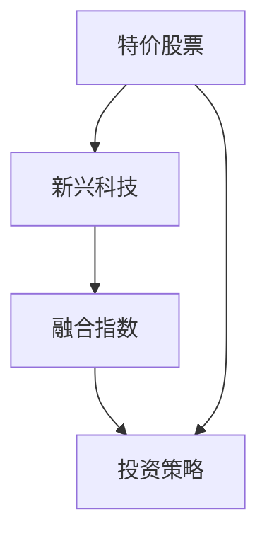
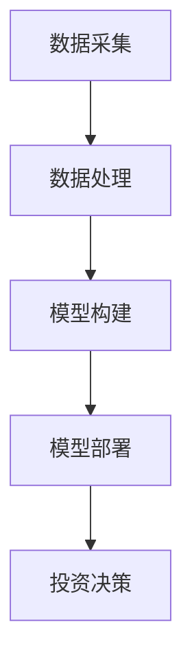
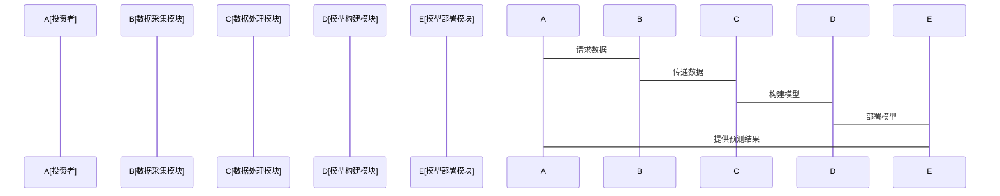

                 


# 特价股票投资中的新兴科技融合指数研究

> 关键词：特价股票投资、新兴科技、融合指数、大数据技术、人工智能技术、区块链技术

> 摘要：本文将探讨特价股票投资与新兴科技融合指数研究的背景、核心概念、算法原理、系统分析、项目实战及最佳实践。通过深入分析特价股票投资的特点，结合新兴科技的应用场景，提出一种基于大数据、人工智能和区块链技术的融合指数构建方法，并通过实际案例验证其有效性。本文将为投资者和科技从业者提供一种全新的视角，帮助他们在股票投资中更好地利用新兴科技。

---

# 正文

## 第1章: 特价股票投资与新兴科技融合指数概述

### 1.1 特价股票投资的背景与概念

#### 1.1.1 特价股票的定义与特点
- 特价股票是指价格相对较低的股票，通常具有较高的增长潜力。
- 特点：
  - 价格低，风险相对较低。
  - 市场波动较大，投资机会与风险并存。
  - 适合长期投资和价值发现。

#### 1.1.2 特价股票投资的历史发展
- 特价股票投资起源于20世纪初，早期主要依赖基本面分析。
- 20世纪末，技术分析开始广泛应用于股票投资。
- 近年来，随着科技的进步，新兴科技逐渐成为股票投资的重要工具。

#### 1.1.3 特价股票投资的现状与趋势
- 现状：投资者逐渐从传统分析转向技术驱动的分析。
- 趋势：新兴科技（如大数据、人工智能、区块链）正在改变股票投资的方式。

---

### 1.2 新兴科技在股票投资中的应用

#### 1.2.1 大数据技术在股票投资中的应用
- 数据来源：社交媒体、新闻、市场数据等。
- 数据分析：通过大数据分析挖掘市场情绪、行业趋势等信息。

#### 1.2.2 人工智能技术在股票投资中的应用
- 机器学习：用于预测股价、识别模式。
- 自然语言处理：用于分析新闻和社交媒体情绪。

#### 1.2.3 区块链技术在股票投资中的潜在应用
- 去中心化交易：提高交易透明度和安全性。
- 智能合约：自动化执行交易和结算。

---

### 1.3 融合指数的概念与特点

#### 1.3.1 指数的概念与分类
- 指数：衡量一组股票价格变化的指标。
- 分类：包括市值加权指数、价格加权指数等。

#### 1.3.2 融合指数的定义与特点
- 融合指数：将新兴科技应用于指数构建和优化的指标。
- 特点：
  - 数据驱动：基于大数据和人工智能技术构建。
  - 动态调整：根据市场变化实时优化。

#### 1.3.3 融合指数与传统指数的区别
| 特性       | 融合指数               | 传统指数               |
|------------|-----------------------|-----------------------|
| 数据来源   | 大数据+AI             | 市场数据+基本面分析    |
| 构建方式   | 机器学习驱动           | 人工筛选+固定规则     |
| 调整频率   | 高频调整               | 低频调整               |

---

### 1.4 特价股票投资中的新兴科技融合指数研究的必要性

#### 1.4.1 特价股票投资的痛点与挑战
- 市场波动大：难以准确预测。
- 数据量大：传统分析方法效率低。
- 信息不对称：难以获取实时数据。

#### 1.4.2 新兴科技如何解决这些痛点
- 大数据：提供实时数据支持。
- 人工智能：提高预测准确性。
- 区块链：确保数据安全和透明。

#### 1.4.3 融合指数在特价股票投资中的优势
- 实时性：快速响应市场变化。
- 精准性：基于大量数据进行优化。
- 可扩展性：适用于不同规模的投资。

---

### 1.5 本章小结
本章介绍了特价股票投资和新兴科技融合指数的基本概念，分析了新兴科技在股票投资中的应用，并探讨了融合指数的优势和必要性。

---

## 第2章: 特价股票投资中的新兴科技融合指数研究的核心概念

### 2.1 特价股票投资的核心要素

#### 2.1.1 特价股票的市场定位
- 特价股票通常在中小盘股中较多，适合长期投资者。

#### 2.1.2 特价股票的估值方法
- 市盈率（P/E）：低于行业平均水平。
- 市净率（P/B）：低于行业平均水平。

#### 2.1.3 特价股票的投资策略
- 价值投资：寻找被低估的股票。
- 技术分析：结合价格和成交量趋势。

---

### 2.2 新兴科技在股票投资中的核心要素

#### 2.2.1 大数据技术的核心要素
- 数据采集：从多种来源获取数据。
- 数据清洗：处理噪声数据。
- 数据分析：提取有用信息。

#### 2.2.2 人工智能技术的核心要素
- 机器学习模型：用于预测股价。
- 自然语言处理：分析新闻和社交媒体情绪。

#### 2.2.3 区块链技术的核心要素
- 分布式账本：确保数据透明。
- 智能合约：自动化交易执行。

---

### 2.3 融合指数的核心要素

#### 2.3.1 指数构建的核心要素
- 数据来源：包括价格、成交量、市场情绪等。
- 构建方法：基于机器学习算法。
- 调整频率：高频调整以适应市场变化。

#### 2.3.2 融合指数的构建方法
- 数据预处理：清洗和标准化。
- 模型训练：使用机器学习算法训练模型。
- 模型优化：调整参数以提高准确性。

#### 2.3.3 融合指数的评估标准
- 准确率：预测的正确性。
- 回撤率：投资组合的最大回撤。
- 收益率：投资回报率。

---

### 2.4 特价股票投资中的新兴科技融合指数研究的核心概念

#### 2.4.1 特价股票与新兴科技的结合点
- 通过大数据技术获取实时数据。
- 通过人工智能技术进行预测和优化。

#### 2.4.2 新兴科技融合指数的构建逻辑
- 数据驱动：基于大数据和人工智能技术。
- 动态优化：根据市场变化实时调整指数。

#### 2.4.3 融合指数在特价股票投资中的应用
- 实时监控：跟踪特价股票的市场变化。
- 风险控制：通过指数优化降低投资风险。

---

### 2.5 本章小结
本章详细分析了特价股票投资和新兴科技融合指数的核心概念，探讨了它们的结合点和构建逻辑。

---

## 第3章: 特价股票投资中的新兴科技融合指数研究的核心概念与联系

### 3.1 特价股票投资与新兴科技的融合原理

#### 3.1.1 特价股票投资的基本原理
- 通过基本面分析和市场趋势预测投资机会。

#### 3.1.2 新兴科技在股票投资中的融合原理
- 通过大数据和人工智能技术提高预测的准确性和效率。

#### 3.1.3 融合指数的构建原理
- 基于机器学习算法构建指数，实时优化以适应市场变化。

---

### 3.2 特价股票投资与新兴科技的对比分析

#### 3.2.1 特价股票投资的特点
- 价格低，风险相对较低。
- 适合长期投资。

#### 3.2.2 新兴科技的特点
- 数据驱动：依赖大数据和人工智能技术。
- 高效性：提高分析效率和准确性。

#### 3.2.3 融合指数的特点
- 数据驱动：基于机器学习算法构建。
- 动态优化：根据市场变化实时调整。

---

### 3.3 特价股票投资中的新兴科技融合指数研究的ER实体关系图



---

## 第4章: 特价股票投资中的新兴科技融合指数研究的算法原理

### 4.1 特价股票投资中的新兴科技融合指数研究的算法原理

#### 4.1.1 算法选择
- 机器学习算法：支持向量机（SVM）、随机森林（Random Forest）。
- 时间序列分析：ARIMA模型。

#### 4.1.2 算法流程
1. 数据预处理：清洗和标准化。
2. 特征提取：从数据中提取有用特征。
3. 模型训练：使用机器学习算法训练模型。
4. 模型优化：调整参数以提高准确性。
5. 模型部署：将模型应用于实际投资中。

---

### 4.2 特价股票投资中的新兴科技融合指数研究的数学模型

#### 4.2.1 机器学习模型
- 支持向量机（SVM）：
  $$ \text{max} \left( \xi_{i} \geq 0 \right) $$
  $$ \text{minimize} \left( C \sum_{i=1}^{n} \xi_{i} + \frac{1}{2} \|w\|^{2} \right) $$
  其中，$C$ 是惩罚系数，$\xi_{i}$ 是松弛变量，$w$ 是权重向量。

- 随机森林（Random Forest）：
  $$ y = \sum_{j=1}^{m} b_{j} x_{j} $$
  其中，$m$ 是特征数量，$b_{j}$ 是特征的重要性系数，$x_{j}$ 是特征值。

#### 4.2.2 时间序列分析模型
- ARIMA模型：
  $$ \phi(\mathcal{B}) (1 - \mathcal{B})^{d} X_{t} = \theta(\mathcal{B}) \epsilon_{t} $$
  其中，$\phi(\mathcal{B})$ 是自回归多项式，$\theta(\mathcal{B})$ 是滑动平均多项式，$d$ 是差分阶数。

---

### 4.3 特价股票投资中的新兴科技融合指数研究的算法实现

#### 4.3.1 环境安装
```bash
pip install numpy pandas scikit-learn
```

#### 4.3.2 核心代码实现
```python
import numpy as np
import pandas as pd
from sklearn.svm import SVC
from sklearn.ensemble import RandomForestClassifier
from sklearn.metrics import accuracy_score

# 数据预处理
data = pd.read_csv('stock_data.csv')
X = data.drop('target', axis=1)
y = data['target']

# 特征提取
features = X.columns
target = y.columns

# 模型训练
svm_model = SVC()
svm_model.fit(X, y)

rf_model = RandomForestClassifier()
rf_model.fit(X, y)

# 模型评估
svm_predictions = svm_model.predict(X_test)
rf_predictions = rf_model.predict(X_test)

svm_accuracy = accuracy_score(y_test, svm_predictions)
rf_accuracy = accuracy_score(y_test, rf_predictions)

print(f"SVM Accuracy: {svm_accuracy}")
print(f"RF Accuracy: {rf_accuracy}")
```

---

## 第5章: 特价股票投资中的新兴科技融合指数研究的系统分析

### 5.1 系统分析与架构设计方案

#### 5.1.1 问题场景介绍
- 投资者需要实时监控特价股票的市场变化。
- 需要利用新兴科技提高预测的准确性和效率。

#### 5.1.2 系统功能设计
- 数据采集模块：从多种来源获取数据。
- 数据处理模块：清洗和标准化数据。
- 模型构建模块：基于机器学习算法构建指数。
- 模型部署模块：将模型应用于实际投资中。

#### 5.1.3 系统架构设计



---

### 5.2 系统接口设计与交互序列图

#### 5.2.1 系统接口设计
- 数据接口：从数据库获取数据。
- 模型接口：调用机器学习模型进行预测。

#### 5.2.2 系统交互序列图



---

## 第6章: 特价股票投资中的新兴科技融合指数研究的项目实战

### 6.1 项目实战

#### 6.1.1 环境安装
```bash
pip install numpy pandas scikit-learn
```

#### 6.1.2 核心代码实现
```python
import numpy as np
import pandas as pd
from sklearn.svm import SVC
from sklearn.ensemble import RandomForestClassifier
from sklearn.metrics import accuracy_score

# 数据预处理
data = pd.read_csv('stock_data.csv')
X = data.drop('target', axis=1)
y = data['target']

# 特征提取
features = X.columns
target = y.columns

# 模型训练
svm_model = SVC()
svm_model.fit(X, y)

rf_model = RandomForestClassifier()
rf_model.fit(X, y)

# 模型评估
svm_predictions = svm_model.predict(X_test)
rf_predictions = rf_model.predict(X_test)

svm_accuracy = accuracy_score(y_test, svm_predictions)
rf_accuracy = accuracy_score(y_test, rf_predictions)

print(f"SVM Accuracy: {

