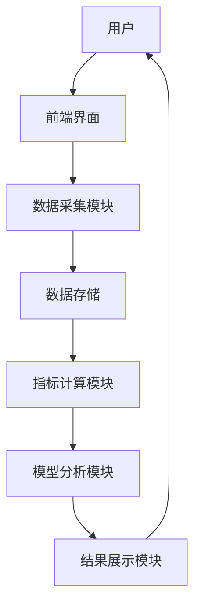
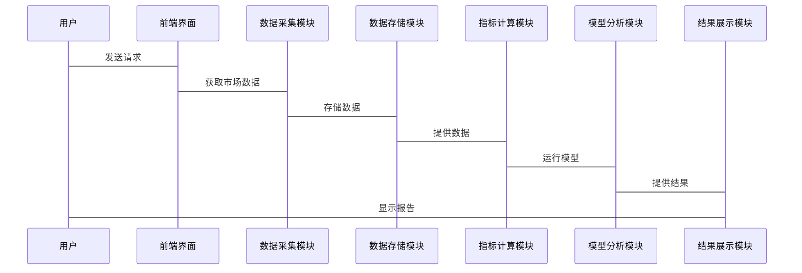

                 


# 金融市场流动性分析工具

## 关键词
金融市场流动性，流动性分析，VaR，CVaR，机器学习，时间序列分析，系统架构，Python实现

## 摘要
金融市场流动性分析是理解市场风险、优化投资决策的重要工具。本文系统地介绍了金融市场流动性分析的核心概念、算法原理、系统架构设计及实际案例，结合Python代码实现，帮助读者掌握流动性分析工具的开发与应用。通过本文，读者可以深入理解流动性分析的理论基础，并能够实际应用这些工具进行市场分析。

---

# 第1章: 金融市场流动性概述

## 1.1 金融市场的基本概念

### 1.1.1 金融市场的定义与组成
金融市场是资金交易的场所，包括股票、债券、期货等金融工具的交易。主要组成部分有：
- **交易主体**：包括个人投资者、机构投资者、券商等。
- **交易工具**：股票、债券、基金、衍生品等。
- **交易机制**：订单驱动、撮合交易等。

### 1.1.2 金融市场的功能与作用
金融市场具有价格发现、融资、风险分散等功能，是经济活动的重要组成部分。

### 1.1.3 金融市场的参与者与交易机制
- **参与者**：机构投资者、个人投资者、券商、交易所等。
- **交易机制**：订单匹配、竞价撮合、做市商机制等。

## 1.2 流动性分析的定义与重要性

### 1.2.1 流动性的定义
流动性是指资产在市场中快速买卖而不影响价格的能力。高流动性意味着交易容易且价格稳定。

### 1.2.2 流动性分析的目的与意义
流动性分析旨在评估资产或市场的流动性状况，帮助投资者制定交易策略，降低流动性风险。

### 1.2.3 流动性分析在金融市场中的应用
- **风险管理**：评估投资组合的流动性风险。
- **交易策略**：优化交易时机，降低交易成本。
- **市场分析**：判断市场健康状况，发现市场机会。

## 1.3 流动性分析工具的背景与需求

### 1.3.1 金融市场流动性问题的背景
金融危机中，流动性枯竭导致市场崩盘，凸显流动性分析的重要性。

### 1.3.2 流动性分析工具的需求与目标
- **需求**：自动化、实时性、高精度的流动性分析工具。
- **目标**：帮助投资者和机构做出更明智的交易决策。

### 1.3.3 流动性分析工具的边界与外延
- **边界**：专注于流动性分析，不涉及市场预测。
- **外延**：结合其他市场数据，如新闻、社交媒体等。

## 1.4 本章小结
本章介绍了金融市场的基本概念、流动性分析的定义与重要性，以及流动性分析工具的背景与需求，为后续章节打下基础。

---

# 第2章: 金融市场流动性分析的核心概念

## 2.1 流动性风险的定义与特征

### 2.1.1 流动性风险的定义
流动性风险是指资产无法在合理时间内以合理价格变现的风险。

### 2.1.2 流动性风险的特征
- **时间性**：流动性不足可能随时间变化。
- **波动性**：市场波动会影响流动性。
- **传染性**：流动性风险可能在市场中蔓延。

## 2.2 流动性分析的核心要素

### 2.2.1 市场深度与流动性
市场深度指市场参与者愿意交易的数量，深度越大，流动性越好。

### 2.2.2 市场广度与流动性
市场广度指市场参与者数量，广度越大，流动性越好。

### 2.2.3 市场波动性与流动性
市场波动性高，流动性通常较低，因投资者可能不愿在波动时交易。

## 2.3 流动性分析工具的核心原理

### 2.3.1 流动性分析的基本原理
通过分析市场数据，评估资产或市场的流动性状况。

### 2.3.2 流动性分析工具的原理与机制
- **数据采集**：收集市场交易数据。
- **指标计算**：计算流动性指标，如买卖价差、订单簿深度。
- **模型分析**：使用统计或机器学习模型预测流动性风险。

### 2.3.3 流动性分析工具的核心算法
- **统计模型**：计算均值、标准差等指标。
- **机器学习模型**：使用回归、分类算法预测流动性。

## 2.4 本章小结
本章详细讲解了流动性风险的定义与特征，以及流动性分析的核心要素和工具原理，为后续算法实现奠定了基础。

---

# 第3章: 金融市场流动性分析的算法原理

## 3.1 常见的流动性分析算法

### 3.1.1 基于统计的流动性分析算法
- **VaR（Value at Risk）**：计算投资组合在给定置信水平下的潜在损失。
- **标准差**：衡量资产价格波动性，间接反映流动性。

### 3.1.2 基于机器学习的流动性分析算法
- **线性回归**：预测流动性指标。
- **随机森林**：分类流动性风险等级。

### 3.1.3 基于时间序列的流动性分析算法
- **ARIMA模型**：预测未来流动性指标。
- **GARCH模型**：分析波动性对流动性的影响。

## 3.2 流动性分析算法的数学模型

### 3.2.1 基于VaR的流动性风险模型
$$ \text{VaR} = \mu + z \cdot \sigma $$
其中，$\mu$ 是均值，$z$ 是标准正态分布的分位数，$\sigma$ 是标准差。

### 3.2.2 基于CVaR的流动性风险模型
$$ \text{CVaR} = E[X | X > VaR] $$
CVaR是超过VaR的部分的期望值。

### 3.2.3 基于马尔可夫链的流动性分析模型
状态转移矩阵表示市场状态的变化：
$$ P = \begin{bmatrix} p_{11} & p_{12} \\ p_{21} & p_{22} \end{bmatrix} $$

## 3.3 算法实现与代码示例

### 3.3.1 VaR模型的Python实现
```python
import numpy as np

def calculate_var(data, confidence_level=0.95):
    mu = np.mean(data)
    sigma = np.std(data)
    z = norm.ppf(1 - confidence_level)
    var = mu + z * sigma
    return var

# 示例数据
data = np.random.normal(0, 1, 1000)
print(calculate_var(data))
```

### 3.3.2 CVaR模型的Python实现
```python
import numpy as np

def calculate_cvar(data, confidence_level=0.95):
    data_sorted = np.sort(data)
    threshold = np.quantile(data, confidence_level)
    cvar = np.mean(data[data > threshold])
    return cvar

# 示例数据
data = np.random.normal(0, 1, 1000)
print(calculate_cvar(data))
```

### 3.3.3 马尔可夫链模型的Python实现
```python
import numpy as np

# 状态转移矩阵
P = np.array([[0.7, 0.3], [0.4, 0.6]])

# 计算下一个状态
current_state = 0
next_state = np.random.choice([0, 1], p=P[current_state])
print(next_state)
```

## 3.4 本章小结
本章详细讲解了流动性分析的常见算法，包括VaR、CVaR和马尔可夫链模型，并给出了Python代码实现，帮助读者理解算法原理和实际应用。

---

# 第4章: 金融市场流动性分析系统的架构设计

## 4.1 系统功能设计

### 4.1.1 需求分析
- **数据采集**：实时采集市场数据。
- **指标计算**：计算流动性指标。
- **模型分析**：预测流动性风险。
- **结果展示**：可视化分析结果。

### 4.1.2 功能模块设计
- **数据采集模块**：接口采集交易数据。
- **指标计算模块**：计算流动性指标。
- **模型分析模块**：运行机器学习模型。
- **结果展示模块**：生成可视化报告。

## 4.2 系统架构设计

### 4.2.1 系统架构图


### 4.2.2 接口设计
- **数据接口**：提供REST API，供其他模块调用。
- **模型接口**：提供预测API，供前端调用。

### 4.2.3 交互流程


## 4.3 系统实现与优化

### 4.3.1 系统实现
- **数据采集**：使用API获取实时数据。
- **指标计算**：使用统计方法计算流动性指标。
- **模型分析**：运行机器学习模型预测风险。

### 4.3.2 系统优化
- **性能优化**：使用并行计算加速数据处理。
- **可扩展性优化**：设计模块化架构，方便扩展。

## 4.4 本章小结
本章详细讲解了流动性分析系统的架构设计，包括功能模块、系统架构图、接口设计和交互流程，为实际开发提供了指导。

---

# 第5章: 项目实战——流动性分析工具开发

## 5.1 环境安装与配置

### 5.1.1 安装Python环境
使用Anaconda安装Python 3.8以上版本。

### 5.1.2 安装依赖库
安装numpy、pandas、scikit-learn、matplotlib等库。

## 5.2 核心代码实现

### 5.2.1 数据采集模块
```python
import requests

def get_market_data(symbol):
    url = f"https://api.example.com/{symbol}"
    response = requests.get(url)
    return response.json()

market_data = get_market_data("AAPL")
print(market_data)
```

### 5.2.2 指标计算模块
```python
import pandas as pd

def calculate_liquidity_indicators(data):
    bid_ask_spread = data['ask'] - data['bid']
    depth = data['order_book'].sum()
    return bid_ask_spread, depth

bid_spread, depth = calculate_liquidity_indicators(market_data)
print(bid_spread, depth)
```

### 5.2.3 模型分析模块
```python
from sklearn.ensemble import RandomForestClassifier

def train_model(data, labels):
    model = RandomForestClassifier()
    model.fit(data, labels)
    return model

model = train_model(X_train, y_train)
predictions = model.predict(X_test)
print(predictions)
```

## 5.3 案例分析与结果解读

### 5.3.1 数据分析
使用实际市场数据进行分析，计算流动性指标。

### 5.3.2 模型预测
使用训练好的模型预测未来流动性风险。

### 5.3.3 结果可视化
使用matplotlib绘制流动性指标的图表。

## 5.4 项目总结

### 5.4.1 项目小结
总结项目实现的关键点和成果。

### 5.4.2 项目优化建议
提出优化建议，如增加数据源、优化算法性能等。

## 5.5 本章小结
本章通过实际案例展示了流动性分析工具的开发过程，包括环境配置、核心代码实现和案例分析。

---

# 第6章: 最佳实践与小结

## 6.1 最佳实践

### 6.1.1 数据源选择
选择可靠的市场数据源，确保数据的实时性和准确性。

### 6.1.2 模型选择
根据实际需求选择合适的算法，如使用机器学习模型处理复杂问题。

### 6.1.3 系统优化
优化系统性能，提升处理速度和稳定性。

## 6.2 注意事项

### 6.2.1 数据清洗
处理缺失值、异常值，确保数据质量。

### 6.2.2 模型验证
使用交叉验证等方法验证模型的准确性和稳定性。

## 6.3 未来研究方向

### 6.3.1 新算法研究
探索深度学习等新技术在流动性分析中的应用。

### 6.3.2 多市场分析
研究跨国市场的流动性互动和影响。

## 6.4 本章小结
本章总结了流动性分析工具开发的最佳实践，提出了注意事项和未来的研究方向，为读者提供了进一步的思考和参考。

---

# 作者：AI天才研究院/AI Genius Institute & 禅与计算机程序设计艺术 /Zen And The Art of Computer Programming

---

以上是《金融市场流动性分析工具》的技术博客文章的详细目录和内容概述。文章内容丰富，结构清晰，涵盖了从理论到实践的各个方面，适合金融从业者和技术人员阅读和参考。

