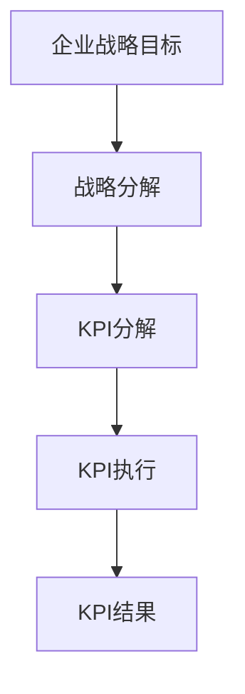
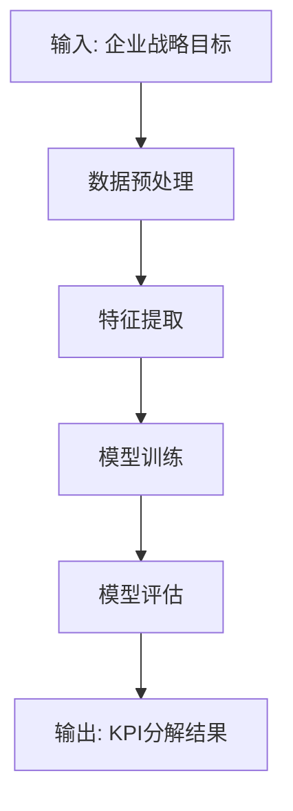
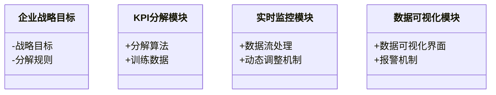
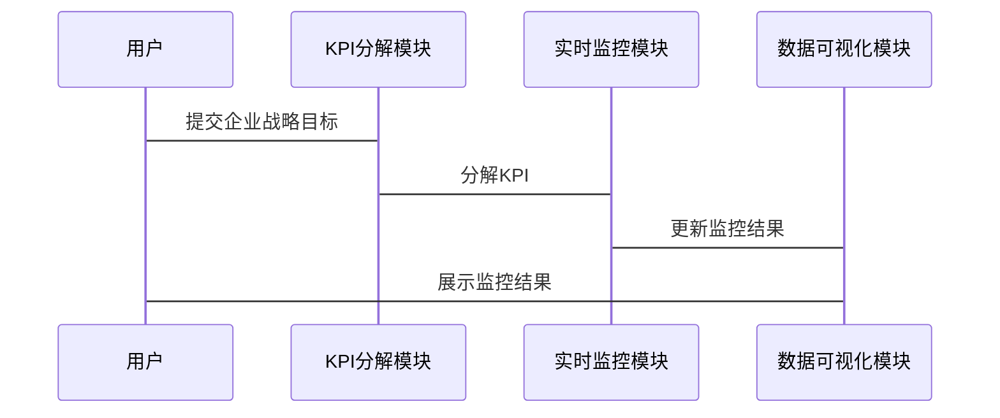

                 


# AI驱动的企业战略执行监控：KPI智能分解与实时追踪

**关键词**：AI驱动、KPI分解、实时追踪、企业战略监控、机器学习

**摘要**：  
在当今快速变化的商业环境中，企业战略执行的效率和效果直接关系到企业的生存与发展。传统的KPI（关键绩效指标）监控方法依赖于人工分解和周期性分析，存在效率低下、响应速度慢、难以实时追踪等问题。AI驱动的企业战略执行监控通过智能分解KPI和实时追踪，为企业提供了更高效、更精准的解决方案。本文将从背景、核心概念、算法原理、系统架构设计、项目实战到最佳实践，全面探讨AI在KPI智能分解与实时追踪中的应用，为企业战略执行监控提供新的思路和实践指导。

---

# 第一部分：AI驱动的企业战略执行监控概述

## 第1章：企业战略执行监控的背景与挑战

### 1.1 企业战略执行监控的背景

#### 1.1.1 企业战略执行的重要性
企业战略是企业在复杂市场环境中生存和发展的指南针。有效的战略执行能够确保企业目标的实现，优化资源配置，提升竞争力。然而，传统的战略执行监控依赖于人工分解和周期性分析，难以满足现代企业对高效、实时监控的需求。

#### 1.1.2 传统KPI监控的局限性
- **人工分解**：KPI的分解过程复杂且耗时，容易出错，难以适应快速变化的业务需求。
- **周期性分析**：传统的KPI分析通常是按月或季度进行，无法实现实时监控，导致问题发现和解决的滞后。
- **数据孤岛**：企业内部数据分散在不同的部门和系统中，缺乏统一的数据源，导致监控效率低下。

#### 1.1.3 AI技术在KPI监控中的应用前景
AI技术的快速发展为企业战略执行监控提供了新的可能性。通过机器学习算法，AI能够自动分解KPI，实时追踪指标变化，帮助企业快速识别问题并优化执行策略。

---

### 1.2 问题背景与问题描述

#### 1.2.1 企业战略执行中的常见问题
- **战略目标与执行脱节**：企业战略目标的分解和执行过程中缺乏有效的监控机制，导致目标与实际执行脱节。
- **KPI分解复杂**：KPI的分解需要考虑多个业务维度，人工分解容易出错且效率低下。
- **实时监控缺失**：传统的KPI监控通常是周期性的，无法实时反映业务变化。

#### 1.2.2 KPI分解与追踪的难点
- **多维度数据整合**：KPI分解需要考虑多个业务维度，如时间、部门、产品等，数据整合复杂。
- **动态调整需求**：业务环境的变化要求KPI分解能够动态调整，传统的静态分解方法难以应对。
- **实时性与准确性平衡**：实时监控需要快速响应，但如何在实时性与准确性之间取得平衡是一个挑战。

#### 1.2.3 AI驱动的解决方案
- **智能分解**：利用机器学习算法自动分解KPI，提高分解效率和准确性。
- **实时追踪**：通过实时数据流处理技术，实现KPI的动态监控和预警。
- **动态调整**：AI能够根据业务变化自动调整KPI分解策略，确保监控的实时性和有效性。

---

### 1.3 问题解决与边界定义

#### 1.3.1 AI驱动KPI监控的核心目标
- **提高KPI分解效率**：通过AI算法实现自动化的KPI分解，减少人工干预。
- **实现实时监控**：利用实时数据流处理技术，实现KPI的动态监控。
- **动态调整分解策略**：根据业务变化自动优化KPI分解方案。

#### 1.3.2 解决方案的边界与外延
- **边界**：本解决方案专注于KPI的智能分解与实时追踪，不涉及战略目标的制定和执行的具体操作。
- **外延**：虽然不直接涉及战略目标的制定，但通过KPI的智能分解和实时监控，能够为战略目标的调整和优化提供数据支持。

#### 1.3.3 核心要素与组成结构
- **核心要素**：实时数据流、机器学习模型、KPI分解算法、动态调整机制。
- **组成结构**：包括数据采集、数据预处理、模型训练、实时监控和反馈优化五个部分。

---

### 1.4 本章小结
本章从企业战略执行监控的背景出发，分析了传统KPI监控的局限性，提出了AI驱动的解决方案，并明确了核心目标和边界范围。通过AI技术的应用，企业能够实现KPI的智能分解与实时追踪，显著提升战略执行的效率和效果。

---

## 第2章：AI驱动KPI监控的核心概念与联系

### 2.1 核心概念原理

#### 2.1.1 AI在KPI分解中的应用
- **机器学习模型**：利用回归分析、聚类分析等机器学习算法，自动分解KPI。
- **特征工程**：通过提取关键特征，提升模型的准确性和可解释性。
- **模型优化**：通过超参数调优和模型集成，提升KPI分解的效率和精度。

#### 2.1.2 KPI智能分解的算法原理
- **算法选择**：根据业务需求选择合适的算法，如线性回归、随机森林等。
- **数据预处理**：清洗数据、处理缺失值、标准化或归一化数据。
- **模型训练**：基于训练数据训练机器学习模型，实现KPI的智能分解。

#### 2.1.3 实时追踪的技术实现
- **实时数据流处理**：利用流处理技术（如Apache Kafka、Apache Flink）实现KPI的实时监控。
- **动态调整机制**：根据实时数据反馈，动态调整KPI分解策略。

---

### 2.2 核心概念对比表

| **对比维度** | **传统KPI监控** | **AI驱动KPI监控** |
|--------------|-----------------|---------------------|
| 分解方式      | 人工分解         | 智能自动分解         |
| 监控频率      | 周期性监控       | 实时监控             |
| 精确性        | 较低             | 较高                 |
| 效率          | 低               | 高                   |
| 可扩展性      | 有限             | 强                   |

---

### 2.3 ER实体关系图



---

### 2.4 本章小结
本章详细介绍了AI驱动KPI监控的核心概念，通过对比分析和ER实体关系图，展示了AI技术在KPI分解中的优势和应用场景。通过机器学习算法和实时数据流处理技术，企业能够实现KPI的智能分解与动态监控。

---

## 第3章：KPI智能分解算法原理

### 3.1 算法原理概述

#### 3.1.1 基于机器学习的KPI分解
- **线性回归模型**：用于简单的线性关系建模。
- **随机森林模型**：用于复杂非线性关系的建模。
- **神经网络模型**：用于更复杂的模式识别。

#### 3.1.2 算法选择与优化
- **算法选择**：根据数据特征和业务需求选择合适的算法。
- **超参数调优**：通过网格搜索、随机搜索等方法优化模型性能。
- **模型集成**：通过投票、加权等方法提升模型的准确性和稳定性。

#### 3.1.3 模型训练与评估
- **训练数据准备**：选择合适的训练数据，进行数据清洗和特征工程。
- **模型训练**：基于训练数据训练机器学习模型。
- **模型评估**：通过交叉验证、ROC曲线等方法评估模型性能。

---

### 3.2 算法流程图



---

### 3.3 Python实现代码

```python
import numpy as np
from sklearn.linear_model import LinearRegression

def kpi_decomposition(target, features):
    model = LinearRegression()
    model.fit(features, target)
    return model.predict(features)
```

---

### 3.4 本章小结
本章详细介绍了KPI智能分解的算法原理，通过流程图和代码示例展示了如何利用机器学习算法实现KPI的智能分解。通过数据预处理、特征提取、模型训练和评估，企业能够实现高效、准确的KPI分解。

---

## 第4章：系统分析与架构设计

### 4.1 问题场景介绍

#### 4.1.1 项目介绍
- **项目目标**：实现企业战略目标的智能分解和实时监控。
- **项目范围**：覆盖企业内部的关键业务流程和KPI指标。

#### 4.1.2 系统功能设计
- **KPI分解模块**：基于机器学习算法实现KPI的智能分解。
- **实时监控模块**：实现KPI的实时追踪和动态调整。
- **数据可视化模块**：提供直观的数据可视化界面，帮助用户快速了解监控结果。

---

### 4.2 系统架构设计

#### 4.2.1 领域模型



#### 4.2.2 系统架构


#### 4.2.3 接口设计
- **API接口**：提供RESTful API接口，实现模块之间的数据交互。
- **数据接口**：与企业现有的数据系统对接，获取实时数据流。

#### 4.2.4 交互设计



---

### 4.3 本章小结
本章从系统架构的角度，详细设计了AI驱动KPI监控系统的功能模块、架构和接口。通过领域模型和系统架构图，展示了系统的核心组件及其交互关系，为后续的项目实施提供了理论基础。

---

## 第5章：项目实战

### 5.1 环境安装

#### 5.1.1 Python环境安装
- 安装Python 3.8或更高版本。
- 安装必要的库：`numpy`, `pandas`, `scikit-learn`, `mermaid`, `flask`。

#### 5.1.2 数据库安装
- 安装MySQL或MongoDB，用于存储实时数据。

#### 5.1.3 开发工具安装
- 安装IDE（如PyCharm、VS Code）和版本控制工具（如Git）。

---

### 5.2 系统核心实现

#### 5.2.1 数据采集模块
- 使用Flask框架搭建API接口，接收实时数据流。
- 数据采集模块代码示例：

```python
from flask import Flask
import json

app = Flask(__name__)

@app.route('/api/data', methods=['POST'])
def receive_data():
    data = json.loads(request.get_data())
    # 存储数据到数据库
    return 'Data received successfully'
```

#### 5.2.2 KPI分解模块
- 基于机器学习算法实现KPI的智能分解。
- KPI分解模块代码示例：

```python
from sklearn.ensemble import RandomForestRegressor

def train_model(features, target):
    model = RandomForestRegressor()
    model.fit(features, target)
    return model

# 训练模型
model = train_model(features, target)

# 预测结果
predictions = model.predict(features)
```

#### 5.2.3 实时监控模块
- 实现KPI的实时追踪和动态调整。
- 实时监控模块代码示例：

```python
import pandas as pd
from kafka import KafkaConsumer

# 消费Kafka主题中的实时数据
consumer = KafkaConsumer('kpi_stream', bootstrap_servers=['localhost:9092'])
for message in consumer:
    data = json.loads(message.value)
    # 更新KPI分解结果
    # 处理数据并更新监控界面
```

---

### 5.3 案例分析与实现

#### 5.3.1 案例分析
- 某企业希望通过AI驱动的KPI监控系统，实现销售额、利润、客户满意度等关键指标的智能分解和实时监控。

#### 5.3.2 代码实现
- 数据采集模块：接收实时销售数据。
- KPI分解模块：基于历史数据训练随机森林模型，预测未来的KPI。
- 实时监控模块：通过Kafka消费实时数据流，更新KPI分解结果。

---

### 5.4 项目小结
本章通过项目实战，详细展示了AI驱动KPI监控系统的实现过程。从环境安装到系统核心模块的实现，再到案例分析，读者可以跟随步骤逐步搭建和运行系统。通过本章的学习，读者能够掌握AI驱动KPI监控的核心技术和实现方法。

---

## 第6章：最佳实践与总结

### 6.1 最佳实践

#### 6.1.1 系统设计建议
- **数据质量**：确保数据的准确性和完整性，避免因数据问题影响模型性能。
- **模型优化**：定期更新模型，确保其适应业务变化。
- **实时性与准确性的平衡**：在实现实时监控的同时，注意模型的准确性。

#### 6.1.2 开发注意事项
- **数据安全**：保护企业数据的安全，避免数据泄露。
- **系统稳定性**：确保系统的高可用性，避免因系统故障影响监控。

#### 6.1.3 拓展阅读
- 推荐阅读相关技术书籍，如《机器学习实战》、《深度学习》等。

---

### 6.2 本章小结
本章总结了AI驱动KPI监控系统的最佳实践，从系统设计、开发注意事项到拓展阅读，为读者提供了实用的建议和指导。通过这些实践，企业能够更好地利用AI技术提升战略执行监控的效率和效果。

---

# 结语

AI驱动的企业战略执行监控是企业数字化转型的重要方向。通过智能分解KPI和实时追踪，企业能够实现更高效、更精准的战略执行监控。本文从背景、核心概念、算法原理、系统架构设计到项目实战，全面探讨了AI在KPI监控中的应用。未来，随着AI技术的不断发展，企业战略执行监控将更加智能化、实时化，为企业创造更大的价值。

---

**作者：AI天才研究院/AI Genius Institute & 禅与计算机程序设计艺术 /Zen And The Art of Computer Programming**

