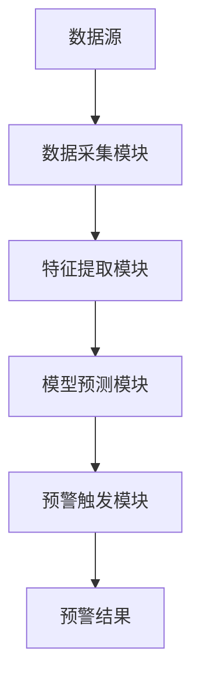

                 


# AI驱动的市场流动性风险预警

> 关键词：市场流动性风险、AI技术、机器学习、风险预警、金融数据分析

> 摘要：随着金融市场日益复杂化和数据化的推进，市场流动性风险的预警显得尤为重要。本文将从AI技术的角度，深入分析流动性风险的形成机制、AI在流动性风险预警中的应用价值，详细探讨基于机器学习的流动性风险预警算法，并通过实际案例展示AI驱动的流动性风险预警系统的构建与实现。

---

# 第一部分: 背景与概述

## 第1章: 市场流动性风险概述

### 1.1 市场流动性风险的定义与特征

#### 1.1.1 流动性风险的定义
流动性风险是指资产在短时间内无法以合理价格变现的风险。在金融市场中，流动性风险通常与市场的深度、广度和稳定性密切相关。

#### 1.1.2 流动性风险的核心特征
- **时间性**：流动性风险通常在市场波动剧烈时暴露。
- **传染性**：流动性风险可能在市场中快速传播，引发系统性风险。
- **复杂性**：流动性风险受到多种因素影响，包括市场参与者的交易行为、宏观经济环境等。

#### 1.1.3 流动性风险的分类与影响
流动性风险可以分为微观流动性风险和宏观流动性风险。微观流动性风险是指单个资产或机构的流动性风险，而宏观流动性风险则涉及整个金融系统的流动性问题。

流动性风险的影响包括：
- 资产贬值。
- 市场信心下降。
- 系统性风险增加。

### 1.2 市场流动性风险的形成机制

#### 1.2.1 市场参与者的交易行为
- 投资者情绪波动。
- 机构交易策略的调整。
- 市场参与者的行为异化。

#### 1.2.2 市场结构与流动性
- 市场深度与广度。
- 交易机制的复杂性。
- 市场参与者的多样性。

#### 1.2.3 宏观经济因素对流动性的影响
- 经济周期。
- 货币政策。
- 全球化与地缘政治因素。

### 1.3 流动性风险的预警意义

#### 1.3.1 预警的重要性
- 提前发现潜在风险。
- 减少经济损失。
- 维护市场稳定性。

#### 1.3.2 预警的经济价值
- 保护投资者利益。
- 维护金融机构的稳健运营。
- 促进金融市场的健康发展。

#### 1.3.3 预警的实现挑战
- 数据的实时性和准确性。
- 模型的复杂性和可解释性。
- 市场环境的动态变化。

### 1.4 本章小结
本章主要介绍了市场流动性风险的定义、特征、形成机制及其预警的必要性与挑战。流动性风险的复杂性和动态变化使得传统的预警方法难以应对，而AI技术的引入为解决这一问题提供了新的可能性。

---

## 第2章: AI技术与市场流动性风险预警的结合

### 2.1 AI技术在金融领域的应用

#### 2.1.1 AI在金融数据分析中的作用
- 数据清洗与特征提取。
- 高频交易中的模式识别。
- 风险评估与预测。

#### 2.1.2 AI在金融预测中的优势
- 处理海量数据的能力。
- 发现数据中的非线性关系。
- 实时分析与动态调整。

#### 2.1.3 AI在金融风险控制中的应用
- 信用风险评估。
- 市场风险预测。
- 操作风险监控。

### 2.2 AI驱动的流动性风险预警的必要性

#### 2.2.1 流动性风险的复杂性
- 多因素影响。
- 动态变化。
- 非线性关系。

#### 2.2.2 AI在处理复杂数据中的优势
- 高维数据处理能力。
- 非线性关系建模。
- 实时数据分析。

#### 2.2.3 AI在实时预警中的潜力
- 高频数据处理。
- 实时模型更新。
- 自动化预警触发。

### 2.3 当前市场流动性风险预警的痛点

#### 2.3.1 传统方法的局限性
- 数据处理能力有限。
- 模型可解释性差。
- 实时性不足。

#### 2.3.2 数据量与复杂度的挑战
- 海量数据的处理效率。
- 非线性关系的建模难度。
- 数据噪声的干扰。

#### 2.3.3 实时性与准确性之间的矛盾
- 高精度模型的计算成本高。
- 实时预警的延迟问题。
- 模型的泛化能力与适应性。

### 2.4 本章小结
本章探讨了AI技术在金融领域的广泛应用及其在流动性风险预警中的独特优势，同时也指出了当前预警方法的痛点和挑战。AI技术的引入为流动性风险预警提供了新的解决方案，但也需要克服一些技术和实现上的难题。

---

# 第二部分: AI驱动的流动性风险预警核心概念与算法

## 第3章: AI驱动的流动性风险预警核心概念

### 3.1 数据特征分析

#### 3.1.1 市场数据的特征提取
- 价格波动性。
- 交易量变化。
- 市场深度指标。
- 市场广度指标。

#### 3.1.2 数据特征与流动性风险的关系
- 高波动性通常伴随着低流动性。
- 交易量骤减可能预示流动性风险。
- 市场深度的快速下降是流动性风险的信号。

#### 3.1.3 数据预处理与标准化
- 数据清洗：去除噪声数据。
- 数据标准化：归一化处理。
- 数据特征选择：去除无关特征。

### 3.2 机器学习模型的选择与优化

#### 3.2.1 常见机器学习算法的对比
| 算法类型   | 优点                           | 缺点                           |
|------------|--------------------------------|--------------------------------|
| 线性回归   | 简单，计算效率高                 | 无法处理非线性关系               |
| 支持向量机 | 适用于高维数据                 | 参数选择敏感                   |
| 随机森林   | 高精度，易于处理缺失值         | 对数据量要求较高               |
| LSTM       | 能够捕捉时间序列中的模式       | 训练时间长，计算资源消耗大       |

#### 3.2.2 流动性风险预警模型的选择
- 根据数据特性选择模型。
- 结合业务需求选择模型。
- 通过实验验证模型性能。

#### 3.2.3 模型优化与调参
- 参数调优：如学习率、正则化参数。
- 模型融合：集成学习提高预测精度。
- 模型解释性：使用特征重要性分析。

### 3.3 实时预警系统的设计

#### 3.3.1 系统设计的目标
- 实时性：快速处理数据，及时预警。
- 准确性：高精度预测，减少误报和漏报。
- 可扩展性：支持大规模数据处理。

#### 3.3.2 系统设计的关键模块
- 数据采集模块。
- 特征提取模块。
- 模型预测模块。
- 预警触发模块。

#### 3.3.3 系统设计的实现路径
1. 数据采集：实时获取市场数据。
2. 特征提取：提取与流动性风险相关的特征。
3. 模型预测：使用训练好的模型进行预测。
4. 预警触发：根据预测结果触发预警机制。

### 3.4 本章小结
本章重点介绍了AI驱动的流动性风险预警中的核心概念，包括数据特征分析、机器学习模型的选择与优化，以及实时预警系统的设计。这些内容为后续的算法实现奠定了理论基础。

---

## 第4章: 流动性风险预警的算法原理

### 4.1 时间序列分析

#### 4.1.1 时间序列的基本概念
时间序列是指按时间顺序排列的数据，通常用于分析随时间变化的动态系统。

#### 4.1.2 时间序列分析的核心步骤
1. 数据预处理：清洗、标准化。
2. 模型选择：选择适合的时间序列模型。
3. 模型训练：训练模型，调整参数。
4. 模型预测：基于模型进行未来预测。

#### 4.1.3 常见的时间序列模型
| 模型类型   | 优点                           | 缺点                           |
|------------|--------------------------------|--------------------------------|
| ARIMA      | 适用于单变量时间序列           | 需要确定阶数参数               |
| LSTM       | 能够捕捉长期依赖关系           | 训练时间长，计算资源消耗大       |
| Prophet    | 易于实现，适合非专业人员使用     | 对数据分布假设敏感             |

### 4.2 特征工程

#### 4.2.1 特征选择的重要性
- 提高模型的预测精度。
- 减少计算复杂度。
- 提高模型的可解释性。

#### 4.2.2 常见的特征选择方法
1. 基于统计的方法：如卡方检验。
2. 基于模型的方法：如Lasso回归。
3. 基于树模型的方法：如随机森林的特征重要性。

#### 4.2.3 特征工程的实现步骤
1. 数据清洗：去除无效特征。
2. 特征变换：如标准化、归一化。
3. 特征组合：如将多个特征组合成新的特征。

### 4.3 模型训练与优化

#### 4.3.1 训练策略
- 分割数据集：训练集、验证集、测试集。
- 交叉验证：如K折交叉验证。
- 超参数调优：如网格搜索。

#### 4.3.2 模型评估指标
- 准确率：预测正确的比例。
- 召回率：实际为正被正确预测的比例。
- F1分数：综合准确率和召回率的指标。

#### 4.3.3 模型优化技巧
- 正则化：防止过拟合。
- 数据增强：增加训练数据的多样性。
- 集成学习：结合多个模型的结果。

### 4.4 本章小结
本章详细讲解了流动性风险预警中的算法原理，包括时间序列分析、特征工程和模型训练与优化。这些算法为后续的系统实现提供了技术支撑。

---

## 第5章: 系统架构与实现

### 5.1 系统架构设计

#### 5.1.1 系统功能模块
1. 数据采集模块：实时获取市场数据。
2. 特征提取模块：提取与流动性风险相关的特征。
3. 模型预测模块：使用训练好的模型进行预测。
4. 预警触发模块：根据预测结果触发预警机制。

#### 5.1.2 系统架构图


### 5.2 系统实现

#### 5.2.1 数据采集
- 数据来源：交易所API、数据供应商。
- 数据格式：时间序列数据，包含价格、交易量等信息。

#### 5.2.2 特征提取
- 特征列表：波动率、交易量、市场深度等。
- 特征工程：数据标准化、特征选择。

#### 5.2.3 模型训练
- 模型选择：基于实验选择最佳模型。
- 训练过程：数据预处理、模型训练、超参数调优。

#### 5.2.4 预警触发
- 预警规则：设置阈值，当预测结果超过阈值时触发预警。
- 预警方式：邮件通知、系统报警、短信提醒。

### 5.3 系统优化

#### 5.3.1 性能优化
- 优化算法：使用分布式计算、并行计算。
- 优化数据存储：使用高效数据库，如InfluxDB。

#### 5.3.2 可扩展性优化
- 模块化设计：各模块独立，便于扩展。
- 弹性计算：根据负载自动调整资源。

#### 5.3.3 可靠性优化
- 数据备份：定期备份数据，防止数据丢失。
- 系统监控：实时监控系统状态，及时发现并解决问题。

### 5.4 本章小结
本章详细设计了AI驱动的流动性风险预警系统的架构，并介绍了系统的实现过程。通过合理的系统架构和优化策略，可以提高系统的性能和可靠性。

---

## 第6章: 项目实战

### 6.1 项目背景与目标

#### 6.1.1 项目背景
- 数据来源：某交易所提供的市场数据。
- 数据范围：过去一年的交易数据。
- 项目目标：构建一个能够实时预警市场流动性风险的系统。

### 6.2 环境配置

#### 6.2.1 系统环境
- 操作系统：Linux/Windows/MacOS。
- 开发工具：Jupyter Notebook、VS Code。
- 依赖库：Python、TensorFlow、Pandas、Scikit-learn、LSTM库。

#### 6.2.2 数据准备
- 数据下载：使用API获取市场数据。
- 数据清洗：去除无效数据，填充缺失值。
- 数据分割：训练集、验证集、测试集。

### 6.3 核心代码实现

#### 6.3.1 数据预处理
```python
import pandas as pd
import numpy as np

# 加载数据
data = pd.read_csv('market_data.csv')

# 数据清洗
data.dropna(inplace=True)
data = data.iloc[:1000]  # 取前1000条数据

# 数据标准化
from sklearn.preprocessing import StandardScaler

scaler = StandardScaler()
scaled_data = scaler.fit_transform(data[['price', 'volume', 'depth']])

# 特征选择
features = scaled_data[:, :3]  # 选择前三个特征
```

#### 6.3.2 模型训练
```python
from keras.models import Sequential
from keras.layers import LSTM, Dense

# 模型定义
model = Sequential()
model.add(LSTM(50, input_shape=(None, 3)))
model.add(Dense(1))
model.compile(optimizer='adam', loss='mean_squared_error')

# 模型训练
model.fit(features, labels, epochs=50, batch_size=32)
```

#### 6.3.3 模型预测与预警
```python
# 预测
predicted = model.predict(features)

# 预警阈值
threshold = 0.5
alarms = predicted > threshold

# 触发预警
import smtplib
from email.mime.text import MIMEText
from email.mime.multipart import MIMEMultipart

# 发送邮件
msg = MIMEMultipart()
msg['Subject'] = '流动性风险预警'
msg['From'] = 'alert@example.com'
msg['To'] = 'risk_manager@example.com'

body = '预警：预测未来24小时内可能出现流动性风险。'
msg.attach(MIMEText(body, 'plain'))

# 发送邮件
server = smtplib.SMTP('smtp.example.com', 587)
server.starttls()
server.login('alert@example.com', 'password')
server.sendmail('alert@example.com', 'risk_manager@example.com', msg.as_string())
server.quit()
```

### 6.4 项目小结
本章通过一个具体的项目实战，详细展示了AI驱动的流动性风险预警系统的实现过程。从数据准备到模型训练，再到系统部署，每一步都进行了详细的代码实现和说明。

---

## 第7章: 总结与展望

### 7.1 总结

#### 7.1.1 核心内容回顾
- 流动性风险的定义与特征。
- AI技术在流动性风险预警中的应用。
- 基于机器学习的流动性风险预警算法。
- 系统架构与实现。

#### 7.1.2 实践中的注意事项
- 数据质量的重要性。
- 模型调优的必要性。
- 系统维护与优化。

### 7.2 未来展望

#### 7.2.1 技术发展
- 更先进的算法：如深度学习、强化学习。
- 多模态数据的融合：如NLP技术分析新闻对市场的影响。

#### 7.2.2 应用拓展
- 更广泛的应用场景：如跨境金融、机构投资。
- 更智能的预警系统：结合区块链技术，实现去中心化的流动性风险预警。

### 7.3 本章小结
本章总结了全文的主要内容，并展望了AI技术在流动性风险预警领域的未来发展方向。随着技术的进步，流动性风险预警将更加智能化、精准化和实时化。

---

# 作者：AI天才研究院/AI Genius Institute & 禅与计算机程序设计艺术 /Zen And The Art of Computer Programming

