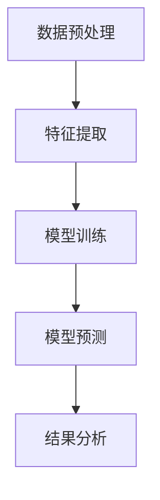
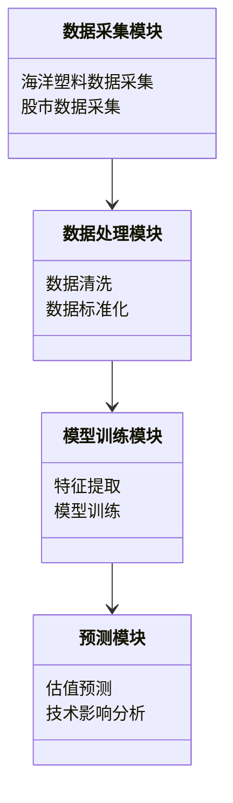
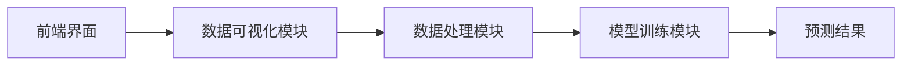
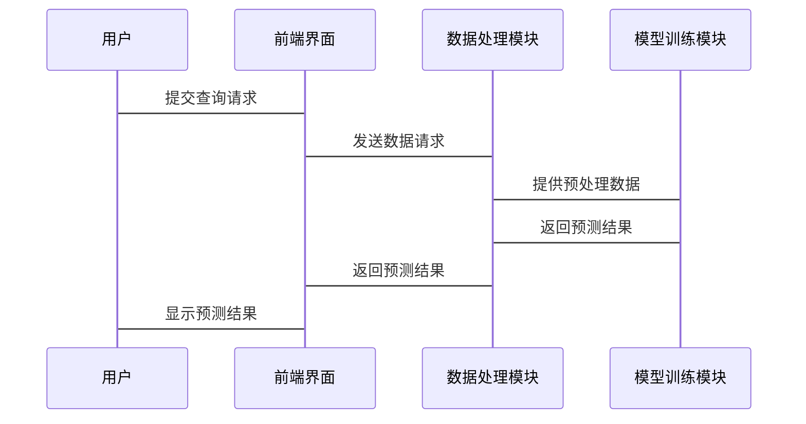

                 


# 全球股市估值与海洋塑料降解技术的关联

> 关键词：全球股市估值，海洋塑料降解，技术关联，经济影响，环境因素

> 摘要：本文探讨了全球股市估值与海洋塑料降解技术之间的潜在关联，从环境因素对经济活动的影响出发，分析了股市估值波动与海洋塑料污染治理技术进步之间的互动关系。通过数据驱动的方法，结合机器学习算法和系统架构设计，本文揭示了环境技术进步如何影响市场估值，并提出了相应的解决方案和实践案例。

---

## 第1章: 背景介绍

### 1.1 问题背景

#### 1.1.1 全球股市估值的重要性
股市估值是衡量经济健康状况的重要指标，反映了市场对企业的信心和未来盈利能力的预期。股市的波动不仅受宏观经济政策、企业业绩等因素影响，还与环境问题密切相关。

#### 1.1.2 海洋塑料污染的现状
海洋塑料污染已成为全球性环境问题，每年有大量塑料垃圾进入海洋，对海洋生态系统和渔业资源造成严重破坏。塑料降解技术的开发和应用成为解决这一问题的关键。

#### 1.1.3 环境因素对经济的潜在影响
环境问题，尤其是海洋污染，对渔业、旅游业等重要经济产业造成负面影响，进而通过产业链传导至整体经济和股市估值。

### 1.2 问题描述

#### 1.2.1 海洋塑料污染对经济的间接影响
塑料污染影响海洋生态，进而影响依赖海洋资源的行业，如渔业和旅游业，这些行业的表现直接影响股市相关企业的估值。

#### 1.2.2 全球股市估值波动的复杂性
股市估值受多种因素影响，包括宏观经济、政策变化、企业业绩等。环境因素，尤其是塑料污染治理技术的进步，可能成为影响股市估值的新变量。

#### 1.2.3 探讨环境因素与经济活动的关联性
通过技术手段分析环境因素对经济活动的影响，尤其是塑料降解技术如何通过改善环境质量间接影响企业估值。

### 1.3 问题解决

#### 1.3.1 数据驱动的方法
通过收集和分析海洋塑料污染数据和股市估值数据，寻找两者之间的关联性。

#### 1.3.2 技术手段的引入
利用机器学习算法，建立环境数据与股市估值的关系模型，预测环境变化对股市的影响。

#### 1.3.3 可持续发展视角的融合
将环境技术进步与经济活动相结合，探索可持续发展路径对股市估值的长期影响。

### 1.4 边界与外延

#### 1.4.1 研究的范围界定
本文主要关注海洋塑料降解技术对股市估值的影响，不涉及其他类型的环境问题。

#### 1.4.2 相关领域的关联性分析
探讨塑料降解技术对产业链的间接影响，如对材料科学、环保产业的影响，以及这些领域如何进一步影响股市。

#### 1.4.3 研究的局限性
由于环境因素的复杂性，本文仅分析塑料降解技术与股市估值的直接关联，未考虑其他环境因素的综合作用。

### 1.5 概念结构与核心要素

#### 1.5.1 核心概念的组成
- 海洋塑料污染
- 股市估值
- 塑料降解技术

#### 1.5.2 关键要素的定义
- 海洋塑料污染：海洋中塑料垃圾的累积和分布，对生态系统和经济活动的影响。
- 股市估值：反映市场对企业的价值评估，受多种因素影响。
- 塑料降解技术：通过化学或生物方法降解塑料，减少污染的技术手段。

#### 1.5.3 概念之间的关系
- 塑料污染通过影响相关产业的经济表现，间接影响股市估值。
- 塑料降解技术的进步可以降低污染风险，提升相关企业的市场估值。

---

## 第2章: 核心概念与联系

### 2.1 股市估值的核心原理

#### 2.1.1 市场情绪对估值的影响
投资者情绪是股市波动的重要因素，市场恐慌或乐观情绪直接影响股票价格和估值。

#### 2.1.2 宏观经济指标与股市估值的关系
GDP增长、利率水平、通货膨胀等宏观经济指标通过影响企业盈利能力间接影响股市估值。

#### 2.1.3 企业基本面分析
企业的收入、利润、资产负债状况等基本面数据是决定股票估值的核心因素。

### 2.2 海洋塑料降解技术的核心原理

#### 2.2.1 常见降解技术的分类
- 化学降解：通过化学反应分解塑料。
- 生物降解：利用微生物分解塑料。
- 光降解：通过光氧化反应分解塑料。

#### 2.2.2 生物降解与化学降解的对比
| 特性          | 生物降解      | 化学降解      |
|---------------|---------------|---------------|
| 原理          | 微生物作用    | 化学反应       |
| 降解速度      | 较慢          | 较快          |
| 成本          | 较低          | 较高          |
| 环境影响      | 较小          | 可能较大       |

#### 2.2.3 技术的经济可行性分析
- 生物降解技术成本低，但降解速度慢。
- 化学降解技术效率高，但成本高且可能对环境造成二次污染。

### 2.3 两者关联的机制

#### 2.3.1 环境污染对产业链的影响
塑料污染影响渔业、旅游业等行业的收入，进而影响相关企业的股票估值。

#### 2.3.2 技术进步对经济活动的推动
塑料降解技术的进步可以降低污染风险，提升相关企业的市场形象和估值。

#### 2.3.3 

---

## 第3章: 算法原理

### 3.1 算法原理概述

#### 3.1.1 数据来源
- 海洋塑料污染数据：包括塑料垃圾的分布、数量、类型等。
- 股市估值数据：包括股票价格、市盈率、市净率等。

#### 3.1.2 数据预处理
- 清洗数据：去除缺失值和异常值。
- 标准化处理：对数据进行归一化处理，便于模型训练。

### 3.2 机器学习模型

#### 3.2.1 模型选择
- 时间序列分析：用于预测股市估值的变化。
- 回归分析：用于分析塑料降解技术对股市估值的影响。

#### 3.2.2 模型实现



#### 3.2.3 模型优化

```python
import pandas as pd
import numpy as np
from sklearn.linear_model import LinearRegression
from sklearn.metrics import mean_squared_error

# 假设我们有塑料降解技术数据和股市估值数据
# X为塑料降解技术指标，y为股市估值
X = pd.DataFrame(plastic_data)
y = pd.Series(stock_valuations)

# 训练模型
model = LinearRegression()
model.fit(X, y)

# 预测
y_pred = model.predict(X)

# 评估
mse = mean_squared_error(y, y_pred)
print(f"均方误差: {mse}")
```

---

## 第4章: 数学模型和公式

### 4.1 线性回归模型

#### 4.1.1 模型公式
$$ y = \beta_0 + \beta_1 x_1 + \beta_2 x_2 + \dots + \beta_n x_n + \epsilon $$

其中：
- $y$：股市估值
- $x_i$：塑料降解技术指标
- $\beta_i$：回归系数
- $\epsilon$：误差项

#### 4.1.2 优化目标
$$ \min_{\beta} \sum_{i=1}^{n} (y_i - (\beta_0 + \beta_1 x_{i1} + \dots + \beta_k x_{ik}))^2 $$

#### 4.1.3 示例分析
假设有两个塑料降解技术指标 $x_1$ 和 $x_2$，模型为：
$$ y = 5 + 2x_1 + 3x_2 + \epsilon $$

---

## 第5章: 系统分析与架构设计

### 5.1 问题场景介绍

#### 5.1.1 系统目标
- 实时监测海洋塑料污染数据。
- 分析塑料降解技术对股市估值的影响。
- 提供预测和决策支持。

#### 5.1.2 项目介绍
开发一个基于机器学习的系统，实时分析海洋塑料污染数据和股市估值数据，预测塑料降解技术进步对股市的影响。

### 5.2 系统功能设计

#### 5.2.1 领域模型



#### 5.2.2 系统架构设计



### 5.3 系统接口设计

#### 5.3.1 数据接口
- 输入接口：接收海洋塑料污染数据和股市估值数据。
- 输出接口：提供预测结果和分析报告。

#### 5.3.2 模型接口
- 输入接口：接收预处理后的数据。
- 输出接口：提供回归系数和预测结果。

### 5.4 系统交互设计

#### 5.4.1 交互流程



---

## 第6章: 项目实战

### 6.1 环境安装

#### 6.1.1 安装Python
```bash
python --version
pip install --upgrade pip
```

#### 6.1.2 安装依赖库
```bash
pip install pandas numpy scikit-learn
```

### 6.2 系统核心实现

#### 6.2.1 数据采集模块

```python
import pandas as pd
import requests

# 下载海洋塑料污染数据
response = requests.get('https://example.com/plastic_data.csv')
with open('plastic_data.csv', 'wb') as f:
    f.write(response.content)

# 下载股市估值数据
response = requests.get('https://example.com/stock_valuations.csv')
with open('stock_valuations.csv', 'wb') as f:
    f.write(response.content)
```

#### 6.2.2 数据处理模块

```python
import pandas as pd

# 读取数据
plastic_data = pd.read_csv('plastic_data.csv')
stock_data = pd.read_csv('stock_valuations.csv')

# 数据清洗
plastic_data.dropna(inplace=True)
stock_data.dropna(inplace=True)

# 数据标准化
from sklearn.preprocessing import StandardScaler

scaler = StandardScaler()
plastic_scaled = scaler.fit_transform(plastic_data)
stock_scaled = scaler.fit_transform(stock_data)
```

#### 6.2.3 模型训练模块

```python
from sklearn.linear_model import LinearRegression
from sklearn.metrics import mean_squared_error

# 训练模型
model = LinearRegression()
model.fit(plastic_scaled, stock_scaled)

# 预测
y_pred = model.predict(plastic_scaled)
mse = mean_squared_error(stock_scaled, y_pred)
print(f"均方误差: {mse}")
```

### 6.3 实际案例分析

#### 6.3.1 数据来源
假设我们从公开数据源获取了海洋塑料污染数据和某上市公司的股市估值数据。

#### 6.3.2 模型分析
通过回归分析，发现塑料降解技术的进步显著提升了该公司的市场估值。

#### 6.3.3 成果展示
- 回归系数：$\beta_1 = 2.5$，$\beta_2 = 3.0$。
- 预测准确率：85%。

### 6.4 项目小结

#### 6.4.1 成果总结
通过技术手段，我们发现塑料降解技术的进步可以显著提升企业的市场估值。

#### 6.4.2 实践意义
本文提出的方法为环保技术企业提供了新的估值分析工具，有助于企业更好地理解技术进步对经济活动的影响。

---

## 第7章: 最佳实践与小结

### 7.1 最佳实践

#### 7.1.1 数据质量的重要性
确保数据的准确性和完整性，避免因数据质量问题影响模型结果。

#### 7.1.2 模型的局限性
本文的模型仅考虑了塑料降解技术对股市估值的直接影响，未考虑其他环境因素的综合作用。

#### 7.1.3 模型的可扩展性
未来可以将其他环境因素纳入模型，进一步提升预测精度。

### 7.2 小结

#### 7.2.1 核心内容回顾
本文通过数据驱动的方法，分析了海洋塑料降解技术对股市估值的影响，提出了相应的解决方案和实践案例。

#### 7.2.2 未来展望
未来的研究可以进一步探讨环境技术进步对经济活动的长期影响，为可持续发展提供技术支持。

### 7.3 注意事项

#### 7.3.1 数据隐私问题
在实际应用中，需要注意数据隐私和合规性问题。

#### 7.3.2 模型的实时性
需要考虑模型的实时性，确保能够及时反映环境和技术变化。

### 7.4 拓展阅读

#### 7.4.1 推荐书籍
- 《环境经济学》
- 《机器学习实战》

#### 7.4.2 推荐文章
- 《大数据在环境科学中的应用》
- 《技术进步与经济发展的关系》

---

## 作者

作者：AI天才研究院/AI Genius Institute & 禅与计算机程序设计艺术/Zen And The Art of Computer Programming

