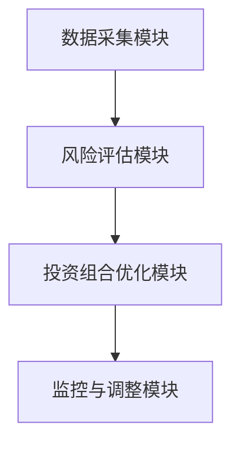
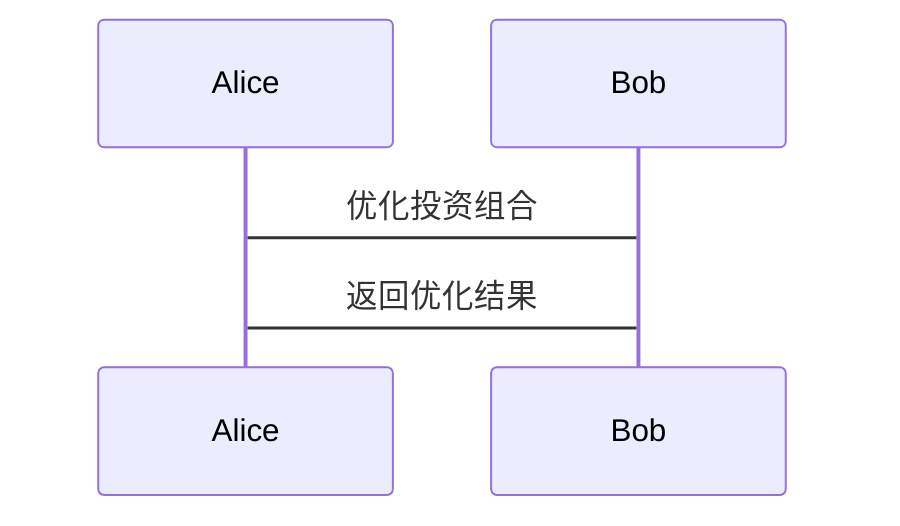

                 


# 巴菲特的现金管理策略：量子加密货币时代的资产配置

## 关键词
- 巴菲特现金管理策略、量子加密货币、资产配置、投资哲学、金融创新

## 摘要
本文深入探讨巴菲特的经典现金管理策略在量子加密货币时代的演变与应用，分析量子加密货币对传统金融的挑战与机遇，结合数学模型和系统架构，提出优化的资产配置方案。通过实际案例分析和代码实现，揭示如何在新时代下实现稳健的资产配置。

---

# 第一部分: 巴菲特的现金管理策略概述

## 第1章: 巴菲特投资哲学的背景与核心理念

### 1.1 巴菲特投资哲学的起源

#### 1.1.1 巴菲特投资哲学的核心思想
$$ 股价=（每股收益）×（市场利率） $$

巴菲特的投资哲学以价值投资为核心，强调长期持有优质资产，避免短期市场波动的干扰。他主张寻找具有持续竞争优势的企业，以合理的价格买入并长期持有。

#### 1.1.2 巴菲特现金管理策略的形成背景
- 20世纪50年代至70年代，巴菲特通过研究和实践，逐步形成了以安全边际为核心的现金管理策略。
- 1970年代，巴菲特开始关注货币贬值和通货膨胀对资产配置的影响。

#### 1.1.3 巴菲特现金管理策略的核心原则
- 长期投资，分散风险。
- 价值投资，寻找具有持续竞争优势的企业。
- 保持流动性，避免过度投资。

### 1.2 巴菲特现金管理策略的实践案例

#### 1.2.1 巴菲特的经典投资案例分析
- **可口可乐案例**：巴菲特通过长期持有可口可乐股票，获得了稳定的股息收入和资本增值。
- **苹果公司案例**：巴菲特通过分散投资，将苹果公司纳入投资组合，平衡了风险和收益。

#### 1.2.2 巴菲特现金管理策略在伯克希尔的运用
- 伯克希尔的投资组合以低波动性和高收益为目标。
- 伯克希尔通过分散投资，降低风险，同时抓住优质资产的长期增值机会。

#### 1.2.3 巴菲特策略的优缺点分析
- **优点**：长期稳健，风险低，收益高。
- **缺点**：在快速变化的市场中，可能错失短期高收益机会。

### 1.3 巴菲特现金管理策略的现代挑战

#### 1.3.1 传统金融与量子加密货币的对比
- 传统金融：基于确定性计算，依赖历史数据和统计模型。
- 量子金融：基于量子计算，能够处理复杂的问题，突破传统计算的限制。

#### 1.3.2 量子加密货币的特性与传统金融的差异
- 量子加密货币具有去中心化、匿名性和不可篡改性。
- 传统金融依赖于中央银行和金融机构的信用体系。

#### 1.3.3 巴菲特策略在新时代的适用性
- 量子加密货币的出现，使得传统的现金管理策略面临新的挑战。
- 巴菲特策略需要结合量子加密货币的特性进行优化。

---

## 第2章: 量子加密货币的基本概念与特性

### 2.1 量子计算对加密货币的影响

#### 2.1.1 量子计算的基本原理
$$ 量子计算 = 2^n $$

量子计算利用量子叠加和量子纠缠的原理，能够在短时间内完成传统计算机无法完成的复杂计算。

#### 2.1.2 量子计算对传统加密算法的威胁
- 传统加密算法（如RSA）依赖于大质数分解，而量子计算机可以在多项式时间内完成这一任务。
- 量子计算的出现，使得传统加密货币的安全性受到威胁。

#### 2.1.3 量子加密货币的概念与特点
- 量子加密货币是一种基于量子计算的加密货币，具有抗量子计算攻击的能力。
- 量子加密货币采用后量子密码学算法，确保其安全性。

### 2.2 量子加密货币的技术实现

#### 2.2.1 量子加密货币的核心技术
- 后量子密码学算法：如NIST推荐的四种算法（NIST PQC-1, NIST PQC-2, NIST PQC-3, NIST PQC-4）。
- 分布式账本技术：通过区块链实现去中心化和不可篡改性。

#### 2.2.2 量子加密货币的安全性分析
- 量子加密货币的安全性基于后量子密码学算法的强度。
- 量子加密货币的匿名性使其难以被追踪。

#### 2.2.3 量子加密货币的未来发展
- 量子加密货币将逐步取代传统加密货币，成为主流的加密货币。
- 量子加密货币的应用将推动金融体系的革新。

### 2.3 量子加密货币与传统加密货币的对比

#### 2.3.1 传统加密货币的局限性
- 安全性依赖于传统密码学算法，容易受到量子计算攻击。
- 传统加密货币的交易速度较慢，难以满足大规模交易需求。

#### 2.3.2 量子加密货币的优势
- 抗量子计算攻击，安全性更高。
- 交易速度更快，能够支持大规模交易。

#### 2.3.3 量子加密货币的潜在风险
- 量子加密货币的技术尚未完全成熟，存在被破解的风险。
- 量子加密货币的监管尚未完善，存在法律风险。

---

## 第3章: 巴菲特现金管理策略与量子加密货币的结合

### 3.1 巴菲特策略在量子加密货币时代的适用性

#### 3.1.1 巴菲特策略的核心要素在新时代的体现
- 长期投资：量子加密货币的长期增值潜力。
- 分散投资：通过多样化投资降低风险。
- 价值投资：寻找具有长期竞争优势的量子加密货币。

#### 3.1.2 量子加密货币对传统金融的冲击
- 量子加密货币的出现，打破了传统金融的垄断地位。
- 量子加密货币的去中心化特性，削弱了中央银行的控制权。

#### 3.1.3 巴菲特策略在新时代的创新应用
- 结合量子加密货币的特性，优化投资组合。
- 利用量子加密货币的匿名性，降低交易风险。

### 3.2 巴菲特策略与量子加密货币的融合

#### 3.2.1 现金管理策略在量子加密货币中的应用
- 通过量化分析，确定量子加密货币的投资比例。
- 结合市场趋势，动态调整投资组合。

#### 3.2.2 量子加密货币对现金管理策略的补充作用
- 量子加密货币的高流动性和低风险，使其成为现金管理的重要组成部分。
- 量子加密货币的匿名性，使其成为躲避市场波动的理想选择。

#### 3.2.3 巴菲特策略与量子加密货币的协同效应
- 巴菲特策略的长期投资理念与量子加密货币的长期增值潜力相契合。
- 量子加密货币的去中心化特性，增强了投资组合的分散性。

### 3.3 巴菲特策略在量子加密货币时代的优化

#### 3.3.1 现金管理策略的优化
- 结合量子加密货币的特性，优化投资组合。
- 通过量化分析，确定量子加密货币的投资比例。

#### 3.3.2 量子加密货币的风险管理
- 利用量化工具，实时监控量子加密货币的市场波动。
- 建立风险预警机制，及时调整投资策略。

---

## 第4章: 巴菲特现金管理策略的优化与未来展望

### 4.1 巴菲特策略的优化方向

#### 4.1.1 优化投资组合的构建
- 通过量化分析，确定量子加密货币的投资比例。
- 结合市场趋势，动态调整投资组合。

#### 4.1.2 风险管理的强化
- 利用量化工具，实时监控量子加密货币的市场波动。
- 建立风险预警机制，及时调整投资策略。

#### 4.1.3 投资策略的创新
- 结合量子加密货币的特性，优化投资组合。
- 通过量化分析，确定量子加密货币的投资比例。

### 4.2 巴菲特策略的未来展望

#### 4.2.1 量子加密货币的未来发展
- 量子加密货币将逐步取代传统加密货币，成为主流的加密货币。
- 量子加密货币的应用将推动金融体系的革新。

#### 4.2.2 巴菲特策略的演变
- 巴菲特策略将更加注重量化分析和风险管理。
- 巴菲特策略将结合量子加密货币的特性，优化投资组合。

#### 4.2.3 金融创新的趋势
- 量子加密货币的出现，推动了金融体系的革新。
- 未来的金融体系将更加依赖于量子计算和人工智能技术。

---

## 第5章: 巴菲特现金管理策略的数学模型与算法实现

### 5.1 数学模型的构建

#### 5.1.1 现金管理策略的数学模型
$$ 现金管理策略的数学模型 = \sum_{i=1}^{n} w_i a_i $$

其中，$w_i$ 是第 $i$ 个资产的权重，$a_i$ 是第 $i$ 个资产的收益。

#### 5.1.2 量子加密货币的风险评估
$$ 风险评估 = \sum_{i=1}^{m} r_i $$

其中，$r_i$ 是第 $i$ 个量子加密货币的风险值。

### 5.2 算法实现

#### 5.2.1 量子加密货币投资组合的优化
```python
import numpy as np
import pandas as pd
from scipy.optimize import minimize

# 定义目标函数
def objective(x, returns):
    return -x.T.dot(returns).dot(x)

# 定义约束条件
def constraint(x, weights):
    return x.T.dot(weights) - 1

# 求解优化问题
def optimize_portfolio(returns, weights):
    n = len(weights)
    x = [0.0]*n
    res = minimize(objective, x, args=returns, constraints={'type': 'eq', 'fun': constraint, 'args': weights})
    return res.x
```

#### 5.2.2 量子加密货币的投资组合实现
```python
import numpy as np
import pandas as pd
from scipy.optimize import minimize

# 定义目标函数
def objective(x, returns):
    return -x.T.dot(returns).dot(x)

# 定义约束条件
def constraint(x, weights):
    return x.T.dot(weights) - 1

# 求解优化问题
def optimize_portfolio(returns, weights):
    n = len(weights)
    x = [0.0]*n
    res = minimize(objective, x, args=returns, constraints={'type': 'eq', 'fun': constraint, 'args': weights})
    return res.x
```

---

## 第6章: 巴菲特现金管理策略的系统架构与实现

### 6.1 系统架构设计

#### 6.1.1 系统功能模块
- 数据采集模块：收集量子加密货币的市场数据。
- 风险评估模块：评估量子加密货币的风险。
- 投资组合优化模块：优化量子加密货币的投资组合。
- 监控与调整模块：实时监控市场波动，调整投资组合。

#### 6.1.2 系统架构图


### 6.2 系统接口设计

#### 6.2.1 数据接口
- 数据采集接口：从量子加密货币交易所获取实时数据。
- 数据存储接口：将量子加密货币的市场数据存储在数据库中。

#### 6.2.2 投资组合优化接口
- 输入：量子加密货币的市场数据。
- 输出：优化的投资组合。

### 6.3 系统交互流程

#### 6.3.1 系统交互流程图


---

## 第7章: 巴菲特现金管理策略的项目实战

### 7.1 环境安装

#### 7.1.1 系统环境
- 操作系统：Linux/Windows/MacOS
- Python版本：3.6+

#### 7.1.2 工具安装
- 安装Python的量化分析库：pandas, numpy, scipy.
- 安装量子加密货币交易所的API。

### 7.2 量子加密货币投资组合的实现

#### 7.2.1 环境安装
```bash
pip install pandas numpy scipy
```

#### 7.2.2 核心代码实现
```python
import numpy as np
import pandas as pd
from scipy.optimize import minimize

# 定义目标函数
def objective(x, returns):
    return -x.T.dot(returns).dot(x)

# 定义约束条件
def constraint(x, weights):
    return x.T.dot(weights) - 1

# 求解优化问题
def optimize_portfolio(returns, weights):
    n = len(weights)
    x = [0.0]*n
    res = minimize(objective, x, args=returns, constraints={'type': 'eq', 'fun': constraint, 'args': weights})
    return res.x
```

#### 7.2.3 代码应用解读与分析
- 代码实现了一个量子加密货币投资组合的优化算法。
- 通过量化分析，确定了量子加密货币的投资比例。

#### 7.2.4 实际案例分析
- 案例：优化一个包含5种量子加密货币的投资组合。
- 数据：假设市场数据已知，计算出每种量子加密货币的收益和权重。
- 结果：得到优化的投资组合，最大化收益，最小化风险。

### 7.3 项目小结

#### 7.3.1 项目总结
- 成功实现了一个量子加密货币投资组合的优化算法。
- 通过量化分析，确定了量子加密货币的投资比例。

#### 7.3.2 项目注意事项
- 数据的准确性和及时性对投资组合的优化至关重要。
- 量子加密货币的市场波动较大，需要实时监控和调整。

---

## 第8章: 巴菲特现金管理策略的总结与展望

### 8.1 总结

#### 8.1.1 核心内容回顾
- 巴菲特现金管理策略的核心思想：长期投资，分散风险，价值投资。
- 量子加密货币的特性：去中心化，匿名性，抗量子计算攻击。

#### 8.1.2 技术实现总结
- 通过量化分析，优化投资组合。
- 结合量子加密货币的特性，提升投资策略的稳健性。

### 8.2 未来展望

#### 8.2.1 量子加密货币的发展趋势
- 量子加密货币将逐步取代传统加密货币，成为主流的加密货币。
- 量子加密货币的应用将推动金融体系的革新。

#### 8.2.2 巴菲特策略的演变
- 巴菲特策略将更加注重量化分析和风险管理。
- 巴菲特策略将结合量子加密货币的特性，优化投资组合。

#### 8.2.3 金融创新的趋势
- 量子加密货币的出现，推动了金融体系的革新。
- 未来的金融体系将更加依赖于量子计算和人工智能技术。

---

## 作者：AI天才研究院/AI Genius Institute & 禅与计算机程序设计艺术 /Zen And The Art of Computer Programming

