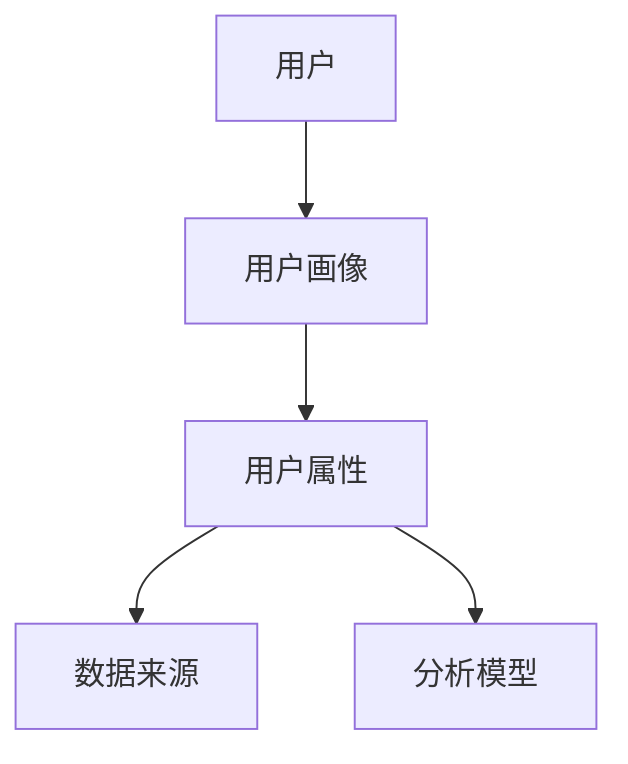
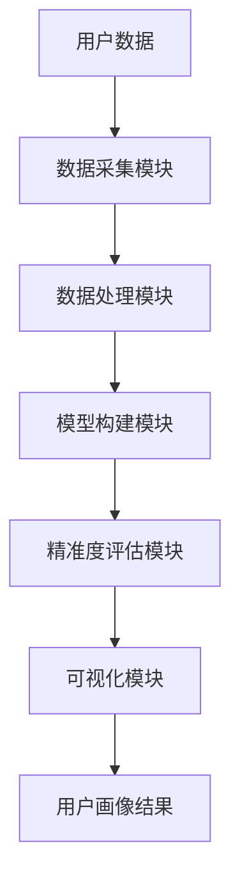
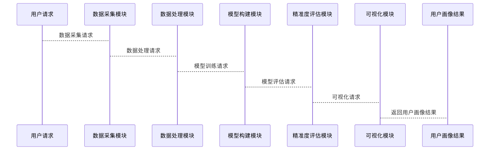

                 


# 彼得林奇如何分析公司的用户画像精准度

**关键词**：用户画像、彼得林奇、精准度分析、投资决策、数据分析、机器学习

**摘要**：本文深入探讨了彼得林奇的投资理念与用户画像精准度分析的结合，通过背景介绍、核心概念、算法原理、系统设计、项目实战等多维度分析，展示了如何利用现代数据科学方法提升用户画像的精准度，进而优化投资决策。文章结合实际案例和代码实现，详细讲解了相关技术原理，并提出了最佳实践建议。

---

## 第一部分：背景介绍

### 第1章：用户画像精准度分析的背景与重要性

#### 1.1 用户画像的定义与核心概念

- **1.1.1 用户画像的定义**  
  用户画像是基于用户的行为数据、属性数据和交互数据，构建的用户特征模型。它能够帮助企业更好地理解用户需求、行为习惯和价值分布。

- **1.1.2 用户画像的核心要素**  
  - 用户的基本属性：年龄、性别、职业、地理位置等。  
  - 用户的行为特征：消费习惯、使用频率、偏好等。  
  - 用户的价值评估：生命周期阶段、收入贡献等。  

- **1.1.3 用户画像的构建过程**  
  1. 数据采集：通过问卷、埋点、API接口等方式获取用户数据。  
  2. 数据清洗：去除无效数据，处理缺失值和异常值。  
  3. 数据建模：利用机器学习算法（如聚类、分类）进行用户分群和特征提取。  
  4. 数据可视化：通过图表展示用户画像，便于理解和分析。  

- **1.1.4 用户画像精准度的定义与衡量标准**  
  用户画像精准度是指用户画像与真实用户特征的匹配程度。衡量标准包括：  
  - 数据的完整性：是否覆盖了用户的核心特征。  
  - 数据的准确性：用户画像是否准确反映了用户的实际行为和属性。  
  - 数据的可解释性：用户画像是否易于理解和应用于实际场景。  

#### 1.2 彼得林奇分析方法的背景

- **1.2.1 彼得林奇投资理念的简介**  
  彼得林奇是著名的投资专家，其核心理念是通过深入研究公司基本面，寻找具有长期增长潜力的企业进行投资。他认为，成功的投资依赖于对公司的深入了解，包括公司文化、管理团队、市场地位等。  

- **1.2.2 彼得林奇分析框架的核心思想**  
  彼得林奇的分析框架强调对企业进行全面的了解，包括：  
  1. 企业的财务状况：收入、利润、现金流等。  
  2. 企业的市场地位：行业排名、竞争对手分析。  
  3. 企业的管理团队：管理层的背景、能力和决策风格。  
  4. 企业的未来增长潜力：市场需求、技术创新、竞争优势等。  

- **1.2.3 用户画像精准度分析与投资决策的关系**  
  用户画像是企业了解用户需求和行为的重要工具。通过精准的用户画像，投资者可以更好地理解企业的目标客户群体，从而评估企业的市场定位、用户满意度和潜在增长空间。这为投资决策提供了重要的数据支持。  

#### 1.3 本章小结

本章介绍了用户画像的核心概念和彼得林奇的分析框架，强调了用户画像精准度在投资决策中的重要性。通过构建精准的用户画像，投资者可以更深入地了解企业的用户基础，从而做出更明智的投资决策。

---

## 第二部分：核心概念与联系

### 第2章：用户画像精准度分析的核心概念

#### 2.1 用户画像的构建过程

- **2.1.1 数据采集与清洗**  
  数据采集是用户画像构建的第一步。常见的数据来源包括：  
  1. **问卷调查**：通过线上或线下的问卷收集用户的基本信息和偏好。  
  2. **埋点数据**：通过在产品中嵌入跟踪代码，收集用户的操作行为数据。  
  3. **API接口**：通过第三方数据接口获取用户的公开数据（如社交媒体数据）。  

  数据清洗是确保数据质量的关键步骤，包括：  
  - 去除重复数据。  
  - 处理缺失值（如使用均值、中位数或删除缺失数据）。  
  - 识别和处理异常值（如通过箱线图检测异常值）。  

- **2.1.2 数据特征提取**  
  数据特征提取是通过分析数据，提取能够反映用户特征的关键指标。常见的特征提取方法包括：  
  - **统计特征**：如均值、方差、分布等。  
  - **文本特征**：如关键词提取、情感分析等。  
  - **行为特征**：如用户活跃度、使用频率等。  

- **2.1.3 数据建模与分析**  
  数据建模是通过机器学习算法对用户数据进行建模，提取深层次的用户特征。常见的建模方法包括：  
  - **聚类分析**：将用户分为不同的群体，识别用户群之间的差异。  
  - **分类分析**：根据用户特征进行分类，如 churn 分析（预测用户流失）。  
  - **回归分析**：分析用户特征与目标变量之间的关系。  

#### 2.2 用户画像精准度的评估方法

- **2.2.1 基于统计学的评估方法**  
  统计学方法通过分析数据的分布、相关性等指标，评估用户画像的准确性。  
  1. **Kappa系数**：衡量分类模型的准确度，公式为：  
     $$ \kappa = \frac{p - p_e}{1 - p_e} $$  
     其中，$p$ 是观察准确率，$p_e$ 是随机准确率。  
  2. **AUC曲线**：用于评估分类模型的区分能力，AUC值越接近1，模型性能越好。  

- **2.2.2 基于机器学习的评估方法**  
  机器学习方法通过训练模型预测用户特征，评估模型的预测准确度。  
  1. **交叉验证**：通过将数据划分为训练集和验证集，评估模型的泛化能力。  
  2. **混淆矩阵**：通过计算精确率、召回率、F1值等指标，评估模型的分类性能。  
     $$ F1 = 2 \times \frac{\text{精确率} \times \text{召回率}}{\text{精确率} + \text{召回率}} $$  

- **2.2.3 基于用户行为反馈的评估方法**  
  通过用户行为数据（如点击、购买、反馈等），评估用户画像的准确性。  
  1. **A/B测试**：通过对比不同用户群体的行为数据，验证用户画像的准确性。  
  2. **用户反馈**：通过问卷或访谈收集用户对画像的感知和反馈。  

#### 2.3 彼得林奇分析框架与用户画像的结合

- **2.3.1 彼得林奇分析框架的核心要素**  
  彼得林奇的分析框架强调对企业进行全面的了解，包括：  
  1. **企业的财务状况**：收入、利润、现金流等。  
  2. **企业的市场地位**：行业排名、竞争对手分析。  
  3. **企业的管理团队**：管理层的背景、能力和决策风格。  
  4. **企业的未来增长潜力**：市场需求、技术创新、竞争优势等。  

- **2.3.2 用户画像在投资决策中的应用**  
  用户画像是企业了解用户需求和行为的重要工具。通过精准的用户画像，投资者可以更好地理解企业的目标客户群体，从而评估企业的市场定位、用户满意度和潜在增长空间。这为投资决策提供了重要的数据支持。  

- **2.3.3 精准度分析对投资决策的影响**  
  精准的用户画像能够帮助投资者更准确地评估企业的用户基础，从而更好地预测企业的收入增长、用户留存率和市场扩展能力。这为投资决策提供了更有力的支持。  

#### 2.4 核心概念对比表格

| **核心概念**       | **定义**                                                                 |
|--------------------|--------------------------------------------------------------------------|
| 用户画像           | 基于用户数据构建的用户特征模型，用于描述用户的行为、属性和价值。                 |
| 精准度分析         | 通过数据科学方法评估用户画像的准确性，确保用户画像与真实用户特征一致。             |
| 彼得林奇分析框架   | 通过对企业进行全面分析，评估企业的投资价值和成长潜力。                           |
| 数据挖掘           | 利用算法从数据中提取有用信息，支持用户画像的构建和精准度分析。                   |

#### 2.5 ER实体关系图



---

## 第三部分：算法原理讲解

### 第3章：用户画像精准度分析的算法原理

#### 3.1 数据挖掘与机器学习算法

- **3.1.1 聚类分析（Clustering）**  
  聚类分析是通过将用户分为不同的群体，识别用户之间的相似性和差异性。常用的聚类算法包括：  
  - K-means：将数据分为K个簇，基于距离进行聚类。  
  - DBSCAN：基于密度的聚类算法，适用于处理噪声数据。  

- **3.1.2 分类分析（Classification）**  
  分类分析是通过训练模型，将用户分为不同的类别（如高价值用户、低价值用户）。常用的分类算法包括：  
  - logistic回归：适用于二分类问题。  
  - 支持向量机（SVM）：适用于高维数据的分类。  
  - 随机森林：适用于非线性分类问题。  

- **3.1.3 回归分析（Regression）**  
  回归分析是通过训练模型，预测用户的某些连续性特征（如消费金额）。常用的回归算法包括：  
  - 线性回归：适用于线性关系的数据。  
  - 逐步回归：通过逐步剔除无关变量，构建最优回归模型。  

- **3.1.4 自然语言处理（NLP）在用户画像中的应用**  
  NLP技术可以用于分析用户的文本数据（如评论、反馈），提取用户的情感倾向和关键词。常用的NLP算法包括：  
  - TF-IDF：用于提取文本中的关键词。  
  - Word2Vec：用于构建词向量，分析文本语义。  

#### 3.2 精准度评估算法

- **3.2.1 基于概率论的精准度评估**  
  概率论方法通过计算用户画像的条件概率，评估其精准度。  
  1. **贝叶斯定理**：用于计算基于条件概率的用户画像准确性。  
     $$ P(A|B) = \frac{P(B|A) \cdot P(A)}{P(B)} $$  
  2. **马尔可夫链**：用于分析用户行为的转移概率，评估用户画像的动态变化。  

- **3.2.2 基于机器学习的精准度评估**  
  机器学习方法通过训练模型预测用户特征，评估模型的预测准确度。  
  1. **交叉验证**：通过将数据划分为训练集和验证集，评估模型的泛化能力。  
  2. **混淆矩阵**：通过计算精确率、召回率、F1值等指标，评估模型的分类性能。  
     $$ F1 = 2 \times \frac{\text{精确率} \times \text{召回率}}{\text{精确率} + \text{召回率}} $$  

- **3.2.3 基于用户行为反馈的精准度评估**  
  通过用户行为数据（如点击、购买、反馈等），评估用户画像的准确性。  
  1. **A/B测试**：通过对比不同用户群体的行为数据，验证用户画像的准确性。  
  2. **用户反馈**：通过问卷或访谈收集用户对画像的感知和反馈。  

#### 3.3 算法实现示例

```python
# 使用K-means进行用户分群
from sklearn.cluster import KMeans
import pandas as pd

# 数据加载与预处理
data = pd.read_csv('user_data.csv')
data = data.dropna()  # 删除缺失值

# 模型训练
kmeans = KMeans(n_clusters=3, random_state=42)
clusters = kmeans.fit_predict(data)

# 可视化结果
from sklearn.decomposition import PCA
pca = PCA(n_components=2)
data_pca = pca.fit_transform(data)

import matplotlib.pyplot as plt
plt.scatter(data_pca[:, 0], data_pca[:, 1], c=clusters, cmap='viridis')
plt.xlabel('PC1')
plt.ylabel('PC2')
plt.title('用户分群结果')
plt.show()
```

---

## 第四部分：系统分析与架构设计方案

### 第4章：用户画像精准度分析的系统架构

#### 4.1 系统功能设计

- **4.1.1 数据采集模块**  
  - 数据来源：数据库、API接口、埋点数据等。  
  - 功能：采集用户的基本信息、行为数据和交互数据。  

- **4.1.2 数据处理模块**  
  - 数据清洗：去除无效数据，处理缺失值和异常值。  
  - 特征提取：提取用户的基本属性、行为特征和文本特征。  

- **4.1.3 数据分析模块**  
  - 数据建模：使用聚类、分类、回归等算法，构建用户画像。  
  - 精准度评估：通过统计学、机器学习和用户行为反馈方法，评估用户画像的准确性。  

- **4.1.4 可视化模块**  
  - 数据可视化：通过图表展示用户画像的结果。  
  - 可视化工具：如 Tableau、Power BI、Matplotlib 等。  

#### 4.2 系统架构设计



#### 4.3 系统接口设计

- **数据采集接口**  
  - 接口名称：`GET_USER_DATA`  
  - 输入参数：用户ID、时间戳等。  
  - 输出结果：用户的基本信息、行为数据。  

- **模型构建接口**  
  - 接口名称：`TRAIN_MODEL`  
  - 输入参数：训练数据、算法参数。  
  - 输出结果：模型参数、模型文件。  

- **精准度评估接口**  
  - 接口名称：`ASSESS_ACCURACY`  
  - 输入参数：测试数据、模型文件。  
  - 输出结果：精确率、召回率、F1值等指标。  

#### 4.4 系统交互设计



---

## 第五部分：项目实战

### 第5章：用户画像精准度分析的项目实现

#### 5.1 项目环境安装

- **Python版本**：3.8及以上  
- **依赖库安装**：  
  ```bash
  pip install pandas numpy scikit-learn matplotlib
  ```

#### 5.2 系统核心实现源代码

```python
# 数据加载与预处理
import pandas as pd
import numpy as np

data = pd.read_csv('user_data.csv')
data = data.dropna()  # 删除缺失值

# 特征工程
from sklearn.preprocessing import StandardScaler

scaler = StandardScaler()
data_scaled = scaler.fit_transform(data)

# 模型训练
from sklearn.cluster import KMeans

kmeans = KMeans(n_clusters=3, random_state=42)
clusters = kmeans.fit_predict(data_scaled)

# 精准度评估
from sklearn.metrics import silhouette_score

score = silhouette_score(data_scaled, clusters)
print(f"轮廓系数：{score}")

# 可视化结果
from sklearn.decomposition import PCA
import matplotlib.pyplot as plt

pca = PCA(n_components=2)
data_pca = pca.fit_transform(data_scaled)

plt.scatter(data_pca[:, 0], data_pca[:, 1], c=clusters, cmap='viridis')
plt.xlabel('PC1')
plt.ylabel('PC2')
plt.title('用户分群结果')
plt.show()
```

#### 5.3 代码应用解读与分析

- **数据加载与预处理**：使用 Pandas 加载数据，并删除缺失值。  
- **特征工程**：使用 StandardScaler 对数据进行标准化处理。  
- **模型训练**：使用 K-means 算法进行用户分群。  
- **精准度评估**：使用轮廓系数评估聚类效果。  
- **可视化结果**：通过 PCA 进行降维，使用 Matplotlib 可视化用户分群结果。  

#### 5.4 实际案例分析和详细讲解剖析

假设我们有一个用户数据集，包含用户的年龄、性别、收入、消费金额等特征。我们的目标是通过用户画像精准度分析，识别出高价值用户，并评估模型的精准度。

1. **数据加载与预处理**：  
   使用 Pandas 加载数据，并删除缺失值。  
   ```python
   data = pd.read_csv('user_data.csv')
   data = data.dropna()
   ```

2. **特征工程**：  
   对数据进行标准化处理。  
   ```python
   scaler = StandardScaler()
   data_scaled = scaler.fit_transform(data)
   ```

3. **模型训练**：  
   使用 K-means 算法进行用户分群。  
   ```python
   kmeans = KMeans(n_clusters=3, random_state=42)
   clusters = kmeans.fit_predict(data_scaled)
   ```

4. **精准度评估**：  
   使用轮廓系数评估聚类效果。  
   ```python
   score = silhouette_score(data_scaled, clusters)
   print(f"轮廓系数：{score}")
   ```

5. **可视化结果**：  
   通过 PCA 进行降维，使用 Matplotlib 可视化用户分群结果。  
   ```python
   pca = PCA(n_components=2)
   data_pca = pca.fit_transform(data_scaled)

   plt.scatter(data_pca[:, 0], data_pca[:, 1], c=clusters, cmap='viridis')
   plt.xlabel('PC1')
   plt.ylabel('PC2')
   plt.title('用户分群结果')
   plt.show()
   ```

#### 5.5 项目小结

通过上述步骤，我们成功构建了一个用户画像精准度分析的系统，能够识别出高价值用户，并评估模型的精准度。通过实际案例分析，我们验证了系统的可行性和有效性。

---

## 第六部分：最佳实践与小结

### 第6章：用户画像精准度分析的最佳实践

#### 6.1 最佳实践 tips

- **数据质量管理**：确保数据的完整性和准确性，是用户画像精准度分析的基础。  
- **模型选择与调优**：根据具体场景选择合适的算法，并通过交叉验证和网格搜索优化模型性能。  
- **用户反馈与迭代**：通过用户行为反馈不断优化用户画像，确保其准确性和实用性。  
- **数据隐私与安全**：在数据采集和处理过程中，注意保护用户隐私，遵守相关法律法规。  

#### 6.2 小结

用户画像精准度分析是现代数据科学的重要应用之一，能够帮助企业更好地理解用户需求和行为。通过结合彼得林奇的分析框架，投资者可以更精准地评估企业的用户基础，从而做出更明智的投资决策。本文通过背景介绍、核心概念、算法原理、系统设计、项目实战等多维度分析，展示了如何利用现代数据科学方法提升用户画像的精准度，进而优化投资决策。

#### 6.3 注意事项

- 在实际应用中，需要注意数据的隐私和安全问题，避免数据泄露和滥用。  
- 在模型选择和调优过程中，需要结合具体场景和业务需求，选择合适的算法和参数。  
- 在用户反馈与迭代过程中，需要建立有效的反馈机制，确保用户画像的准确性和实用性。  

#### 6.4 拓展阅读

- **推荐书籍**：  
  - 《Data Mining: Concepts and Techniques》  
  - 《Python机器学习实战》  
  - 《彼得林奇投资学》  

- **推荐博客/文章**：  
  - Towards Data Science：https://towardsdatascience.com/  
  - Analytics Vidhya：https://www.analyticsvidhya.com/  
  - Investopedia：https://www.investopedia.com/  

---

## 第七部分：拓展阅读

### 第7章：用户画像精准度分析的未来发展

#### 7.1 未来发展趋势

- **人工智能与深度学习**：随着人工智能技术的不断发展，深度学习算法（如神经网络、卷积神经网络）将在用户画像精准度分析中发挥更大的作用。  
- **实时数据分析**：实时数据分析技术将使得用户画像的构建和更新更加实时化和动态化。  
- **多模态数据融合**：通过融合文本、图像、语音等多种数据源，构建更加全面的用户画像。  
- **自动化分析工具**：自动化分析工具将使得用户画像的构建和分析更加便捷和高效。  

#### 7.2 挑战与机遇

- **挑战**：  
  - 数据隐私与安全问题：随着数据量的增加，数据隐私和安全问题将更加突出。  
  - 模型解释性问题：复杂模型的解释性较差，影响用户画像的可解释性和实用性。  
  - 数据质量和多样性问题：数据的质量和多样性将影响用户画像的精准度和泛化能力。  

- **机遇**：  
  - 新技术的应用：如人工智能、区块链等新技术将为用户画像精准度分析提供新的工具和方法。  
  - 行业应用拓展：用户画像精准度分析将应用于更多领域，如医疗、教育、金融等。  
  - 数据科学教育普及：随着数据科学教育的普及，用户画像精准度分析的技术和方法将更加广泛地被应用和推广。  

---

## 作者：AI天才研究院/AI Genius Institute & 禅与计算机程序设计艺术 /Zen And The Art of Computer Programming

---

以上是《彼得林奇如何分析公司的用户画像精准度》的技术博客文章的完整目录和内容框架。

