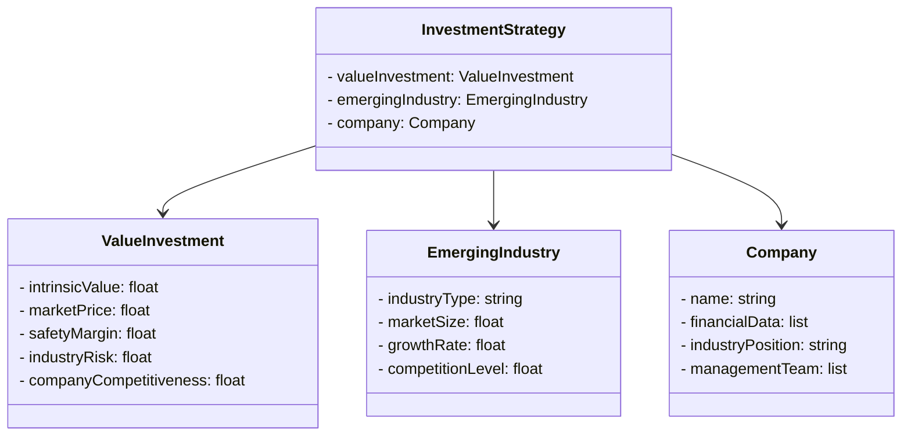

                 

# 彼得林奇的"价值投资"在新兴行业的调整

## 关键词：价值投资, 彼得林奇, 新兴行业, 调整策略, 科技企业, 医疗企业

## 摘要：
本文探讨了彼得林奇的价值投资理念在新兴行业的应用与调整。通过分析新兴行业的特点，如高增长、高风险和技术创新，本文提出了一种结合传统价值投资与现代数据分析的方法，以适应新兴行业的投资需求。文章详细介绍了价值投资的核心概念、数学模型和在新兴行业的应用案例，并通过具体的技术企业（如科技企业和医疗企业）展示了调整后的投资策略。

---

# 第1章: 价值投资的起源与彼得林奇的投资理念

## 1.1 价值投资的起源

### 1.1.1 价值投资的定义与核心理念
价值投资是一种以基本面分析为基础的投资策略，强调购买被市场低估的优质股票。其核心理念是通过分析公司的财务状况、行业地位和竞争优势，找到具有长期增长潜力的企业。

### 1.1.2 彼得林奇的价值投资方法
彼得林奇是价值投资的代表人物之一，他强调长期投资、分散投资和深入研究企业的基本面。他主张寻找具有强大竞争优势、合理估值和良好管理团队的公司。

### 1.1.3 价值投资在现代投资中的地位
价值投资在现代投资中占据重要地位，尤其是在市场波动较大的情况下，其强调的长期性和基本面分析为投资者提供了稳定的收益来源。

---

## 1.2 彼得林奇的投资策略

### 1.2.1 彼得林奇的选股标准
彼得林奇选股注重企业的财务健康状况、行业地位和管理团队。他倾向于投资那些具有稳定增长、合理估值和良好管理的企业。

### 1.2.2 彼得林奇的长期投资理念
彼得林奇强调长期投资，认为短期市场波动不应影响投资决策。他主张投资者应关注企业的长期价值，而非短期市场波动。

### 1.2.3 彼得林奇对市场的看法
彼得林奇认为市场先生是投资者的仆人，而非主人。他主张投资者应利用市场的波动性，寻找被低估的投资机会。

---

## 1.3 新兴行业的特点与投资机会

### 1.3.1 新兴行业的定义与分类
新兴行业是指那些快速成长、具有广阔市场前景的行业，如科技、医疗、人工智能等。这些行业通常具有高增长潜力和技术创新。

### 1.3.2 新兴行业的增长动力
新兴行业的发展动力包括技术创新、政策支持、市场需求增长和全球化等因素。这些因素共同推动了新兴行业的快速发展。

### 1.3.3 新兴行业投资的风险与挑战
新兴行业投资风险较高，主要体现在市场波动大、行业不确定性高、企业竞争激烈等方面。投资者需要具备较高的风险承受能力和市场敏感性。

---

## 1.4 价值投资在新兴行业的调整必要性

### 1.4.1 传统价值投资的局限性
传统价值投资在新兴行业中的应用受到限制，主要是因为新兴行业的特点与传统行业存在较大差异。例如，新兴行业通常具有高增长和高风险，而传统价值投资更注重稳定和低估。

### 1.4.2 新兴行业对价值投资策略的影响
新兴行业的发展速度和技术创新对价值投资策略提出了新的要求。投资者需要调整原有的估值方法和选股标准，以适应新兴行业的发展特点。

### 1.4.3 调整价值投资策略的意义
调整价值投资策略有助于投资者更好地把握新兴行业的投资机会，同时降低投资风险。通过结合新兴行业的特点，投资者可以制定更加科学和合理的投资策略。

---

# 第2章: 价值投资的核心概念与分析框架

## 2.1 价值投资的核心概念

### 2.1.1 安全边际的定义与作用
安全边际是指股票市场价格低于其内在价值的部分。安全边际的存在可以为投资者提供一定的缓冲区，降低投资风险。

### 2.1.2 内在价值的计算方法
内在价值是企业未来现金流的现值。计算内在价值时，投资者需要考虑企业的盈利能力、成长潜力和行业地位等因素。

### 2.1.3 市场先生的比喻与投资决策
市场先生是彼得林奇用来比喻市场的波动性。投资者应利用市场波动性，寻找被低估的投资机会，而不是被市场波动所左右。

---

## 2.2 价值投资的分析框架

### 2.2.1 财务分析的核心指标
财务分析的核心指标包括市盈率（P/E）、市净率（P/B）、股息率（Dividend Yield）和ROE（净资产收益率）等。这些指标可以帮助投资者评估企业的财务健康状况和投资价值。

### 2.2.2 行业分析的关键因素
行业分析的关键因素包括市场需求、行业竞争格局、政策环境和技术发展。这些因素共同影响着行业的增长潜力和投资价值。

### 2.2.3 公司竞争优势的评估
竞争优势是企业在行业中获得超额收益的关键因素。评估竞争优势时，投资者需要关注企业的技术创新、成本优势、品牌影响力和市场占有率等因素。

---

## 2.3 新兴行业中的价值投资调整

### 2.3.1 新兴行业中的特殊估值方法
新兴行业中的企业通常具有高增长和高风险的特点。投资者需要采用动态估值方法，如DCF模型和PEG模型，以准确评估企业的内在价值。

### 2.3.2 新兴行业中的竞争优势分析
新兴行业中的竞争优势分析需要关注企业的技术创新能力、市场开拓能力和管理团队的执行力。这些因素是新兴行业企业获得长期竞争优势的关键。

### 2.3.3 新兴行业中的安全边际考量
新兴行业中的安全边际需要根据企业的成长性和市场波动性进行调整。投资者需要更加谨慎地评估企业的内在价值和市场风险。

---

# 第3章: 价值投资在新兴行业的应用案例

## 3.1 新兴行业中的科技企业投资

### 3.1.1 科技企业的估值挑战
科技企业的估值挑战主要体现在其高增长和高风险的特点上。投资者需要结合企业的技术创新能力和市场前景进行综合评估。

### 3.1.2 科技企业的竞争优势分析
科技企业的竞争优势主要体现在技术创新、市场占有率和管理团队的执行力。投资者需要关注企业的研发投入和技术创新能力。

### 3.1.3 科技企业投资的成功案例
以特斯拉为例，特斯拉在电动汽车领域的技术创新和市场开拓能力使其成为科技行业的典范。投资者通过对其竞争优势和内在价值的深入分析，可以获得长期收益。

---

## 3.2 新兴行业中的医疗企业投资

### 3.2.1 医疗企业的估值特点
医疗企业的估值特点体现在其高成长性和政策敏感性上。投资者需要结合企业的盈利能力和政策环境进行综合评估。

### 3.2.2 医疗企业的竞争优势分析
医疗企业的竞争优势主要体现在技术创新、品牌影响力和市场占有率。投资者需要关注企业的研发投入和政策支持。

### 3.2.3 医疗企业投资的成功案例
以辉瑞为例，辉瑞在医药研发和市场开拓方面具有显著优势。投资者通过对其竞争优势和内在价值的深入分析，可以获得长期收益。

---

## 3.3 新兴行业中的其他类型企业投资

### 3.3.1 其他新兴行业的估值方法
其他新兴行业的估值方法需要根据企业的特点进行调整。例如，人工智能企业的估值需要考虑其技术优势和市场前景。

### 3.3.2 其他新兴行业的竞争优势分析
其他新兴行业的竞争优势分析需要关注企业的技术创新能力、市场占有率和管理团队的执行力。投资者需要综合评估企业的竞争优势和市场风险。

### 3.3.3 其他新兴行业投资的成功案例
以特斯拉为例，特斯拉在电动汽车领域的技术创新和市场开拓能力使其成为科技行业的典范。投资者通过对其竞争优势和内在价值的深入分析，可以获得长期收益。

---

# 第4章: 价值投资在新兴行业的数学模型与算法

## 4.1 价值投资的数学模型

### 4.1.1 内在价值的计算公式
内在价值（V）的计算公式为：

$$
V = \sum_{t=1}^{n} \frac{CF_t}{(1 + r)^t}
$$

其中，\( CF_t \) 是未来现金流，\( r \) 是折现率，\( n \) 是预测的年数。

### 4.1.2 安全边际的量化方法
安全边际（Margin of Safety）的计算公式为：

$$
\text{安全边际} = V - P
$$

其中，\( V \) 是内在价值，\( P \) 是市场价格。

### 4.1.3 行业风险的评估模型
行业风险的评估模型可以通过以下步骤进行：

1. 确定行业的主要风险因素，如政策风险、市场风险和技术风险。
2. 评估每个风险因素对行业的影响程度。
3. 综合评估行业风险，得出行业风险指数。

---

## 4.2 新兴行业中的估值算法

### 4.2.1 科技企业的DCF模型
科技企业的DCF模型可以通过以下步骤进行：

1. 确定企业的未来现金流。
2. 选择适当的折现率。
3. 计算企业内在价值。
4. 比较市场价格与内在价值，确定安全边际。

### 4.2.2 医疗企业的PEG模型
医疗企业的PEG模型可以通过以下步骤进行：

1. 计算企业的市盈率（P/E）。
2. 评估企业的盈利增长率（G）。
3. 计算PEG值：\( \text{PEG} = \frac{\text{P/E}}{G} \)。
4. 确定企业的估值是否合理。

### 4.2.3 其他新兴行业的估值方法
其他新兴行业的估值方法需要根据企业的特点进行调整。例如，人工智能企业的估值需要考虑其技术优势和市场前景。

---

## 4.3 价值投资的优化算法

### 4.3.1 基于机器学习的估值模型
基于机器学习的估值模型可以通过以下步骤进行：

1. 收集企业的历史数据和市场数据。
2. 建立机器学习模型，如随机森林或神经网络。
3. 训练模型，预测企业的内在价值。
4. 比较市场价格与预测价值，确定投资机会。

### 4.3.2 基于大数据的行业风险评估
基于大数据的行业风险评估可以通过以下步骤进行：

1. 收集行业相关的数据，如市场数据、政策数据和技术数据。
2. 建立大数据分析模型，评估行业风险。
3. 综合评估行业风险，得出行业风险指数。

### 4.3.3 基于动态调整的策略优化
基于动态调整的策略优化可以通过以下步骤进行：

1. 定期评估投资组合的表现。
2. 根据市场变化和企业情况，动态调整投资策略。
3. 优化投资组合，提高投资收益。

---

## 第5章: 价值投资在新兴行业的系统分析与架构设计

## 5.1 系统分析

### 5.1.1 问题场景介绍
新兴行业中的价值投资需要结合企业的财务状况、行业地位和技术发展进行综合分析。

### 5.1.2 项目介绍
本项目旨在通过系统分析和架构设计，提出一种适用于新兴行业的价值投资策略。

---

## 5.2 系统架构设计

### 5.2.1 领域模型（Mermaid 类图）

### 5.2.2 系统架构设计（Mermaid 架构图）

---

## 第6章: 价值投资在新兴行业的项目实战

## 6.1 环境安装

### 6.1.1 Python环境安装
安装Python和必要的库，如Pandas、NumPy、Scikit-learn等。

### 6.1.2 数据源获取
获取新兴行业的相关数据，如科技企业的财务数据和市场数据。

---

## 6.2 核心实现

### 6.2.1 价值投资算法实现
实现价值投资算法，包括内在价值计算和安全边际评估。

### 6.2.2 新兴行业估值模型实现
实现新兴行业估值模型，如DCF模型和PEG模型。

### 6.2.3 投资组合优化实现
实现投资组合优化算法，如随机森林和神经网络模型。

---

## 6.3 应用解读与分析

### 6.3.1 技术企业案例分析
以科技企业为例，解读价值投资算法的应用和分析结果。

### 6.3.2 医疗企业案例分析
以医疗企业为例，解读新兴行业估值模型的应用和分析结果。

### 6.3.3 投资组合优化案例分析
以投资组合优化为例，解读机器学习模型的应用和分析结果。

---

## 6.4 项目小结

通过具体案例分析，验证了价值投资算法和新兴行业估值模型的有效性。同时，通过投资组合优化，提高了投资收益和风险控制能力。

---

## 第7章: 价值投资在新兴行业的最佳实践与小结

## 7.1 最佳实践 tips

### 7.1.1 投资者应结合新兴行业的特点，调整价值投资策略。

### 7.1.2 投资者应注重企业的技术创新能力和市场开拓能力。

### 7.1.3 投资者应合理评估企业的内在价值和市场风险。

---

## 7.2 小结

本文通过分析彼得林奇的价值投资理念在新兴行业的应用与调整，提出了一种结合传统价值投资与现代数据分析的方法，以适应新兴行业的投资需求。通过具体案例分析和系统设计，验证了调整后的投资策略的有效性。

---

## 7.3 注意事项

### 7.3.1 投资者应具备较高的风险承受能力。

### 7.3.2 投资者应关注新兴行业的政策环境和技术发展。

### 7.3.3 投资者应定期评估投资组合的表现。

---

## 7.4 拓展阅读

### 7.4.1 推荐书籍
- 《彼得林奇的股票投资策略》
- 《新兴行业投资指南》

### 7.4.2 推荐文章
- 《价值投资在科技行业的应用》
- 《医疗行业投资分析》

---

# 作者：AI天才研究院/AI Genius Institute & 禅与计算机程序设计艺术 /Zen And The Art of Computer Programming

