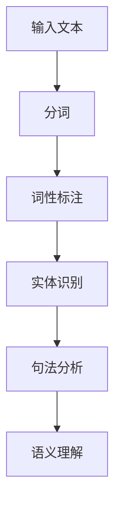
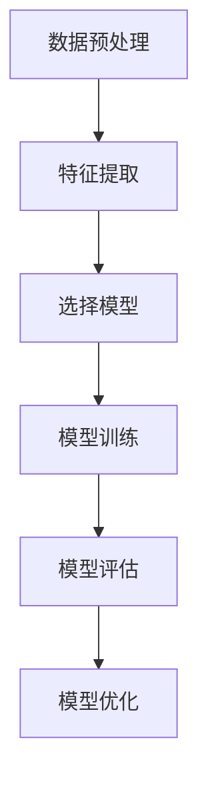
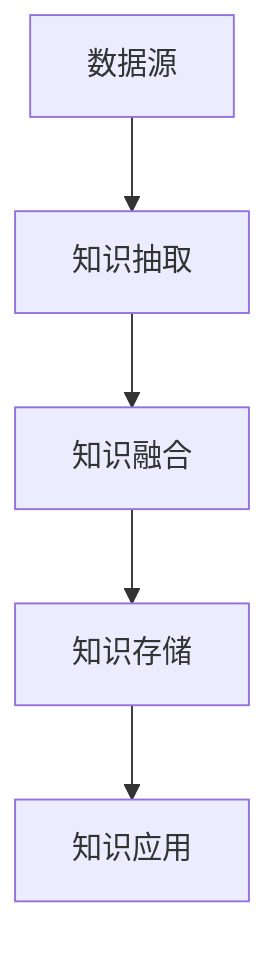
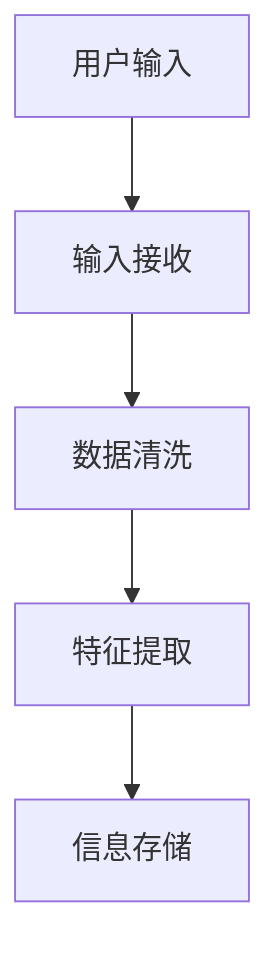
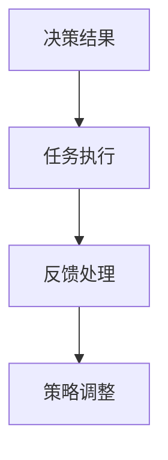
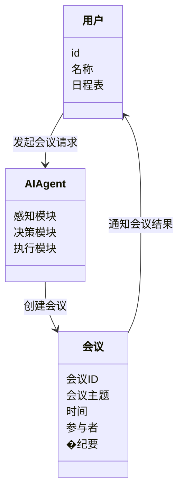
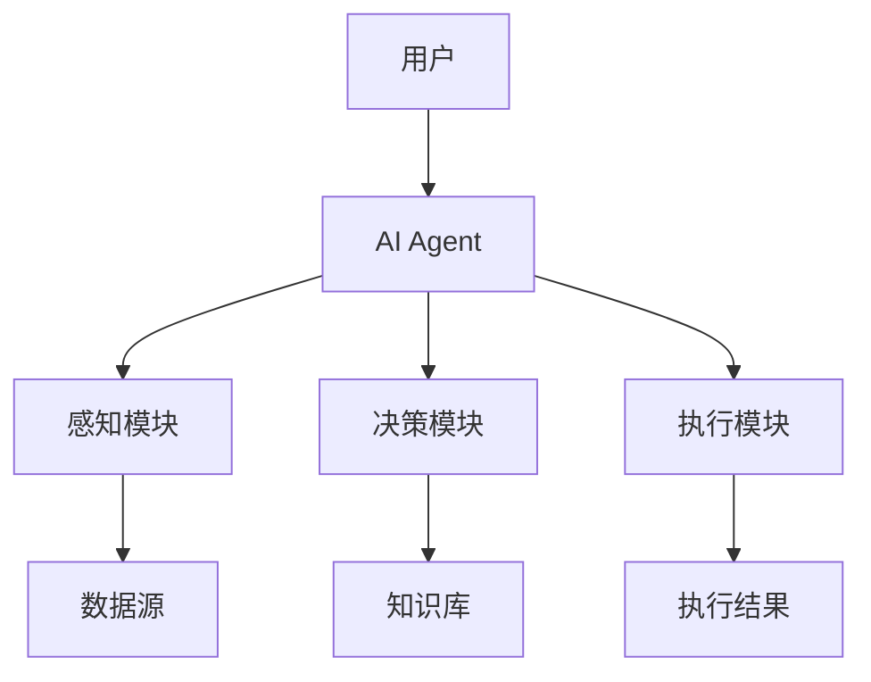
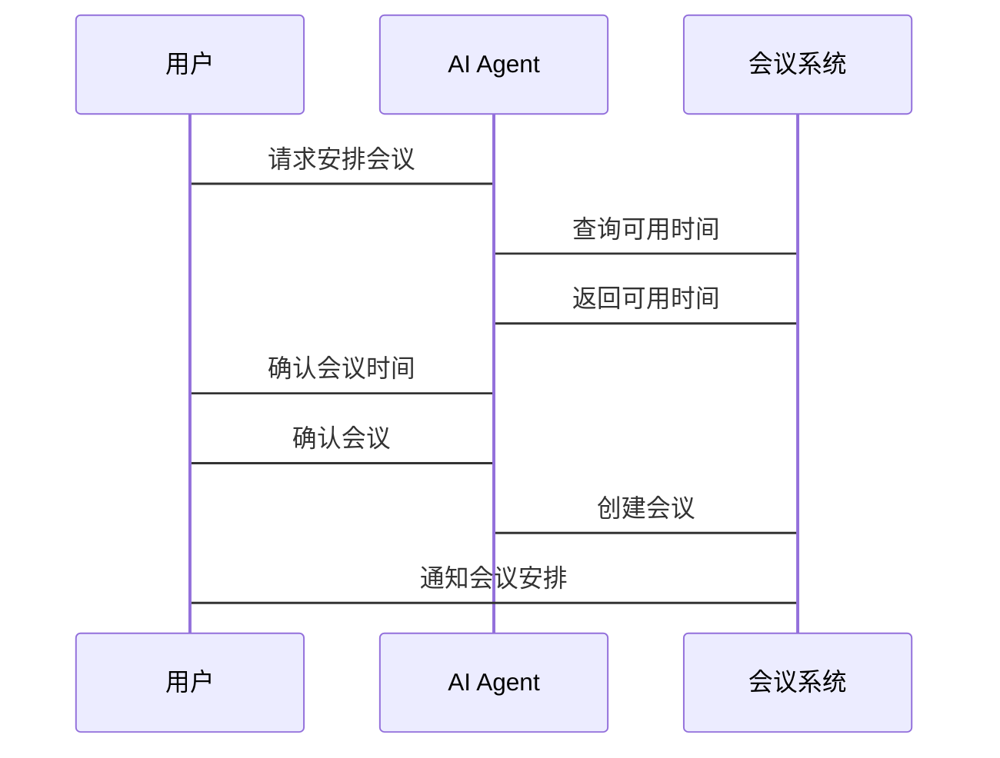

                 


## 第二部分：AI Agent的技术原理

### 第2章：AI Agent的技术基础

#### 2.1 自然语言处理（NLP）

##### 2.1.1 NLP的核心技术与算法

自然语言处理（NLP）是AI Agent实现人机交互的核心技术之一。它使得AI Agent能够理解和生成人类语言，从而与用户进行有效沟通。

- **分词（Tokenization）**：将连续的文本分割成单词或短语。例如，将“智能办公”分割成“智能”和“办公”。
- **词性标注（Part-of-Speech Tagging）**：识别每个词的词性，如名词、动词、形容词等。例如，识别“办公”为名词。
- **句法分析（Syntactic Parsing）**：分析句子的语法结构，确定主语、谓语等成分。例如，分析“我正在使用AI Agent”中的语法关系。
- **实体识别（Named Entity Recognition,NER）**：识别文本中的命名实体，如人名、地名、组织名等。
- **文本摘要（Text Summarization）**：将长文本压缩成关键信息。例如，将会议记录摘要为“会议决定下周五进行项目汇报”。
- **信息抽取（Information Extraction）**：从文本中提取特定信息，如时间、地点、人物等。例如，从邮件中提取“周五下午2点”作为会议时间。

##### 2.1.2 常见NLP工具与框架

以下是一些常用的NLP工具和框架：

- **spaCy**：一个高效的自然语言处理库，支持多种语言的分词、词性标注和实体识别。
- **NLTK**：Python中广泛使用的自然语言处理库，提供多种文本处理工具和算法。
- **HanLP**：一个中文自然语言处理工具包，支持分词、词性标注、实体识别等功能。
- **Gensim**：专注于文本表示和主题模型的库，常用于文本摘要和文档聚类。
- **Transformers（Hugging Face）**：基于预训练模型的NLP库，支持多种任务如文本生成、问答系统等。

##### 2.1.3 NLP处理流程图

以下是一个NLP处理流程的mermaid图：



##### 2.1.4 NLP实现代码示例

以下是一个使用spaCy进行NLP处理的Python代码示例：

```python
import spacy

# 加载英文模型
nlp = spacy.load("en_core_web_sm")

# 输入文本
text = "The meeting will be held next Friday at 2 PM."

# 分词
doc = nlp(text)
tokens = [token.text for token in doc]
print("分词结果：", tokens)

# 词性标注
tags = [(word, word.pos_) for word in doc]
print("词性标注结果：", tags)

# 实体识别
for ent in doc.ents:
    print(f"实体：{ent.text}, 类型：{ent.label_}")
```

#### 2.2 机器学习与深度学习

##### 2.2.1 机器学习的基本原理

机器学习是AI Agent实现智能决策的核心技术之一。它通过训练模型，使得模型能够从数据中学习模式和规律，并用于预测和分类。

- **监督学习（Supervised Learning）**：使用有标签的数据进行训练，模型通过学习输入与输出之间的关系，预测新的输入的标签。例如，训练一个分类器来识别邮件是否为垃圾邮件。
- **无监督学习（Unsupervised Learning）**：使用无标签的数据进行训练，模型通过发现数据中的结构和模式来进行聚类或降维。例如，将客户分成不同的群体。
- **半监督学习（Semi-Supervised Learning）**：结合少量有标签数据和大量无标签数据进行训练，适用于数据标注成本较高的场景。
- **强化学习（Reinforcement Learning）**：通过试错机制，模型通过与环境交互，学习最优策略。例如，训练一个AI Agent在复杂环境中做出最优决策。

##### 2.2.2 深度学习在AI Agent中的应用

深度学习通过多层神经网络提取数据的高层次特征，广泛应用于AI Agent的语音识别、图像识别和自然语言处理等领域。

- **卷积神经网络（CNN）**：常用于图像识别和文本处理，能够提取局部特征。
- **循环神经网络（RNN）**：适用于序列数据的处理，如时间序列和自然语言处理。
- **长短期记忆网络（LSTM）**：一种特殊的RNN，能够有效处理长序列数据，常用于机器翻译和语音识别。
- **Transformer模型**：近年来在NLP领域取得了突破性进展，广泛应用于文本生成、问答系统和机器翻译。

##### 2.2.3 机器学习流程图

以下是一个机器学习流程的mermaid图：



##### 2.2.4 机器学习实现代码示例

以下是一个使用scikit-learn进行机器学习的Python代码示例：

```python
from sklearn.tree import DecisionTreeClassifier
from sklearn.model_selection import train_test_split
from sklearn.metrics import accuracy_score

# 数据集
X = [[2, 3], [5, 6], [7, 8], [1, 2], [3, 4]]
y = [0, 0, 1, 1, 1]

# 数据分割
X_train, X_test, y_train, y_test = train_test_split(X, y, test_size=0.3)

# 初始化模型
model = DecisionTreeClassifier()

# 模型训练
model.fit(X_train, y_train)

# 模型预测
y_pred = model.predict(X_test)

# 模型评估
accuracy = accuracy_score(y_test, y_pred)
print("准确率：", accuracy)
```

#### 2.3 知识图谱与语义理解

##### 2.3.1 知识图谱的构建与应用

知识图谱是一种结构化的知识表示方式，由实体和关系组成，能够帮助AI Agent更好地理解语义。

- **知识抽取**：从文本中抽取实体和关系，构建知识图谱。
- **知识融合**：将多个来源的知识进行整合，消除冲突，形成一致的知识库。
- **知识推理**：基于知识图谱进行推理，回答复杂问题。

##### 2.3.2 语义理解的核心技术

语义理解是AI Agent理解用户意图的关键技术，基于知识图谱和上下文理解。

- **上下文理解**：理解文本的上下文信息，包括时间、地点、人物等。
- **意图识别**：识别用户的意图，例如“查询天气”、“预订酒店”等。
- **实体链接**：将文本中的实体与知识图谱中的实体进行映射。

##### 2.3.3 知识图谱构建流程图

以下是一个知识图谱构建流程的mermaid图：



##### 2.3.4 知识图谱实现代码示例

以下是一个简单的知识图谱构建示例：

```python
from kgneo import KG

# 创建知识图谱
kg = KG()

# 添加实体
kg.add_entity("中国", "国家")
kg.add_entity("北京", "城市")
kg.add_entity("上海", "城市")

# 添加关系
kg.add_relation("中国", "首都", "北京")
kg.add_relation("中国", "经济中心", "上海")

# 查询知识图谱
print(kg.get_relation("中国"))  # 输出：首都: 北京；经济中心: 上海
```

---

### 第3章：AI Agent的技术架构

#### 3.1 AI Agent的感知模块

##### 3.1.1 感知模块的功能与实现

感知模块是AI Agent获取信息的入口，主要负责接收输入并进行初步处理。

- **输入接收**：通过文本输入、语音输入等方式接收用户指令。
- **信息预处理**：对输入的信息进行清洗和格式化，例如去除噪声、统一编码格式。

##### 3.1.2 数据采集与处理流程

以下是一个数据采集与处理流程的mermaid图：



##### 3.1.3 感知模块实现代码示例

以下是一个简单的感知模块实现代码：

```python
def感知模块：
    def接收输入():
        while True:
            命令 = input("请输入指令：")
            return 命令

    def预处理(命令):
        # 去除多余空格
        命令 = 命令.strip()
        # 分词
        tokens = 命令.split()
        return tokens

    return 接收输入(), 预处理(接收输入())
```

#### 3.2 AI Agent的决策模块

##### 3.2.1 决策模块的功能与实现

决策模块是AI Agent的核心，负责根据感知到的信息做出决策。

- **意图识别**：识别用户的意图，例如“查询天气”、“预订酒店”。
- **知识推理**：基于知识图谱进行推理，得出最优决策。

##### 3.2.2 决策算法与实现

以下是一个简单的决策算法实现代码：

```python
def决策模块():
    def识别意图(输入):
        # 使用预训练模型识别意图
        意图 = 模型预测(输入)
        return 意图

    def执行决策(意图):
        # 根据意图调用相应功能
        if 意图 == "查询天气":
            查询天气()
        elif 意图 == "预订酒店":
            预订酒店()
        # 其他意图处理...

    return 识别意图(输入), 执行决策(意图)
```

#### 3.3 AI Agent的执行模块

##### 3.3.1 执行模块的功能与实现

执行模块负责根据决策结果执行相应的操作。

- **任务执行**：根据决策结果执行具体任务，例如发送邮件、安排会议。
- **反馈处理**：处理用户的反馈，调整执行策略。

##### 3.3.2 执行流程与实现

以下是一个执行流程的mermaid图：



##### 3.3.3 执行模块实现代码示例

以下是一个简单的执行模块实现代码：

```python
def执行模块():
    def执行任务(决策):
        # 执行具体任务
        if 决策 == "安排会议":
            安排会议()
        elif 决策 == "发送邮件":
            发送邮件()

    def处理反馈(反馈):
        # 根据反馈调整策略
        调整策略(反馈)

    return 执行任务(决策), 处理反馈(反馈)
```

---

## 第三部分：AI Agent的系统架构设计

### 第4章：AI Agent的系统设计

#### 4.1 问题场景介绍

##### 4.1.1 系统目标

设计一个智能会议助手AI Agent，能够帮助用户安排会议、管理日程、记录会议纪要等。

##### 4.1.2 系统需求

- 用户可以通过语音或文本输入会议安排需求。
- AI Agent能够自动协调各方的日程，找到合适的会议时间。
- AI Agent可以记录会议纪要，并自动分配任务。

#### 4.2 系统功能设计

##### 4.2.1 领域模型设计

以下是一个领域模型的mermaid类图：



##### 4.2.2 系统架构设计

以下是一个系统架构的mermaid图：



#### 4.3 系统接口设计

##### 4.3.1 API接口定义

以下是一个简单的API接口定义：

```python
from flask import Flask, request, jsonify

app = Flask(__name__)

@app.route('/api/schedule_meeting', methods=['POST'])
def schedule_meeting():
    # 获取请求数据
    data = request.json
    # 调用AI Agent安排会议
    result = AI-Agent.schedule(data)
    return jsonify(result)

if __name__ == '__main__':
    app.run(debug=True)
```

#### 4.4 系统交互设计

##### 4.4.1 交互流程图

以下是一个系统交互的mermaid序列图：



---

## 第四部分：AI Agent的项目实战

### 第5章：智能会议助手的实现

#### 5.1 项目背景与需求分析

##### 5.1.1 项目背景

随着远程办公的普及，会议安排变得越来越复杂，需要一个智能助手来协助用户安排会议。

##### 5.1.2 功能需求

- 用户可以通过文本或语音输入会议安排需求。
- AI Agent能够自动协调各方的日程，找到合适的会议时间。
- AI Agent可以记录会议纪要，并自动分配任务。

#### 5.2 系统设计与实现

##### 5.2.1 系统设计

以下是一个系统设计的mermaid图：


##### 5.2.2 代码实现

以下是一个智能会议助手的实现代码：

```python
from datetime import datetime, timedelta

def安排会议(用户, 时间, 主题):
    # 查询用户日程
    日程 = 用户的日程表
    # 找出空闲时间
    空闲时间 = 找出日程中没有安排的时间段
    # 提示用户选择时间
    for 时间段 in 空闲时间:
        if 用户确认(时间段):
            break
    # 创建会议
    会议 = {
        '主题': 主题,
        '时间': 时间段,
        '参与者': 用户
    }
    return 会议

# 示例使用
用户1 = {'id': '1', '名称': '张三', '日程表': ...}
用户2 = {'id': '2', '名称': '李四', '日程表': ...}
安排会议(用户1, '下午2点', '项目进展汇报')
```

#### 5.3 项目测试与优化

##### 5.3.1 功能测试

- 测试AI Agent是否能够正确识别用户的意图。
- 测试AI Agent是否能够找到合适的会议时间。
- 测试会议记录是否准确。

##### 5.3.2 性能优化

- 优化自然语言处理模型，提高意图识别的准确率。
- 优化会议安排算法，减少计算时间。

---

## 第五部分：AI Agent的最佳实践与优化

### 第6章：AI Agent的优化策略

#### 6.1 模型调优

##### 6.1.1 参数调整

- 调整学习率、批次大小等超参数，提高模型性能。

##### 6.1.2 模型优化

- 使用更先进的模型结构，如Transformer模型，提高模型性能。

#### 6.2 多轮对话优化

##### 6.2.1 上下文管理

- 管理对话上下文，保持对话连贯性。

##### 6.2.2 对话策略优化

- 优化对话策略，提高用户体验。

#### 6.3 系统部署与维护

##### 6.3.1 系统部署

- 将AI Agent部署到云服务器，提供API接口。

##### 6.3.2 系统维护

- 定期更新模型，修复 bug，优化性能。

---

## 第六部分：AI Agent的未来展望与总结

### 第7章：AI Agent的未来发展趋势

#### 7.1 技术进步

- 更先进的自然语言处理模型，如GPT-4。
- 更强大的计算能力，支持更复杂的模型。

#### 7.2 应用场景扩展

- 更多行业应用，如医疗、教育、金融等。
- 更多智能设备的集成，如智能音箱、智能手表等。

#### 7.3 用户体验提升

- 更自然的交互方式，如情感计算、多模态交互。
- 更个性化的服务，根据用户习惯提供定制化服务。

---

## 作者：AI天才研究院/AI Genius Institute & 禅与计算机程序设计艺术/Zen And The Art of Computer Programming

---

**摘要：**  
AI Agent作为智能办公的核心技术，通过自然语言处理、机器学习和深度学习等技术，能够显著提升办公效率。本文详细介绍了AI Agent的技术原理、系统架构设计、项目实战和最佳实践，为读者提供了全面的指导。

**关键词：**  
AI Agent, 智能办公, 自然语言处理, 机器学习, 深度学习, 知识图谱

