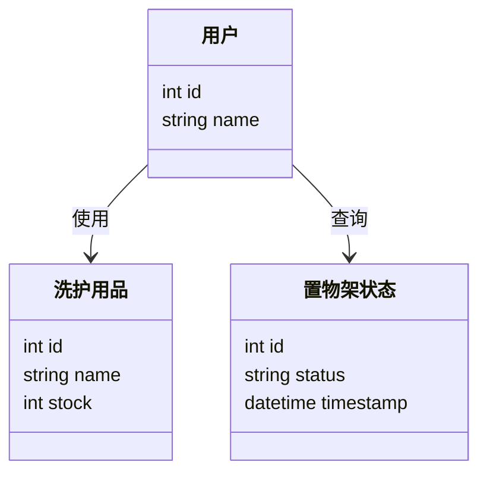
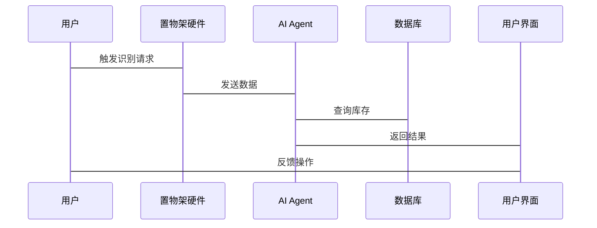

                 


# 智能浴室置物架：AI Agent的洗护用品管理

## 关键词：智能浴室置物架，AI Agent，洗护用品管理，智能家居，AI算法

## 摘要：  
本文探讨了智能浴室置物架在AI Agent技术下的洗护用品管理解决方案。通过分析背景、核心概念、算法原理、系统架构、项目实战等，展示了如何利用AI技术实现智能家居中的高效管理。文章还提供了最佳实践和优化建议，帮助读者更好地理解和应用相关技术。

---

## 第一章：背景介绍

### 1.1 问题背景

#### 1.1.1 智能家居的发展趋势
智能家居正以飞速发展，AI Agent（智能代理）作为其核心，通过自动化服务提升生活质量。浴室环境复杂，洗护用品管理混乱，亟需智能化解决方案。

#### 1.1.2 洗护用品管理的痛点与需求
传统浴室置物架功能单一，手动管理效率低下，用户需求与实际体验存在明显差距。智能管理需求强烈，用户期望自动识别、库存提醒、智能推荐等高级功能。

#### 1.1.3 AI Agent在智能家居中的应用潜力
AI Agent具备感知、决策和执行能力，可显著提升智能家居设备的智能化水平，为洗护用品管理提供创新解决方案。

### 1.2 问题描述

#### 1.2.1 洗护用品管理的复杂性
洗护用品种类繁多，使用场景多样，传统管理方式难以实现高效管理。用户对智能管理的需求日益增长，但现有解决方案仍存在诸多不足。

#### 1.2.2 智能浴室置物架的功能需求
用户期望智能置物架具备物品识别、库存管理、智能推荐、自动补货等功能，同时要求界面友好、操作便捷。

#### 1.2.3 用户对智能管理的期望
用户希望智能置物架能够简化管理流程，提升生活品质，同时具备高度的智能化和便捷性。

### 1.3 问题解决

#### 1.3.1 AI Agent的核心作用
AI Agent通过感知环境、分析数据、执行任务，帮助用户实现智能化的洗护用品管理。其多模态感知能力使其能够准确识别物品并优化管理策略。

#### 1.3.2 智能浴室置物架的设计目标
设计目标包括物品识别的准确性、库存管理的实时性、系统运行的稳定性以及用户体验的优化。通过AI Agent实现高效、智能的管理。

#### 1.3.3 技术实现的关键点
技术实现的关键点包括传感器数据的采集、AI算法的优化、系统架构的设计以及用户界面的友好性。这些因素共同决定了系统的性能和用户体验。

### 1.4 边界与外延

#### 1.4.1 功能边界
系统仅限于洗护用品的识别、管理和推荐，不涉及其他智能家居设备的控制。功能边界清晰，确保系统专注于核心任务。

#### 1.4.2 与其他智能家居设备的协同
系统可与其他设备如智能音箱、智能镜子等进行协同工作，扩展应用场景，提升用户体验。协同工作通过标准接口实现，确保兼容性和互操作性。

#### 1.4.3 产品的扩展性与兼容性
系统设计具备良好的扩展性，支持未来功能的增加和性能的提升。同时，系统兼容多种设备和平台，确保用户的灵活性和选择性。

### 1.5 概念结构与核心要素

#### 1.5.1 核心要素组成
系统由AI Agent、传感器、数据存储、用户界面和通信模块组成。这些要素协同工作，实现洗护用品的智能化管理。

#### 1.5.2 系统架构的初步设想
初步设想采用微服务架构，各模块独立运行，通过API进行通信。这种架构确保系统的可扩展性和灵活性。

#### 1.5.3 用户体验的关键点
用户体验的关键点包括界面的直观性、操作的便捷性以及反馈的及时性。系统需提供清晰的操作指引和实时反馈，确保用户能够轻松管理洗护用品。

---

## 第二章：AI Agent的核心原理

### 2.1 核心概念原理

#### 2.1.1 AI Agent的定义与分类
AI Agent是一种智能实体，能够感知环境、自主决策并执行任务。按智能水平可分为简单反应式、基于模型的反思式和实用推理式。

#### 2.1.2 智能浴室置物架中的AI Agent角色
在智能浴室置物架中，AI Agent负责物品识别、库存管理和智能推荐。其角色是系统的核心，负责处理数据并驱动系统运行。

#### 2.1.3 多模态感知与决策机制
AI Agent通过多种传感器（如摄像头、RFID）感知环境，结合上下文信息进行决策。决策机制基于实时数据和预设规则，确保管理的高效性和准确性。

### 2.2 核心概念属性对比

#### 2.2.1 比较表格：AI Agent与传统自动化设备的差异
| 特性            | AI Agent                     | 传统自动化设备               |
|-----------------|------------------------------|------------------------------|
| 感知能力        | 强，多模态                   | 弱或无                     |
| 决策能力        | 强，动态调整                | 固定，无灵活性               |
| 用户交互        | 支持自然语言交互            | 无或有限                   |
| 学习能力        | 强，可自适应                | 无或弱                     |

#### 2.2.2 比较表格：不同AI Agent算法的优缺点
| 算法类型         | 优点                          | 缺点                          |
|------------------|-------------------------------|-------------------------------|
| 规则引擎         | 简单易懂，适合规则明确的场景   | 灵活性差，难以处理复杂场景    |
| 机器学习模型     | 高精度，适应性强             | 需大量数据，训练时间长        |
| 深度学习模型     | 强大的特征提取能力，高精度    | 计算资源需求高，推理时间长    |

### 2.3 ER实体关系图
```mermaid
er
    actor 用户 {
        id: int
        name: string
    }
    entity 洗护用品 {
        id: int
        name: string
        stock: int
    }
    entity 置物架状态 {
        id: int
        status: string
        timestamp: datetime
    }
    relation 用户-洗护用品 {
        用户 -> 洗护用品: 使用
    }
    relation 用户-置物架状态 {
        用户 -> 置物架状态: 查询
    }
```

---

## 第三章：AI Agent的算法

### 3.1 算法原理讲解

#### 3.1.1 算法的总体流程
AI Agent的算法流程包括数据采集、物品识别、库存更新、决策优化和执行反馈。每个步骤都紧密相连，确保系统高效运行。

#### 3.1.2 算法的数学模型

##### 3.1.2.1 物品识别模型
使用目标检测算法，如YOLO或Faster R-CNN，对洗护用品进行识别。模型通过卷积神经网络提取特征，并使用非极大值抑制进行候选框筛选。

##### 3.1.2.2 库存管理模型
基于时间序列分析的库存预测模型，采用ARIMA算法预测消耗速度，优化补货策略。

##### 3.1.2.3 智能推荐模型
基于协同过滤的推荐算法，计算物品相似度，为用户提供个性化推荐。

#### 3.1.3 算法的实现步骤

##### 3.1.3.1 数据采集与预处理
通过摄像头或RFID传感器采集物品信息，预处理包括去噪、标准化等。

##### 3.1.3.2 物品识别与分类
使用预训练模型进行物品识别，分类采用K-近邻算法或支持向量机进行分类。

##### 3.1.3.3 库存管理与优化
通过动态规划算法优化库存管理策略，确保库存合理，避免过剩或短缺。

#### 3.1.4 算法的优缺点

##### 3.1.4.1 优点
算法高效准确，能够实时处理数据，适应性强，适用于多种场景。

##### 3.1.4.2 缺点
计算资源需求较高，初次部署成本较高，需要定期更新模型以保持准确性。

### 3.2 算法的实现代码示例

#### 3.2.1 物品识别代码
```python
import cv2
import numpy as np

# 加载预训练模型
net = cv2.dnn.readNet("yolov4.weights", "yolov4.cfg")
classes = ["soap", "shampoo", "toothpaste", ...]

cap = cv2.VideoCapture(0)
while cap.isOpened():
    success, img = cap.read()
    blob = cv2.dnn.blobFromImage(img, 1/255, (416, 416), swapRB=True, crop=False)
    net.setInput(blob)
    outputs = net.forward()
    # 处理输出并识别物品
    ...
```

#### 3.2.2 库存管理代码
```python
from statsmodels.tsa.arima_model import ARIMA

# 训练ARIMA模型
data = [inventory_data]
model = ARIMA(data, order=(1, 1, 1)).fit()
# 预测未来库存
forecast = model.forecast(steps=30)
```

#### 3.2.3 智能推荐代码
```python
from sklearn.metrics.pairwise import cosine_similarity

# 计算物品相似度
similarity_matrix = cosine_similarity(item_features)
# 生成推荐列表
def recommend(item_id):
    idx = np.where(item_features[:, item_id] == item_id)[0]
    return np.argsort(similarity_matrix[idx], axis=0)[::-1]
```

### 3.3 算法的优化与调整

#### 3.3.1 性能优化
通过量化模型参数、减少计算复杂度和优化数据预处理步骤来提升算法性能。

#### 3.3.2 算法调整
根据实际运行情况调整模型参数，如学习率、训练轮数等，以提高识别准确率和管理效率。

---

## 第四章：系统分析与架构设计方案

### 4.1 系统分析

#### 4.1.1 问题场景介绍
系统需在浴室环境中稳定运行，面对潮湿、高温等挑战，同时确保数据安全和隐私保护。

#### 4.1.2 项目介绍
项目目标是开发一款基于AI Agent的智能浴室置物架，实现洗护用品的智能化管理。项目范围包括硬件设计、算法开发和用户界面设计。

### 4.2 系统功能设计

#### 4.2.1 领域模型


#### 4.2.2 系统架构设计


#### 4.2.3 系统接口设计
系统接口包括传感器接口、数据库接口和用户界面接口。通过标准API实现模块间通信，确保系统的可扩展性和灵活性。

#### 4.2.4 系统交互设计


### 4.3 系统优化与调整

#### 4.3.1 系统优化
通过硬件优化和算法改进，提升系统的稳定性和响应速度。优化传感器灵敏度，增强AI算法的鲁棒性。

#### 4.3.2 系统调整
根据用户反馈和实际运行情况，调整系统参数和功能模块，确保系统性能和用户体验达到最佳状态。

---

## 第五章：项目实战

### 5.1 环境搭建

#### 5.1.1 开发环境配置
安装Python、OpenCV、TensorFlow等开发工具和库，配置开发环境。

#### 5.1.2 硬件设备准备
选择合适的传感器和硬件设备，确保其兼容性和性能。

### 5.2 核心代码实现

#### 5.2.1 物品识别模块
```python
import cv2
import numpy as np

def detect_item(image_path):
    # 加载模型并进行预测
    pass
```

#### 5.2.2 库存管理模块
```python
from datetime import datetime

def update_inventory(item_id):
    # 更新库存数据
    pass
```

#### 5.2.3 智能推荐模块
```python
def generate_recommendations(user_id):
    # 根据用户历史数据生成推荐
    pass
```

### 5.3 实际案例分析

#### 5.3.1 案例一：库存预警
用户购买的洗发水即将用完，系统自动触发预警，并推荐补货。

#### 5.3.2 案例二：智能推荐
根据用户的使用习惯，系统推荐常用的洗护用品，提升用户体验。

### 5.4 项目总结

#### 5.4.1 实践中的收获
通过项目实战，掌握了AI Agent在实际应用中的开发和优化技巧，提升了问题解决能力。

#### 5.4.2 经验教训
在项目过程中，遇到传感器精度不足和算法计算资源消耗过高的问题，通过优化硬件和调整算法参数解决了这些问题。

---

## 第六章：优化与扩展

### 6.1 系统优化

#### 6.1.1 性能优化
通过量化模型参数和优化数据预处理步骤，降低计算复杂度，提升系统性能。

#### 6.1.2 算法优化
采用更高效的算法，如轻量级模型和分布式计算，减少资源消耗。

### 6.2 功能扩展

#### 6.2.1 新功能开发
增加语音控制、远程监控等功能，扩展系统的应用场景。

#### 6.2.2 功能优化
优化用户界面，增加更多个性化设置，提升用户体验。

### 6.3 注意事项

#### 6.3.1 系统安全
确保系统数据安全，防止隐私泄露和网络攻击。

#### 6.3.2 系统兼容性
保持系统的兼容性，确保与不同设备和平台的顺利集成。

### 6.4 拓展阅读

#### 6.4.1 推荐书籍
推荐读者阅读《人工智能：一种现代的方法》和《深度学习》等书籍，深入理解AI技术的应用。

#### 6.4.2 技术博客
推荐关注知名技术博客和开源项目，获取最新的技术动态和开发经验。

---

## 第七章：总结与展望

### 7.1 总结

#### 7.1.1 核心内容回顾
本文详细探讨了智能浴室置物架的AI Agent技术，涵盖了背景分析、算法原理、系统设计和项目实战等内容。

#### 7.1.2 重要观点总结
AI Agent在智能家居中的应用潜力巨大，智能浴室置物架作为典型场景，展示了AI技术在日常生活中的巨大价值。

### 7.2 展望

#### 7.2.1 未来技术发展
随着AI技术的进步，智能浴室置物架将具备更强大的功能，如自主学习和自适应管理。

#### 7.2.2 应用场景扩展
AI Agent技术将进一步扩展应用场景，推动智能家居生态的完善和升级。

---

## 作者：AI天才研究院/AI Genius Institute & 禅与计算机程序设计艺术 /Zen And The Art of Computer Programming

