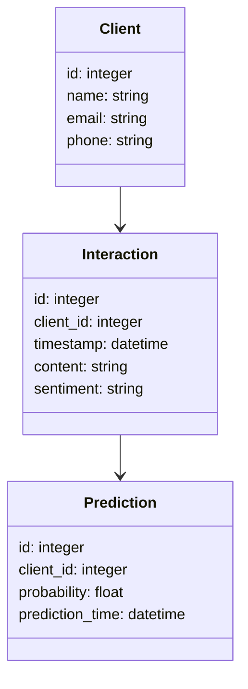
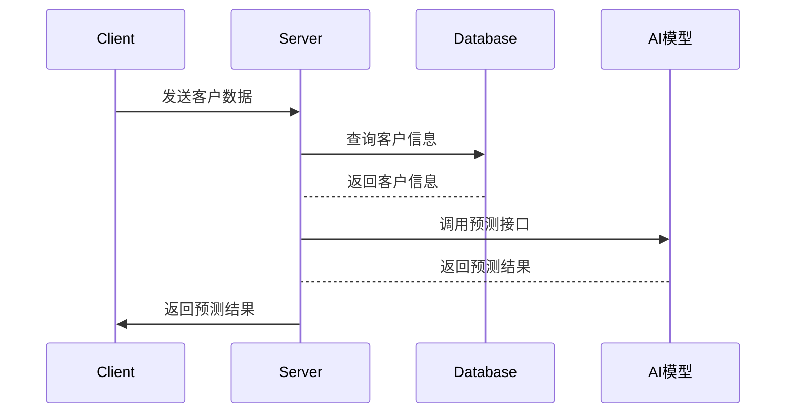

                 


# 构建AI驱动的企业客户关系管理(CRM)系统

> 关键词：人工智能，客户关系管理，CRM系统，自然语言处理，机器学习，知识图谱

> 摘要：随着人工智能技术的迅速发展，企业客户关系管理（CRM）系统也在不断进化。传统的CRM系统依赖于人工操作和简单的规则匹配，而现代的AI驱动CRM系统通过自然语言处理（NLP）、机器学习和知识图谱等技术，能够更智能地分析客户行为、预测客户需求，并提供个性化的服务。本文将深入探讨AI驱动CRM的核心概念、算法实现、系统架构以及实际应用案例，帮助读者全面理解如何构建一个高效、智能的CRM系统。

---

## 第一部分: 构建AI驱动的企业客户关系管理系统的背景与概述

## 第1章: 企业客户关系管理(CRM)概述

### 1.1 CRM的基本概念与功能

#### 1.1.1 CRM的定义与核心功能
客户关系管理（Customer Relationship Management，CRM）是一种管理客户关系的商业策略，旨在通过优化客户互动和提升客户满意度，从而提高企业的销售和利润。CRM系统的核心功能包括客户信息管理、销售自动化、客户服务与支持、营销自动化和数据分析等。

#### 1.1.2 传统CRM的局限性
传统的CRM系统主要依赖于人工操作，数据输入和维护成本高，且难以实时分析客户的复杂需求。此外，传统CRM系统通常基于简单的规则匹配，难以应对客户的个性化需求和复杂场景。

#### 1.1.3 AI驱动CRM的优势与价值
AI驱动的CRM系统通过引入自然语言处理（NLP）、机器学习和知识图谱等技术，能够自动分析客户的语言、行为和历史数据，从而更精准地识别客户需求、预测客户行为并提供个性化的服务。这种智能化的CRM系统不仅提高了客户满意度，还能够显著降低企业的运营成本。

---

### 1.2 AI技术在CRM中的应用前景

#### 1.2.1 AI驱动CRM的定义与特点
AI驱动的CRM是一种基于人工智能技术的客户关系管理系统，其特点是智能化、自动化和个性化。通过AI技术，CRM系统能够实时分析客户数据，提供智能决策支持，并与客户进行自然语言交互。

#### 1.2.2 AI在CRM中的主要应用场景
AI技术在CRM中的主要应用场景包括客户交互分析、客户行为预测、智能推荐、自动回复和客户分群等。例如，通过NLP技术，系统可以自动解析客户的邮件和聊天记录，提取关键信息并生成相应的响应。

#### 1.2.3 企业采用AI CRM的驱动力与挑战
企业采用AI CRM的主要驱动力包括提高客户满意度、降低运营成本和提升销售效率。然而，AI CRM的实现也面临一些挑战，如数据隐私问题、模型优化和系统的可解释性等。

---

### 1.3 本章小结
本章介绍了CRM的基本概念、传统CRM的局限性以及AI驱动CRM的优势与价值。通过对比分析，我们可以看出，AI技术的应用能够显著提升CRM系统的智能化水平，为企业带来更大的竞争优势。

---

## 第二部分: AI驱动CRM的核心概念与技术

## 第2章: AI驱动CRM的核心概念

### 2.1 自然语言处理(NLP)在CRM中的应用

#### 2.1.1 NLP的基本原理
自然语言处理（NLP）是人工智能的核心技术之一，旨在让计算机能够理解、处理和生成人类语言。NLP的主要技术包括分词、句法分析、实体识别和文本分类等。

#### 2.1.2 NLP在客户交互中的应用
在CRM系统中，NLP技术可以用于客户邮件、聊天记录的自动分析，提取关键词和情感倾向，从而帮助企业更好地理解客户需求。

#### 2.1.3 NLP模型的优缺点对比
目前常用的NLP模型包括基于规则的模型和基于深度学习的模型。基于规则的模型简单易用，但灵活性较差；基于深度学习的模型虽然效果更好，但需要大量的训练数据和计算资源。

---

#### 2.1.4 使用NLP技术进行客户情感分析的案例
以下是一个基于NLP的情感分析案例，使用Python的`nltk`库和`sentiment-analyzer`模型：

```python
from nltk.sentiment import SentimentIntensityAnalyzer

sia = SentimentIntensityAnalyzer()
text = "I love this product!"
scores = sia.polarity_scores(text)
print(scores)
```

输出结果为：

```json
{
  "neg": 0.0,
  "neu": 0.0,
  "pos": 1.0,
  "compound": 1.0
}
```

这表明客户的情感倾向为“正面”。

---

### 2.2 机器学习与客户行为预测

#### 2.2.1 机器学习的基本原理
机器学习是一种人工智能技术，旨在通过数据训练模型，使其能够自动学习和预测。常见的机器学习算法包括线性回归、支持向量机（SVM）和神经网络等。

#### 2.2.2 客户行为预测的常用算法
在CRM系统中，客户行为预测通常使用逻辑回归、随机森林和神经网络等算法。例如，可以通过客户的购买历史和浏览行为，预测客户下一次购买的可能性。

#### 2.2.3 机器学习模型在CRM中的应用案例
以下是一个基于逻辑回归的客户购买概率预测案例：

```python
from sklearn.linear_model import LogisticRegression
from sklearn.model_selection import train_test_split

# 数据预处理
X = df[['age', 'income', 'purchase_history']]
y = df['purchase_probability']

X_train, X_test, y_train, y_test = train_test_split(X, y, test_size=0.2)

# 模型训练
model = LogisticRegression()
model.fit(X_train, y_train)

# 模型预测
print(model.predict(X_test))
```

---

### 2.3 知识图谱与客户关系管理

#### 2.3.1 知识图谱的定义与构建方法
知识图谱是一种结构化的数据表示方式，通过实体和关系描述现实世界中的知识。构建知识图谱的主要步骤包括数据采集、数据清洗、实体识别和关系抽取等。

#### 2.3.2 知识图谱在CRM中的应用
在CRM系统中，知识图谱可以用于客户信息的整合与分析，帮助企业在复杂的客户关系中快速找到关键信息。

#### 2.3.3 知识图谱与NLP的结合
通过将NLP技术与知识图谱结合，可以实现对客户语言的深度理解，并将其与企业的知识库进行关联，从而提供更智能的客户服务。

---

### 2.4 本章小结
本章详细介绍了AI驱动CRM中的核心概念，包括NLP、机器学习和知识图谱等技术。通过这些技术的结合，CRM系统能够更智能地分析客户数据，提供个性化的服务。

---

## 第三部分: AI驱动CRM的算法与技术实现

## 第3章: 基于NLP的客户意图识别

### 3.1 文本匹配算法

#### 3.1.1 基于余弦相似度的文本匹配
余弦相似度是一种衡量文本相似性的指标，其计算公式为：

$$
\text{余弦相似度} = \frac{\vec{A} \cdot \vec{B}}{|\vec{A}| |\vec{B}|}
$$

其中，$\vec{A}$和$\vec{B}$分别是两个文本的向量表示。

#### 3.1.2 基于深度学习的文本匹配
基于深度学习的文本匹配通常使用预训练语言模型（如BERT）进行文本表示，并通过模型对文本进行相似度计算。

#### 3.1.3 算法实现与优化
以下是一个基于余弦相似度的文本匹配实现：

```python
from sklearn.feature_extraction.text import TfidfVectorizer
from sklearn.metrics.pairwise import cosine_similarity

vectorizer = TfidfVectorizer()
text1 = "I like AI."
text2 = "AI is interesting."
vectors = vectorizer.fit_transform([text1, text2])
similarity = cosine_similarity(vectors[0], vectors[1])
print(similarity)
```

---

### 3.2 意图识别算法

#### 3.2.1 基于机器学习的意图识别
意图识别可以通过训练分类器，将客户文本分类为不同的意图类别。

#### 3.2.2 基于规则的意图识别
基于规则的意图识别通过预定义的规则，匹配客户文本中的关键词或句式，从而识别意图。

#### 3.2.3 深度学习模型在意图识别中的应用
深度学习模型（如LSTM和Transformer）在意图识别中表现出色，尤其适用于复杂的场景。

---

### 3.3 本章小结
本章介绍了基于NLP的客户意图识别算法，包括文本匹配和意图识别的实现方法。通过这些算法，CRM系统能够更准确地理解客户的意图，提供个性化的服务。

---

## 第四部分: 系统分析与架构设计方案

## 第4章: AI驱动CRM的系统架构设计

### 4.1 问题场景介绍
本章将从实际问题出发，分析如何设计一个高效的AI驱动CRM系统。

### 4.2 项目介绍
本项目旨在构建一个基于AI的CRM系统，实现客户交互分析、行为预测和智能推荐等功能。

### 4.3 系统功能设计
以下是系统的功能模块设计：



### 4.4 系统架构设计

```mermaid
client
  connected to
  server
  connected to
  database
  connected to
  AI模型
```

### 4.5 系统接口设计
系统接口设计包括客户交互接口、数据接口和AI模型接口。

### 4.6 系统交互设计



---

## 第五部分: 项目实战

## 第5章: AI驱动CRM的实现与案例分析

### 5.1 环境安装
以下是项目所需的环境和工具：

- Python 3.8+
- TensorFlow 2.0+
- Keras 2.2.5+
- NLTK 3.6+

### 5.2 系统核心实现

#### 5.2.1 客户交互分析模块

```python
from tensorflow.keras.preprocessing.text import Tokenizer
from tensorflow.keras.preprocessing.sequence import pad_sequences

# 数据预处理
tokenizer = Tokenizer(num_words=10000)
tokenizer.fit_on_texts(train_texts)
train_sequences = tokenizer.texts_to_sequences(train_texts)
train_sequences = pad_sequences(train_sequences, maxlen=500)
```

#### 5.2.2 客户行为预测模块

```python
from sklearn.ensemble import RandomForestClassifier

# 训练模型
model = RandomForestClassifier(n_estimators=100)
model.fit(X_train, y_train)
```

#### 5.2.3 智能推荐模块

```python
from surprise import SVD

# 训练推荐模型
model = SVD()
model.fit(trainset)
```

### 5.3 实际案例分析

#### 5.3.1 案例背景
某电商企业希望通过AI驱动CRM系统，提高客户满意度和销售额。

#### 5.3.2 数据收集与处理
从客户的购买记录、浏览行为和评价中提取特征数据。

#### 5.3.3 模型训练与优化
通过交叉验证和网格搜索，优化模型参数，提高预测准确率。

#### 5.3.4 系统实现与测试
开发系统的前端和后端，集成AI模块，进行功能测试和性能优化。

### 5.4 本章小结
本章通过实际案例分析，详细介绍了AI驱动CRM系统的实现过程，包括环境安装、核心模块开发和系统测试等。

---

## 第六部分: 最佳实践与总结

## 第6章: 最佳实践与总结

### 6.1 最佳实践

#### 6.1.1 数据隐私与安全
在处理客户数据时，必须遵守相关法律法规，确保数据隐私和安全。

#### 6.1.2 模型优化与维护
定期对模型进行优化和更新，确保系统的准确性和稳定性。

#### 6.1.3 系统可扩展性
设计系统时，应考虑未来的扩展性和可维护性。

### 6.2 小结
通过本文的介绍，我们详细探讨了AI驱动CRM系统的核心概念、算法实现和系统架构。结合实际案例分析，我们展示了如何将AI技术应用于CRM系统中，以提高企业的客户管理效率和客户满意度。

### 6.3 注意事项
在实际应用中，需要注意数据质量、模型解释性和系统的可扩展性等问题。

### 6.4 拓展阅读
推荐读者进一步阅读以下书籍和论文：
- 《Deep Learning》—— Ian Goodfellow
- 《Natural Language Processing with Python》—— Allen Ivanov

---

## 结语

通过构建AI驱动的企业客户关系管理(CRM)系统，企业能够更智能地管理客户关系，提高客户满意度和销售额。本文详细介绍了AI驱动CRM的核心概念、算法实现和系统架构，并通过实际案例分析展示了系统的实现过程。希望本文能够为读者提供有价值的参考，帮助他们在实际工作中更好地应用AI技术。

---

## 作者

作者：AI天才研究院/AI Genius Institute & 禅与计算机程序设计艺术/Zen And The Art of Computer Programming

---

以上是《构建AI驱动的企业客户关系管理(CRM)系统》的完整目录和文章内容。

