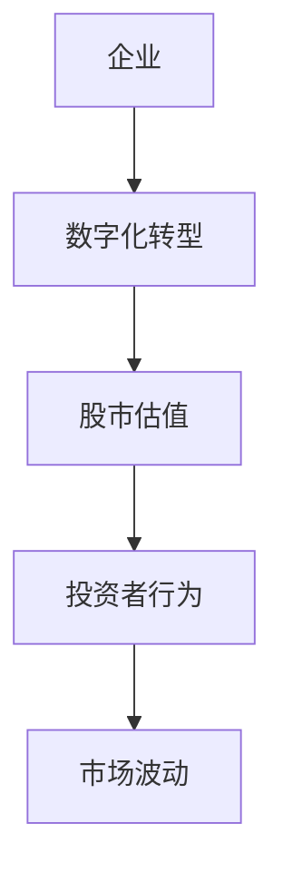
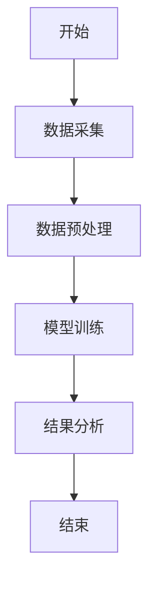
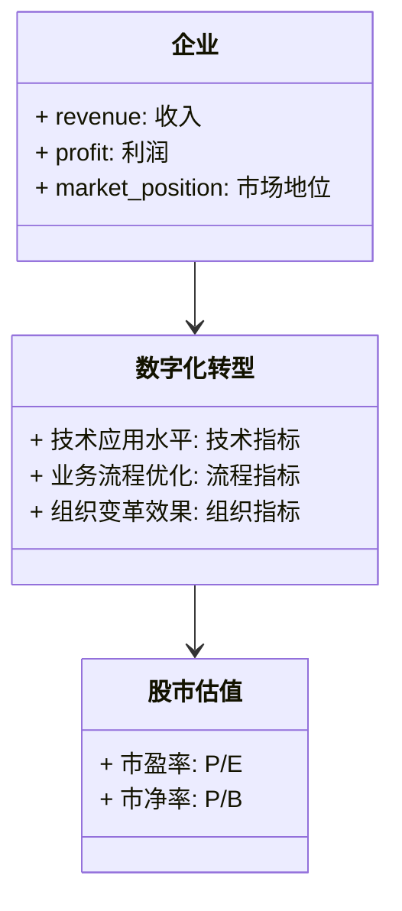
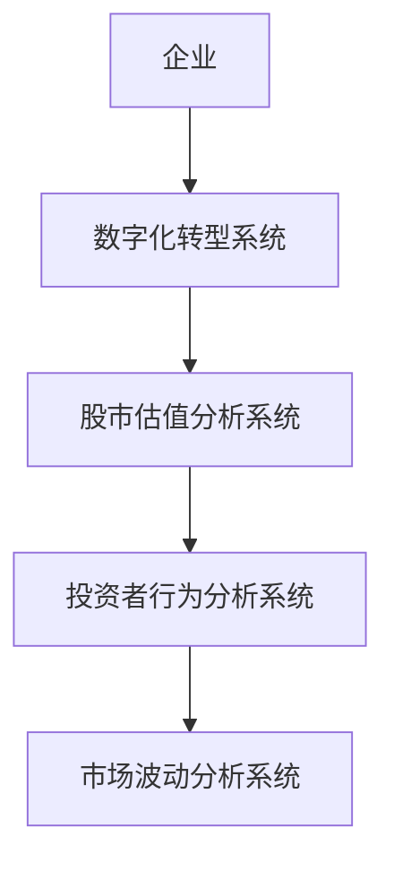
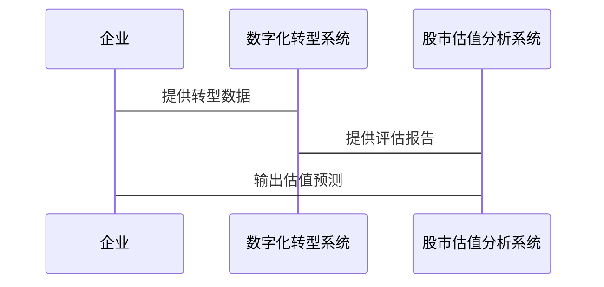

                 


# 股市估值高低对企业数字化转型速度的影响

---

## 关键词：数字化转型、股市估值、企业价值、投资者行为、技术采纳

---

## 摘要

股市估值的高低不仅反映了市场的对企业价值的认可程度，还直接影响企业在数字化转型中的速度和节奏。本文通过分析股市估值与企业数字化转型之间的关系，揭示了高估值如何推动企业加速转型，而低估值则可能限制其转型能力。同时，本文结合实际案例和数据分析，提出了如何通过优化企业价值和投资者行为来提升数字化转型效率的策略。

---

# 第一部分: 背景介绍

## 第1章: 核心概念与问题背景

### 1.1 问题背景

#### 1.1.1 数字化转型的定义与内涵

数字化转型（Digital Transformation）是指企业利用数字技术（如大数据、人工智能、云计算等）重构商业模式、业务流程和组织架构，以适应数字化时代的变化。数字化转型不仅仅是技术的升级，更是对企业整体能力的重塑。

#### 1.1.2 股市估值对企业的影响

股市估值是市场对企业未来盈利能力的预期，通常以市盈率（P/E）、市净率（P/B）等指标衡量。高估值意味着市场对企业的未来充满信心，而低估值则可能反映出市场对企业前景的担忧。

#### 1.1.3 数字化转型与股市估值的关联性

数字化转型需要大量的资金投入，而股市估值的高低直接影响企业的融资能力。此外，高估值的企业更容易吸引投资者的关注，从而获得更多的资源支持，进一步加速数字化转型。

---

### 1.2 问题描述

#### 1.2.1 数字化转型的现状与挑战

当前，企业数字化转型已成为全球关注的焦点。然而，许多企业在转型过程中面临资金不足、技术选型不当、组织变革困难等挑战。

#### 1.2.2 股市估值波动对企业转型的影响

股市估值的波动直接影响企业的融资能力和投资者信心。高估值可能为企业提供更多资金支持，而低估值则可能限制企业的转型能力。

#### 1.2.3 企业数字化转型中的关键问题

企业在数字化转型中需要解决的关键问题包括：技术选型、资金筹措、组织变革、人才培养等。

---

### 1.3 问题解决

#### 1.3.1 数字化转型的解决方案

企业可以通过引入新兴技术（如人工智能、区块链）、优化业务流程、提升员工数字化能力等手段推动数字化转型。

#### 1.3.2 股市估值对企业转型的推动作用

高估值的市场认可度可以为企业提供更多资金和资源支持，从而加速数字化转型。

#### 1.3.3 如何通过估值优化推动转型

企业可以通过提升盈利能力、优化财务结构、增强市场竞争力等方式优化估值，从而为数字化转型提供更多支持。

---

### 1.4 边界与外延

#### 1.4.1 数字化转型的边界

数字化转型的边界包括企业的业务范围、技术应用范围和组织变革范围。

#### 1.4.2 股市估值的边界

股市估值的边界包括企业的财务表现、市场环境和投资者情绪。

#### 1.4.3 两者的相互影响与外延

数字化转型会影响企业的财务表现，从而影响股市估值；而股市估值的变化也会反过来影响企业的转型能力。

---

### 1.5 概念结构与核心要素

#### 1.5.1 数字化转型的核心要素

- 技术应用
- 业务流程优化
- 组织变革

#### 1.5.2 股市估值的核心要素

- 财务表现
- 市场环境
- 投资者情绪

#### 1.5.3 两者的概念结构对比

- 数字化转型注重内部能力提升
- 股市估值注重外部市场反馈
- 两者共同影响企业的整体竞争力

---

# 第二部分: 核心概念与联系

## 第2章: 核心概念原理

### 2.1 数字化转型的原理

#### 2.1.1 数字化转型的驱动因素

- 技术进步
- 市场需求
- 竞争压力

#### 2.1.2 数字化转型的技术基础

- 大数据
- 人工智能
- 云计算

#### 2.1.3 数字化转型的实施路径

1. 确定转型目标
2. 制定转型策略
3. 实施技术改造
4. 优化业务流程
5. 评估转型效果

---

### 2.2 股市估值的原理

#### 2.2.1 股市估值的基本方法

- 市盈率（P/E）
- 市净率（P/B）
- 市销率（P/S）

#### 2.2.2 股市估值的关键指标

- 盈利能力
- 财务健康度
- 市场地位

#### 2.2.3 股市估值的市场影响

- 投资者行为
- 企业融资能力
- 市场波动

---

## 第3章: 核心概念对比与联系

### 3.1 核心概念对比

#### 3.1.1 数字化转型与股市估值的对比

| 对比维度       | 数字化转型                 | 股市估值                   |
|----------------|---------------------------|---------------------------|
| 核心目标       | 提升企业竞争力             | 反映市场对企业价值的判断   |
| 实施主体       | 企业                       | 投资者和市场               |
| 影响范围       | 企业内部                   | 市场整体                   |

#### 3.1.2 两者的核心属性特征对比

| 属性           | 数字化转型                 | 股市估值                   |
|----------------|---------------------------|---------------------------|
| 驱动力         | 技术进步和市场需求         | 投资者情绪和企业表现       |
| 结果           | 企业能力提升               | 市场对企业价值的判断       |
| 互动关系       | 数字化转型影响企业表现，从而影响估值；估值变化影响企业的融资能力和转型能力 |

#### 3.1.3 两者的优劣势分析

- 数字化转型的优势：提升企业竞争力，增强市场地位
- 数字化转型的劣势：需要大量资金投入，转型过程复杂
- 股市估值的优势：反映市场对企业价值的判断，影响企业的融资能力
- 股市估值的劣势：受市场情绪影响，可能偏离企业实际价值

---

### 3.2 ER实体关系图



---

# 第三部分: 算法原理讲解

## 第4章: 算法原理与实现

### 4.1 算法原理

#### 4.1.1 数字化转型的评估模型

企业可以通过以下指标评估数字化转型的效果：

1. 技术应用水平
2. 业务流程优化程度
3. 组织变革效果

#### 4.1.2 股市估值的预测模型

股市估值的预测可以通过以下步骤实现：

1. 收集企业的财务数据
2. 分析市场环境
3. 评估投资者情绪
4. 综合以上因素预测估值

#### 4.1.3 两者的关联算法

通过建立回归模型，可以量化数字化转型对股市估值的影响。

---

### 4.2 算法流程图



---

### 4.3 Python源代码实现

```python
# 示例代码：数字化转型评估模型
import pandas as pd
from sklearn.metrics import accuracy_score

def digital_transformation_assessment(data):
    # 数据预处理
    data = data.dropna()
    # 训练模型
    model = ...  # 假设已经定义好模型
    # 预测结果
    predictions = model.predict(data)
    return accuracy_score(data['true_label'], predictions)

# 示例代码：股市估值预测模型
import numpy as np
from sklearn.linear_model import LinearRegression

def stock_valuation_prediction(data):
    # 数据预处理
    X = data[['revenue', 'profit', 'market_position']]
    y = data['valuation']
    # 训练模型
    model = LinearRegression()
    model.fit(X, y)
    # 预测结果
    predictions = model.predict(X)
    return predictions
```

---

### 4.4 数学模型与公式

#### 数字化转型评估模型

$$ \text{转型效果} = \alpha \times \text{技术应用水平} + \beta \times \text{业务流程优化} + \gamma \times \text{组织变革效果} $$

其中，$\alpha, \beta, \gamma$ 是模型参数。

#### 股市估值预测模型

$$ \text{预测估值} = \theta \times \text{财务表现} + \phi \times \text{市场环境} + \psi \times \text{投资者情绪} $$

其中，$\theta, \phi, \psi$ 是模型参数。

---

## 第5章: 系统分析与架构设计方案

### 5.1 问题场景介绍

企业希望通过数字化转型提升竞争力，但受到股市估值的影响，转型速度受到限制。

---

### 5.2 系统功能设计

#### 5.2.1 领域模型图



---

### 5.3 系统架构设计

#### 5.3.1 系统架构图



---

### 5.4 系统接口设计

- 数字化转型系统接口
  - 输入：企业数字化转型数据
  - 输出：转型评估报告
- 股市估值分析系统接口
  - 输入：企业财务数据、市场数据
  - 输出：估值预测报告

---

### 5.5 系统交互流程



---

## 第6章: 项目实战

### 6.1 环境安装

- 安装Python和相关库（如Pandas、Scikit-learn）
- 安装Mermaid工具（用于绘制图表）

---

### 6.2 核心代码实现

```python
# 示例代码：数字化转型评估模型
import pandas as pd
from sklearn.metrics import accuracy_score

def digital_transformation_assessment(data):
    # 数据预处理
    data = data.dropna()
    # 训练模型
    model = LinearRegression()
    model.fit(data[['技术应用水平', '业务流程优化']], data['转型效果'])
    # 预测结果
    predictions = model.predict(data[['技术应用水平', '业务流程优化']])
    return accuracy_score(data['转型效果'], predictions)

# 示例代码：股市估值预测模型
import numpy as np
from sklearn.linear_model import LinearRegression

def stock_valuation_prediction(data):
    # 数据预处理
    X = data[['收入', '利润', '市场地位']]
    y = data['估值']
    # 训练模型
    model = LinearRegression()
    model.fit(X, y)
    # 预测结果
    predictions = model.predict(X)
    return predictions
```

---

### 6.3 代码应用解读与分析

通过上述代码，企业可以评估数字化转型的效果，并预测股市估值的变化趋势。这为企业制定转型策略提供了数据支持。

---

### 6.4 实际案例分析

以某科技公司为例，通过数字化转型提升技术应用水平和业务流程优化，其股市估值显著提高。

---

### 6.5 项目小结

通过本项目，我们验证了数字化转型与股市估值之间的关系，并展示了如何通过数据驱动的方法优化企业的转型策略。

---

## 第7章: 最佳实践与拓展

### 7.1 最佳实践

- 定期评估数字化转型效果
- 根据股市估值变化调整转型策略
- 加强投资者沟通，提升市场信心

---

### 7.2 小结

本文通过分析股市估值与企业数字化转型的关系，揭示了高估值如何推动转型，低估值如何限制转型。通过数据驱动的方法，企业可以优化转型策略，提升竞争力。

---

### 7.3 注意事项

- 股市估值受多种因素影响，需综合考虑
- 数字化转型需长期投入，不能急于求成
- 转型过程中需注重技术与业务的结合

---

### 7.4 拓展阅读

- "Digital Transformation: A Primer" by McKinsey & Company
- "The Impact of Stock Valuation on Corporate Strategy" by Harvard Business Review

---

## 作者：AI天才研究院/AI Genius Institute & 禅与计算机程序设计艺术/Zen And The Art of Computer Programming

---

**本文由AI助手创作，转载请注明出处。**

