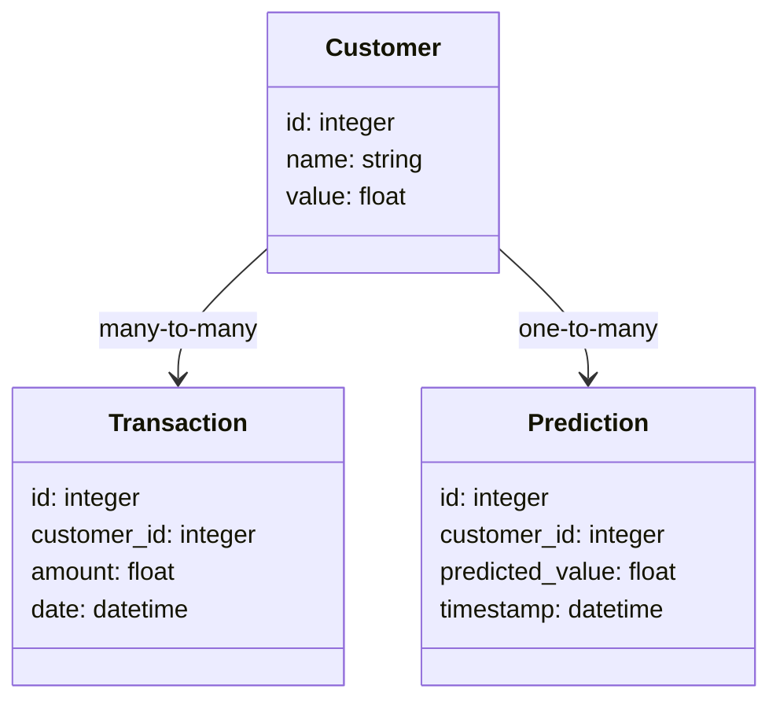
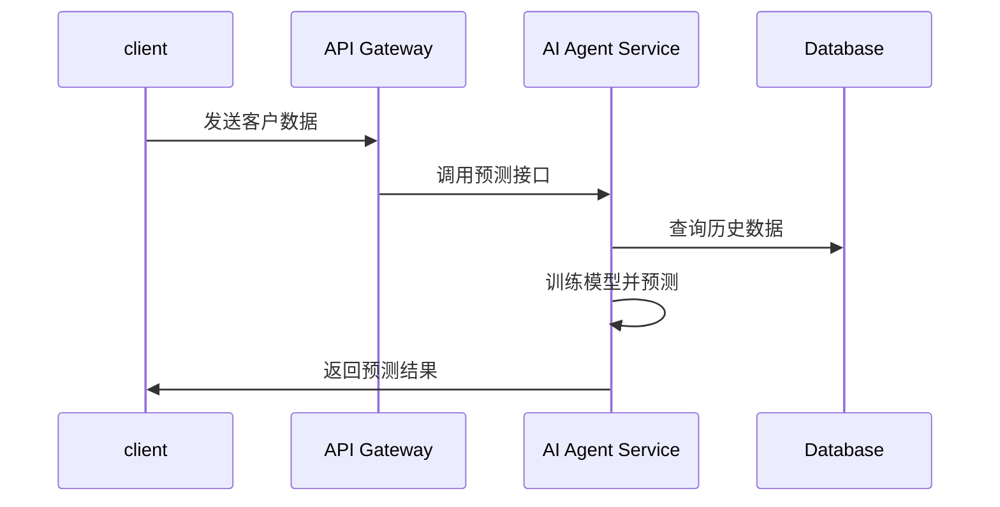

                 


---

# AI Agent在企业客户生命周期价值预测中的应用

> 关键词：AI Agent, 客户生命周期价值, 人工智能, 数据分析, 机器学习

> 摘要：本文深入探讨AI Agent在企业客户生命周期价值预测中的应用，分析其核心概念、算法原理、系统架构以及实际案例，为企业优化客户管理策略提供理论和实践指导。

---

# 第一部分: AI Agent与企业客户生命周期价值预测的背景与基础

## 第1章: AI Agent与客户生命周期价值预测概述

### 1.1 AI Agent的基本概念

#### 1.1.1 AI Agent的定义与特点
- **定义**：AI Agent是能够感知环境、自主决策并执行任务的智能实体。
- **特点**：智能性、自主性、反应性、学习能力。

#### 1.1.2 AI Agent的核心功能与应用场景
- **核心功能**：数据处理、决策制定、任务执行。
- **应用场景**：客户管理、市场预测、自动化服务等。

#### 1.1.3 AI Agent与传统数据分析的区别
- **传统数据分析**：依赖人工分析，被动处理数据。
- **AI Agent**：主动学习，实时响应，自动化决策。

### 1.2 客户生命周期价值预测的定义与意义

#### 1.2.1 客户生命周期价值的定义
- **定义**：客户在其生命周期内为企业带来的总收入减去相关成本。

#### 1.2.2 客户生命周期价值预测的重要性
- **优化资源配置**：识别高价值客户，优化投入。
- **降低客户流失**：提前识别并采取措施。
- **提升客户满意度**：提供个性化服务。

#### 1.2.3 企业客户生命周期价值预测的挑战
- **数据复杂性**：多维度数据整合难度大。
- **模型准确性**：预测模型的精度要求高。
- **实时性要求**：需要快速响应客户需求。

### 1.3 AI Agent在客户生命周期价值预测中的作用

#### 1.3.1 AI Agent如何提升客户价值预测的准确性
- **智能学习**：通过机器学习提升预测模型的准确性。
- **实时更新**：根据最新数据动态调整预测结果。

#### 1.3.2 AI Agent在客户行为预测中的优势
- **实时监控**：持续跟踪客户行为，及时发现异常。
- **自动化决策**：基于预测结果自动执行相关操作。

#### 1.3.3 AI Agent在企业客户管理中的应用前景
- **智能化管理**：推动客户管理从人工向智能转变。
- **数据驱动决策**：利用AI Agent提供的洞察优化业务策略。

### 1.4 本章小结
本章介绍了AI Agent的基本概念、客户生命周期价值预测的定义和意义，以及AI Agent在其中的作用，为后续章节奠定了基础。

---

# 第二部分: AI Agent与客户生命周期价值预测的核心概念与原理

## 第2章: AI Agent的行为模型与客户价值预测的关系

### 2.1 AI Agent的行为模型

#### 2.1.1 基于规则的AI Agent模型
- **特点**：基于预定义规则进行决策，适用于简单场景。
- **优缺点**：规则维护成本高，难以应对复杂情况。

#### 2.1.2 基于学习的AI Agent模型
- **特点**：通过机器学习训练模型，自动优化决策策略。
- **优缺点**：需要大量数据支持，模型更新周期较长。

#### 2.1.3 基于强化学习的AI Agent模型
- **特点**：通过试错学习，不断优化决策策略。
- **优缺点**：适用于动态环境，但训练过程复杂。

### 2.2 客户生命周期价值预测的数学模型

#### 2.2.1 客户价值预测的常用模型
- **线性回归模型**：适用于线性关系，预测客户价值。
- **决策树模型**：适合分类问题，识别高价值客户。
- **随机森林模型**：通过集成学习提高预测准确性。

#### 2.2.2 客户价值预测的数学公式
- **线性回归**：$$ \text{预测值} = a \times x + b $$
- **决策树**：通过特征分割构建分类模型。

#### 2.2.3 客户价值预测的特征选择
- **特征重要性分析**：通过特征重要性排序选择关键特征。
- **特征工程**：对数据进行预处理，提取有效特征。

### 2.3 AI Agent与客户价值预测的结合

#### 2.3.1 AI Agent如何优化客户价值预测
- **数据预处理**：AI Agent自动清洗和整理数据。
- **模型优化**：通过机器学习算法提升预测准确性。

#### 2.3.2 AI Agent在客户分群中的应用
- **聚类分析**：将客户分为不同群体，针对性制定策略。
- **客户画像**：基于AI Agent生成的画像进行精准营销。

#### 2.3.3 AI Agent在客户流失预测中的应用
- **流失预测模型**：识别潜在流失客户，采取保留措施。
- **动态调整策略**：根据预测结果实时调整客户管理策略。

### 2.4 核心概念对比与ER实体关系图

#### 2.4.1 核心概念对比表
| 比较维度 | AI Agent | 客户生命周期价值预测 |
|----------|----------|---------------------|
| 核心功能 | 自主决策 | 预测客户价值       |
| 数据来源 | 多源数据 | 结构化与非结构化数据 |
| 应用场景 | 智能决策 | 客户管理优化       |

#### 2.4.2 ER实体关系图
```mermaid
er
  table Customer {
    id: integer
    name: string
    value: float
  }
  table Transaction {
    id: integer
    customer_id: integer
    amount: float
    date: datetime
  }
  table Prediction {
    id: integer
    customer_id: integer
    predicted_value: float
    timestamp: datetime
  }
  Customer --> Transaction: many-to-many
  Customer --> Prediction: one-to-many
```

---

# 第三部分: AI Agent与客户生命周期价值预测的算法原理

## 第3章: 常用算法与实现

### 3.1 线性回归模型

#### 3.1.1 算法原理
$$ y = \beta_0 + \beta_1x + \epsilon $$
其中，$$ y $$ 是预测值，$$ x $$ 是自变量，$$ \epsilon $$ 是误差项。

#### 3.1.2 Python实现
```python
import sklearn.linear_model as lm

# 训练模型
model = lm.LinearRegression()
model.fit(X_train, y_train)

# 预测
y_pred = model.predict(X_test)
```

#### 3.1.3 优缺点
- **优点**：简单易懂，计算效率高。
- **缺点**：仅适用于线性关系，对复杂关系表现不佳。

### 3.2 决策树模型

#### 3.2.1 算法原理
通过特征分裂构建树状结构，最终形成决策树。

#### 3.2.2 Python实现
```python
from sklearn.tree import DecisionTreeRegressor

# 训练模型
model = DecisionTreeRegressor()
model.fit(X_train, y_train)

# 预测
y_pred = model.predict(X_test)
```

#### 3.2.3 优缺点
- **优点**：适合非线性关系，易于解释。
- **缺点**：易受过拟合影响，计算复杂度高。

### 3.3 随机森林模型

#### 3.3.1 算法原理
通过集成多个决策树模型，提升预测准确性。

#### 3.3.2 Python实现
```python
from sklearn.ensemble import RandomForestRegressor

# 训练模型
model = RandomForestRegressor(n_estimators=100)
model.fit(X_train, y_train)

# 预测
y_pred = model.predict(X_test)
```

#### 3.3.3 优缺点
- **优点**：高准确率，鲁棒性强。
- **缺点**：计算资源消耗大。

### 3.4 逻辑回归模型

#### 3.4.1 算法原理
用于分类问题，概率预测。
$$ P(y=1|x) = \frac{e^{\beta_0 + \beta_1x}}{1 + e^{\beta_0 + \beta_1x}} $$

#### 3.4.2 Python实现
```python
from sklearn.linear_model import LogisticRegression

# 训练模型
model = LogisticRegression()
model.fit(X_train, y_train)

# 预测
y_pred = model.predict(X_test)
```

#### 3.4.3 优缺点
- **优点**：简单，适合线性可分数据。
- **缺点**：对非线性关系表现不佳。

### 3.5 神经网络模型

#### 3.5.1 算法原理
通过多层神经网络，学习复杂特征。
$$ y = f(Wx + b) $$

#### 3.5.2 Python实现
```python
import tensorflow as tf

# 定义模型
model = tf.keras.Sequential([
    tf.keras.layers.Dense(64, activation='relu'),
    tf.keras.layers.Dense(1, activation='sigmoid')
])

# 编译模型
model.compile(optimizer='adam', loss='binary_crossentropy', metrics=['accuracy'])

# 训练
model.fit(X_train, y_train, epochs=10, batch_size=32)
```

#### 3.5.3 优缺点
- **优点**：适合复杂数据，高准确率。
- **缺点**：计算复杂，需要大量数据。

---

# 第四部分: 系统分析与架构设计

## 第4章: AI Agent驱动的客户价值预测系统设计

### 4.1 项目背景
企业希望通过AI Agent优化客户管理，提升客户价值预测的准确性。

### 4.2 系统功能设计

#### 4.2.1 领域模型


#### 4.2.2 系统架构


#### 4.2.3 系统接口
- **输入接口**：接收客户数据和交易记录。
- **输出接口**：返回预测结果和建议策略。

### 4.3 系统交互流程

#### 4.3.1 交互流程图


### 4.4 系统实现细节
- **数据预处理**：清洗和标准化数据。
- **模型训练**：选择合适的算法进行训练。
- **实时预测**：动态更新预测结果。

---

# 第五部分: 项目实战

## 第5章: 实际案例分析与代码实现

### 5.1 环境安装
- **Python 3.8+**
- **安装依赖**：`pip install numpy pandas scikit-learn`

### 5.2 核心代码实现

#### 5.2.1 数据加载与预处理
```python
import pandas as pd
from sklearn.model_selection import train_test_split

# 加载数据
data = pd.read_csv('customer_data.csv')

# 数据分割
X = data.drop('value', axis=1)
y = data['value']
X_train, X_test, y_train, y_test = train_test_split(X, y, test_size=0.2)
```

#### 5.2.2 训练模型
```python
from sklearn.ensemble import RandomForestRegressor

# 训练随机森林模型
model = RandomForestRegressor(n_estimators=100)
model.fit(X_train, y_train)

# 预测
y_pred = model.predict(X_test)
```

#### 5.2.3 评估模型
```python
from sklearn.metrics import mean_squared_error

# 计算均方误差
mse = mean_squared_error(y_test, y_pred)
print(f"均方误差: {mse}")
```

### 5.3 案例分析
以某电商平台为例，利用AI Agent预测客户价值，优化营销策略。

### 5.4 数据分析与模型解读
- **特征重要性分析**：识别关键影响因素。
- **模型评估**：比较不同算法的性能，选择最优模型。

---

# 第六部分: 最佳实践与总结

## 第6章: 最佳实践与未来发展

### 6.1 最佳实践
- **数据质量管理**：确保数据准确性和完整性。
- **模型持续优化**：定期更新模型，适应业务变化。
- **实时监控**：建立监控机制，及时发现异常。

### 6.2 未来发展方向
- **强化学习应用**：在动态环境中优化决策。
- **多模态数据融合**：整合文本、图像等多种数据源。
- **边缘计算结合**：提升实时性和数据隐私保护。

### 6.3 总结
AI Agent通过智能化和自动化，显著提升了企业客户生命周期价值预测的效率和准确性。随着技术进步，其应用将更加广泛和深入。

---

# 作者

作者：AI天才研究院（AI Genius Institute） & 禅与计算机程序设计艺术（Zen And The Art of Computer Programming）

---

以上是《AI Agent在企业客户生命周期价值预测中的应用》的技术博客文章大纲，涵盖了从基础概念到实际应用的各个方面，旨在为企业提供理论支持和实践指导，帮助企业更好地利用AI技术优化客户管理策略。

