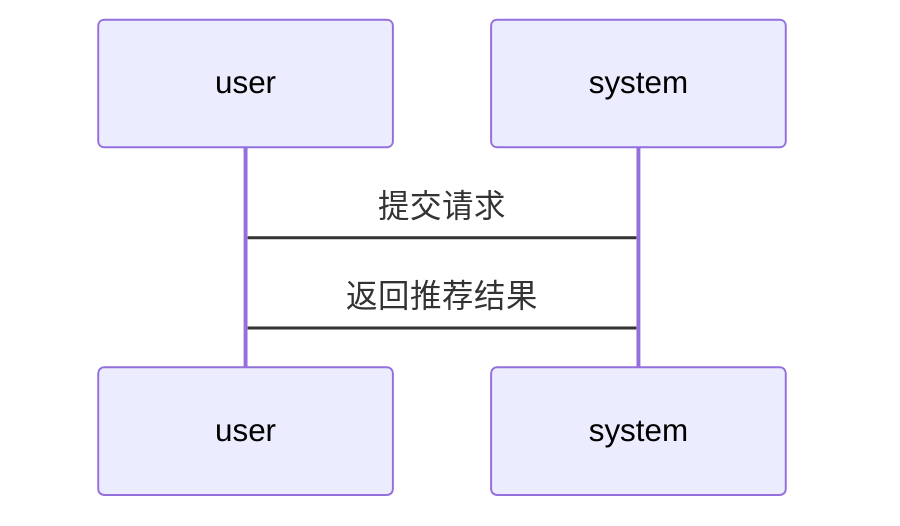

                 


# AI Agent在智能个性化营销中的应用

> 关键词：AI Agent, 智能个性化营销, 自然语言处理, 机器学习, 推荐系统, 营销自动化, 数据挖掘

> 摘要：本文详细探讨了AI Agent在智能个性化营销中的应用，从基本概念到核心技术，从系统设计到项目实战，全面解析了AI Agent如何通过自然语言处理、机器学习和推荐系统等技术实现个性化营销。文章还通过实际案例分析，展示了AI Agent在营销自动化中的潜力和挑战。

---

# 第1章: AI Agent与智能个性化营销概述

## 1.1 AI Agent的基本概念

### 1.1.1 AI Agent的定义与特点

AI Agent（人工智能代理）是一种能够感知环境、执行任务并做出决策的智能系统。它具备以下特点：

1. **自主性**：AI Agent能够自主决策，无需人工干预。
2. **反应性**：能够实时感知环境变化并做出响应。
3. **目标导向**：以特定目标为导向，优化行动策略。
4. **学习能力**：通过数据和反馈不断优化自身性能。

AI Agent的核心在于其智能化和自动化能力，能够处理复杂任务并提供个性化服务。

### 1.1.2 AI Agent与传统营销的区别

传统营销依赖人工操作，效率低且难以个性化。AI Agent通过自动化和智能化技术，能够实时分析数据、优化策略并执行操作。例如，AI Agent可以自动分析用户行为数据，生成个性化推荐，而传统营销则需要人工分析数据并制定策略。

### 1.1.3 AI Agent在营销中的应用潜力

AI Agent在营销中的潜力巨大。它可以通过自然语言处理（NLP）分析用户反馈，利用机器学习算法预测用户行为，并通过推荐系统提供个性化产品推荐。此外，AI Agent还可以自动化执行营销任务，如发送邮件、管理客户关系等。

## 1.2 智能个性化营销的背景与需求

### 1.2.1 当前营销环境的变化

随着互联网的普及和数据技术的发展，营销环境发生了巨大变化。消费者的行为越来越个性化，企业需要通过数据驱动的方式进行精准营销。

### 1.2.2 消费者行为的个性化趋势

消费者越来越追求个性化体验，传统的批量营销已经无法满足需求。个性化营销能够提高客户满意度和忠诚度，从而提升企业竞争力。

### 1.2.3 企业对个性化营销的需求

企业希望通过个性化营销提高转化率和客户满意度。个性化营销能够帮助企业在竞争激烈的市场中脱颖而出，同时降低营销成本。

## 1.3 AI Agent在个性化营销中的作用

### 1.3.1 提供个性化推荐

AI Agent可以通过分析用户行为数据，利用协同过滤和内容推荐算法，为用户提供个性化的产品推荐。

### 1.3.2 自动化营销流程

AI Agent能够自动化执行营销任务，如发送邮件、管理客户关系等，从而提高营销效率。

### 1.3.3 实时数据分析

AI Agent能够实时分析用户数据，快速响应市场变化，帮助企业做出及时决策。

## 1.4 本章小结

本章介绍了AI Agent的基本概念及其在营销中的应用潜力，分析了智能个性化营销的背景与需求，探讨了AI Agent在个性化营销中的作用。

---

# 第2章: AI Agent的核心技术与实现

## 2.1 自然语言处理技术

### 2.1.1 NLP的基本原理

自然语言处理（NLP）是AI Agent实现文本理解的核心技术。NLP通过将自然语言文本转化为计算机可理解的结构，帮助AI Agent理解用户意图。

### 2.1.2 常见的NLP算法

1. **分词**：将文本分割成词或短语，常用算法包括jieba、nltk等。
2. **实体识别**：识别文本中的实体，如人名、地名等。
3. **情感分析**：分析文本情感倾向，常用算法包括基于词袋模型和支持向量机（SVM）。

### 2.1.3 NLP在营销中的应用

NLP可以用于分析用户反馈、情感分析和关键词提取，帮助营销人员更好地理解用户需求。

## 2.2 机器学习与深度学习

### 2.2.1 机器学习的基本原理

机器学习通过数据训练模型，使其能够自动识别模式并做出预测。常用算法包括线性回归、决策树和随机森林。

### 2.2.2 深度学习的核心算法

深度学习通过多层神经网络进行特征提取和模式识别。常用算法包括卷积神经网络（CNN）和循环神经网络（RNN）。

### 2.2.3 机器学习在个性化推荐中的应用

机器学习算法可以用于个性化推荐，如协同过滤和基于内容的推荐。

## 2.3 数据挖掘与分析

### 2.3.1 数据挖掘的基本概念

数据挖掘是从大量数据中提取有价值信息的过程，常用技术包括分类、聚类和关联规则挖掘。

### 2.3.2 常见的数据挖掘算法

1. **分类**：如决策树、支持向量机（SVM）。
2. **聚类**：如K-means、层次聚类。
3. **关联规则挖掘**：如Apriori算法。

### 2.3.3 数据挖掘在营销中的应用

数据挖掘可以用于客户分群、 churn预测和市场 basket分析。

## 2.4 AI Agent的意图识别

### 2.4.1 意图识别的定义

意图识别是通过分析用户行为和文本，推断用户的意图。

### 2.4.2 基于NLP的意图识别

基于NLP的意图识别可以通过关键词匹配和情感分析实现。

### 2.4.3 意图识别的实现流程

1. 数据预处理：清洗和标注数据。
2. 特征提取：提取关键词和情感特征。
3. 模型训练：训练分类器，如支持向量机（SVM）和随机森林。

## 2.5 个性化推荐系统

### 2.5.1 推荐系统的分类

推荐系统可以分为协同过滤、基于内容的推荐和混合推荐。

### 2.5.2 基于协同过滤的推荐算法

协同过滤通过寻找相似用户的偏好进行推荐，常用算法包括基于用户的协同过滤和基于物品的协同过滤。

### 2.5.3 基于内容的推荐算法

基于内容的推荐算法通过分析商品属性进行推荐，常用算法包括TF-IDF和LSA。

### 2.5.4 混合推荐算法

混合推荐算法结合协同过滤和基于内容的推荐，优势在于能够同时考虑用户偏好和商品属性。

## 2.6 本章小结

本章详细介绍了AI Agent的核心技术，包括自然语言处理、机器学习、数据挖掘和意图识别，探讨了个性化推荐系统的实现方法。

---

# 第3章: AI Agent的系统设计与实现

## 3.1 系统架构设计

### 3.1.1 系统架构概述

AI Agent的系统架构通常包括数据采集层、数据处理层、模型训练层和应用层。

### 3.1.2 系统架构的设计原则

1. **模块化设计**：各个模块相对独立，便于维护和扩展。
2. **高可用性**：系统能够承受部分节点故障，保证服务不中断。
3. **可扩展性**：系统能够适应数据量和用户量的增长。

### 3.1.3 系统架构的组成

1. **数据采集层**：负责采集用户行为数据和市场数据。
2. **数据处理层**：对数据进行清洗、转换和存储。
3. **模型训练层**：训练机器学习模型并进行预测。
4. **应用层**：提供用户界面和API接口，供其他系统调用。

## 3.2 系统功能设计

### 3.2.1 系统功能模块

1. **数据采集模块**：采集用户行为数据和市场数据。
2. **数据处理模块**：清洗、转换和存储数据。
3. **模型训练模块**：训练机器学习模型并进行预测。
4. **推荐系统模块**：根据模型预测结果生成个性化推荐。

### 3.2.2 系统功能设计的流程

1. 数据采集：通过网页爬虫、API接口等方式采集数据。
2. 数据处理：清洗数据、去除噪声，并将其转换为适合模型训练的格式。
3. 模型训练：使用训练数据训练机器学习模型，生成推荐结果。
4. 推荐系统：根据模型预测结果生成个性化推荐，并通过用户界面展示。

## 3.3 系统架构设计

### 3.3.1 系统架构的实现

1. **数据采集层**：使用爬虫工具（如Scrapy）采集数据。
2. **数据处理层**：使用Python的Pandas库进行数据清洗和转换。
3. **模型训练层**：使用Scikit-learn库训练机器学习模型。
4. **应用层**：使用Flask框架搭建Web界面，并通过API接口提供服务。

## 3.4 系统接口设计

### 3.4.1 API接口设计

1. **数据接口**：提供数据采集和存储的API接口。
2. **推荐接口**：提供个性化推荐的API接口。

### 3.4.2 API接口的实现

1. 数据接口：通过RESTful API实现数据的增删改查操作。
2. 推荐接口：通过RESTful API返回个性化推荐结果。

## 3.5 系统交互设计

### 3.5.1 用户与系统交互流程

1. 用户登录系统，提交请求。
2. 系统根据用户请求生成个性化推荐。
3. 用户查看推荐结果并进行操作。

### 3.5.2 系统交互流程图



## 3.6 本章小结

本章详细介绍了AI Agent的系统设计与实现，包括系统架构设计、功能模块设计、接口设计和交互流程设计。

---

# 第4章: 项目实战

## 4.1 项目背景

本项目旨在通过AI Agent实现个性化推荐系统，帮助电商网站提高用户转化率和满意度。

## 4.2 项目环境安装

### 4.2.1 安装Python和相关库

1. 安装Python：可以从官网下载安装包。
2. 安装Pandas、Scikit-learn和Flask库：使用pip命令安装。

```bash
pip install pandas scikit-learn flask
```

### 4.2.2 安装数据库

1. 安装MySQL：可以从官网下载安装包。
2. 创建数据库和表：使用SQL命令创建用户表和推荐表。

```sql
CREATE TABLE users (
    user_id INT AUTO_INCREMENT PRIMARY KEY,
    username VARCHAR(50)
);
CREATE TABLE recommendations (
    recommendation_id INT AUTO_INCREMENT PRIMARY KEY,
    user_id INT,
    product_id INT,
    recommendation_score FLOAT,
    FOREIGN KEY (user_id) REFERENCES users(user_id)
);
```

## 4.3 系统核心实现

### 4.3.1 数据采集与处理

1. 使用爬虫工具采集用户行为数据。
2. 使用Pandas库清洗和转换数据。

```python
import pandas as pd

# 读取数据
data = pd.read_csv('data.csv')

# 数据清洗
data.dropna(inplace=True)
data.drop_duplicates(inplace=True)

# 数据转换
data['timestamp'] = pd.to_datetime(data['timestamp'])
```

### 4.3.2 模型训练与推荐

1. 使用Scikit-learn库训练协同过滤模型。
2. 生成个性化推荐结果。

```python
from sklearn.neighbors import NearestNeighbors

# 训练模型
model = NearestNeighbors(n_neighbors=5, algorithm='ball_tree').fit(X)

# 生成推荐
distances, indices = model.kneighbors(X_test)
```

### 4.3.3 接口实现与部署

1. 使用Flask框架搭建Web界面。
2. 部署API接口。

```python
from flask import Flask, jsonify

app = Flask(__name__)

@app.route('/recommend', methods=['POST'])
def recommend():
    # 获取请求参数
    user_id = request.json['user_id']
    # 生成推荐
    recommendations = get_recommendations(user_id)
    return jsonify({'recommendations': recommendations})

if __name__ == '__main__':
    app.run(debug=True)
```

## 4.4 项目实战小结

本章通过实际项目展示了AI Agent在个性化推荐系统中的实现过程，包括环境安装、数据处理、模型训练和接口部署。

---

# 第5章: 未来趋势与挑战

## 5.1 未来发展趋势

### 5.1.1 技术发展趋势

1. **多模态学习**：结合文本、图像和语音等多种模态数据进行分析。
2. **强化学习**：通过强化学习优化AI Agent的决策能力。

### 5.1.2 市场发展趋势

1. **个性化营销普及**：越来越多的企业将采用个性化营销策略。
2. **自动化营销工具**：AI Agent将推动营销工具的自动化和智能化。

## 5.2 当前面临的主要挑战

### 5.2.1 技术挑战

1. **数据隐私问题**：如何保护用户数据隐私是一个重要挑战。
2. **模型可解释性**：需要提高模型的可解释性，以便更好地理解推荐结果。

### 5.2.2 市场挑战

1. **市场竞争加剧**：随着越来越多的企业采用AI Agent，市场竞争将更加激烈。
2. **用户接受度**：用户对AI Agent的接受度可能影响其推广。

## 5.3 未来研究方向

### 5.3.1 技术研究方向

1. **高效算法研究**：研究更高效的算法，以提高推荐系统的性能。
2. **模型融合**：研究如何将多种模型进行融合，以提高推荐效果。

### 5.3.2 应用研究方向

1. **跨平台应用**：研究如何在不同平台间实现AI Agent的应用。
2. **实时性优化**：研究如何优化推荐系统的实时性。

## 5.4 本章小结

本章分析了AI Agent在智能个性化营销中的未来发展趋势和当前面临的挑战，提出了未来的研究方向。

---

# 作者：AI天才研究院/AI Genius Institute & 禅与计算机程序设计艺术 /Zen And The Art of Computer Programming

---

### 总结

本文详细探讨了AI Agent在智能个性化营销中的应用，从基本概念到核心技术，从系统设计到项目实战，全面解析了AI Agent如何通过自然语言处理、机器学习和推荐系统等技术实现个性化营销。文章还通过实际案例分析，展示了AI Agent在营销自动化中的潜力和挑战。未来，随着技术的进步和市场的需求，AI Agent在智能个性化营销中的应用将更加广泛和深入。

