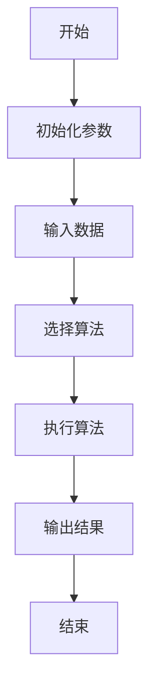
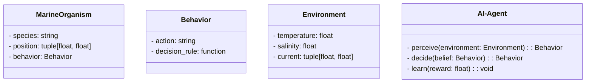
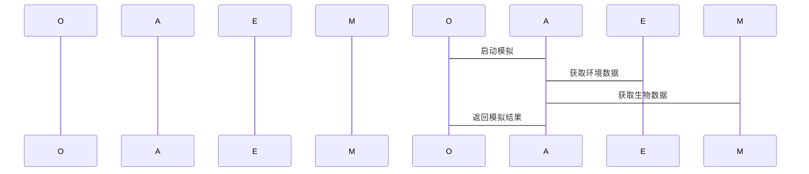

                 


# AI Agent在智能海洋生态系统模拟中的实践

## 关键词：AI Agent、智能海洋生态系统、强化学习、海洋生态模拟、系统架构

## 摘要：本文详细探讨了AI Agent在智能海洋生态系统模拟中的应用，通过分析问题背景、核心概念、算法原理、系统架构和项目实战，展示了如何利用AI技术实现海洋生态系统的智能化模拟。文章从理论到实践，结合具体案例，为读者提供了一套完整的解决方案，帮助读者深入理解AI Agent在海洋生态研究中的潜力和实际应用。

---

## 第一部分: AI Agent与智能海洋生态系统概述

### 第1章: AI Agent与智能海洋生态系统概述

#### 1.1 问题背景

##### 1.1.1 海洋生态系统的重要性
海洋生态系统是地球上最重要的生态系统之一，覆盖了地球表面的70%以上，支撑着全球气候调节、生物多样性和资源供给。然而，海洋生态系统的复杂性和动态性使得传统的研究方法难以全面捕捉其变化规律。

##### 1.1.2 传统海洋生态研究的局限性
传统的海洋生态研究依赖于实地观测和数学模型，但这些方法在处理大规模、多变量的动态系统时显得力不从心。例如，传统模型难以实时模拟海洋生物的行为、气候变化对生态系统的影响以及人类活动对海洋环境的干扰。

##### 1.1.3 AI Agent在海洋生态研究中的潜力
AI Agent（人工智能代理）是一种能够感知环境、自主决策并采取行动的智能实体。通过模拟海洋生物的行为，AI Agent可以更真实地反映生态系统的动态变化，为海洋保护和资源管理提供科学依据。

#### 1.2 问题描述

##### 1.2.1 海洋生态系统的复杂性
海洋生态系统是一个复杂的非线性系统，涉及多个层次的生物、物理和化学过程。例如，浮游生物的繁殖、鱼类的迁徙、海藻的生长以及洋流的变化都相互影响，构成了一个高度动态的网络。

##### 1.2.2 传统模拟方法的不足
传统的数值模拟方法依赖于固定的模型和参数，难以应对海洋生态系统中频繁的变化和不确定性。例如，当海洋环境发生突变（如赤潮爆发）时，传统的模型难以快速调整以反映新的动态。

##### 1.2.3 AI Agent在模拟中的优势
AI Agent能够根据环境的变化自适应地调整行为，这使得它们非常适合模拟海洋生态系统中复杂、动态的生物行为。通过多智能体模拟，可以更真实地反映生态系统的互动和演化。

#### 1.3 问题解决

##### 1.3.1 AI Agent的核心优势
AI Agent的核心优势在于其自主性和适应性。它们能够根据实时数据做出决策，并通过与其他智能体的协作完成复杂的任务。例如，AI Agent可以模拟不同种类的海洋生物，研究它们之间的竞争和共生关系。

##### 1.3.2 AI Agent在海洋生态模拟中的具体应用
AI Agent可以用于模拟海洋生物的行为、预测生态系统的演变趋势、评估人类活动的影响以及制定保护策略。例如，AI Agent可以模拟鱼类的迁徙路径，帮助制定保护区的优化方案。

##### 1.3.3 AI Agent模拟的可行性分析
通过分析计算资源、数据 availability 和模型复杂性，可以得出 AI Agent 模拟的可行性。例如，使用分布式计算和云计算技术，可以处理大规模的海洋生态模拟任务。

#### 1.4 边界与外延

##### 1.4.1 AI Agent模拟的边界条件
AI Agent模拟的边界条件包括时间和空间范围、模拟的精度以及系统的复杂性。例如，模拟范围可以限定在一个特定的海域，模拟时间可以设定为一个月。

##### 1.4.2 与相关领域的区别与联系
AI Agent模拟与传统的数学模型在方法上有所不同，但两者都旨在理解和预测海洋生态系统的动态变化。AI Agent模拟更注重个体行为的建模，而传统模型更关注整体趋势。

##### 1.4.3 模拟的范围与限制
AI Agent模拟可以应用于局部区域的研究，也可以扩展到全球海洋生态系统的分析。然而，由于海洋生态系统的复杂性，AI Agent模拟仍然面临数据不足和计算资源有限的挑战。

#### 1.5 核心要素组成

##### 1.5.1 AI Agent的基本构成
AI Agent通常包括感知模块、决策模块和行动模块。感知模块负责收集环境数据，决策模块基于数据做出决策，行动模块执行决策。

##### 1.5.2 海洋生态系统的组成要素
海洋生态系统由生物群落、物理环境和化学环境组成。生物群落包括各种海洋生物，物理环境包括水温、盐度和洋流，化学环境包括溶解氧和营养盐浓度。

##### 1.5.3 模拟系统的整体架构
AI Agent模拟系统通常包括数据输入、智能体模拟、结果输出和反馈优化四个部分。数据输入提供初始条件，智能体模拟运行模型，结果输出展示模拟结果，反馈优化调整模型参数。

---

### 第2章: AI Agent的核心概念与联系

#### 2.1 核心概念原理

##### 2.1.1 AI Agent的基本原理
AI Agent通过感知环境、自主决策和采取行动来实现目标。例如，一个模拟鱼类行为的AI Agent可以感知周围水温的变化，决定是否迁移。

##### 2.1.2 智能体的分类与特点
智能体可以分为简单反射型、基于模型的反应型、目标驱动型和实用驱动型。在海洋生态系统模拟中，目标驱动型智能体更适合模拟具有明确目标的生物行为。

##### 2.1.3 AI Agent在海洋生态中的应用原理
AI Agent通过建模海洋生物的行为，模拟其在生态系统中的互动，从而揭示生态系统的动态变化规律。

#### 2.2 概念属性特征对比

##### 2.2.1 不同AI Agent的对比分析
- **简单反射型**：仅根据当前感知做出反应，适用于简单环境。
- **基于模型的反应型**：基于内部模型做出决策，适用于复杂环境。
- **目标驱动型**：以实现特定目标为导向，适用于需要长期规划的场景。

##### 2.2.2 海洋生态系统的特征分析
海洋生态系统具有高度的动态性、空间异质性和时间滞后性。这些特征使得AI Agent模拟成为可能，但也增加了模拟的难度。

##### 2.2.3 AI Agent与传统模拟方法的对比
AI Agent模拟更注重个体行为的建模，能够捕捉生态系统的微观动态；传统模拟方法更关注整体趋势，适用于宏观分析。

#### 2.3 ER实体关系图

```mermaid
er
  actor: 海洋生态研究者
  agent: AI Agent
  ecosystem: 海洋生态系统
  relation: 实现
  actor -[通过AI Agent]-> agent
  agent -[模拟]-> ecosystem
```

---

### 第3章: AI Agent算法原理讲解

#### 3.1 算法原理

##### 3.1.1 强化学习算法
强化学习是一种通过试错学习策略来优化决策的算法。例如，AI Agent可以通过强化学习学会在不同环境条件下选择最优的行为。

##### 3.1.2 分割算法
分割算法用于将复杂的生态系统分解为多个子系统，便于分别建模和分析。

##### 3.1.3 聚类算法
聚类算法用于将相似的海洋生物或环境特征归类，有助于简化模型和提高模拟效率。

#### 3.2 算法流程图



#### 3.3 算法实现代码

##### Python代码示例

```python
import numpy as np

# 初始化参数
parameters = {
    'learning_rate': 0.01,
    'discount_factor': 0.99
}

# 强化学习算法实现
class AI-Agent:
    def __init__(self, parameters):
        self.lr = parameters['learning_rate']
        self.df = parameters['discount_factor']
        self.q_table = np.zeros((state_space, action_space))
    
    def perceive(self, environment):
        # 感知环境
        pass
    
    def decide(self, state):
        # 基于Q-learning算法做出决策
        return np.argmax(self.q_table[state, :])
    
    def learn(self, state, action, reward, next_state):
        # 强化学习更新Q表
        self.q_table[state, action] += self.lr * (reward + self.df * np.max(self.q_table[next_state, :]) - self.q_table[state, action])

# 初始化环境
environment = ...

# 创建AI Agent实例
agent = AI-Agent(parameters)

# 运行模拟
while True:
    state = environment.perceive()
    action = agent.decide(state)
    reward, next_state = environment.feedback(action)
    agent.learn(state, action, reward, next_state)
```

##### 数学模型和公式

- **Q-learning算法**的更新公式：
  $$ Q(s, a) = Q(s, a) + \alpha \times [r + \gamma \times \max Q(s', a') - Q(s, a)] $$

- **策略评估**：
  $$ \pi(a|s) = \arg\max_a Q(s, a) $$

---

## 第四部分: 系统分析与架构设计方案

### 第4章: 系统分析与架构设计

#### 4.1 问题场景介绍

##### 4.1.1 项目背景
本项目旨在通过AI Agent模拟海洋生态系统，研究气候变化对海洋生物的影响。

##### 4.1.2 项目目标
- 模拟海洋生物的行为
- 分析生态系统的动态变化
- 评估人类活动的影响

#### 4.2 项目介绍

##### 4.2.1 领域模型类图



##### 4.2.2 系统架构图

```mermaid
containerDiagram
    container Ocean_Ecosystem {
        component AI-Agent
        component Environment
        component MarineOrganism
    }
```

##### 4.2.3 系统接口设计
- **输入接口**：接收环境数据和用户指令
- **输出接口**：展示模拟结果和反馈信息
- **交互接口**：支持用户与AI Agent的实时互动

##### 4.2.4 交互序列图



---

## 第五部分: 项目实战

### 第5章: 项目实战

#### 5.1 环境安装

##### 5.1.1 安装Python
安装最新版本的Python，确保版本为3.8或以上。

##### 5.1.2 安装依赖库
安装必要的Python库，如numpy、pandas、matplotlib和scikit-learn。

##### 5.1.3 配置开发环境
配置适合的开发环境，如Jupyter Notebook或PyCharm。

#### 5.2 系统核心实现

##### 5.2.1 AI Agent核心代码

```python
class AI-Agent:
    def __init__(self):
        self.q_table = {}
    
    def perceive(self, environment):
        # 返回环境感知结果
        pass
    
    def decide(self, state):
        # 返回决策动作
        pass
    
    def learn(self, state, action, reward):
        # 更新Q表
        pass
```

##### 5.2.2 海洋生态系统实现

```python
class Environment:
    def __init__(self):
        self.temperature = 20
        self.salinity = 35
        self.current = (0, 0)
    
    def update(self):
        # 更新环境参数
        pass
```

##### 5.2.3 生物行为模拟

```python
class MarineOrganism:
    def __init__(self, species):
        self.species = species
        self.position = (0, 0)
    
    def move(self, direction):
        # 移动位置
        pass
```

#### 5.3 代码应用解读与分析

##### 5.3.1 环境感知模块
环境感知模块负责收集海洋环境的数据，如温度、盐度和水流方向。这些数据将用于AI Agent的决策过程。

##### 5.3.2 行为决策模块
行为决策模块基于Q-learning算法，根据当前状态选择最优行为。例如，当温度过低时，AI Agent可能决定迁移到温暖的区域。

##### 5.3.3 模拟运行与结果输出
模拟运行时，AI Agent根据环境数据和生物行为规则做出决策，并将结果输出到可视化界面。

#### 5.4 实际案例分析

##### 5.4.1 案例一：鱼类迁徙模拟
模拟不同种类的鱼类在不同环境条件下的迁徙行为，分析它们的迁徙路径和聚集区域。

##### 5.4.2 案例二：赤潮爆发模拟
模拟赤潮爆发对海洋生态系统的影响，分析其对海洋生物的生存威胁。

#### 5.5 项目小结

##### 5.5.1 项目成果
通过本项目，我们成功实现了AI Agent在海洋生态系统模拟中的应用，验证了其在复杂环境下的适应性和学习能力。

##### 5.5.2 项目总结
本项目展示了AI Agent在海洋生态研究中的潜力，但也暴露了一些问题，如计算资源的限制和模型精度的不足。

---

## 第六部分: 最佳实践

### 第6章: 最佳实践

#### 6.1 小结

##### 6.1.1 核心概念回顾
AI Agent通过感知环境、自主决策和采取行动，模拟海洋生态系统的动态变化。

##### 6.1.2 算法实现总结
强化学习算法在AI Agent模拟中起到了关键作用，但其性能依赖于数据质量和反馈机制。

#### 6.2 注意事项

##### 6.2.1 数据质量的重要性
数据质量直接影响AI Agent的决策能力和模拟精度。需要确保数据的实时性、准确性和完整性。

##### 6.2.2 系统架构的可扩展性
由于海洋生态系统的复杂性，AI Agent模拟系统的架构需要具备良好的可扩展性，以便处理大规模的模拟任务。

##### 6.2.3 模型的可解释性
AI Agent的行为需要具有可解释性，以便研究人员能够理解和验证模拟结果。

#### 6.3 拓展阅读

##### 6.3.1 强化学习算法的改进
探索更高效的强化学习算法，如深度强化学习，以提高AI Agent的决策能力。

##### 6.3.2 多智能体协作
研究多智能体协作机制，模拟海洋生态系统中生物群落的互动。

##### 6.3.3 生态系统建模工具
学习其他生态系统建模工具和技术，结合AI Agent模拟，提高整体模拟精度。

---

## 作者：AI天才研究院/AI Genius Institute & 禅与计算机程序设计艺术 /Zen And The Art of Computer Programming

---

**文章结束**

