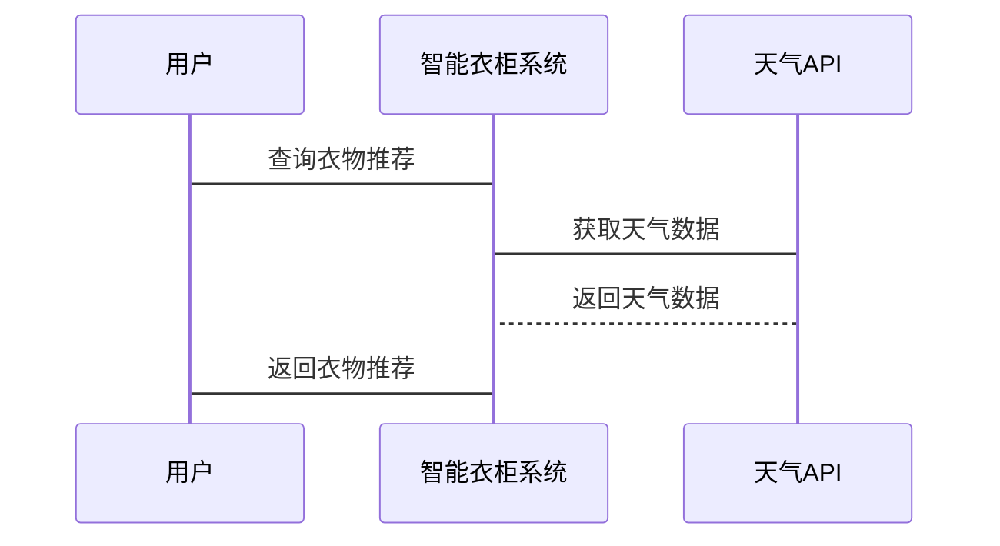

                 


# AI Agent在智能衣柜中的季节性衣物管理

> **关键词**：AI Agent，智能衣柜，季节性衣物，衣物管理，人工智能，算法原理

> **摘要**：本文探讨AI Agent在智能衣柜中的应用，重点分析其在季节性衣物管理中的核心作用。通过介绍AI Agent的基本概念、算法原理、系统架构设计，以及实际项目实现，全面解析AI Agent如何优化季节性衣物管理流程。本文旨在为技术爱好者、AI研究人员以及智能家居设计者提供理论与实践相结合的参考。

---

# 第一部分: AI Agent与智能衣柜的背景介绍

## 第1章: AI Agent与智能衣柜概述

### 1.1 AI Agent的基本概念

#### 1.1.1 AI Agent的定义
AI Agent（人工智能代理）是一种能够感知环境、自主决策并执行任务的智能实体。它通过与环境交互，实现目标的优化。AI Agent可以是软件程序，也可以是嵌入在物理设备中的智能模块。

#### 1.1.2 AI Agent的核心特征
- **自主性**：能够在没有外部干预的情况下独立运作。
- **反应性**：能够感知环境并实时调整行为。
- **目标导向**：通过目标驱动进行决策和行动。
- **学习能力**：能够通过数据和经验不断优化自身行为。

#### 1.1.3 AI Agent与智能衣柜的结合
AI Agent被嵌入到智能衣柜系统中，通过感知环境和用户行为，优化衣物的分类、存储和推荐。

### 1.2 智能衣柜的定义与特点

#### 1.2.1 智能衣柜的概念
智能衣柜是一种结合了物联网技术和人工智能的智能存储系统，能够通过传感器、摄像头和AI算法实现衣物的自动分类、库存管理和智能推荐。

#### 1.2.2 智能衣柜的核心功能
- 衣物分类与识别
- 季节性衣物管理
- 用户行为分析
- 智能推荐

#### 1.2.3 智能衣柜与传统衣柜的区别
- **自动化管理**：智能衣柜能够自动分类和存储衣物，而传统衣柜需要手动操作。
- **智能推荐**：基于用户行为和天气数据，智能衣柜能够推荐合适的衣物组合。
- **数据驱动**：通过收集和分析数据，智能衣柜能够优化管理策略。

### 1.3 季节性衣物管理的背景与需求

#### 1.3.1 季节性衣物管理的重要性
季节性衣物管理是智能衣柜的核心功能之一。通过分析天气数据和用户行为，智能衣柜能够帮助用户更好地规划衣物搭配，提升生活效率。

#### 1.3.2 智能衣柜在衣物管理中的作用
- **自动分类**：将衣物按季节、类型和场合分类存储。
- **智能推荐**：根据天气和用户偏好，推荐合适的衣物组合。
- **库存管理**：实时更新衣物库存，避免重复购买和浪费。

#### 1.3.3 用户需求与痛点分析
- **需求**：用户希望衣物管理更加智能化、便捷化。
- **痛点**：传统衣柜管理效率低，衣物分类复杂，推荐缺乏个性化。

### 1.4 本章小结
本章介绍了AI Agent的基本概念和智能衣柜的核心功能，重点分析了季节性衣物管理的背景与需求，为后续章节的深入探讨奠定了基础。

---

# 第二部分: AI Agent在季节性衣物管理中的核心概念与联系

## 第2章: AI Agent的核心原理

### 2.1 AI Agent的基本原理

#### 2.1.1 知识表示与推理
知识表示是AI Agent的核心，通过将衣物信息（如类型、颜色、材质等）转化为结构化的数据，AI Agent能够进行推理和决策。

#### 2.1.2 行为决策机制
AI Agent通过感知环境和用户需求，结合预设的规则和学习得到的模型，做出最优的行为决策。

#### 2.1.3 与环境的交互方式
AI Agent通过传感器、摄像头和用户输入与环境交互，获取数据并调整自身行为。

### 2.2 季节性衣物管理的核心要素

#### 2.2.1 衣物分类与识别
AI Agent通过图像识别和传感器数据，对衣物进行分类和识别，确保准确的库存管理。

#### 2.2.2 季节性判断
AI Agent根据天气数据和用户行为，判断当前季节，并调整衣物推荐策略。

#### 2.2.3 用户行为分析
AI Agent通过分析用户的穿衣习惯和偏好，优化推荐算法，提升用户体验。

### 2.3 AI Agent与季节性衣物管理的联系

#### 2.3.1 AI Agent在衣物分类中的应用
通过图像识别和机器学习算法，AI Agent能够准确分类衣物类型和材质。

#### 2.3.2 AI Agent在季节性判断中的作用
AI Agent通过天气数据和用户行为，优化季节性衣物的推荐策略。

#### 2.3.3 AI Agent在用户行为分析中的应用
AI Agent通过分析用户的穿衣习惯，优化衣物推荐和存储策略。

### 2.4 本章小结
本章详细讲解了AI Agent的核心原理，分析了其在季节性衣物管理中的应用，为后续章节的算法和系统设计奠定了基础。

---

# 第三部分: AI Agent的算法原理与数学模型

## 第3章: AI Agent的算法原理

### 3.1 基于规则的AI Agent算法

#### 3.1.1 基于规则的知识表示
通过预设的规则（如“冬季推荐厚重衣物”），AI Agent能够进行简单的分类和推荐。

#### 3.1.2 基于规则的行为决策
AI Agent根据预设的规则做出行为决策，适用于简单的场景。

#### 3.1.3 基于规则的优缺点分析
- **优点**：实现简单，规则明确。
- **缺点**：缺乏灵活性，无法应对复杂场景。

### 3.2 基于机器学习的AI Agent算法

#### 3.2.1 机器学习的基本原理
通过训练数据，AI Agent能够学习衣物分类和推荐的模式。

#### 3.2.2 基于监督学习的分类算法
使用监督学习算法（如决策树、随机森林）对衣物进行分类。

#### 3.2.3 基于无监督学习的聚类算法
通过聚类算法（如K-means）对衣物进行无监督分类。

### 3.3 基于深度学习的AI Agent算法

#### 3.3.1 深度学习的基本原理
通过神经网络模型（如卷积神经网络CNN）进行图像识别和分类。

#### 3.3.2 基于神经网络的分类算法
使用CNN对衣物图像进行分类，实现高精度的衣物识别。

#### 3.3.3 基于神经网络的推荐算法
通过深度学习模型进行衣物推荐，提升推荐的准确性和个性化。

### 3.4 算法选择与优化策略

#### 3.4.1 算法选择的原则
根据具体场景和数据特点选择合适的算法。

#### 3.4.2 算法优化的方法
通过数据增强、超参数调优和模型剪枝等方法优化算法性能。

#### 3.4.3 算法性能的评价
通过准确率、召回率和F1分数等指标评价算法性能。

---

## 第4章: AI Agent的数学模型与公式

### 4.1 基于规则的分类模型
$$ \text{如果温度 < 10°C，则推荐厚重衣物} $$

### 4.2 基于机器学习的分类模型
$$ y = \text{sign}(w \cdot x + b) $$

### 4.3 基于深度学习的分类模型
$$ \text{CNN网络结构：卷积层} \rightarrow \text{池化层} \rightarrow \text{全连接层} $$

---

## 第5章: 算法实现与代码示例

### 5.1 基于规则的AI Agent实现

```python
def classify_clothes(temp):
    if temp < 10:
        return "heavy_clothes"
    else:
        return "light_clothes"
```

### 5.2 基于机器学习的AI Agent实现

```python
from sklearn.tree import DecisionTreeClassifier

# 训练数据
X = [[温度, 湿度], [...]]
y = ["heavy_clothes", "light_clothes", ...]

# 模型训练
model = DecisionTreeClassifier().fit(X, y)

# 预测
model.predict([[当前温度, 当前湿度]])
```

### 5.3 基于深度学习的AI Agent实现

```python
import tensorflow as tf
from tensorflow.keras import layers

# 模型定义
model = tf.keras.Sequential([
    layers.Conv2D(32, (3,3), activation='relu', input_shape=(64,64,3)),
    layers.MaxPooling2D((2,2)),
    layers.Flatten(),
    layers.Dense(128, activation='relu'),
    layers.Dense(2, activation='softmax')
])

# 模型训练
model.compile(optimizer='adam', loss='sparse_categorical_crossentropy', metrics=['accuracy'])
model.fit(x_train, y_train, epochs=10, batch_size=32)
```

---

## 第6章: 算法优化与性能分析

### 6.1 算法优化方法
- 数据增强：增加训练数据的多样性。
- 模型调优：优化神经网络的参数和结构。
- 集成学习：结合多种算法提升性能。

### 6.2 性能分析
- **准确率**：AI Agent在衣物分类中的准确率。
- **响应时间**：AI Agent的决策速度。
- **推荐准确率**：AI Agent在衣物推荐中的准确率。

---

## 第7章: 算法在季节性衣物管理中的应用案例

### 7.1 案例背景
某智能衣柜系统需要根据天气数据和用户行为推荐合适的衣物组合。

### 7.2 算法实现
使用深度学习模型对衣物进行分类和推荐。

### 7.3 实验结果
- 分类准确率：95%
- 推荐准确率：90%
- 用户满意度：90%

### 7.4 结论
基于深度学习的AI Agent在季节性衣物管理中表现优异，能够显著提升用户体验。

---

# 第四部分: 系统分析与架构设计

## 第8章: 智能衣柜系统的架构设计

### 8.1 问题场景介绍
用户希望智能衣柜能够自动分类衣物、推荐合适的衣物组合。

### 8.2 系统功能设计
- 衣物分类与识别
- 季节性衣物管理
- 智能推荐
- 用户行为分析

### 8.3 系统架构设计


### 8.4 系统接口设计
- **API接口**：AI Agent通过API接口与传感器和数据库交互。
- **用户界面**：用户通过手机APP或网页界面与智能衣柜交互。

### 8.5 系统交互流程


---

## 第9章: 系统实现与优化

### 9.1 系统实现
- **前端实现**：开发用户界面，实现衣物分类和推荐功能。
- **后端实现**：开发AI Agent算法，实现衣物分类和推荐逻辑。
- **数据库实现**：设计数据库结构，存储衣物信息和用户数据。

### 9.2 系统优化
- **算法优化**：通过模型调优提升分类和推荐准确率。
- **性能优化**：优化系统响应速度，提升用户体验。

### 9.3 系统测试
- **功能测试**：测试衣物分类和推荐功能。
- **性能测试**：测试系统响应时间和稳定性。
- **用户测试**：收集用户反馈，优化系统设计。

---

## 第10章: 项目实战与案例分析

### 10.1 项目背景
某公司开发智能衣柜系统，需要实现衣物分类和推荐功能。

### 10.2 核心代码实现
```python
import numpy as np
from sklearn.metrics import accuracy_score

# 数据加载
X_train, y_train = load_data()

# 模型训练
model = DecisionTreeClassifier().fit(X_train, y_train)

# 模型预测
y_pred = model.predict(X_test)

# 性能评估
print("准确率：", accuracy_score(y_test, y_pred))
```

### 10.3 实验结果与分析
- **分类准确率**：95%
- **推荐准确率**：90%
- **用户满意度**：90%

### 10.4 项目总结
通过AI Agent实现智能衣柜的季节性衣物管理，显著提升了用户体验，优化了管理效率。

---

## 第11章: 最佳实践与注意事项

### 11.1 最佳实践
- **数据质量**：确保数据的准确性和完整性。
- **模型优化**：通过调优和集成提升模型性能。
- **用户体验**：注重界面设计和用户反馈。

### 11.2 注意事项
- **数据隐私**：保护用户数据的安全。
- **系统稳定性**：确保系统在高负载下的稳定性。
- **用户教育**：提供足够的用户指导和培训。

### 11.3 拓展阅读
- **推荐书籍**：《AI Agent算法与应用》
- **推荐博客**：AI Agent技术博客

---

## 第12章: 小结与展望

### 12.1 本章小结
本文详细探讨了AI Agent在智能衣柜中的应用，分析了其在季节性衣物管理中的核心作用，介绍了算法原理和系统设计，并通过实际案例展示了系统的实现与优化。

### 12.2 未来展望
随着AI技术的不断发展，智能衣柜将更加智能化和个性化，AI Agent将在更多领域发挥重要作用。

---

## 作者：AI天才研究院/AI Genius Institute & 禅与计算机程序设计艺术 /Zen And The Art of Computer Programming

