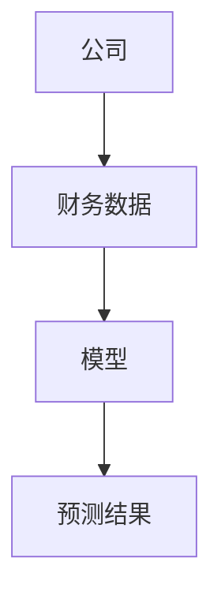
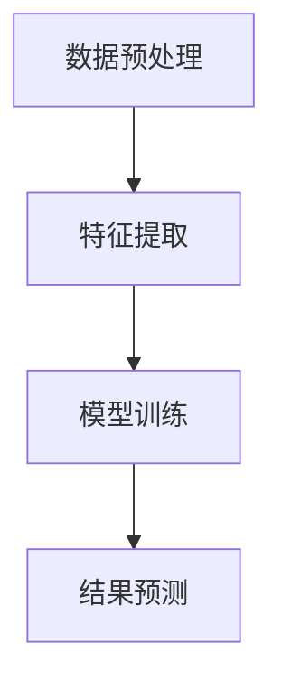
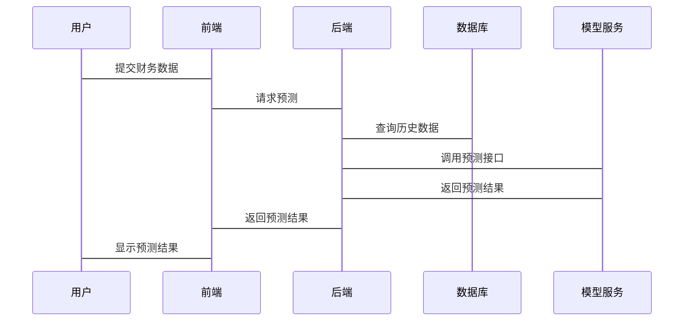

                 


# AI辅助的公司财务规划

> 关键词：AI、财务规划、机器学习、深度学习、财务数据分析、财务预测模型

> 摘要：本文将详细探讨AI技术如何辅助公司进行财务规划，从背景介绍、核心概念、算法原理、系统架构到项目实战和最佳实践，逐步分析AI在财务规划中的应用。通过本文，读者将了解如何利用AI技术提升公司财务规划的效率和准确性。

---

## 第1章: AI与公司财务规划的背景介绍

### 1.1 问题背景与描述

#### 1.1.1 公司财务规划的传统方法
公司财务规划是企业运营中的核心活动之一，传统的财务规划方法依赖于人工分析和经验判断。这种方法虽然可靠，但存在效率低、耗时长、易受主观因素影响等缺点。

#### 1.1.2 传统方法的局限性与挑战
- 数据量大：公司财务数据通常涵盖多个部门和业务单元，数据量庞大，人工处理效率低下。
- 数据复杂性：财务数据涉及多个维度，如收入、支出、利润等，人工分析难以捕捉所有变量之间的复杂关系。
- 时间敏感性：财务规划需要在特定时间内完成，传统方法难以满足快速变化的业务需求。
- 易受主观因素影响：依赖于个人经验和判断，可能导致规划结果的不准确或偏差。

#### 1.1.3 AI技术如何解决这些挑战
AI技术通过自动化数据处理、智能模型构建和实时分析，能够显著提高财务规划的效率和准确性。AI算法能够从大量数据中提取有价值的信息，发现隐藏的模式，并提供基于数据的预测和优化建议。

---

### 1.2 核心概念与问题解决

#### 1.2.1 AI辅助财务规划的核心概念
AI辅助财务规划的核心在于利用机器学习算法对财务数据进行分析和预测，从而为公司提供科学的财务决策支持。

#### 1.2.2 问题解决的思路与方法
- 数据收集与预处理：从公司内部和外部数据源获取相关财务数据，并进行清洗和标准化处理。
- 模型构建与训练：基于预处理后的数据，选择合适的机器学习算法（如线性回归、随机森林、神经网络等）构建财务预测模型。
- 结果分析与优化：通过模型预测结果，结合业务实际情况，提出优化建议。

#### 1.2.3 AI在财务规划中的具体应用场景
- 收入预测：基于历史销售数据和市场趋势，预测未来收入。
- 成本控制：通过分析历史成本数据，优化未来的成本结构。
- 资金管理：预测现金流，优化资金分配和使用效率。

---

### 1.3 边界与外延

#### 1.3.1 AI辅助财务规划的边界
AI辅助财务规划的边界主要体现在数据范围和应用场景上。AI技术无法完全替代人类的财务决策，而是作为辅助工具提供支持。

#### 1.3.2 相关领域的外延
AI技术在财务领域的应用不仅限于财务规划，还包括财务分析、风险评估、税务优化等多个方面。

#### 1.3.3 核心要素与组成
AI辅助财务规划的核心要素包括：
- 数据：财务数据、业务数据、市场数据等。
- 模型：机器学习模型、统计模型等。
- 工具：数据分析工具、编程框架等。
- 人员：数据科学家、财务专家等。

---

### 1.4 本章小结

#### 1.4.1 知识回顾
本章主要介绍了AI辅助财务规划的背景、核心概念和应用场景。

#### 1.4.2 核心要点总结
- AI技术能够显著提高财务规划的效率和准确性。
- AI辅助财务规划的核心在于数据处理和模型构建。
- AI在财务规划中的应用场景广泛，包括收入预测、成本控制和资金管理等。

#### 1.4.3 下一章的引导
下一章将深入探讨AI辅助财务规划的核心概念和原理，包括数据处理、模型选择和结果分析等内容。

---

## 第2章: AI辅助财务规划的核心概念与联系

### 2.1 核心概念原理

#### 2.1.1 数据处理与分析
数据处理是AI辅助财务规划的基础。通过对财务数据进行清洗、转换和特征提取，可以为后续的模型构建提供高质量的数据支持。

#### 2.1.2 模型训练与优化
基于处理后的数据，选择合适的算法进行模型训练，并通过优化算法参数和调整模型结构来提高预测准确度。

#### 2.1.3 结果预测与解释
利用训练好的模型对未来的财务数据进行预测，并对预测结果进行解释和验证。

---

### 2.2 核心概念对比表格

| **核心概念** | **传统方法** | **AI辅助方法** |
|--------------|--------------|----------------|
| 数据处理     | 人工处理，效率低 | 自动化处理，高效准确 |
| 模型选择     | 主观判断，依赖经验 | 数据驱动，优化选择 |
| 结果分析     | 单维度分析，易遗漏 | 多维度分析，全面深入 |

---

### 2.3 ER实体关系图



---

### 2.4 本章小结

#### 2.4.1 知识回顾
本章主要介绍了AI辅助财务规划的核心概念和原理，包括数据处理、模型训练和结果预测等内容。

#### 2.4.2 核心要点总结
- 数据处理是AI辅助财务规划的基础。
- 模型选择和优化是提高预测准确度的关键。
- 结果预测和解释是财务规划的重要环节。

#### 2.4.3 下一章的引导
下一章将详细讲解AI辅助财务规划的算法原理，包括具体的机器学习算法、模型训练流程和数学公式等内容。

---

## 第3章: AI辅助财务规划的算法原理

### 3.1 算法原理概述

#### 3.1.1 机器学习基础
机器学习是一种通过数据训练模型的技术，能够从数据中学习规律并进行预测。

#### 3.1.2 监督学习与无监督学习
- 监督学习：基于有标签的数据进行训练，适用于预测任务。
- 无监督学习：基于无标签的数据进行训练，适用于聚类任务。

#### 3.1.3 深度学习简介
深度学习是一种基于人工神经网络的机器学习技术，能够处理复杂的非线性关系。

---

### 3.2 算法流程图



---

### 3.3 算法实现代码

```python
import pandas as pd
from sklearn.linear_model import LinearRegression

# 数据加载
data = pd.read_csv('financial_data.csv')

# 特征与目标分离
X = data[['revenue', 'expenses']]
y = data['profit']

# 模型训练
model = LinearRegression()
model.fit(X, y)

# 预测结果
predicted_profit = model.predict(X)
```

---

### 3.4 数学模型与公式

#### 3.4.1 线性回归模型
线性回归是一种常用的机器学习算法，其数学模型如下：

$$ y = \beta_0 + \beta_1x_1 + \beta_2x_2 + \dots + \beta_nx_n $$

其中，$y$ 是目标变量，$\beta_0$ 是截距，$\beta_1, \beta_2, \dots, \beta_n$ 是特征变量的系数，$x_1, x_2, \dots, x_n$ 是特征变量。

#### 3.4.2 随机森林模型
随机森林是一种基于树的集成学习算法，其数学模型如下：

$$ y = \sum_{i=1}^n \text{Tree}_i(x) $$

其中，$\text{Tree}_i(x)$ 是第$i$棵树的预测结果，$x$ 是输入特征。

---

### 3.5 本章小结

#### 3.5.1 知识回顾
本章主要介绍了AI辅助财务规划的算法原理，包括机器学习基础、算法流程和数学模型等内容。

#### 3.5.2 核心要点总结
- 线性回归和随机森林是常用的机器学习算法。
- 算法流程包括数据预处理、特征提取、模型训练和结果预测。
- 数学模型是算法实现的核心，需要理解其原理和应用。

#### 3.5.3 下一章的引导
下一章将详细讲解AI辅助财务规划的系统架构设计，包括功能设计、架构图和接口设计等内容。

---

## 第4章: 系统分析与架构设计方案

### 4.1 问题场景介绍

#### 4.1.1 财务规划系统的功能需求
- 数据采集与处理
- 模型训练与预测
- 结果展示与分析

#### 4.1.2 项目介绍
本项目旨在开发一个基于AI的财务规划系统，帮助公司提高财务预测的准确性和效率。

---

### 4.2 系统功能设计

#### 4.2.1 领域模型（Mermaid类图）


#### 4.2.2 系统架构设计（Mermaid架构图）


#### 4.2.3 系统接口设计
- 前端接口：用户输入财务数据，获取预测结果。
- 后端接口：接收前端请求，调用模型服务进行预测。
- 数据库接口：存储和检索财务数据。

#### 4.2.4 系统交互（Mermaid序列图）


---

### 4.3 本章小结

#### 4.3.1 知识回顾
本章主要介绍了AI辅助财务规划的系统架构设计，包括功能设计、架构图和接口设计等内容。

#### 4.3.2 核心要点总结
- 系统功能设计需要明确需求和模块划分。
- 架构设计需要考虑系统的可扩展性和可维护性。
- 接口设计需要标准化，确保系统各部分的协同工作。

#### 4.3.3 下一章的引导
下一章将详细讲解AI辅助财务规划的项目实战，包括环境安装、核心实现和实际案例分析等内容。

---

## 第5章: 项目实战

### 5.1 环境安装

#### 5.1.1 安装Python
```bash
python --version
pip install --upgrade pip
```

#### 5.1.2 安装依赖包
```bash
pip install pandas scikit-learn matplotlib
```

---

### 5.2 系统核心实现

#### 5.2.1 数据加载与预处理
```python
import pandas as pd

# 加载数据
data = pd.read_csv('financial_data.csv')

# 查看数据信息
print(data.info())

# 数据清洗
data.dropna(inplace=True)
```

#### 5.2.2 模型训练与预测
```python
from sklearn.model_selection import train_test_split
from sklearn.linear_model import LinearRegression

# 特征与目标分离
X = data[['revenue', 'expenses']]
y = data['profit']

# 数据划分
X_train, X_test, y_train, y_test = train_test_split(X, y, test_size=0.2, random_state=42)

# 模型训练
model = LinearRegression()
model.fit(X_train, y_train)

# 预测结果
y_pred = model.predict(X_test)

# 评估模型
print('Score:', model.score(X_test, y_test))
```

---

### 5.3 代码应用解读与分析

#### 5.3.1 数据加载与预处理
- 使用Pandas库加载CSV格式的财务数据。
- 查看数据信息，确保数据完整性。
- 删除缺失值，保证数据质量。

#### 5.3.2 模型训练与预测
- 使用Scikit-learn库中的线性回归算法进行模型训练。
- 将数据划分为训练集和测试集，确保模型的泛化能力。
- 使用测试集评估模型性能，计算得分。

---

### 5.4 实际案例分析

#### 5.4.1 案例背景
某公司希望利用AI技术预测未来的收入和利润。

#### 5.4.2 数据分析
- 历史收入数据：过去三年的收入数据。
- 历史利润数据：过去三年的利润数据。
- 市场趋势数据：行业平均收入增长率。

#### 5.4.3 模型预测
基于历史数据，模型预测未来一年的收入和利润。

---

### 5.5 本章小结

#### 5.5.1 知识回顾
本章通过实际案例，详细讲解了AI辅助财务规划的项目实战，包括环境安装、代码实现和案例分析等内容。

#### 5.5.2 核心要点总结
- 项目实战是理论知识的实践应用。
- 数据加载与预处理是项目成功的关键。
- 模型训练与预测是项目的核心部分。

#### 5.5.3 下一章的引导
下一章将总结AI辅助财务规划的最佳实践，包括小结、注意事项和拓展阅读等内容。

---

## 第6章: 最佳实践

### 6.1 小结

#### 6.1.1 知识回顾
本文详细介绍了AI辅助公司财务规划的核心概念、算法原理和系统架构设计等内容。

#### 6.1.2 核心要点总结
- AI技术能够显著提高财务规划的效率和准确性。
- 数据处理和模型选择是AI辅助财务规划的关键。
- 系统架构设计需要考虑可扩展性和可维护性。

---

### 6.2 注意事项

#### 6.2.1 数据质量的重要性
- 数据质量直接影响模型的预测结果，需要确保数据的准确性和完整性。

#### 6.2.2 模型选择的注意事项
- 根据具体业务需求选择合适的模型，避免盲目追求复杂算法。

#### 6.2.3 系统安全与隐私保护
- 确保财务数据的安全性和隐私性，防止数据泄露和滥用。

---

### 6.3 拓展阅读

#### 6.3.1 推荐书籍
- 《机器学习实战》
- 《Python机器学习》
- 《数据挖掘导论》

#### 6.3.2 推荐博客与资源
- [Towards Data Science](https://towardsdatascience.com/)
- [Medium - AI & Machine Learning](https://medium.com/ai-and-machine-learning)

---

## 作者：AI天才研究院/AI Genius Institute & 禅与计算机程序设计艺术/Zen And The Art of Computer Programming

