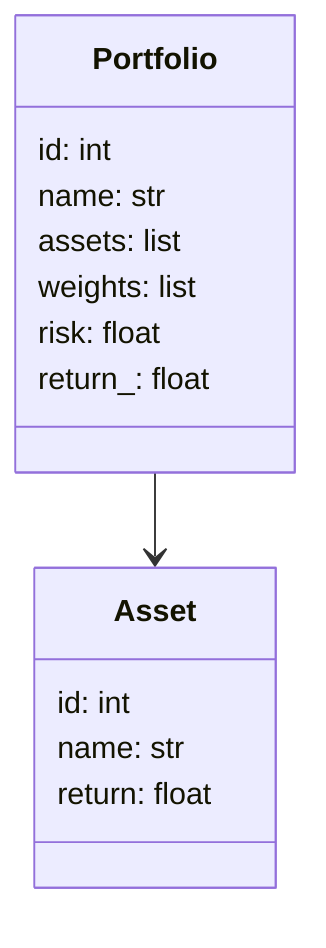
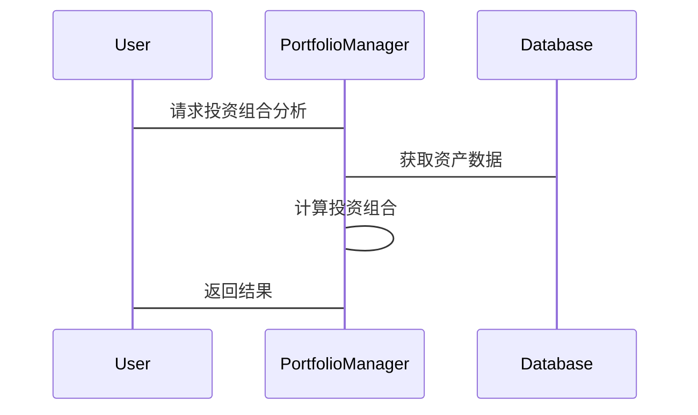

                 


# 《投资组合管理》

> **关键词**：投资组合管理, 资产配置, 风险管理, 投资策略, 现代投资组合理论, 数字化投资, 可持续投资

> **摘要**：本文系统地介绍了投资组合管理的核心概念、算法原理、系统架构和实战应用。从投资组合管理的基本概念出发，分析了其重要性与核心原则，详细讲解了均值-方差优化和现代投资组合理论等算法，探讨了投资组合管理系统的功能设计与架构实现，并通过一个基于Python的投资组合管理系统项目，展示了投资组合管理的实际应用。最后，总结了投资组合管理的最佳实践与未来趋势。

---

# 第一部分: 投资组合管理基础

---

## 第1章: 投资组合管理概述

### 1.1 投资组合管理的基本概念

#### 1.1.1 投资组合的定义
投资组合是指将多种资产（如股票、债券、房地产等）按照一定比例组合在一起，以实现特定投资目标的一种投资方式。投资组合的核心在于通过多元化配置降低风险，同时最大化收益。

#### 1.1.2 投资组合管理的目标
投资组合管理的目标包括：
1. **最大化收益**：在可接受的风险水平下，实现收益的最大化。
2. **最小化风险**：通过资产配置和分散化投资，降低投资组合的整体风险。
3. **动态调整**：根据市场变化和个人投资目标的调整，定期优化投资组合。

#### 1.1.3 投资组合管理的参与者
投资组合管理的参与者包括：
1. **投资者**：个人或机构投资者，通过投资组合实现财富增值。
2. **投资经理**：负责管理和优化投资组合的专业人士。
3. **数据分析师**：利用数据分析技术，帮助投资经理制定科学的投资策略。
4. **风险管理团队**：负责监控和管理投资组合中的风险。

---

### 1.2 投资组合管理的重要性

#### 1.2.1 投资组合管理的意义
投资组合管理是投资者实现财务目标的重要工具。通过科学的投资组合配置，投资者可以在不同市场环境下保持稳定的投资收益，同时降低因单一资产波动带来的风险。

#### 1.2.2 投资组合管理的挑战
投资组合管理面临的主要挑战包括：
1. **市场风险**：市场波动可能导致投资组合的价值下降。
2. **数据不足**：缺乏足够的历史数据或实时数据，可能导致投资决策失误。
3. **模型风险**：依赖特定的数学模型，可能因模型假设错误而产生偏差。

#### 1.2.3 投资组合管理的未来发展趋势
随着技术的进步，投资组合管理正朝着以下几个方向发展：
1. **数字化与智能化**：利用大数据和人工智能技术优化投资组合。
2. **可持续投资**：将环境、社会和治理（ESG）因素纳入投资决策。
3. **全球化与本地化结合**：在全球化背景下，结合本地市场特点进行投资组合配置。

---

### 1.3 投资组合管理的核心原则

#### 1.3.1 风险与收益的平衡
投资组合管理的核心原则之一是平衡风险与收益。投资者需要在追求高收益的同时，控制投资组合的整体风险。

#### 1.3.2 资产配置的重要性
资产配置是指将资金分配到不同资产类别（如股票、债券、现金等）中的过程。合理的资产配置可以降低投资组合的整体风险，同时提高收益。

#### 1.3.3 分散化投资的优势
分散化投资是指通过将资金投资于多个不同的资产或资产类别，以降低特定资产或市场波动带来的风险。分散化投资是投资组合管理的重要策略之一。

---

## 第2章: 投资组合管理的背景与现状

### 2.1 投资组合管理的背景

#### 2.1.1 金融市场的基本结构
金融市场是投资组合管理的基础。金融市场包括股票市场、债券市场、外汇市场等，投资者通过这些市场进行资产交易。

#### 2.1.2 投资者的需求与期望
投资者的需求与期望因人而异。个人投资者可能关注短期收益，而机构投资者则更注重长期稳健的投资回报。

#### 2.1.3 投资组合管理的演变历程
投资组合管理的历史可以追溯到20世纪30年代。随着金融理论的发展和计算机技术的进步，投资组合管理逐渐从简单的资产配置发展到复杂的量化投资。

---

### 2.2 投资组合管理的现状

#### 2.2.1 当前市场环境对投资组合管理的影响
当前市场环境复杂多变，包括全球经济不确定性、地缘政治风险等，这些因素对投资组合管理提出了更高的要求。

#### 2.2.2 技术进步对投资组合管理的推动
大数据、人工智能等技术的进步为投资组合管理提供了新的工具和方法。例如，量化投资和算法交易的兴起。

#### 2.2.3 全球化背景下投资组合管理的机遇与挑战
全球化为投资者提供了更多的投资机会，但也带来了更大的市场风险。

---

### 2.3 投资组合管理的未来展望

#### 2.3.1 数字化与智能化的趋势
随着技术的进步，投资组合管理将更加依赖于数字化和智能化工具，例如使用机器学习算法优化投资组合。

#### 2.3.2 可持续投资与ESG因素的融入
可持续投资越来越受到关注，越来越多的投资者将环境、社会和治理（ESG）因素纳入投资决策。

#### 2.3.3 全球化与本地化结合的策略
在全球化与本地化结合的策略下，投资者需要在国际市场中寻找机会，同时考虑本地市场的特殊性。

---

## 第3章: 投资组合管理的核心概念与联系

### 3.1 核心概念的定义与属性

#### 3.1.1 资产配置
资产配置是指将资金分配到不同资产类别中的过程。资产配置的核心在于根据投资者的风险承受能力和收益目标，选择合适的资产组合。

#### 3.1.2 风险管理
风险管理是指识别、评估和控制投资组合中的风险。风险管理是投资组合管理的重要组成部分，旨在降低投资组合的波动性和潜在损失。

#### 3.1.3 投资策略
投资策略是指投资者在投资过程中采用的具体方法和步骤。例如，价值投资、成长投资、指数投资等。

---

### 3.2 核心概念之间的关系

#### 3.2.1 资产配置与风险管理的相互作用
资产配置是风险管理的基础。通过合理的资产配置，投资者可以降低投资组合的整体风险。

#### 3.2.2 投资策略与市场环境的适应性
投资策略需要根据市场环境的变化进行调整。例如，在市场牛市中，可以增加股票配置；在市场熊市中，可以增加债券配置。

#### 3.2.3 投资组合管理的整体性与协调性
投资组合管理是一个整体性的工作，需要将资产配置、风险管理、投资策略等多个方面协调起来，才能实现最佳的投资效果。

---

### 3.3 核心概念的对比分析

#### 3.3.1 资产配置与投资策略的对比
| **属性**       | **资产配置**               | **投资策略**               |
|----------------|---------------------------|---------------------------|
| 定义           | 资金分配到不同资产类别     | 具体的投资方法和步骤       |
| 目标           | 降低风险，实现收益目标     | 实现特定的投资目标           |
| 灵活性         | 较高，需要定期调整           | 较低，通常根据市场变化调整   |

#### 3.3.2 风险管理与收益目标的平衡
风险管理与收益目标的平衡是投资组合管理的核心问题之一。投资者需要在追求收益的同时，控制风险。

#### 3.3.3 不同投资组合管理方法的优缺点
以下是几种常见的投资组合管理方法及其优缺点：

| **方法**       | **优点**                     | **缺点**                     |
|----------------|------------------------------|------------------------------|
| 均值-方差优化   | 科学合理，能够最大化收益     | 计算复杂，需要大量数据支持   |
| 指数投资        | 简单易行，成本低             | 收益稳定，但可能无法超越市场 |
| 主动投资        | 可能获得超额收益             | 需要专业知识和市场敏感性       |

---

## 第4章: 投资组合管理的算法原理

### 4.1 均值-方差优化

#### 4.1.1 均值-方差优化的定义
均值-方差优化是一种优化方法，旨在在给定的风险水平下，找到收益最大的投资组合，或者在给定收益水平下，找到风险最小的投资组合。

#### 4.1.2 均值-方差优化的数学模型
均值-方差优化的数学模型如下：
$$
\min_{w} \sigma^2 \\
s.t. \\
\sum_{i=1}^n w_i = 1 \\
\sum_{i=1}^n w_i r_i = \mu
$$
其中，$w$ 是权重向量，$\sigma^2$ 是投资组合的方差，$r_i$ 是资产 $i$ 的收益率，$\mu$ 是目标收益。

#### 4.1.3 均值-方差优化的实现步骤
1. **输入参数**：资产收益率、协方差矩阵。
2. **计算优化**：使用优化算法求解最优权重。
3. **输出结果**：最优权重和投资组合的收益与风险。

#### 4.1.4 均值-方差优化的代码实现
```python
import numpy as np
from scipy.optimize import minimize

def mean_variance_optimization(r, cov, target_return=0.1):
    n = len(r)
    # 定义目标函数
    def objective(w):
        return np.dot(w.T, cov).dot(w)
    # 定义约束条件
    constraints = [
        {'type': 'eq', 'fun': lambda w: np.sum(w) - 1},
        {'type': 'eq', 'fun': lambda w: np.dot(w, r) - target_return}
    ]
    # 初始权重
    w0 = np.array([1/n]*n)
    # 优化
    result = minimize(objective, w0, constraints=constraints)
    return result.x
```

---

### 4.2 现代投资组合理论（MPT）

#### 4.2.1 现代投资组合理论的定义
现代投资组合理论（MPT）是由哈里·马科维茨提出的，旨在通过资产配置和分散化投资降低风险。

#### 4.2.2 现代投资组合理论的数学模型
现代投资组合理论的核心是通过优化投资组合的收益与风险之间的关系，找到最优投资组合。

#### 4.2.3 现代投资组合理论的实现步骤
1. **计算资产收益率和协方差矩阵**。
2. **计算投资组合的收益和风险**。
3. **找到最优投资组合**。

---

## 第5章: 投资组合管理系统架构设计

### 5.1 系统功能设计

#### 5.1.1 领域模型


#### 5.1.2 系统架构


#### 5.1.3 接口设计


---

## 第6章: 项目实战

### 6.1 环境安装
```bash
pip install numpy pandas scipy matplotlib
```

### 6.2 核心代码实现
```python
import numpy as np
from scipy.optimize import minimize

def portfolio_optimization(r, cov, target_return=0.1):
    n = len(r)
    # 定义目标函数
    def objective(w):
        return np.dot(w.T, cov).dot(w)
    # 定义约束条件
    constraints = [
        {'type': 'eq', 'fun': lambda w: np.sum(w) - 1},
        {'type': 'eq', 'fun': lambda w: np.dot(w, r) - target_return}
    ]
    # 初始权重
    w0 = np.array([1/n]*n)
    # 优化
    result = minimize(objective, w0, constraints=constraints)
    return result.x
```

### 6.3 案例分析
以某股票组合为例，假设股票收益率为[0.1, 0.2, 0.15]，协方差矩阵为：
$$
\begin{bmatrix}
0.02 & 0.01 & 0.015 \\
0.01 & 0.03 & 0.02 \\
0.015 & 0.02 & 0.03
\end{bmatrix}
$$
目标收益为0.15，调用上述函数计算最优权重。

---

## 第7章: 投资组合管理的最佳实践

### 7.1 小结
投资组合管理是一个复杂但重要的过程，需要结合理论与实践，不断优化和调整。

### 7.2 注意事项
1. **数据质量**：确保数据的准确性和完整性。
2. **模型选择**：选择合适的优化模型和算法。
3. **风险管理**：定期监控和调整投资组合的风险。

### 7.3 拓展阅读
- 马科维茨的《投资学》
- 希尔的《投资组合管理》

---

**作者：AI天才研究院/AI Genius Institute & 禅与计算机程序设计艺术 /Zen And The Art of Computer Programming**

