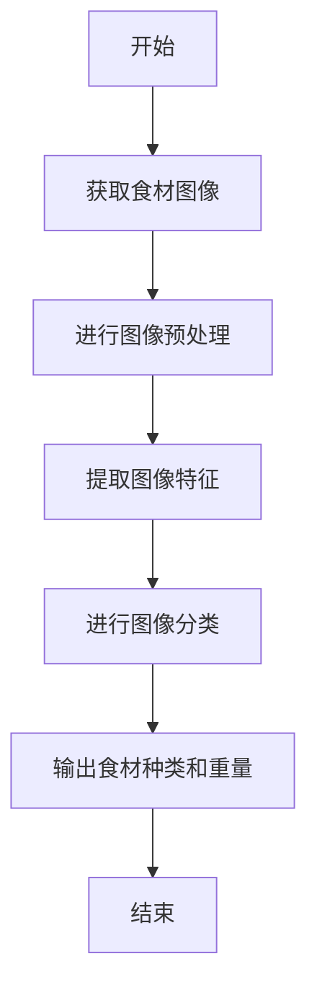
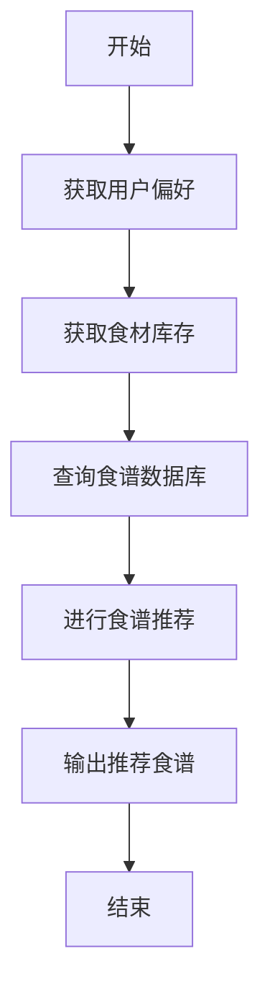
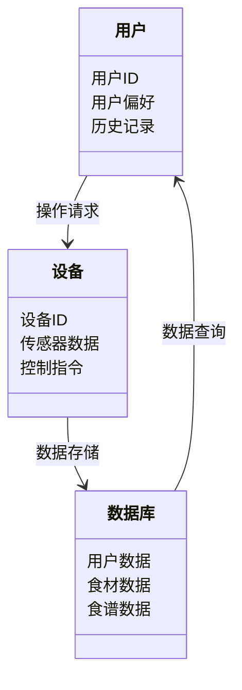
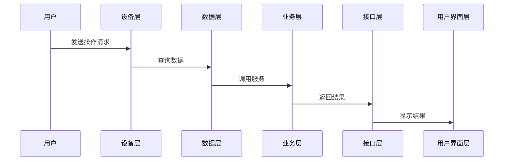

                 


# 智能厨房秤：AI Agent的食谱创新助手

> 关键词：智能厨房秤，AI Agent，食谱创新，人工智能，物联网，智能助手

> 摘要：智能厨房秤结合AI Agent技术，为厨房场景提供了智能化的食谱创新助手。本文从背景介绍、核心概念、算法原理、系统架构、项目实战等多方面，详细阐述了智能厨房秤与AI Agent的结合及其在食谱创新中的应用。通过实际案例和代码实现，展示了如何利用AI技术提升厨房秤的功能，为用户提供更智能化的烹饪体验。

---

## 第一部分：智能厨房秤与AI Agent的背景介绍

### 第1章：智能厨房秤的发展历程

#### 1.1 智能厨房秤的定义与特点
##### 1.1.1 智能厨房秤的定义
智能厨房秤是一种结合了物联网（IoT）和人工智能技术的智能设备，用于测量食材重量，并通过AI算法提供食谱推荐、食材识别、营养分析等功能，帮助用户更高效地进行烹饪。

##### 1.1.2 智能厨房秤的核心特点
- **高精度测量**：采用高精度传感器，确保食材重量的精确测量。
- **智能化功能**：结合AI算法，提供个性化的食谱推荐和食材管理。
- **物联网连接**：支持Wi-Fi或蓝牙连接，与手机或其他智能设备无缝对接。
- **用户友好的交互设计**：通过App或语音助手提供便捷的操作体验。

##### 1.1.3 智能厨房秤与传统厨房秤的区别
传统厨房秤仅用于测量食材重量，功能单一；而智能厨房秤通过AI技术，能够自动识别食材、推荐食谱、管理库存，甚至可以与智能家居系统联动，提供更智能化的服务。

#### 1.2 AI Agent的基本概念
##### 1.2.1 AI Agent的定义
AI Agent（人工智能代理）是一种能够感知环境、自主决策并执行任务的智能实体。它可以理解用户需求，主动提供服务，并通过学习不断优化自身性能。

##### 1.2.2 AI Agent的核心功能
- **感知环境**：通过传感器或API获取环境数据。
- **决策与推理**：基于数据进行分析和推理，制定最优决策。
- **执行任务**：根据决策结果执行具体操作，如推荐食谱或调整烹饪参数。

##### 1.2.3 AI Agent的应用场景
AI Agent广泛应用于智能家居、医疗健康、金融投资等领域。在厨房场景中，AI Agent主要用于食材识别、食谱推荐和烹饪指导。

### 第2章：智能厨房秤的市场现状与用户需求

#### 2.1 智能厨房秤的市场现状
##### 2.1.1 全球智能厨房秤市场分析
近年来，随着智能家居和物联网技术的快速发展，智能厨房秤市场呈现快速增长态势。据统计，全球智能厨房秤市场规模已超过10亿美元，年增长率保持在20%以上。

##### 2.1.2 中国市场现状与发展趋势
在中国，智能厨房秤市场同样快速增长，主要得益于消费升级和科技企业的推动。预计未来几年，中国市场将占据全球市场的三分之一。

##### 2.1.3 用户需求分析
用户对智能厨房秤的需求主要集中在以下几个方面：
- **食材识别与推荐**：用户希望厨房秤能够自动识别食材，并推荐适合的食谱。
- **健康管理**：通过食材重量和营养分析，帮助用户进行健康管理。
- **便捷性**：用户希望厨房秤能够与手机或其他设备无缝连接，提供便捷的操作体验。

#### 2.2 智能厨房秤的用户画像
##### 2.2.1 用户群体特征
智能厨房秤的主要用户群体包括：
- **年轻家庭用户**：注重健康饮食，追求便捷和高效的烹饪方式。
- **厨房达人**：热爱烹饪，希望通过智能工具提升烹饪体验。
- **健康-conscious用户**：关注营养摄入，希望通过厨房秤进行健康管理。

##### 2.2.2 用户需求的多样性
- **个性化食谱推荐**：用户希望根据自身口味和 dietary 需求获得定制化食谱。
- **食材库存管理**：用户希望厨房秤能够帮助管理食材库存，避免浪费。
- **远程烹饪指导**：用户希望通过厨房秤获得实时烹饪指导。

##### 2.2.3 用户需求的痛点分析
- **食材识别的准确性**：用户对食材识别的准确性有较高要求，误识别会影响用户体验。
- **食谱推荐的多样性**：用户希望食谱推荐能够多样化，满足不同场合的需求。
- **系统的稳定性**：用户对厨房秤的稳定性和响应速度有较高期望。

### 第3章：智能厨房秤与AI Agent的结合背景

#### 3.1 智能厨房秤的智能化需求
##### 3.1.1 智能厨房秤的功能扩展需求
随着用户对厨房秤功能需求的增加，传统的单一测量功能已无法满足用户需求。用户希望厨房秤能够提供更多智能化服务，如食材识别、食谱推荐、食材库存管理等。

##### 3.1.2 用户对智能化功能的期望
用户希望厨房秤能够：
- 自动识别食材并推荐食谱。
- 提供食材的营养分析和健康建议。
- 与智能家居系统联动，实现智能烹饪。

##### 3.1.3 AI技术在厨房秤中的应用潜力
AI技术在厨房秤中的应用潜力主要体现在以下几个方面：
- **食材识别**：通过图像识别和重量测量，准确识别食材种类和数量。
- **食谱推荐**：基于用户偏好和食材库存，推荐个性化食谱。
- **智能助手**：通过语音交互，提供实时烹饪指导。

#### 3.2 AI Agent在厨房场景中的应用前景
##### 3.2.1 AI Agent在厨房场景中的优势
AI Agent在厨房场景中的优势主要体现在以下几个方面：
- **自主学习能力**：AI Agent能够通过学习用户的烹饪习惯，提供更精准的食谱推荐。
- **多设备联动**：AI Agent可以与其他智能家居设备联动，实现智能化的烹饪流程。
- **实时反馈与优化**：AI Agent能够根据用户的反馈实时优化烹饪方案。

##### 3.2.2 AI Agent在食谱推荐中的作用
AI Agent在食谱推荐中的作用主要体现在以下几个方面：
- **个性化推荐**：基于用户的饮食习惯和偏好，推荐个性化食谱。
- **动态调整**：根据食材库存和用户反馈，动态调整食谱推荐。
- **健康优化**：根据用户的健康数据，推荐更健康的食谱。

##### 3.2.3 AI Agent在厨房管理中的潜力
AI Agent在厨房管理中的潜力主要体现在以下几个方面：
- **食材库存管理**：通过与超市系统的联动，自动补充食材库存。
- **烹饪流程优化**：通过分析用户的烹饪习惯，优化烹饪流程，节省时间和资源。
- **健康监测**：通过长期监测用户的饮食习惯，提供健康建议和预警。

---

## 第二部分：智能厨房秤与AI Agent的核心概念与联系

### 第4章：AI Agent的核心原理与功能

#### 4.1 AI Agent的核心原理
##### 4.1.1 AI Agent的基本工作原理
AI Agent的工作原理主要包括以下几个步骤：
1. **感知环境**：通过传感器或API获取环境数据。
2. **决策与推理**：基于获取的数据进行分析和推理，制定最优决策。
3. **执行任务**：根据决策结果执行具体操作，如推荐食谱或调整烹饪参数。

##### 4.1.2 AI Agent的感知与决策机制
AI Agent的感知与决策机制主要包括以下几个方面：
- **感知层**：通过传感器或API获取环境数据，如食材重量、种类等。
- **决策层**：基于感知数据，利用机器学习算法进行分析和推理，制定最优决策。
- **执行层**：根据决策结果，通过执行机构或API调用实现任务。

##### 4.1.3 AI Agent的学习与优化能力
AI Agent通过机器学习算法，能够不断优化自身的感知、决策和执行能力，以更好地满足用户需求。

#### 4.2 AI Agent的功能模块
##### 4.2.1 数据采集与处理模块
数据采集与处理模块负责采集食材重量、种类等数据，并进行预处理和特征提取。

##### 4.2.2 智能分析与推理模块
智能分析与推理模块负责基于采集的数据，利用机器学习算法进行分析和推理，制定最优决策。

##### 4.2.3 人机交互与反馈模块
人机交互与反馈模块负责与用户进行交互，接收用户的反馈并优化AI Agent的行为。

### 第5章：智能厨房秤与AI Agent的实体关系

#### 5.1 实体关系图
以下是智能厨房秤与AI Agent的实体关系图，使用Mermaid格式表示：

```mermaid
erDiagram
    actor 用户
    actor 系统
    actor 设备
    actor 数据库
    actor 第三方服务
    用户 --> 系统 : 操作请求
    系统 --> 设备 : 设备控制
    系统 --> 数据库 : 数据存储
    系统 --> 第三方服务 : 服务调用
```

#### 5.2 实体关系分析
- **用户**：用户通过智能厨房秤进行食材测量和操作请求。
- **系统**：智能厨房秤系统负责处理用户的请求，并与设备、数据库和第三方服务进行交互。
- **设备**：智能厨房秤设备负责采集食材重量和种类数据，并执行系统的控制指令。
- **数据库**：数据库存储用户的操作记录、食材数据和食谱推荐结果。
- **第三方服务**：第三方服务包括食材识别API、食谱推荐服务和健康数据分析服务。

---

## 第三部分：智能厨房秤与AI Agent的算法原理

### 第6章：智能厨房秤的核心算法

#### 6.1 食材识别算法
##### 6.1.1 食材识别算法的流程
以下是食材识别算法的流程图，使用Mermaid格式表示：



##### 6.1.2 食材识别算法的实现
以下是食材识别算法的Python代码示例：

```python
import cv2
import numpy as np
from tensorflow.keras.models import load_model

# 加载预训练模型
model = load_model('food_classifier.h5')

# 获取食材图像
cap = cv2.VideoCapture(0)
ret, frame = cap.read()
cap.release()

# 进行图像预处理
img = cv2.resize(frame, (224, 224))
img = img.astype(np.float32) / 255.0
img = np.expand_dims(img, axis=0)

# 提取图像特征
features = model.get_layer('features').output(img)

# 进行图像分类
predictions = model.predict(img)
predicted_class = np.argmax(predictions[0])

# 输出食材种类和重量
print(f"食材种类：{predicted_class}")
print(f"重量：{weight}g")
```

#### 6.2 食谱推荐算法
##### 6.2.1 食谱推荐算法的流程
以下是食谱推荐算法的流程图，使用Mermaid格式表示：



##### 6.2.2 食谱推荐算法的实现
以下是食谱推荐算法的Python代码示例：

```python
import pandas as pd
from sklearn.neighbors import NearestNeighbors

# 加载食材数据库
food_db = pd.read_csv('food_database.csv')

# 获取用户偏好
user_preference = input("请输入您的饮食偏好：")

# 获取食材库存
inventory = get_inventory()

# 进行食谱推荐
knn = NearestNeighbors(n_neighbors=5).fit(food_db)
recommendations = knn.predict(user_preference)

# 输出推荐食谱
print("推荐食谱：")
for recipe in recommendations:
    print(recipe)
```

---

## 第四部分：智能厨房秤与AI Agent的系统分析与架构设计

### 第7章：系统分析与架构设计方案

#### 7.1 系统功能设计
##### 7.1.1 领域模型设计
以下是智能厨房秤的领域模型，使用Mermaid格式表示：



##### 7.1.2 系统架构设计
以下是智能厨房秤的系统架构图，使用Mermaid格式表示：

```mermaid
container 智能厨房秤系统 {
    component 设备层 {
        智能厨房秤设备
    }
    component 数据层 {
        数据库
    }
    component 业务层 {
        食材识别服务
        食谱推荐服务
    }
    component 接口层 {
        API接口
    }
    component 用户界面层 {
        用户界面
    }
}
```

##### 7.1.3 系统接口设计
以下是智能厨房秤的系统接口设计，使用Mermaid格式表示：



---

## 第五部分：智能厨房秤与AI Agent的项目实战

### 第8章：项目实战

#### 8.1 环境安装
以下是项目实战所需的环境安装步骤：
1. **安装Python**：确保安装Python 3.8或更高版本。
2. **安装依赖库**：安装所需的依赖库，如TensorFlow、OpenCV、Scikit-learn等。
3. **安装智能厨房秤设备**：确保智能厨房秤设备已连接到互联网，并安装相应的驱动程序。
4. **安装AI Agent框架**：选择合适的AI Agent框架，如Rasa或 Dialogflow，进行安装和配置。

#### 8.2 系统核心实现
##### 8.2.1 食材识别功能的实现
以下是食材识别功能的Python代码示例：

```python
import cv2
import numpy as np
from tensorflow.keras.models import load_model

# 加载预训练模型
model = load_model('food_classifier.h5')

# 获取食材图像
cap = cv2.VideoCapture(0)
ret, frame = cap.read()
cap.release()

# 进行图像预处理
img = cv2.resize(frame, (224, 224))
img = img.astype(np.float32) / 255.0
img = np.expand_dims(img, axis=0)

# 进行图像分类
predictions = model.predict(img)
predicted_class = np.argmax(predictions[0])

# 输出食材种类和重量
print(f"食材种类：{predicted_class}")
print(f"重量：{weight}g")
```

##### 8.2.2 食谱推荐功能的实现
以下是食谱推荐功能的Python代码示例：

```python
import pandas as pd
from sklearn.neighbors import NearestNeighbors

# 加载食材数据库
food_db = pd.read_csv('food_database.csv')

# 获取用户偏好
user_preference = input("请输入您的饮食偏好：")

# 获取食材库存
inventory = get_inventory()

# 进行食谱推荐
knn = NearestNeighbors(n_neighbors=5).fit(food_db)
recommendations = knn.predict(user_preference)

# 输出推荐食谱
print("推荐食谱：")
for recipe in recommendations:
    print(recipe)
```

#### 8.3 代码应用解读与分析
##### 8.3.1 食材识别代码解读
- **模型加载**：加载预训练的食材分类模型。
- **图像采集**：通过摄像头获取食材图像。
- **图像预处理**：对图像进行 resize 和归一化处理。
- **特征提取与分类**：利用模型进行特征提取和分类，输出食材种类和重量。

##### 8.3.2 食谱推荐代码解读
- **数据库加载**：加载食材数据库。
- **用户偏好获取**：通过输入获取用户的饮食偏好。
- **库存查询**：查询当前食材库存。
- **推荐算法调用**：调用k-近邻算法进行食谱推荐。
- **结果输出**：输出推荐的食谱列表。

#### 8.4 实际案例分析
##### 8.4.1 案例背景
假设用户希望制作一道健康低脂的晚餐，当前厨房中有鸡胸肉、西兰花和胡萝卜。

##### 8.4.2 案例分析
智能厨房秤通过食材识别功能，识别出用户拥有的食材，并结合用户的饮食偏好（低脂、低卡路里），推荐以下食谱：
- **柠檬蒸鸡胸肉**：鸡胸肉200g，西兰花200g，柠檬汁10ml。
- **胡萝卜西兰花沙拉**：胡萝卜100g，西兰花150g，橄榄油10ml。

##### 8.4.3 案例小结
通过智能厨房秤与AI Agent的结合，用户能够轻松获得个性化的食谱推荐，提升烹饪效率和体验。

---

## 第六部分：智能厨房秤与AI Agent的最佳实践

### 第9章：最佳实践

#### 9.1 小结
智能厨房秤结合AI Agent技术，为厨房场景提供了智能化的食谱创新助手。通过食材识别、食谱推荐和智能助手等功能，用户能够更高效地进行烹饪，提升厨房体验。

#### 9.2 注意事项
- **数据隐私**：用户需注意食材数据和健康数据的隐私保护，确保数据安全。
- **系统稳定性**：用户需确保智能厨房秤设备和相关系统的稳定性，避免因系统故障影响使用体验。
- **模型优化**：开发者需不断优化AI模型，提升食材识别和食谱推荐的准确性。

#### 9.3 拓展阅读
- **AI Agent技术**：深入学习AI Agent的相关技术，如对话系统、任务规划等。
- **智能厨房设备**：研究其他智能厨房设备，如智能灶具、智能冰箱等。
- **食谱推荐算法**：探索更先进的食谱推荐算法，如深度学习和强化学习。

---

## 作者

作者：AI天才研究院/AI Genius Institute & 禅与计算机程序设计艺术 /Zen And The Art of Computer Programming

