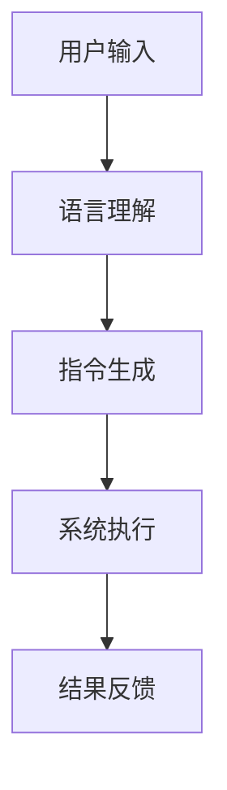
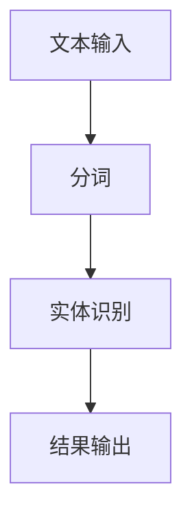
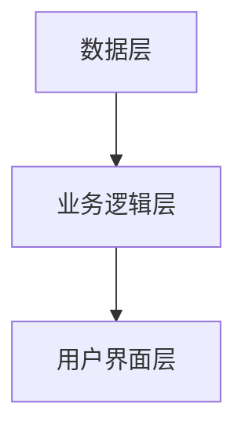
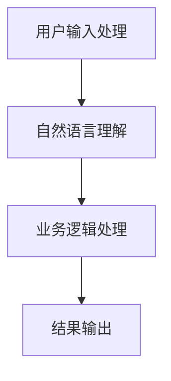
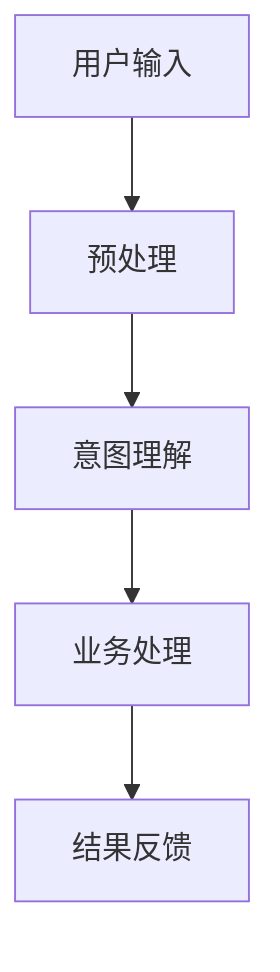

                 


# 构建企业级自然语言接口：简化复杂业务系统操作的智能层

## 关键词：自然语言接口, 企业级应用, 自然语言处理, 系统架构设计, 智能层

## 摘要

随着企业信息化的快速发展，业务系统的复杂性不断提高，用户操作的难度也随之增加。为了简化复杂业务系统的操作，提升用户体验，自然语言接口（NLI）作为一种智能化的解决方案应运而生。本文将从自然语言接口的核心概念、算法原理、系统架构设计、项目实战等方面进行详细探讨，为企业级应用提供理论支持和实践指导。文章内容丰富，逻辑清晰，结合实际案例和代码示例，深入剖析自然语言接口的构建过程，为读者提供全面的知识体系和实用的技术指导。

---

# 第一章：自然语言接口的背景与应用

## 1.1 自然语言接口的定义与背景

### 1.1.1 什么是自然语言接口

自然语言接口（Natural Language Interface, NLI）是一种能够让用户通过自然语言（如中文或英文）与计算机系统进行交互的技术。与传统的图形用户界面（GUI）不同，NLI允许用户以更自然的方式表达需求，系统通过理解和解析用户的输入，完成相应的任务。

**自然语言接口的核心功能包括：**

1. **理解和解析用户的输入**：将用户的自然语言输入转换为计算机可理解的指令。
2. **生成自然语言输出**：将计算机处理后的结果以自然语言的形式反馈给用户。
3. **提供智能化的交互体验**：通过学习和优化，提升系统的理解和生成能力，使交互更加自然和高效。

### 1.1.2 自然语言接口的背景与发展趋势

随着人工智能技术的快速发展，自然语言处理（NLP）技术取得了显著进步。深度学习模型（如BERT、GPT）的出现，使得自然语言理解的准确性和生成能力得到了极大的提升。企业级应用中，复杂的业务系统往往需要通过复杂的菜单和按钮进行操作，用户需要经过严格的培训才能熟练使用。这不仅增加了用户的使用成本，也降低了操作效率。

### 1.1.3 企业级应用中的需求与挑战

在企业级应用中，用户通常需要与复杂的业务系统（如ERP、CRM、OA系统）进行交互。传统的交互方式依赖于用户的记忆和操作能力，容易出错且效率低下。自然语言接口能够通过自然语言解析用户的意图，自动完成相应的操作，从而简化用户的操作流程，提升效率。

**自然语言接口在企业级应用中的优势：**

- **降低学习成本**：用户无需记忆复杂的操作流程，只需通过自然语言表达需求。
- **提高操作效率**：系统能够快速理解和执行用户的指令，减少用户的操作步骤。
- **增强用户体验**：通过自然语言交互，用户能够更直观地表达需求，获得更流畅的使用体验。

---

## 1.2 自然语言接口的核心概念

### 1.2.1 自然语言处理与自然语言接口的区别

自然语言处理（NLP）是研究如何让计算机理解和生成人类语言的技术，而自然语言接口是NLP技术的具体应用之一。NLP的核心任务包括文本分类、实体识别、句法分析、情感分析等，而NLI则专注于将自然语言输入转换为系统可执行的操作。

**自然语言处理与自然语言接口的区别对比表：**

| **维度**         | **自然语言处理（NLP）**                     | **自然语言接口（NLI）**                     |
|------------------|-------------------------------------------|-------------------------------------------|
| **核心任务**     | 理解和生成自然语言                         | 基于自然语言输入，执行系统操作             |
| **应用场景**     | 学术研究、信息抽取、情感分析等               | 人机交互、智能客服、业务系统自动化等       |
| **技术基础**     | 语言模型、深度学习、自然语言理解算法         | 基于NLP技术，结合系统接口设计和业务逻辑   |

### 1.2.2 自然语言接口的工作原理

自然语言接口的核心工作流程包括以下几个步骤：

1. **用户输入**：用户通过自然语言形式输入需求，例如“请给我生成一份明天的销售报表”。
2. **语言理解**：系统对用户的输入进行解析，识别用户的意图、实体信息（如“销售报表”）等。
3. **指令生成**：将解析后的意图和实体信息转换为系统可执行的指令，例如调用销售报表生成模块。
4. **执行操作**：系统根据生成的指令执行相应的操作，生成结果。
5. **结果反馈**：将处理结果以自然语言的形式反馈给用户。

**自然语言接口的工作流程图：**



### 1.2.3 自然语言接口的分类与应用场景

自然语言接口可以根据应用场景和实现方式分为以下几类：

1. **基于规则的NLI**：通过预定义的规则和关键词匹配来解析用户的意图，适用于简单场景。
2. **基于统计的NLI**：利用统计模型（如马尔可夫链）进行意图识别，适用于中等复杂度的场景。
3. **基于深度学习的NLI**：利用深度学习模型（如BERT、GPT）进行意图理解和生成，适用于复杂场景。

**自然语言接口的主要应用场景：**

- **智能客服**：通过自然语言交互为用户提供问题解答。
- **业务系统自动化**：用户通过自然语言指令操作复杂业务系统。
- **智能助手**：为企业员工提供个性化的信息查询和任务处理服务。

---

## 1.3 企业级自然语言接口的优势

### 1.3.1 提高用户操作效率

自然语言接口通过简化操作流程，减少了用户的记忆负担，用户只需通过自然语言表达需求，系统即可自动完成操作。

### 1.3.2 降低用户学习成本

传统的业务系统操作通常需要用户接受专业培训，而自然语言接口通过自然的语言交互方式，降低了用户的使用门槛。

### 1.3.3 优化企业业务流程

自然语言接口能够快速解析用户的意图，并通过系统执行相应的操作，优化了企业的业务流程，提高了工作效率。

---

## 1.4 本章小结

本章主要介绍了自然语言接口的核心概念、工作原理以及在企业级应用中的优势。通过对比自然语言处理和自然语言接口的区别，明确了NLI在企业级应用中的定位和作用。下一章将深入探讨自然语言处理技术的基础知识，为后续内容的学习奠定基础。

---

# 第二章：自然语言接口的技术基础

## 2.1 自然语言处理技术基础

### 2.1.1 自然语言处理的基本概念

自然语言处理（NLP）是研究如何让计算机理解和生成人类语言的技术，其核心任务包括文本分词、实体识别、句法分析等。

### 2.1.2 自然语言处理的主要任务

1. **文本分词**：将连续的文本分割成有意义的词语或短语。
2. **实体识别**：识别文本中的实体（如人名、地名、组织名）。
3. **句法分析**：分析句子的语法结构。
4. **语义理解**：理解文本的语义含义。

### 2.1.3 自然语言处理的常用技术

1. **基于规则的方法**：通过预定义的规则进行文本处理。
2. **统计方法**：基于统计模型（如HMM）进行文本处理。
3. **深度学习方法**：利用神经网络模型（如RNN、BERT）进行文本处理。

---

## 2.2 语言模型与预训练技术

### 2.2.1 语言模型的定义与作用

语言模型（Language Model, LM）是一种用于预测下一个词的概率模型。语言模型在自然语言处理中广泛应用于文本生成、机器翻译等任务。

### 2.2.2 预训练技术的发展历程

预训练技术（Pre-training）是利用大规模数据对模型进行预先训练的方法，目的是让模型学习语言的通用特征。近年来，预训练技术得到了广泛应用，如BERT、GPT等模型。

### 2.2.3 常见的预训练模型介绍

1. **BERT**：Bidirectional Encoder Representations from Transformers，由Google提出，广泛应用于文本理解和生成任务。
2. **GPT**：Generative Pre-trained Transformer，由OpenAI提出，主要用于生成任务。
3. **T5**：Text-to-Text Transformer，由Google提出，专注于文本生成任务。

---

## 2.3 自然语言处理的挑战与解决方案

### 2.3.1 数据稀疏性问题

数据稀疏性问题是指在某些特定领域或场景下，训练数据不足，导致模型性能下降。

### 2.3.2 领域适应性问题

领域适应性问题是指模型在不同领域之间的迁移能力不足。

### 2.3.3 模型可解释性问题

模型可解释性问题是指模型的决策过程难以被人类理解和解释。

---

## 2.4 本章小结

本章主要介绍了自然语言处理技术的基础知识，包括文本分词、实体识别、句法分析等任务，以及语言模型和预训练技术的发展。同时，还讨论了自然语言处理技术面临的挑战和解决方案。下一章将详细介绍自然语言接口的算法原理和系统架构设计。

---

# 第三章：自然语言接口的算法原理

## 3.1 分词算法与实体识别

### 3.1.1 分词算法的原理与实现

分词算法是自然语言处理中的基础任务，常用的分词算法包括基于规则的分词、统计分词和深度学习分词。

**基于规则的分词方法：**

1. **分词规则的建立**：根据语言的语法规则，建立分词规则。
2. **分词实现**：根据分词规则对文本进行分词。

**代码示例：**

```python
def segment(text):
    segments = []
    # 分词规则
    rules = {
        'noun': ['名词', '名词短语'],
        'verb': ['动词', '动词短语']
    }
    # 分词实现
    for word in text.split():
        if word in rules['noun'] or word in rules['verb']:
            segments.append(word)
    return segments
```

### 3.1.2 实体识别的原理与实现

实体识别（Named Entity Recognition,NER）是自然语言处理中的重要任务，主要用于识别文本中的实体信息。

**基于深度学习的实体识别算法：**

1. **模型选择**：选择适合的深度学习模型（如LSTM、BERT）。
2. **数据预处理**：对文本数据进行分词和标注。
3. **模型训练**：利用标注数据训练模型。
4. **实体识别**：对未标注文本进行实体识别。

**代码示例：**

```python
import spacy

nlp = spacy.load("en_core_web_sm")

def entity_recognition(text):
    doc = nlp(text)
    entities = []
    for ent in doc.ents:
        entities.append((ent.text, ent.label_))
    return entities

text = "Apple is a technology company."
print(entity_recognition(text))
```

### 3.1.3 分词与实体识别的结合应用

分词和实体识别是自然语言处理中的两个重要任务，它们在实际应用中通常是结合使用的。

**分词与实体识别的结合流程图：**



---

## 3.2 基于深度学习的自然语言理解算法

### 3.2.1 基于Transformer的自然语言理解模型

Transformer模型是一种基于注意力机制的深度学习模型，广泛应用于自然语言处理任务。

**Transformer模型的基本结构：**

1. **编码器**：负责将输入序列编码为一个固定长度的向量。
2. **解码器**：负责根据编码器的输出生成目标序列。

**数学公式：**

$$
\text{Attention}(Q, K, V) = \text{softmax}\left(\frac{QK^T}{\sqrt{d_k}}\right)V
$$

其中，\( Q \)、\( K \)、\( V \) 分别表示查询、键、值向量。

### 3.2.2 基于BERT的自然语言理解

BERT（Bidirectional Encoder Representations from Transformers）是一种基于Transformer的预训练模型，广泛应用于自然语言理解任务。

**BERT模型的核心思想：**

1. **双向编码**：利用双向Transformer进行编码。
2. **预训练任务**：通过掩码任务和下一个词预测任务进行预训练。

---

## 3.3 算法原理的总结与对比

### 3.3.1 常见的自然语言理解算法对比

1. **基于规则的算法**：适用于简单场景，准确率较低。
2. **基于统计的算法**：适用于中等复杂度场景，准确率较高。
3. **基于深度学习的算法**：适用于复杂场景，准确率最高。

**算法对比表：**

| **算法类型**        | **优点**                       | **缺点**                       |
|---------------------|-------------------------------|-------------------------------|
| 基于规则的算法      | 实现简单，适用于简单场景       | 准确率低，适用于复杂场景效果差 |
| 基于统计的算法      | 准确率较高，适用于中等复杂度场景 | 实现复杂，计算资源消耗较大     |
| 基于深度学习的算法    | 准确率高，适用于复杂场景       | 实现复杂，计算资源消耗大       |

### 3.3.2 算法选择的原则

1. **任务需求**：根据具体的任务需求选择合适的算法。
2. **数据规模**：根据数据规模选择算法，小规模数据适合基于规则或统计的算法，大规模数据适合深度学习算法。
3. **计算资源**：根据计算资源选择算法，深度学习算法需要较高的计算资源。

---

## 3.4 本章小结

本章主要介绍了自然语言接口的核心算法原理，包括分词算法、实体识别算法以及基于深度学习的自然语言理解算法。通过对比不同算法的优缺点，明确了在不同场景下选择合适的算法的重要性。下一章将详细介绍自然语言接口的系统架构设计。

---

# 第四章：自然语言接口的系统架构设计

## 4.1 系统模块划分

### 4.1.1 用户输入处理模块

用户输入处理模块负责接收用户的自然语言输入，并进行预处理（如分词、实体识别）。

### 4.1.2 自然语言理解模块

自然语言理解模块负责解析用户的意图，并生成相应的系统指令。

### 4.1.3 业务逻辑处理模块

业务逻辑处理模块负责根据生成的指令调用相应的业务逻辑，执行操作。

### 4.1.4 结果输出模块

结果输出模块负责将处理结果以自然语言的形式反馈给用户。

---

## 4.2 系统架构设计

### 4.2.1 分层架构设计

分层架构将系统划分为多个层次，每个层次负责不同的功能，如数据层、业务逻辑层、用户界面层。

**分层架构示意图：**



### 4.2.2 微服务架构设计

微服务架构将系统划分为多个独立的服务，每个服务负责不同的功能模块。

**微服务架构示意图：**



### 4.2.3 混合架构设计

混合架构结合了分层架构和微服务架构的优点，适用于复杂的企业级应用。

---

## 4.3 系统接口设计

### 4.3.1 输入接口设计

输入接口负责接收用户的自然语言输入，支持多种输入格式（如文本、语音）。

### 4.3.2 输出接口设计

输出接口负责将处理结果以自然语言的形式反馈给用户，支持多种输出格式（如文本、语音）。

### 4.3.3 调用接口设计

调用接口负责协调各个模块之间的交互，确保系统的顺利运行。

---

## 4.4 系统交互设计

### 4.4.1 系统交互流程

1. **用户输入**：用户通过输入接口输入自然语言指令。
2. **预处理**：系统对输入进行分词、实体识别等预处理。
3. **意图理解**：系统解析用户的意图，生成相应的指令。
4. **业务处理**：系统调用业务逻辑处理模块执行操作。
5. **结果反馈**：系统将处理结果反馈给用户。

**系统交互流程图：**



### 4.4.2 交互流程优化

通过优化交互流程，可以提高系统的响应速度和准确性。

---

## 4.5 本章小结

本章主要介绍了自然语言接口的系统架构设计，包括模块划分、架构设计、接口设计和交互流程设计。通过合理的设计，可以提高系统的稳定性和可扩展性。下一章将详细介绍自然语言接口的项目实战。

---

# 第五章：自然语言接口的项目实战

## 5.1 项目介绍

### 5.1.1 项目背景

本项目旨在构建一个企业级自然语言接口，简化复杂业务系统的操作流程。

### 5.1.2 项目目标

通过自然语言接口实现用户与业务系统的智能化交互。

### 5.1.3 项目技术选型

选择合适的深度学习模型和框架（如BERT、TensorFlow）进行项目开发。

---

## 5.2 环境安装与配置

### 5.2.1 安装Python环境

安装Python 3.8及以上版本。

### 5.2.2 安装必要的库

安装自然语言处理相关库（如spaCy、transformers）。

**代码示例：**

```bash
pip install spacy transformers
python -m spacy download en_core_web_sm
```

---

## 5.3 系统核心实现

### 5.3.1 分词与实体识别实现

使用spaCy库进行分词和实体识别。

**代码示例：**

```python
import spacy

nlp = spacy.load("en_core_web_sm")

def process_text(text):
    doc = nlp(text)
    tokens = [token.text for token in doc]
    entities = []
    for ent in doc.ents:
        entities.append((ent.text, ent.label_))
    return tokens, entities

text = "Apple is a technology company."
tokens, entities = process_text(text)
print(tokens)
print(entities)
```

### 5.3.2 自然语言理解实现

使用预训练模型（如BERT）进行自然语言理解。

**代码示例：**

```python
from transformers import BertTokenizer, BertModel

tokenizer = BertTokenizer.from_pretrained('bert-base-uncased')
model = BertModel.from_pretrained('bert-base-uncased')

def encode_text(text):
    inputs = tokenizer(text, return_tensors='pt')
    outputs = model(**inputs)
    return outputs.last_hidden_state

text = "What is the company's revenue?"
encoded = encode_text(text)
print(encoded)
```

### 5.3.3 系统交互实现

实现用户与系统的交互功能。

**代码示例：**

```python
def main():
    while True:
        text = input("请输入您的指令：")
        tokens, entities = process_text(text)
        print("分词结果：", tokens)
        print("实体识别结果：", entities)
        print("系统正在处理，请稍等...")
        # 处理业务逻辑
        print("处理完成，结果已反馈。")

if __name__ == "__main__":
    main()
```

---

## 5.4 项目测试与优化

### 5.4.1 测试用例设计

设计合理的测试用例，确保系统的稳定性和准确性。

### 5.4.2 系统优化

通过优化算法和系统架构，提高系统的性能和响应速度。

---

## 5.5 项目总结与小结

通过本章的项目实战，我们详细讲解了自然语言接口的实现过程，包括环境配置、核心功能实现、系统交互设计等。通过实际案例，读者可以更好地理解和掌握自然语言接口的构建方法。

---

# 第六章：自然语言接口的优化与维护

## 6.1 系统性能优化

### 6.1.1 模型优化

通过优化模型结构和参数，提高模型的准确率和运行效率。

### 6.1.2 系统调优

通过调整系统参数和优化系统架构，提高系统的整体性能。

---

## 6.2 系统安全与维护

### 6.2.1 数据安全

确保系统的数据安全，防止数据泄露和攻击。

### 6.2.2 系统维护

定期对系统进行维护和更新，确保系统的稳定性和可用性。

---

## 6.3 未来发展趋势

### 6.3.1 多模态交互

未来的自然语言接口将更加注重多模态交互，结合图像、语音等多种方式。

### 6.3.2 自适应学习

未来的自然语言接口将具备更强的自适应学习能力，能够根据用户的行为和反馈不断优化自身的性能。

---

## 6.4 本章小结

本章主要介绍了自然语言接口的优化与维护，包括系统性能优化、数据安全与维护以及未来发展趋势。通过合理的优化和维护，可以提高系统的稳定性和可用性。

---

# 作者：AI天才研究院/AI Genius Institute & 禅与计算机程序设计艺术 /Zen And The Art of Computer Programming

