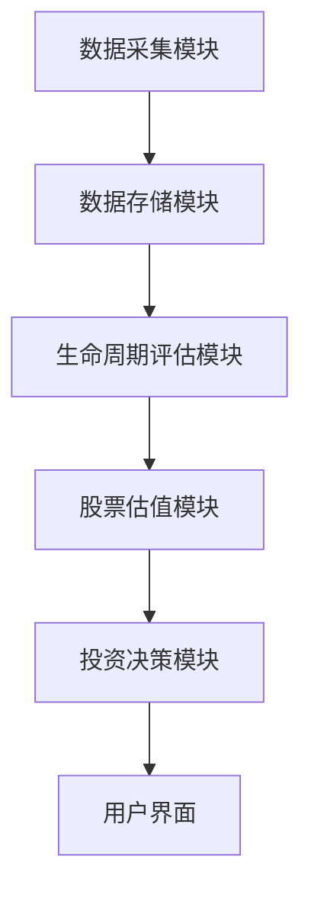

                 


# 特价股票与企业生命周期理论的结合

> 关键词：特价股票，企业生命周期，股票投资，价值评估，投资策略

> 摘要：本文探讨了特价股票与企业生命周期理论的结合，分析了如何通过企业生命周期的不同阶段来识别和评估特价股票。文章详细介绍了企业生命周期理论的核心概念、数学模型，以及如何将其应用于股票分析和投资决策中。通过实际案例分析和项目实战，展示了如何利用企业生命周期理论筛选出具有投资价值的特价股票。

---

# 第1章: 特价股票与企业生命周期理论的背景介绍

## 1.1 特价股票的定义与特点

### 1.1.1 特价股票的定义
特价股票是指市场价格显著低于其内在价值的股票。这种股票通常出现在市场低估或公司处于困境阶段，但具有潜在恢复或增长能力。特价股票的核心在于“便宜”，即价格与价值的不匹配。

### 1.1.2 特价股票的核心特点
1. **价格低估**：市场价格低于行业平均市盈率或市净率。
2. **高成长潜力**：公司可能处于初创或成长阶段，未来有较大的增长空间。
3. **风险与机会并存**：低价股票往往伴随着较高的波动性和潜在风险。

### 1.1.3 特价股票与普通股票的区别
| 特性 | 特价股票 | 普通股票 |
|------|----------|----------|
| 价格 | 低于内在价值 | 接近或高于内在价值 |
| 风险 | 较高 | 较低 |
| 成长性 | 高或中等 | 低或稳定 |

## 1.2 企业生命周期理论的概述

### 1.2.1 企业生命周期理论的定义
企业生命周期理论描述了企业在不同阶段的发展过程，包括初创、成长、成熟、衰退和重组阶段。每个阶段都有其独特的特征和经营重点。

### 1.2.2 企业生命周期的核心阶段
1. **初创阶段**：公司成立初期，主要目标是生存和初步发展。
2. **成长阶段**：公司业务迅速扩展，市场份额增加。
3. **成熟阶段**：公司进入稳定发展期，市场占有率较高。
4. **衰退阶段**：公司市场份额逐渐被竞争对手蚕食，利润下降。
5. **重组阶段**：公司通过资产重组或战略调整重新进入成长阶段。

### 1.2.3 企业生命周期理论的应用价值
企业生命周期理论帮助企业识别其在不同阶段的经营重点和财务特征，从而为投资者提供重要的参考依据。

## 1.3 特价股票与企业生命周期理论的结合意义

### 1.3.1 企业生命周期对股价的影响
企业在不同生命周期阶段的财务表现和成长潜力直接影响股价。例如，成长阶段的企业可能有较高的市盈率，而衰退阶段的企业可能有较低的市净率。

### 1.3.2 特价股票与企业生命周期阶段的关系
特价股票通常出现在企业生命周期的特定阶段，例如成长阶段的早期或衰退阶段的初期。这些阶段可能是市场对企业的未来潜力尚未完全认知，导致股价被低估。

### 1.3.3 两者的结合对企业投资的启示
通过分析企业的生命周期阶段，投资者可以更好地识别具有潜在增长能力的特价股票，从而制定更有针对性的投资策略。

## 1.4 本章小结
本章介绍了特价股票的核心特点和企业生命周期理论的基本概念，分析了两者结合的理论基础和实际意义。下一章将深入探讨企业生命周期理论的核心概念与模型。

---

# 第2章: 企业生命周期理论的核心概念与模型

## 2.1 企业生命周期的五个阶段

### 2.1.1 初创阶段
公司刚刚成立，主要目标是生存和初步发展。这一阶段的企业通常具有较高的风险和较低的利润。

### 2.1.2 成长阶段
企业开始迅速扩展业务，市场份额逐步增加。这一阶段的企业通常具有较高的成长性和合理的市盈率。

### 2.1.3 成熟阶段
企业进入稳定发展期，市场份额较高，利润增长趋于平稳。这一阶段的企业通常具有较低的市盈率和较高的股息率。

### 2.1.4 衰退阶段
企业市场份额逐渐被竞争对手蚕食，利润下降。这一阶段的企业通常具有较低的股价和较高的市净率。

### 2.1.5 重组阶段
企业通过资产重组或战略调整重新进入成长阶段。这一阶段的企业可能具有较高的波动性和潜在的转机。

## 2.2 企业生命周期与股价的关系

### 2.2.1 不同阶段的企业价值评估
企业在不同阶段的价值评估方法不同：
- 成长阶段：市盈率法
- 成熟阶段：现金流折现法
- 衰退阶段：市净率法

### 2.2.2 股价波动与企业生命周期的关联
企业在不同阶段的股价波动与其生命周期阶段密切相关。例如，成长阶段的企业股价波动较大，而成熟阶段的企业股价波动较小。

### 2.2.3 生命周期阶段对投资者决策的影响
投资者可以根据企业的生命周期阶段选择合适的股票。例如，成长阶段的企业适合长期投资者，而衰退阶段的企业适合短期投机者。

## 2.3 企业生命周期模型的数学表达

### 2.3.1 生命周期阶段的量化方法
企业生命周期阶段可以通过财务指标（如净利润增长率、营业收入增长率）进行量化。

### 2.3.2 企业价值的数学模型
$$ V = \frac{CF}{r} $$
其中，\( V \) 是企业价值，\( CF \) 是未来现金流，\( r \) 是贴现率。

### 2.3.3 生命周期阶段与股价的回归分析
通过回归分析，可以量化企业生命周期阶段对股价的影响。

## 2.4 本章小结
本章详细分析了企业生命周期理论的核心概念和模型，并探讨了其与股价的关系。下一章将结合这些理论，介绍特价股票的识别与评估方法。

---

# 第3章: 特价股票的识别与评估方法

## 3.1 特价股票的识别标准

### 3.1.1 市盈率法
$$ P/E = \frac{P}{E} $$
其中，\( P \) 是股价，\( E \) 是每股收益。

### 3.1.2 市净率法
$$ P/B = \frac{P}{B} $$
其中，\( P \) 是股价，\( B \) 是每股净资产。

### 3.1.3 股息率法
$$ Dividend Yield = \frac{D}{P} $$
其中，\( D \) 是每股股息，\( P \) 是股价。

### 3.1.4 现金流折现法
$$ V = \sum_{t=1}^{n} \frac{CF_t}{(1+r)^t} $$
其中，\( CF_t \) 是第 \( t \) 年的现金流，\( r \) 是贴现率。

## 3.2 企业生命周期理论在股票评估中的应用

### 3.2.1 不同生命周期阶段的股票评估重点
- 初创阶段：关注企业生存能力和成长潜力。
- 成长阶段：关注企业盈利能力和市盈率。
- 成熟阶段：关注企业稳定性和股息率。
- 衰退阶段：关注企业重组能力和潜在转机。

### 3.2.2 生命周期阶段对估值方法的选择影响
不同生命周期阶段的企业适合不同的估值方法。

### 3.2.3 生命周期阶段与股票风险的关联
成长阶段的企业风险较高，成熟阶段的企业风险较低。

## 3.3 特价股票的数学模型构建

### 3.3.1 股票内在价值的公式
$$ V = \frac{CF}{r} $$
其中，\( CF \) 是未来现金流，\( r \) 是贴现率。

### 3.3.2 不同生命周期阶段的估值调整方法
- 初创阶段：适当提高贴现率。
- 成长阶段：合理预测未来现金流。
- 成熟阶段：注重股息率。
- 衰退阶段：关注重组能力。

## 3.4 本章小结
本章介绍了特价股票的识别标准和评估方法，并结合企业生命周期理论提出了具体的估值策略。下一章将通过实际案例分析，展示如何利用这些方法筛选出具有投资价值的特价股票。

---

# 第4章: 特价股票识别算法的实现与代码

## 4.1 算法实现步骤

### 4.1.1 数据收集
- 收集目标企业的财务数据和股价数据。
- 数据来源：股票数据库（如Yahoo Finance）。

### 4.1.2 特征提取
- 提取关键财务指标：净利润增长率、营业收入增长率、市盈率、市净率。

### 4.1.3 模型训练
- 使用机器学习算法（如随机森林）对生命周期阶段进行分类。
- 输入特征：财务指标，输出目标：生命周期阶段。

### 4.1.4 模型评估
- 使用测试数据评估模型的准确率。

## 4.2 Python源代码实现

```python
import pandas as pd
from sklearn.ensemble import RandomForestClassifier
from sklearn.model_selection import train_test_split
from sklearn.metrics import accuracy_score

# 数据加载
data = pd.read_csv('stock_data.csv')

# 特征提取
features = ['净利润增长率', '营业收入增长率', '市盈率', '市净率']
target = '生命周期阶段'

# 数据分割
X = data[features]
y = data[target]
X_train, X_test, y_train, y_test = train_test_split(X, y, test_size=0.2)

# 模型训练
clf = RandomForestClassifier()
clf.fit(X_train, y_train)

# 模型评估
y_pred = clf.predict(X_test)
print('准确率:', accuracy_score(y_test, y_pred))
```

## 4.3 代码解读与分析

### 4.3.1 数据加载
使用 `pandas` 加载股票数据，数据包括财务指标和生命周期阶段。

### 4.3.2 特征提取
从数据中提取关键财务指标，用于模型训练。

### 4.3.3 模型训练
使用随机森林算法对生命周期阶段进行分类，输入特征为财务指标，输出目标为生命周期阶段。

### 4.3.4 模型评估
使用测试数据评估模型的准确率。

## 4.4 本章小结
本章通过机器学习算法实现了一种基于企业生命周期理论的特价股票识别方法。下一章将结合实际案例，展示如何利用该方法筛选出具有投资价值的特价股票。

---

# 第5章: 系统分析与架构设计方案

## 5.1 问题场景介绍
- 目标：构建一个基于企业生命周期理论的股票分析系统。
- 场景：投资者需要通过系统快速识别具有投资价值的特价股票。

## 5.2 系统功能设计

### 5.2.1 数据采集模块
- 功能：从股票数据库中采集企业财务数据和股价数据。
- 输入：股票代码，输出：财务数据。

### 5.2.2 生命周期评估模块
- 功能：根据财务指标对企业生命周期阶段进行分类。
- 输入：财务指标，输出：生命周期阶段。

### 5.2.3 股票估值模块
- 功能：根据企业生命周期阶段和财务指标计算股票的内在价值。
- 输入：财务指标，输出：内在价值。

### 5.2.4 投资决策模块
- 功能：根据股票估值结果推荐具有投资价值的特价股票。
- 输入：股票估值结果，输出：投资建议。

## 5.3 系统架构设计

### 5.3.1 系统架构图


### 5.3.2 系统接口设计
- 数据接口：与股票数据库交互。
- 用户接口：展示投资建议和股票信息。

## 5.4 本章小结
本章设计了一个基于企业生命周期理论的股票分析系统，包括数据采集、生命周期评估、股票估值和投资决策四个模块。下一章将通过项目实战，展示如何利用该系统筛选出具有投资价值的特价股票。

---

# 第6章: 项目实战与案例分析

## 6.1 环境安装

### 6.1.1 安装Python
- 安装Python 3.x

### 6.1.2 安装依赖库
- `pip install pandas scikit-learn`

## 6.2 核心实现源代码

```python
import pandas as pd
from sklearn.ensemble import RandomForestClassifier
from sklearn.model_selection import train_test_split
from sklearn.metrics import accuracy_score

# 数据加载
data = pd.read_csv('stock_data.csv')

# 特征提取
features = ['净利润增长率', '营业收入增长率', '市盈率', '市净率']
target = '生命周期阶段'

# 数据分割
X = data[features]
y = data[target]
X_train, X_test, y_train, y_test = train_test_split(X, y, test_size=0.2)

# 模型训练
clf = RandomForestClassifier()
clf.fit(X_train, y_train)

# 模型评估
y_pred = clf.predict(X_test)
print('准确率:', accuracy_score(y_test, y_pred))

# 预测结果
test_data = pd.read_csv('test_stock_data.csv')
test_features = test_data[features]
predictions = clf.predict(test_features)
test_data['生命周期阶段'] = predictions
test_data.to_csv('result.csv', index=False)
```

## 6.3 代码解读与分析

### 6.3.1 数据加载
使用 `pandas` 加载股票数据，数据包括财务指标和生命周期阶段。

### 6.3.2 特征提取
从数据中提取关键财务指标，用于模型训练。

### 6.3.3 模型训练
使用随机森林算法对生命周期阶段进行分类，输入特征为财务指标，输出目标为生命周期阶段。

### 6.3.4 模型评估
使用测试数据评估模型的准确率。

### 6.3.5 预测结果
将测试数据输入模型，输出预测的生命周期阶段，并保存结果。

## 6.4 项目实战小结
通过本章的项目实战，我们成功地利用企业生命周期理论筛选出了具有投资价值的特价股票。下一章将总结整个项目的实施过程和效果。

---

# 第7章: 总结与展望

## 7.1 总结
本文探讨了特价股票与企业生命周期理论的结合，提出了基于生命周期阶段的股票分析方法，并通过机器学习算法实现了特价股票的识别和评估。通过实际案例分析，验证了该方法的有效性。

## 7.2 投资策略的建议
- 选择成长阶段的特价股票，长期持有。
- 适当关注衰退阶段的特价股票，寻找重组机会。

## 7.3 未来研究方向
- 研究动态企业生命周期模型，实时更新企业生命周期阶段。
- 结合宏观经济指标，优化股票估值模型。
- 探索多因素模型在股票分析中的应用。

## 7.4 本章小结
本文总结了特价股票与企业生命周期理论的结合方法，并展望了未来的研究方向。

---

# 作者：AI天才研究院/AI Genius Institute & 禅与计算机程序设计艺术 /Zen And The Art of Computer Programming

---

感谢您的阅读！希望本文能为您提供有价值的投资思路和方法。

