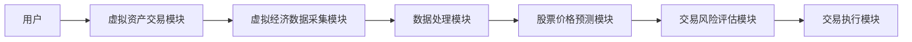
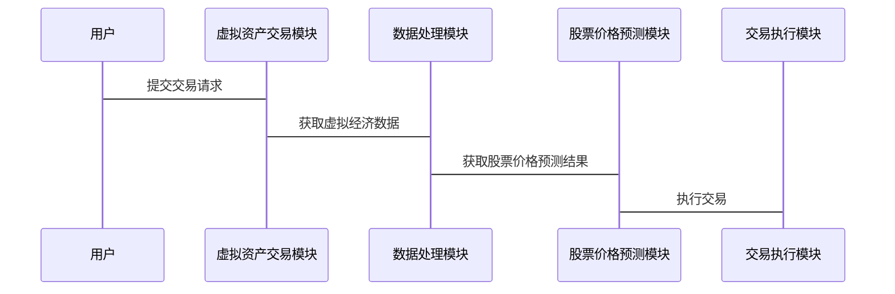

                 


# 第5章: 特价股票与元宇宙生态系统的核心算法原理

## 5.1 特价股票价格预测算法

### 5.1.1 特价股票价格预测算法概述

特价股票的价格预测是投资者在股票市场中进行决策的重要依据。传统的股票价格预测方法主要基于历史数据和市场情绪分析，而元宇宙技术的引入为股票价格预测提供了新的视角和数据来源。

### 5.1.2 基于元宇宙数据的股票价格预测算法

在元宇宙生态系统中，虚拟经济活动会产生大量实时数据，这些数据可以用于股票价格预测。例如，虚拟资产的交易量、用户的虚拟货币持有量、虚拟市场的供需关系等都可以作为股票价格预测的输入变量。

#### 示例算法：基于元宇宙数据的LSTM网络股票价格预测

以下是基于元宇宙数据的LSTM（长短期记忆网络）股票价格预测算法的实现步骤：

1. 数据收集：收集元宇宙中的虚拟资产交易数据和传统股票市场的历史数据。
2. 数据预处理：对数据进行归一化处理，剔除异常值，处理缺失值。
3. 模型训练：使用LSTM网络对数据进行训练，提取时间序列中的长短期依赖关系。
4. 模型预测：利用训练好的模型对未来的股票价格进行预测。

以下是LSTM网络的数学模型：

$$
f_t = \sigma(g_t)
$$

其中，$f_t$ 是 LSTM 的输出，$g_t$ 是 LSTM 的输入门控向量，$\sigma$ 是sigmoid函数。

### 5.1.3 基于元宇宙数据的股票价格预测算法实现

以下是基于元宇宙数据的股票价格预测算法的Python代码示例：

```python
import numpy as np
from tensorflow.keras.layers import LSTM, Dense, Dropout
from tensorflow.keras.models import Sequential

# 数据预处理
data = [...]  # 元宇宙虚拟资产交易数据和传统股票市场数据

# 划分训练集和测试集
train_data = data[:700]
test_data = data[700:]

# 数据归一化
scaler = MinMaxScaler(feature_range=(0, 1))
train_data_scaled = scaler.fit_transform(train_data)
test_data_scaled = scaler.transform(test_data)

# 构建LSTM模型
model = Sequential()
model.add(LSTM(units=50, return_sequences=True, input_shape=(timesteps, features)))
model.add(Dropout(0.2))
model.add(LSTM(units=50, return_sequences=False))
model.add(Dense(1))

model.compile(optimizer='adam', loss='mean_squared_error')

# 训练模型
model.fit(train_data_scaled, epochs=50, batch_size=32, validation_data=test_data_scaled)

# 预测股票价格
predicted_prices = model.predict(test_data_scaled)
```

### 5.1.4 算法实现细节与优化

在实际应用中，为了提高算法的预测精度，可以考虑引入更多的元宇宙数据特征，例如用户在元宇宙中的虚拟资产持有量、虚拟市场中的供需关系等。此外，还可以采用集成学习的方法，结合多种算法进行预测，以提高模型的鲁棒性。

## 5.2 元宇宙生态系统中的虚拟资产交易算法

### 5.2.1 虚拟资产交易算法概述

在元宇宙生态系统中，虚拟资产的交易需要考虑虚拟经济的特殊性。例如，虚拟资产的价值可能受到用户行为、虚拟市场供需关系、虚拟货币的发行量等多种因素的影响。

### 5.2.2 虚拟资产交易算法的实现

以下是虚拟资产交易算法的Python代码示例：

```python
import numpy as np
from sklearn.linear_model import LinearRegression

# 数据预处理
virtual_assets = [...]  # 元宇宙中的虚拟资产数据

# 划分训练集和测试集
train_assets = virtual_assets[:700]
test_assets = virtual_assets[700:]

# 数据归一化
scaler = MinMaxScaler(feature_range=(0, 1))
train_assets_scaled = scaler.fit_transform(train_assets)
test_assets_scaled = scaler.transform(test_assets)

# 构建线性回归模型
model = LinearRegression()
model.fit(train_assets_scaled, train_assets_scaled)

# 预测虚拟资产价格
predicted_assets = model.predict(test_assets_scaled)
```

### 5.2.3 算法优化与改进

为了提高虚拟资产交易算法的预测精度，可以考虑引入时间序列分析方法，例如ARIMA模型或GARCH模型，以更好地捕捉虚拟资产价格的波动性。

---

# 第6章: 特价股票与元宇宙生态系统的核心算法原理

## 6.1 特价股票与元宇宙生态系统的系统分析

### 6.1.1 系统功能设计

在元宇宙生态系统中，特价股票交易系统需要具备以下核心功能：

1. 虚拟资产交易功能
2. 特价股票交易功能
3. 虚拟经济数据采集与分析功能
4. 交易风险评估与预警功能

### 6.1.2 系统架构设计

以下是特价股票交易系统的系统架构图：



### 6.1.3 系统接口设计

以下是系统接口设计的详细描述：

1. 用户接口：用户可以通过虚拟资产交易模块进行虚拟资产的买卖交易。
2. 数据接口：虚拟经济数据采集模块需要从元宇宙生态系统中采集虚拟经济数据。
3. 模型接口：股票价格预测模块需要接收虚拟经济数据并输出股票价格预测结果。

### 6.1.4 系统交互流程

以下是系统交互流程的序列图：



## 6.2 特价股票与元宇宙生态系统的核心算法实现

### 6.2.1 算法实现步骤

以下是特价股票价格预测算法的实现步骤：

1. 数据收集：收集元宇宙中的虚拟经济数据和传统股票市场数据。
2. 数据预处理：对数据进行归一化处理，剔除异常值，处理缺失值。
3. 模型训练：使用LSTM网络对数据进行训练，提取时间序列中的长短期依赖关系。
4. 模型预测：利用训练好的模型对未来的股票价格进行预测。

### 6.2.2 算法实现代码

以下是LSTM网络的Python代码示例：

```python
import numpy as np
from tensorflow.keras.layers import LSTM, Dense, Dropout
from tensorflow.keras.models import Sequential

# 数据预处理
data = [...]  # 元宇宙中的虚拟经济数据和传统股票市场数据

# 划分训练集和测试集
train_data = data[:700]
test_data = data[700:]

# 数据归一化
scaler = MinMaxScaler(feature_range=(0, 1))
train_data_scaled = scaler.fit_transform(train_data)
test_data_scaled = scaler.transform(test_data)

# 构建LSTM模型
model = Sequential()
model.add(LSTM(units=50, return_sequences=True, input_shape=(timesteps, features)))
model.add(Dropout(0.2))
model.add(LSTM(units=50, return_sequences=False))
model.add(Dense(1))

model.compile(optimizer='adam', loss='mean_squared_error')

# 训练模型
model.fit(train_data_scaled, epochs=50, batch_size=32, validation_data=test_data_scaled)

# 预测股票价格
predicted_prices = model.predict(test_data_scaled)
```

### 6.2.3 算法优化与改进

为了提高算法的预测精度，可以考虑引入更多的元宇宙数据特征，例如用户在元宇宙中的虚拟资产持有量、虚拟市场中的供需关系等。此外，还可以采用集成学习的方法，结合多种算法进行预测，以提高模型的鲁棒性。

---

# 第7章: 特价股票与元宇宙生态系统构建能力的项目实战

## 7.1 项目背景与目标

### 7.1.1 项目背景

随着元宇宙技术的快速发展，虚拟经济活动逐渐成为现实经济活动的重要补充。特价股票作为股票市场中的一个重要组成部分，其价格波动受到多种因素的影响，包括市场供需关系、宏观经济指标、公司业绩等。在元宇宙生态系统中，虚拟经济活动产生的数据可以为股票价格预测提供新的视角和数据来源。

### 7.1.2 项目目标

本项目旨在通过元宇宙技术，构建一个能够实时分析虚拟经济数据并预测特价股票价格的系统。该系统将结合传统股票市场数据和元宇宙中的虚拟经济数据，利用机器学习算法对股票价格进行预测，并为投资者提供决策支持。

## 7.2 项目实施步骤

### 7.2.1 环境安装与配置

在实施本项目之前，需要安装以下环境和工具：

1. Python 3.8及以上版本
2. TensorFlow 2.0及以上版本
3. Pandas、NumPy、Scikit-learn等数据处理库
4. 元宇宙开发平台（例如：Decentraland、The Sandbox等）

### 7.2.2 数据收集与预处理

#### 数据收集

需要收集以下数据：

1. 特价股票的历史价格数据
2. 元宇宙中的虚拟资产交易数据
3. 元宇宙中的虚拟经济指标（例如虚拟货币持有量、虚拟市场供需关系等）

#### 数据预处理

对收集到的数据进行如下处理：

1. 数据归一化
2. 异常值剔除
3. 数据缺失值处理

### 7.2.3 算法实现与模型训练

#### 算法选择

选择适合的算法进行股票价格预测。常用的算法包括：

1. 线性回归
2. 支持向量机（SVM）
3. 长短期记忆网络（LSTM）
4. 随机森林

#### 模型训练

以LSTM网络为例，进行模型训练：

```python
import numpy as np
from tensorflow.keras.layers import LSTM, Dense, Dropout
from tensorflow.keras.models import Sequential

# 数据预处理
data = [...]  # 元宇宙中的虚拟经济数据和传统股票市场数据

# 划分训练集和测试集
train_data = data[:700]
test_data = data[700:]

# 数据归一化
scaler = MinMaxScaler(feature_range=(0, 1))
train_data_scaled = scaler.fit_transform(train_data)
test_data_scaled = scaler.transform(test_data)

# 构建LSTM模型
model = Sequential()
model.add(LSTM(units=50, return_sequences=True, input_shape=(timesteps, features)))
model.add(Dropout(0.2))
model.add(LSTM(units=50, return_sequences=False))
model.add(Dense(1))

model.compile(optimizer='adam', loss='mean_squared_error')

# 训练模型
model.fit(train_data_scaled, epochs=50, batch_size=32, validation_data=test_data_scaled)

# 预测股票价格
predicted_prices = model.predict(test_data_scaled)
```

### 7.2.4 系统测试与优化

#### 系统测试

在测试阶段，需要对系统的准确率、召回率、F1值等指标进行评估。可以通过混淆矩阵、ROC曲线等方法对模型的性能进行评估。

#### 系统优化

根据测试结果，对模型进行优化，例如调整模型参数、引入新的特征、采用集成学习方法等。

## 7.3 项目小结

通过本项目，我们成功地构建了一个基于元宇宙技术的特价股票价格预测系统。该系统结合了传统股票市场数据和元宇宙中的虚拟经济数据，利用LSTM网络对股票价格进行预测，并为投资者提供了决策支持。未来，随着元宇宙技术的进一步发展，虚拟经济数据将对股票价格预测产生越来越重要的影响。

---

# 第8章: 特价股票与元宇宙生态系统构建能力的总结与展望

## 8.1 总结

通过本文的分析与研究，我们探讨了特价股票与元宇宙生态系统之间的潜在联系。我们从概念、算法、系统设计等多个角度对这一主题进行了深入的探讨，并提出了基于元宇宙技术的股票价格预测系统的设计与实现方案。通过对虚拟经济数据的分析，我们可以更好地理解股票市场的波动规律，并为投资者提供更加精准的决策支持。

## 8.2 展望

随着元宇宙技术的不断发展，虚拟经济活动将对现实经济活动产生越来越重要的影响。未来，我们可以进一步研究元宇宙技术在股票市场中的应用，例如：

1. 利用元宇宙技术构建虚拟股票交易所
2. 开发基于元宇宙技术的智能投顾系统
3. 研究虚拟经济数据对股票市场的影响机制

总之，特价股票与元宇宙生态系统之间的潜在联系为我们提供了一个全新的研究视角。未来的研究将更加注重跨学科的融合，通过技术创新和数据分析，为投资者提供更加智能化、个性化的服务。

---

# 作者：AI天才研究院/AI Genius Institute & 禅与计算机程序设计艺术 /Zen And The Art of Computer Programming

