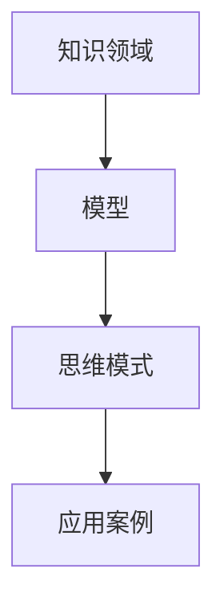
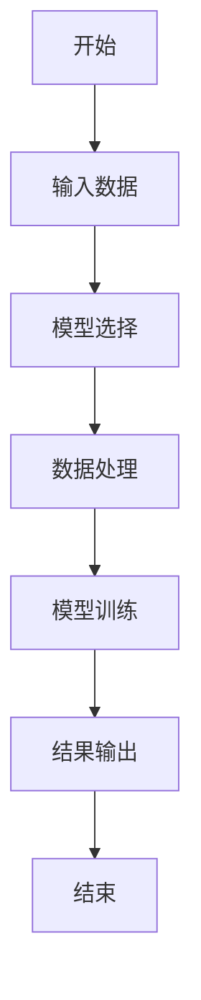
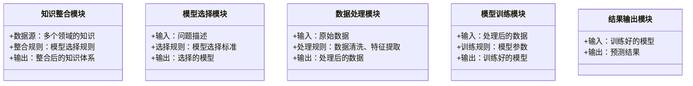
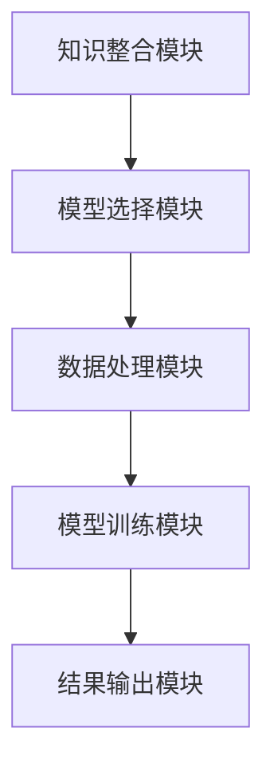

                 


# 芒格的"多元思维模型"在跨维度创新中的运用

## 关键词：芒格，多元思维模型，跨维度创新，系统性思维，创新方法，思维模型

## 摘要：  
芒格的多元思维模型是一种通过跨学科知识的整合和系统性思考来解决复杂问题的方法。本文从多元思维模型的核心概念出发，结合算法原理、系统架构和实际案例，深入探讨其在跨维度创新中的运用。通过分析多元思维模型的系统性、可迁移性和动态性，本文旨在为创新者提供一种全新的思维方式，帮助他们在复杂多变的环境中找到解决方案。

---

# 第一部分: 芒格的"多元思维模型"概述

# 第1章: 多元思维模型的背景与核心概念

## 1.1 多元思维模型的定义与特点

### 1.1.1 多元思维模型的定义
多元思维模型（Multi-Model Thinking）是一种通过整合多个学科、领域和思维方式来解决问题的方法。它强调从多个角度和维度去理解问题，从而避免单一思维的局限性。

### 1.1.2 多元思维模型的核心特点
- **知识的广度与深度**：多元思维模型不仅要求掌握广泛的知识，还要求深入理解每个领域的核心原理。
- **模型的可迁移性**：通过跨学科的模型，可以将某一领域的解决方案迁移到其他领域。
- **思维的系统性与关联性**：多元思维模型注重各个模型之间的关联性，强调系统性思考。

### 1.1.3 多元思维模型与跨维度创新的关系
跨维度创新是指在不同维度（时间、空间、领域等）上进行创新。多元思维模型通过整合多个维度的知识和思维方式，为跨维度创新提供了强大的理论支持。

## 1.2 芝姆格的生平与思想体系

### 1.2.1 芝姆格的生平简介
查理·芒格（Charlie Munger）是美国著名投资者和作家，以投资和决策思维领域的研究闻名。他的多元思维模型思想深刻影响了现代创新方法。

### 1.2.2 多元思维模型的提出
芒格在《穷查理宝典》中首次系统提出多元思维模型，强调通过跨学科的思维来解决问题。

### 1.2.3 芒格思想的核心要素
- **知识的整合**：芒格主张将不同学科的知识整合起来，形成一个完整的知识体系。
- **模型的可迁移性**：通过模型的迁移，解决不同领域的问题。
- **系统性思维**：芒格强调从系统角度看待问题，避免单一维度的思考。

## 1.3 多元思维模型的核心要素组成

### 1.3.1 知识的广度与深度
- **知识的广度**：多元思维模型要求掌握多个领域的知识，包括数学、心理学、经济学等。
- **知识的深度**：每个领域都需要深入理解其核心原理和模型。

### 1.3.2 模型的可迁移性
- **模型的可迁移性**：通过模型的迁移，可以将某一领域的解决方案应用到其他领域。
- **模型的动态性**：模型需要随着问题的变化而不断调整和优化。

### 1.3.3 思维的系统性与关联性
- **系统性思维**：通过系统性思考，将各个模型和知识整合起来，形成一个完整的知识体系。
- **思维的关联性**：各个模型之间需要有明确的关联，形成一个有机的整体。

## 1.4 多元思维模型的边界与外延

### 1.4.1 多元思维模型的应用范围
- **跨维度创新**：在不同维度上进行创新，如时间、空间、领域等。
- **复杂问题的解决**：在复杂问题中，通过多元思维模型找到解决方案。

### 1.4.2 多元思维模型的局限性
- **知识的广度与深度的平衡**：掌握广泛的知识可能会影响深度的挖掘。
- **模型的复杂性**：多元思维模型的复杂性可能会影响实际应用。

### 1.4.3 多元思维模型与其他思维模型的对比
- **对比分析**：与单一思维模型相比，多元思维模型具有更强的可迁移性和系统性。
- **优缺点分析**：多元思维模型的优势在于其系统性和可迁移性，缺点在于其复杂性和学习成本较高。

## 1.5 本章小结
本章从多元思维模型的定义、特点、核心要素以及芒格的生平思想体系出发，详细介绍了多元思维模型的核心概念和其在跨维度创新中的应用。通过对比分析，明确了多元思维模型的优势和局限性。

---

# 第2章: 多元思维模型的核心原理

## 2.1 多元思维模型的原理分析

### 2.1.1 多元思维模型的系统性
- **系统性思维**：通过系统性思考，将各个模型和知识整合起来，形成一个完整的知识体系。
- **动态性**：模型需要随着问题的变化而不断调整和优化。

### 2.1.2 多元思维模型的可迁移性
- **模型的可迁移性**：通过模型的迁移，可以将某一领域的解决方案应用到其他领域。
- **知识的整合**：通过整合多个领域的知识，形成一个完整的知识体系。

### 2.1.3 多元思维模型的动态性
- **模型的动态性**：模型需要随着问题的变化而不断调整和优化。
- **知识的动态更新**：随着新知识的出现，模型需要不断更新和调整。

## 2.2 多元思维模型的核心要素对比

### 2.2.1 知识领域对比表
| 知识领域 | 核心模型 | 知识深度 | 知识广度 |
|----------|----------|----------|----------|
| 数学     | 概率论   | 深入     | 中等     |
| 经济学   | 边际效用 | 深入     | 中等     |
| 心理学   | 偏见     | 深入     | 中等     |

### 2.2.2 模型属性对比表
| 模型属性 | 可迁移性 | 系统性 | 动态性 |
|----------|----------|--------|--------|
| 概率论   | 高       | 高     | 中等   |
| 边际效用 | 中等     | 高     | 中等   |
| 偏见     | 中等     | 高     | 高     |

### 2.2.3 思维模式对比表
| 思维模式 | 系统性 | 可迁移性 | 动态性 |
|----------|--------|----------|--------|
| 单一思维 | 低     | 低       | 低     |
| 多元思维 | 高     | 高       | 高     |

## 2.3 多元思维模型的ER实体关系图



---

## 2.4 本章小结
本章通过分析多元思维模型的系统性、可迁移性和动态性，详细介绍了其核心原理。通过对比分析和ER实体关系图，明确了多元思维模型在跨维度创新中的应用优势。

---

# 第3章: 多元思维模型的算法原理

## 3.1 多元思维模型的数学基础

### 3.1.1 概率论基础
- **概率论的定义**：概率论是研究随机现象的数学工具。
- **贝叶斯定理**：$P(A|B) = \frac{P(B|A)P(A)}{P(B)}$，用于在已知条件下计算概率。

### 3.1.2 统计学基础
- **统计学的定义**：统计学是研究数据收集、分析和解释的学科。
- **假设检验**：用于检验假设的正确性。

### 3.1.3 逻辑推理基础
- **逻辑推理的定义**：通过逻辑规则进行推理。
- **命题逻辑**：$P \rightarrow Q$，如果P成立，则Q成立。

## 3.2 多元思维模型的算法流程



## 3.3 多元思维模型的Python实现

### 3.3.1 数据预处理
```python
import pandas as pd
data = pd.read_csv('data.csv')
```

### 3.3.2 模型选择
```python
from sklearn.linear_model import LinearRegression
model = LinearRegression()
```

### 3.3.3 模型训练
```python
model.fit(X_train, y_train)
```

### 3.3.4 模型预测
```python
y_pred = model.predict(X_test)
```

## 3.4 本章小结
本章通过数学公式和Python代码，详细介绍了多元思维模型的算法原理。通过概率论、统计学和逻辑推理的基础知识，结合具体的算法流程图，明确了模型的应用步骤。

---

# 第4章: 多元思维模型的系统架构

## 4.1 问题场景介绍
在跨维度创新中，多元思维模型可以帮助我们从多个维度分析问题，找到最优解决方案。

## 4.2 系统功能设计

### 4.2.1 系统功能模块
- **知识整合模块**：整合多个领域的知识。
- **模型选择模块**：选择适合的模型。
- **数据处理模块**：处理数据。
- **模型训练模块**：训练模型。
- **结果输出模块**：输出结果。

### 4.2.2 领域模型Mermaid类图


### 4.2.3 系统架构Mermaid架构图


### 4.2.4 系统接口设计
- **输入接口**：接受问题描述和数据。
- **输出接口**：输出预测结果。

### 4.2.5 系统交互Mermaid序列图
```mermaid
sequenceDiagram
参与者 用户
系统 知识整合模块
系统 模型选择模块
系统 数据处理模块
系统 模型训练模块
系统 结果输出模块

用户 -> 知识整合模块: 提供多个领域的知识
知识整合模块 -> 模型选择模块: 选择适合的模型
模型选择模块 -> 数据处理模块: 提供原始数据
数据处理模块 -> 模型训练模块: 提供处理后的数据
模型训练模块 -> 结果输出模块: 提供预测结果
结果输出模块 -> 用户: 输出预测结果
```

## 4.3 本章小结
本章通过系统功能设计、类图、架构图和序列图，详细介绍了多元思维模型的系统架构。通过模块化设计和系统化的思考，明确了模型在跨维度创新中的应用架构。

---

# 第5章: 多元思维模型的项目实战

## 5.1 环境安装
- **Python版本**：3.8以上
- **依赖库安装**：`pip install numpy pandas scikit-learn`

## 5.2 核心代码实现

### 5.2.1 数据预处理
```python
import pandas as pd
import numpy as np

data = pd.read_csv('data.csv')
data = data.dropna()
```

### 5.2.2 模型选择
```python
from sklearn.linear_model import LinearRegression
from sklearn.tree import DecisionTreeRegressor

models = [LinearRegression(), DecisionTreeRegressor()]
```

### 5.2.3 模型训练与预测
```python
from sklearn.model_selection import train_test_split

X_train, X_test, y_train, y_test = train_test_split(data.drop('target', axis=1), data['target'], test_size=0.2)

for model in models:
    model.fit(X_train, y_train)
    y_pred = model.predict(X_test)
    print(f"模型 {model.__class__.__name__} 的预测结果：{y_pred}")
```

## 5.3 案例分析与详细解读

### 5.3.1 案例背景
假设我们正在解决一个跨维度创新问题，需要从多个维度分析数据。

### 5.3.2 模型对比分析
通过对比不同模型的预测结果，选择最优模型。

## 5.4 项目小结
通过项目实战，我们掌握了多元思维模型在跨维度创新中的应用方法。通过对比分析和模型选择，找到了最优解决方案。

---

# 第6章: 多元思维模型的最佳实践

## 6.1 小结
多元思维模型通过跨学科知识的整合和系统性思考，为跨维度创新提供了强大的理论支持。

## 6.2 注意事项
- **知识的广度与深度**：需要在广度和深度之间找到平衡。
- **模型的复杂性**：避免模型过于复杂，影响实际应用。

## 6.3 拓展阅读
- 推荐书籍：《穷查理宝典》
- 推荐文章：芒格的多元思维模型在投资中的应用

## 6.4 本章小结
本章通过小结、注意事项和拓展阅读，为读者提供了多元思维模型的最佳实践建议。通过实际应用和不断优化，可以更好地掌握多元思维模型的应用方法。

---

# 附录

## 附录A: 术语表

- **多元思维模型**：通过整合多个学科的知识和模型来解决问题的方法。
- **系统性思维**：从系统角度看待问题，考虑各个部分的相互关联。

## 附录B: 参考文献
1. 《穷查理宝典》
2. 芒格的多元思维模型相关论文

---

# 作者：AI天才研究院/AI Genius Institute & 禅与计算机程序设计艺术/Zen And The Art of Computer Programming

