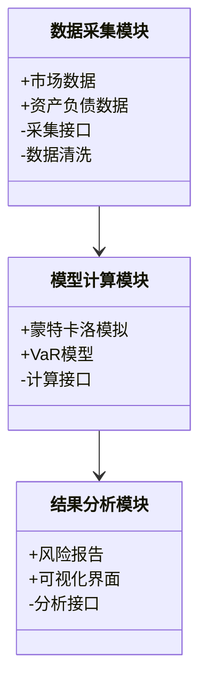
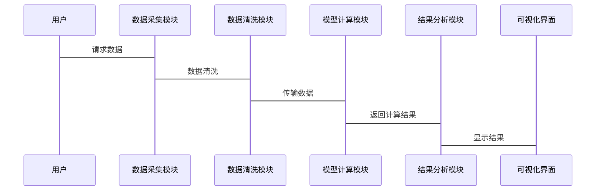

                 


# 金融机构流动性风险压力测试平台

## 关键词：流动性风险、压力测试、金融机构、蒙特卡洛模拟、VaR模型、系统架构设计

## 摘要：金融机构流动性风险压力测试平台是一种用于评估和管理金融机构在极端市场条件下的流动性风险的系统。本文详细介绍了流动性风险的基本概念、压力测试的核心算法与模型、系统架构设计，以及如何通过实际案例实现平台的功能。文章还提供了相关的数学公式、代码示例和系统设计图，帮助读者全面理解并构建类似的平台。

---

# 第一部分: 金融机构流动性风险压力测试平台概述

## 第1章: 金融机构流动性风险与压力测试概述

### 1.1 金融机构流动性风险的基本概念
#### 1.1.1 流动性风险的定义与特征
流动性风险是指金融机构无法在不产生额外成本或损失的情况下，及时以合理价格获得足够的资金来满足其资产增长或履行其义务的风险。其主要特征包括短期性、不确定性、传染性和系统性。

#### 1.1.2 流动性风险的来源与表现形式
- **来源**：
  - 市场波动：如股市 crash 或债券评级下调。
  - 机构行为：如银行客户大量提取存款或赎回理财产品。
  - 系统性风险：如整个金融体系的流动性危机。

- **表现形式**：
  - 资产负债期限错配。
  - 资金需求激增。
  - 资金来源突然枯竭。

#### 1.1.3 流动性风险对金融机构的影响
- 影响资金调度能力。
- 增加融资成本。
- 可能导致流动性危机，甚至引发机构破产。

---

### 1.2 压力测试的基本概念与方法
#### 1.2.1 压力测试的定义与目的
压力测试是一种用于评估金融机构在极端市场条件下承受压力的能力的工具。其目的是识别潜在的风险点，评估机构的资本充足性、流动性和风险管理能力。

#### 1.2.2 压力测试的主要方法与应用场景
- **方法**：
  - 情景分析：模拟不同经济环境下的市场表现。
  - 蒙特卡洛模拟：通过随机抽样模拟多种市场情况。
  - VaR（Value at Risk）模型：评估在特定置信水平下的潜在损失。

- **应用场景**：
  - 金融机构内部风险控制。
  - 监管机构评估金融机构的稳健性。
  - 投资者评估投资风险。

#### 1.2.3 压力测试在金融机构中的重要性
- 帮助金融机构识别和应对潜在风险。
- 提供决策支持，优化资本配置。
- 提高金融机构的抗风险能力。

---

### 1.3 金融机构流动性风险压力测试平台的必要性
#### 1.3.1 平台的定义与功能定位
金融机构流动性风险压力测试平台是一种用于模拟极端市场条件下金融机构流动性状况的系统。其功能包括数据采集、模型计算、结果分析和风险预警。

#### 1.3.2 平台在金融机构中的作用
- 提供实时风险评估。
- 支持决策者制定应对策略。
- 优化资金配置和流动性管理。

#### 1.3.3 平台的建设目标与意义
- **目标**：构建一个高效、准确的流动性风险评估系统。
- **意义**：提升金融机构的风险管理能力，确保金融系统的稳定运行。

---

### 1.4 本章小结
本章主要介绍了流动性风险的基本概念、压力测试的方法及其在金融机构中的重要性。通过理解这些内容，读者可以认识到构建流动性风险压力测试平台的必要性和重要意义。

---

## 第2章: 金融机构流动性风险压力测试的核心概念与联系

### 2.1 金融机构流动性风险压力测试的核心概念
#### 2.1.1 流动性风险压力测试的定义
流动性风险压力测试是指在极端市场条件下，评估金融机构的流动性状况，识别潜在的资金缺口，并制定应对策略的过程。

#### 2.1.2 流动性风险压力测试的主体与客体
- **主体**：金融机构、监管机构。
- **客体**：金融机构的资产负债表、市场数据、压力测试模型。

#### 2.1.3 流动性风险压力测试的流程与步骤
1. 数据采集与处理。
2. 模型选择与构建。
3. 情景模拟与计算。
4. 结果分析与报告。

---

### 2.2 金融机构流动性风险压力测试的核心要素
#### 2.2.1 流动性风险压力测试的输入要素
- 市场数据：利率、汇率、股价等。
- 资产负债数据：存款、贷款、投资等。
- 情景假设：极端市场情况的设定。

#### 2.2.2 流动性风险压力测试的模型与方法
- 情景分析法。
- 蒙特卡洛模拟。
- VaR模型。

#### 2.2.3 流动性风险压力测试的输出与结果分析
- 潜在资金缺口。
- 资金来源与使用的对比分析。
- 风险等级评估。

---

### 2.3 金融机构流动性风险压力测试的系统架构
#### 2.3.1 系统架构的组成与功能
- 数据采集模块：收集市场数据和资产负债数据。
- 模型计算模块：运行压力测试模型。
- 结果分析模块：生成报告和风险预警。

#### 2.3.2 系统架构的层次与模块划分
- 数据层：数据存储与管理。
- 计算层：模型运行与计算。
- 展示层：结果展示与用户交互。

#### 2.3.3 系统架构的灵活性与可扩展性
- 支持多种模型和情景。
- 灵活调整参数和输入数据。

---

### 2.4 本章小结
本章详细阐述了流动性风险压力测试的核心概念、要素和系统架构。通过理解这些内容，读者可以更好地掌握压力测试的实施过程和系统设计。

---

## 第3章: 金融机构流动性风险压力测试的核心算法与数学模型

### 3.1 金融机构流动性风险压力测试的算法原理
#### 3.1.1 蒙特卡洛模拟算法
- **原理**：通过随机抽样模拟多种市场情况，计算潜在损失。
- **实现步骤**：
  1. 确定输入参数。
  2. 生成随机样本。
  3. 计算每种情况下的结果。
  4. 统计分析结果。

- **代码示例**：
  ```python
  import numpy as np
  def monte_carlo_simulation(n_simulations, initial_amount, rate, time):
      results = []
      for _ in range(n_simulations):
          # 生成随机利率
          random_rate = np.random.normal(rate, 0.1)
          # 计算终值
          final_amount = initial_amount * (1 + random_rate) ** time
          results.append(final_amount)
      return np.mean(results), np.std(results)
  ```

- **数学公式**：
  $$ E[Value] = \frac{1}{N}\sum_{i=1}^{N}Value_i $$

---

#### 3.1.2 VaR（Value at Risk）模型
- **原理**：计算在特定置信水平下的潜在损失。
- **实现步骤**：
  1. 收集历史数据。
  2. 计算收益分布。
  3. 确定VaR值。

- **代码示例**：
  ```python
  import numpy as np
  def calculate VaR(data, confidence_level):
      sorted_data = np.sort(data)
      VaR = sorted_data[int(len(sorted_data) * (1 - confidence_level))]
      return VaR
  ```

- **数学公式**：
  $$ VaR = \alpha \times \sigma $$

  其中，$\alpha$ 是分位数，$\sigma$ 是标准差。

---

#### 3.1.3 极大极小算法（Maximin）
- **原理**：在最坏情况下寻找最优解。
- **实现步骤**：
  1. 确定所有可能的市场情景。
  2. 计算每种情景下的收益。
  3. 选择收益最小的情况作为最坏情况。

---

### 3.2 金融机构流动性风险压力测试的数学模型
#### 3.2.1 流动性风险压力测试的数学公式
- 资金缺口模型：
  $$ \text{资金缺口} = \text{负债需求} - \text{资产可用性} $$

- 资金流动性比率：
  $$ \text{流动性比率} = \frac{\text{流动性资产}}{\text{流动性负债}} $$

---

### 3.3 算法实现与代码示例
#### 3.3.1 蒙特卡洛模拟算法的Python实现
```python
import numpy as np
import matplotlib.pyplot as plt

def monte_carlo_simulation(n=1000, mean=0, std=1):
    np.random.seed(42)
    data = np.random.normal(mean, std, n)
    plt.hist(data, bins=30)
    plt.show()

monte_carlo_simulation()
```

#### 3.3.2 VaR模型的数学推导与实现
- 推导：
  - 收益服从正态分布。
  - VaR基于分位数计算。

- 实现：
  ```python
  import numpy as np
  def calculate VaR(data, confidence_level):
      sorted_data = np.sort(data)
      VaR = sorted_data[int(len(sorted_data) * (1 - confidence_level))]
      return VaR
  ```

#### 3.3.3 极大极小算法的代码实现
```python
def maximin_algorithm(data):
    worst_case = min(data)
    return worst_case
```

---

### 3.4 本章小结
本章通过详细讲解蒙特卡洛模拟、VaR模型和极大极小算法，展示了流动性风险压力测试的核心算法和数学模型。通过代码示例和数学公式，读者可以更好地理解和实现这些算法。

---

## 第4章: 金融机构流动性风险压力测试系统的系统分析与架构设计

### 4.1 金融机构流动性风险压力测试系统的系统分析
#### 4.1.1 问题场景介绍
- 市场波动导致的流动性风险。
- 金融机构需要实时监控和评估流动性状况。

#### 4.1.2 项目介绍
- 平台目标：构建一个高效的流动性风险压力测试系统。
- 项目范围：涵盖数据采集、模型计算、结果分析和风险预警。

---

### 4.2 系统功能设计
#### 4.2.1 领域模型（Mermaid 类图）


---

#### 4.2.2 系统架构设计（Mermaid 架构图）
```mermaid
container 容器1 {
    数据采集模块
    数据清洗模块
}
container 容器2 {
    模型计算模块
    接口服务
}
container 容器3 {
    结果分析模块
    可视化界面
}

容器1 --> 容器2
容器2 --> 容器3
```

---

#### 4.2.3 系统接口设计
- 数据接口：提供 RESTful API 用于数据采集和传输。
- 计算接口：提供 API 用于调用压力测试模型。
- 结果接口：提供 API 用于获取测试结果和报告。

---

#### 4.2.4 系统交互设计（Mermaid 序列图）


---

### 4.3 本章小结
本章详细分析了流动性风险压力测试系统的功能设计和架构设计，展示了如何通过系统化的方法构建一个高效的流动性风险评估平台。

---

## 第5章: 金融机构流动性风险压力测试平台的项目实战

### 5.1 环境安装与配置
- 安装 Python 和相关库（如 NumPy、Pandas、Matplotlib）。
- 安装 Jupyter Notebook 用于开发和测试。

---

### 5.2 系统核心功能实现
#### 5.2.1 数据采集模块的实现
```python
import requests

def fetch_market_data(api_key):
    url = f"https://api.example.com/market_data?api_key={api_key}"
    response = requests.get(url)
    return response.json()
```

#### 5.2.2 模型计算模块的实现
```python
import numpy as np

def monte_carlo_simulation(data, n_simulations=1000):
    rates = np.random.normal(np.mean(data), np.std(data), n_simulations)
    returns = np.log(1 + rates)
    return np.exp(returns)
```

#### 5.2.3 结果分析模块的实现
```python
def generate_report(results):
    report = {
        "mean": np.mean(results),
        "std": np.std(results),
        "VaR": np.quantile(results, 0.95)
    }
    return report
```

---

### 5.3 实际案例分析与详细讲解
#### 5.3.1 案例背景
假设某银行需要评估其在极端市场情况下的流动性风险。

#### 5.3.2 数据准备
- 资产负债数据。
- 市场数据（如利率、汇率）。

#### 5.3.3 模型运行
运行蒙特卡洛模拟和 VaR 模型，计算潜在的资金缺口。

#### 5.3.4 结果分析
- 计算 VaR 值。
- 生成风险报告。
- 提出应对策略。

---

### 5.4 本章小结
本章通过实际案例展示了如何利用流动性风险压力测试平台进行风险评估和管理，帮助读者理解理论与实践的结合。

---

## 第6章: 最佳实践与注意事项

### 6.1 最佳实践
- 数据的准确性和及时性。
- 模型的合理性和可解释性。
- 系统的稳定性和可扩展性。

---

### 6.2 注意事项
- 数据隐私和安全。
- 模型的局限性。
- 系统的维护和更新。

---

## 第7章: 总结与展望

### 7.1 本章总结
本文详细介绍了金融机构流动性风险压力测试平台的设计与实现，涵盖了核心算法、系统架构和项目实战。

### 7.2 未来展望
- 智能化：引入机器学习算法。
- 实时化：支持实时数据处理。
- 多维度：结合市场、机构和客户多方面的数据。

---

## 作者：AI天才研究院/AI Genius Institute & 禅与计算机程序设计艺术 /Zen And The Art of Computer Programming

---

以上是《金融机构流动性风险压力测试平台》的技术博客文章的完整目录和部分内容示例。文章从基础概念到系统设计，再到项目实战，层层递进，内容详实，旨在为读者提供一个全面的视角，帮助他们理解和构建类似的金融风险管理系统。

