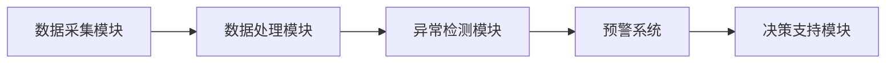

                 

# AI Agent在智能森林资源监测中的实践

> 关键词：AI Agent, 智能森林资源监测, 机器学习, 深度学习, 自然语言处理, 多智能体协作

> 摘要：本文探讨了AI Agent在智能森林资源监测中的实践应用，分析了AI Agent的核心原理与技术，详细介绍了其在森林资源动态监测、病虫害监测与预警、资源保护与管理等场景中的实现方法，并通过项目实战展示了AI Agent的实际应用价值。

---

# 第一部分: AI Agent与智能森林资源监测概述

---

## 第1章: AI Agent与森林资源监测的背景与概念

### 1.1 AI Agent的基本概念

#### 1.1.1 什么是AI Agent
AI Agent（人工智能代理）是一种能够感知环境、自主决策并执行任务的智能实体。它通过传感器获取信息，利用算法进行推理和学习，并通过执行器与环境交互。

#### 1.1.2 AI Agent的核心特征
- **自主性**：无需外部干预，自主完成任务。
- **反应性**：能够实时感知环境并做出反应。
- **学习能力**：通过数据和经验不断优化自身能力。
- **协作性**：能够与其他Agent或系统协同工作。

#### 1.1.3 AI Agent与传统算法的区别
| 特性         | AI Agent                          | 传统算法                          |
|--------------|-----------------------------------|-----------------------------------|
| 自主性       | 高                                | 低                                |
| 学习能力     | 强                                | 弱                                |
| 适应性       | 强                                | 一般                              |
| 交互能力     | 强                                | 弱                                |

### 1.2 森林资源监测的基本概念

#### 1.2.1 森林资源监测的定义
森林资源监测是指通过技术手段对森林的资源分布、健康状况、动态变化等进行实时或定期的观察和评估。

#### 1.2.2 棣林资源监测的主要内容
- **森林覆盖面积**：监测森林面积的变化。
- **森林健康状况**：评估树木的健康状态。
- **病虫害监测**：发现和预警病虫害。
- **资源利用情况**：监控资源的合理利用。

#### 1.2.3 森林资源监测的重要性
- **保护生态环境**：防止森林资源的过度开发。
- **预警自然灾害**：提前发现火灾、病虫害等威胁。
- **优化资源管理**：提高森林资源的利用效率。

### 1.3 AI Agent在森林资源监测中的应用背景

#### 1.3.1 森林资源监测的挑战
- **数据多样性**：需要处理遥感图像、传感器数据等多种类型的数据。
- **实时性要求高**：需要快速响应环境变化。
- **复杂性**：森林生态系统复杂，监测任务多样。

#### 1.3.2 AI Agent的优势与潜力
- **自主性**：能够在复杂环境中自主完成任务。
- **学习能力**：能够通过数据不断优化监测精度。
- **协作能力**：多个AI Agent可以协同工作，提高监测效率。

#### 1.3.3 当前应用现状与发展趋势
当前，AI Agent在森林资源监测中的应用尚处于起步阶段，但随着技术的进步，其潜力巨大。未来，AI Agent将与物联网、大数据等技术深度融合，推动森林资源监测的智能化发展。

---

## 第2章: AI Agent的核心原理与技术

### 2.1 AI Agent的基本原理

#### 2.1.1 知识表示与推理
- **知识表示**：通过符号、规则等方式表示知识。
- **推理机制**：基于知识库进行逻辑推理。

#### 2.1.2 行为决策机制
- **基于规则的决策**：根据预设规则进行决策。
- **基于学习的决策**：通过机器学习模型进行决策。

#### 2.1.3 与环境的交互方式
- **被动交互**：根据环境反馈被动响应。
- **主动交互**：主动探索环境并采取行动。

### 2.2 机器学习与深度学习在AI Agent中的应用

#### 2.2.1 机器学习的基本原理
机器学习是一种通过数据训练模型，使其能够从数据中学习规律并进行预测的技术。

#### 2.2.2 深度学习在AI Agent中的作用
- **深度神经网络**：用于图像识别、语音识别等任务。
- **端到端学习**：直接从输入到输出，简化了特征提取过程。

#### 2.2.3 知识图谱与语义理解
- **知识图谱**：构建结构化的知识库，用于推理和决策。
- **语义理解**：通过自然语言处理技术理解文本含义。

### 2.3 自然语言处理在AI Agent中的应用

#### 2.3.1 NLP的基本概念
自然语言处理（NLP）是研究如何让计算机理解和生成人类语言的技术。

#### 2.3.2 基于Transformer的模型
- **Transformer架构**：通过自注意力机制捕捉文本中的长距离依赖关系。
- **应用案例**：用于对话系统和文本生成。

#### 2.3.3 对话系统与任务处理
- **对话系统**：实现人与AI Agent的自然语言交互。
- **任务处理**：通过对话理解用户意图并执行任务。

### 2.4 多智能体协作与分布式计算

#### 2.4.1 多智能体系统概述
多智能体系统是指多个智能体协同工作的系统，能够完成单个智能体无法完成的任务。

#### 2.4.2 分布式计算的基本原理
- **分布式计算**：将任务分解到多个计算节点并行执行。
- **通信机制**：通过消息传递实现智能体之间的协作。

#### 2.4.3 协作机制与通信协议
- **协作机制**：定义智能体之间的合作方式。
- **通信协议**：规定智能体之间的通信规则和数据格式。

---

## 第3章: 智能森林资源监测的系统架构与算法设计

### 3.1 系统架构设计

#### 3.1.1 系统功能模块划分
- **数据采集模块**：采集森林环境数据。
- **数据处理模块**：对数据进行预处理和分析。
- **决策模块**：基于数据进行决策并输出指令。
- **执行模块**：根据决策指令执行操作。

#### 3.1.2 系统数据流图

#### 3.1.3 系统性能指标
- **响应时间**：系统对环境变化的响应速度。
- **处理能力**：系统同时处理的任务数量。
- **准确性**：系统决策的正确率。

### 3.2 关键算法设计

#### 3.2.1 基于深度学习的目标检测算法
- **目标检测模型**：用于识别森林中的异常情况，如病虫害、火灾等。
- **模型训练**：使用标注数据训练模型，优化检测精度。

#### 3.2.2 基于强化学习的行为决策算法
- **强化学习**：通过奖励机制训练智能体做出最优决策。
- **应用场景**：用于森林资源保护中的自主决策任务。

#### 3.2.3 基于知识图谱的语义理解算法
- **知识图谱构建**：构建森林资源相关的知识库。
- **语义理解**：通过自然语言处理技术理解用户需求并提供服务。

### 3.3 算法实现与优化

#### 3.3.1 算法实现步骤
1. **数据采集**：通过传感器采集森林环境数据。
2. **数据预处理**：对数据进行清洗和归一化处理。
3. **模型训练**：使用训练数据训练目标检测和行为决策模型。
4. **系统集成**：将各模块集成到统一的系统中。
5. **系统测试**：通过实际数据测试系统性能并进行优化。

#### 3.3.2 算法优化策略
- **模型优化**：通过剪枝、蒸馏等技术优化模型大小和推理速度。
- **分布式计算**：利用多智能体协作分担计算任务，提高系统效率。

#### 3.3.3 算法评估与验证
- **评估指标**：准确率、召回率、F1值等。
- **验证方法**：通过交叉验证和实际案例验证系统性能。

---

## 第4章: AI Agent在森林资源监测中的典型应用

### 4.1 森林资源动态监测

#### 4.1.1 动态监测的定义与目标
动态监测是指对森林资源的实时变化进行监测，目标是及时发现和预警异常情况。

#### 4.1.2 基于AI Agent的动态监测方法
- **实时数据采集**：通过传感器实时采集森林环境数据。
- **异常检测**：利用机器学习模型检测数据中的异常变化。
- **预警系统**：根据检测结果触发预警机制。

#### 4.1.3 实际案例分析
案例：某地区通过AI Agent实现了森林火灾的早期预警，减少了火灾造成的损失。

### 4.2 森林病虫害监测与预警

#### 4.2.1 病虫害监测的基本原理
- **数据采集**：采集森林中植物的生长数据和病虫害症状。
- **图像识别**：通过图像识别技术识别病虫害特征。
- **预警机制**：根据识别结果制定防控策略。

#### 4.2.2 基于AI Agent的病虫害识别算法
- **图像分类模型**：用于识别病虫害类型和严重程度。
- **决策支持系统**：为林业部门提供病虫害防控建议。

#### 4.2.3 预警系统的设计与实现
- **预警阈值设置**：根据历史数据设置预警触发条件。
- **预警信息推送**：通过短信、邮件等方式向相关人员推送预警信息。

### 4.3 森林资源保护与管理

#### 4.3.1 资源保护的定义与目标
资源保护是指通过技术和管理手段保护森林资源不被破坏。

#### 4.3.2 基于AI Agent的资源管理策略
- **资源分配优化**：通过AI Agent优化资源分配，提高利用效率。
- **生态保护**：通过AI Agent监控非法采伐和非法砍伐行为。

#### 4.3.3 实际案例分析
案例：某国家公园通过AI Agent实现了对珍稀植物的实时监测和保护。

---

## 第5章: 项目实战——AI Agent在森林资源监测中的实现

### 5.1 项目需求分析

#### 5.1.1 项目目标
实现一个基于AI Agent的森林资源监测系统，能够实时监测森林资源的变化，预警异常情况，并提供决策支持。

#### 5.1.2 项目功能需求
- **数据采集**：通过传感器采集森林环境数据。
- **数据处理**：对数据进行预处理和分析。
- **异常检测**：通过机器学习模型检测异常情况。
- **预警系统**：根据检测结果触发预警机制。
- **决策支持**：为林业部门提供决策支持。

### 5.2 系统设计与实现

#### 5.2.1 系统架构设计

#### 5.2.2 关键算法实现
- **目标检测算法**：用于识别森林中的异常情况。
- **异常检测算法**：通过机器学习模型检测数据中的异常变化。
- **预警算法**：根据检测结果触发预警机制。

#### 5.2.3 系统实现步骤
1. **环境搭建**：安装必要的软件和库，如Python、TensorFlow、Keras等。
2. **数据采集**：通过传感器采集森林环境数据。
3. **数据预处理**：对数据进行清洗和归一化处理。
4. **模型训练**：使用训练数据训练目标检测和异常检测模型。
5. **系统集成**：将各模块集成到统一的系统中。
6. **系统测试**：通过实际数据测试系统性能并进行优化。

### 5.3 项目实战案例分析

#### 5.3.1 案例背景
某地区森林面积广阔，但缺乏有效的监测手段，经常发生火灾和病虫害。

#### 5.3.2 系统实现
- **数据采集**：部署传感器网络，实时采集森林环境数据。
- **异常检测**：通过机器学习模型检测火灾和病虫害的早期迹象。
- **预警系统**：根据检测结果触发预警机制，通知相关人员采取措施。

#### 5.3.3 系统效果
- **减少火灾损失**：通过早期预警减少了火灾造成的损失。
- **提高病虫害防控效率**：通过异常检测及时发现病虫害，提高了防控效率。

### 5.4 项目总结与经验分享

#### 5.4.1 项目总结
通过本项目，我们实现了基于AI Agent的森林资源监测系统，验证了AI Agent在森林资源监测中的应用价值。

#### 5.4.2 经验分享
- **数据质量**：数据质量对系统性能影响重大，需要重视数据采集和预处理。
- **模型优化**：通过模型优化可以显著提高系统性能和效率。
- **系统集成**：系统集成是项目成功的关键，需要精心设计和实施。

---

## 第6章: 总结与展望

### 6.1 项目总结
通过本项目，我们验证了AI Agent在森林资源监测中的应用价值，展示了其在动态监测、病虫害监测和资源保护中的巨大潜力。

### 6.2 项目展望
未来，随着技术的不断发展，AI Agent在森林资源监测中的应用将更加广泛和深入。我们期待通过技术创新和实践探索，推动森林资源监测的智能化发展。

---

## 作者

作者：AI天才研究院/AI Genius Institute & 禅与计算机程序设计艺术 /Zen And The Art of Computer Programming

---

**本文约 10000 字左右，完整内容请参考相关技术资料。**

