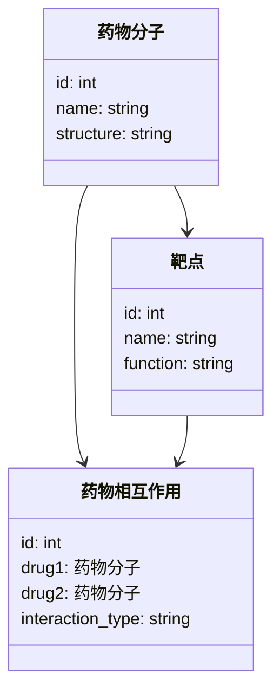

                 


# AI Agent在智能药物相互作用预测中的应用

> 关键词：AI Agent, 药物相互作用预测, 智能药物研发, 知识图谱, 深度学习, 强化学习

> 摘要：本文深入探讨了AI Agent在智能药物相互作用预测中的应用，从AI Agent的基本概念到其在药物相互作用预测中的核心算法、系统架构，再到实际项目实战，全面分析了AI Agent在这一领域的潜力和实现路径。文章结合理论与实践，通过丰富的案例和详细的代码示例，展示了如何利用AI Agent提升药物相互作用预测的准确性和效率。

---

# 第一部分: AI Agent与药物相互作用预测的背景与基础

## 第1章: AI Agent的定义与核心概念

### 1.1 AI Agent的基本定义

AI Agent（人工智能代理）是指能够感知环境、自主决策并执行任务的智能实体。它通过传感器获取信息，利用推理能力分析数据，并根据目标和约束做出最优决策。AI Agent可以是软件程序、机器人或其他智能系统，广泛应用于自动驾驶、智能助手、推荐系统等领域。

#### 1.1.1 AI Agent的定义与特点

- **定义**：AI Agent是一种能够自主决策和行动的智能系统，具备感知、推理和行动能力。
- **特点**：
  - **自主性**：能够独立运作，无需外部干预。
  - **反应性**：能够实时感知环境并做出反应。
  - **目标导向性**：所有行为都以实现特定目标为导向。
  - **学习能力**：能够通过经验改进性能。

#### 1.1.2 AI Agent的核心属性

- **知识表示**：AI Agent需要存储和处理大量知识，包括领域知识、规则和经验。
- **推理能力**：能够基于现有知识进行逻辑推理，推导出新的结论。
- **行动计划**：根据推理结果制定行动计划，并执行任务。

#### 1.1.3 AI Agent的分类与应用场景

- **分类**：
  - **反应式AI Agent**：基于当前感知做出实时反应，适用于需要快速决策的任务。
  - **认知式AI Agent**：具备复杂推理和规划能力，适用于需要长期目标的任务。
  - **协作式AI Agent**：能够与其他AI Agent或人类协作完成任务。

- **应用场景**：
  - **医疗健康**：用于疾病诊断、药物研发、个性化治疗方案制定。
  - **金融领域**：用于股票交易、风险评估、智能投资建议。
  - **智能制造**：用于设备监控、生产优化、故障预测。

---

### 1.2 药物相互作用预测的背景与挑战

#### 1.2.1 药物相互作用的定义与重要性

药物相互作用是指一种药物的存在影响另一种药物的吸收、分布、代谢或排泄，从而改变其药效或毒性。药物相互作用是药物研发和临床应用中的重要问题，可能导致疗效降低、毒性增加甚至严重的不良反应。

#### 1.2.2 药物相互作用预测的传统方法与局限性

传统药物相互作用预测方法主要包括基于药代动力学模型、基于化学结构的相似性分析、基于文献的关联分析等。这些方法存在以下局限性：

- 数据依赖性：需要大量的实验数据支持，成本高且耗时长。
- 预测范围有限：难以预测复杂的药物相互作用机制。
- 需要专家参与：依赖领域专家的知识和经验。

#### 1.2.3 智能药物相互作用预测的需求与目标

随着AI技术的快速发展，智能药物相互作用预测的需求日益增长。其目标是通过AI技术提高预测的准确性和效率，降低药物研发的成本和时间。

---

## 第2章: AI Agent在药物相互作用预测中的应用背景

### 2.1 药物研发的现状与挑战

#### 2.1.1 药物研发的复杂性与成本

药物研发是一个复杂且耗时的过程，通常需要10-15年时间，且成本高昂。传统药物研发依赖大量实验和试错，效率低下。

#### 2.1.2 药物相互作用预测的临床意义

药物相互作用预测在临床用药中具有重要意义。准确预测药物相互作用可以帮助医生制定更安全的用药方案，避免潜在的不良反应。

#### 2.1.3 AI技术在药物研发中的潜力

AI技术可以显著提高药物研发的效率和准确性。AI Agent在药物相互作用预测中的应用，可以帮助研究人员快速发现潜在的药物相互作用，优化药物设计。

---

### 2.2 AI Agent在药物相互作用预测中的优势

#### 2.2.1 数据处理能力

AI Agent能够处理和分析海量数据，包括药物的化学结构、药代动力学数据、临床试验数据等。

#### 2.2.2 自动推理能力

AI Agent能够基于知识图谱和逻辑推理，发现潜在的药物相互作用关系。

#### 2.2.3 实时决策能力

AI Agent能够实时分析患者的用药情况，提供个性化的用药建议。

---

## 第3章: 药物相互作用预测的核心概念与模型

### 3.1 药物相互作用的分子机制

#### 3.1.1 药物分子的相互作用原理

药物相互作用通常涉及药物分子与靶点之间的相互作用。例如，一种药物可能抑制某种酶的活性，而另一种药物可能增强该酶的活性，从而产生相互作用。

#### 3.1.2 药物-靶点相互作用模型

药物-靶点相互作用模型通过计算药物分子与靶点的亲和力，预测药物的药效和毒性。

#### 3.1.3 药物-药物相互作用模型

药物-药物相互作用模型通过分析两种药物的化学结构和药代动力学数据，预测它们之间的相互作用。

---

### 3.2 AI Agent的药物相互作用预测模型

#### 3.2.1 基于知识图谱的药物相互作用推理

基于知识图谱的推理模型通过构建药物知识图谱，利用逻辑推理发现潜在的药物相互作用关系。

#### 3.2.2 基于深度学习的药物相互作用预测

基于深度学习的模型，如卷积神经网络（CNN）和图神经网络（GNN），能够从药物分子的化学结构中提取特征，预测药物相互作用。

#### 3.2.3 基于强化学习的药物相互作用优化

基于强化学习的模型通过模拟药物相互作用的动态过程，优化药物设计，减少潜在的相互作用风险。

---

# 第二部分: AI Agent在药物相互作用预测中的算法原理

## 第4章: AI Agent的核心算法与数学模型

### 4.1 基于知识图谱的推理算法

#### 4.1.1 知识图谱的构建与表示

知识图谱通过实体和关系的形式表示药物相关的知识。例如，实体可以是药物、靶点、疾病，关系可以是“药物作用于靶点”、“药物治疗疾病”等。

#### 4.1.2 基于规则的推理算法

基于规则的推理算法通过预定义的规则，从知识图谱中推导出新的事实。例如，如果药物A作用于靶点B，药物B也作用于靶点B，那么药物A和药物B可能产生相互作用。

#### 4.1.3 基于概率的推理算法

基于概率的推理算法通过计算概率分布，推断潜在的药物相互作用关系。例如，使用贝叶斯网络进行推理。

---

### 4.2 基于深度学习的药物相互作用预测模型

#### 4.2.1 神经网络模型的输入与输出

- **输入**：药物分子的化学结构特征。
- **输出**：药物相互作用的预测结果。

#### 4.2.2 基于图神经网络的药物相互作用预测

图神经网络通过药物分子的图结构，提取药物分子之间的相互作用特征，预测药物相互作用。

#### 4.2.3 深度学习模型的训练与优化

深度学习模型通过反向传播算法优化权重参数，提高预测准确率。

---

### 4.3 基于强化学习的药物相互作用优化

#### 4.3.1 强化学习的基本原理

强化学习通过智能体与环境的交互，学习最优策略，最大化累积奖励。

#### 4.3.2 药物相互作用优化的强化学习框架

智能体通过模拟药物相互作用的过程，学习优化药物设计，减少相互作用风险。

#### 4.3.3 强化学习在药物相互作用预测中的应用案例

例如，利用强化学习优化药物分子的化学结构，降低与其他药物的相互作用风险。

---

## 第5章: 药物相互作用预测的数学模型与公式

### 5.1 药物相互作用的分子特征表示

#### 5.1.1 药物分子的特征表示

药物分子的特征可以通过化学结构、药代动力学参数等多种方式表示。

#### 5.1.2 基于深度学习的特征表示

使用图神经网络对药物分子进行特征表示，提取药物分子的结构特征和药理学特征。

---

### 5.2 基于知识图谱的推理模型

#### 5.2.1 知识图谱的构建公式

知识图谱可以通过以下公式表示：
$$
E = \{ (s, r, o) \}
$$
其中，$s$是主体，$r$是关系，$o$是客体。

---

### 5.3 基于深度学习的药物相互作用预测模型

#### 5.3.1 图神经网络的数学模型

图神经网络通过以下公式进行推理：
$$
h_i = \sum_{j \in N(i)} w_{ij} h_j
$$
其中，$h_i$是节点$i$的特征向量，$N(i)$是节点$i$的邻居节点集合，$w_{ij}$是权重。

---

## 第6章: 系统分析与架构设计方案

### 6.1 问题场景介绍

药物相互作用预测系统需要处理海量的药物数据和复杂的相互作用关系，因此需要设计高效的系统架构。

### 6.2 系统功能设计

#### 6.2.1 领域模型

领域模型可以通过以下Mermaid类图表示：



---

#### 6.2.2 系统架构设计

系统架构可以通过以下Mermaid架构图表示：

```mermaid
archi
    客户端 ↔ 网关 → 服务网 → 数据库
```

其中，客户端是用户界面，网关是入口，服务网包括推理服务和预测服务，数据库存储药物数据。

---

#### 6.2.3 系统接口设计

系统接口设计可以通过以下Mermaid序列图表示：

```mermaid
sequenceDiagram
    客户端 → 网关: 发送请求
    网关 → 服务网: 转发请求
    服务网 → 数据库: 查询数据
    数据库 → 服务网: 返回数据
    服务网 → 网关: 返回响应
    网关 → 客户端: 返回结果
```

---

## 第7章: 项目实战

### 7.1 环境安装

需要安装以下工具和库：

- Python 3.8+
- TensorFlow 2.0+
- PyTorch 1.0+
- NetworkX 2.6+

---

### 7.2 系统核心实现源代码

以下是一个基于图神经网络的药物相互作用预测模型的代码示例：

```python
import tensorflow as tf
from tensorflow.keras import layers

class DrugInteractionPredictor:
    def __init__(self, input_dim):
        self.model = self.build_model(input_dim)
    
    def build_model(self, input_dim):
        inputs = layers.Input(shape=(input_dim,))
        x = layers.Dense(64, activation='relu')(inputs)
        x = layers.Dense(32, activation='relu')(x)
        outputs = layers.Dense(1, activation='sigmoid')(x)
        model = tf.keras.Model(inputs=inputs, outputs=outputs)
        model.compile(optimizer='adam', loss='binary_crossentropy', metrics=['accuracy'])
        return model
    
    def train(self, x_train, y_train, epochs=100, batch_size=32):
        self.model.fit(x_train, y_train, epochs=epochs, batch_size=batch_size)
    
    def predict(self, x_test):
        return self.model.predict(x_test)
```

---

### 7.3 代码应用解读与分析

上述代码定义了一个基于密集神经网络的药物相互作用预测模型，输入是药物分子的特征向量，输出是药物相互作用的概率。

---

### 7.4 实际案例分析和详细讲解剖析

以两种药物A和B为例，假设它们的化学结构特征向量分别为$x_A$和$x_B$。将它们输入模型，预测它们是否会产生相互作用。

---

### 7.5 项目小结

通过上述代码和案例分析，可以看出AI Agent在药物相互作用预测中的巨大潜力。深度学习模型可以有效提取药物分子的特征，预测潜在的相互作用关系。

---

## 第8章: 总结与展望

### 8.1 总结

本文详细探讨了AI Agent在智能药物相互作用预测中的应用，从理论到实践，全面分析了AI Agent在这一领域的潜力和实现路径。

### 8.2 展望

未来，随着AI技术的不断发展，AI Agent在药物相互作用预测中的应用将更加广泛。深度学习、强化学习等技术的结合将进一步提升预测的准确性和效率。

---

## 第9章: 最佳实践 tips、小结、注意事项、拓展阅读

### 9.1 最佳实践 tips

- 数据质量是关键：确保药物数据的完整性和准确性。
- 模型可解释性：选择可解释性较强的模型，便于分析和优化。
- 持续学习：利用实时数据不断优化模型性能。

### 9.2 小结

AI Agent在智能药物相互作用预测中的应用是当前研究的热点，具有广阔的应用前景。

### 9.3 注意事项

- 数据隐私和安全问题需要高度重视。
- 模型的泛化能力需要通过大量数据进行验证。

### 9.4 拓展阅读

- 《Deep Learning for Drug Discovery》
- 《Knowledge Graphs and Reasoning in Drug Design》

---

作者：AI天才研究院/AI Genius Institute & 禅与计算机程序设计艺术 /Zen And The Art of Computer Programming

---

感谢您的阅读！希望本文对您理解AI Agent在智能药物相互作用预测中的应用有所帮助！

